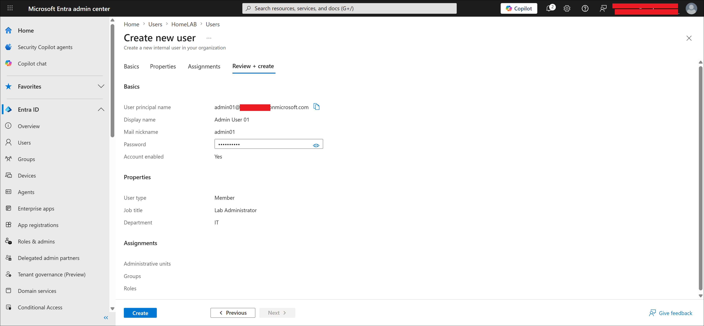
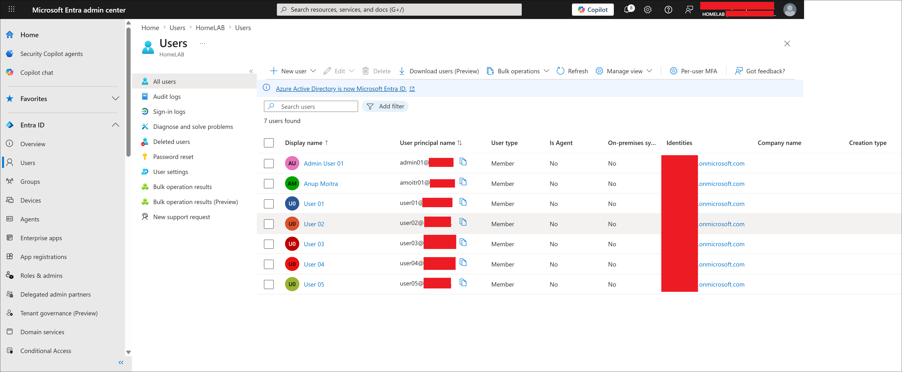
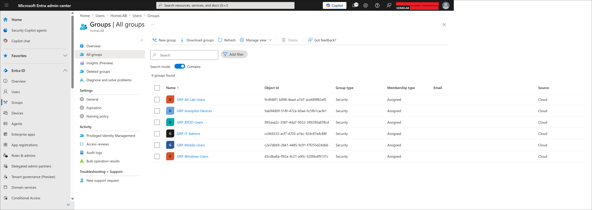
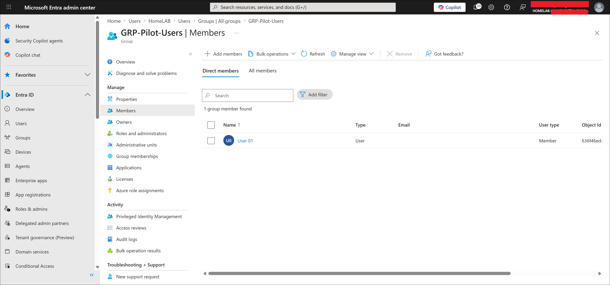
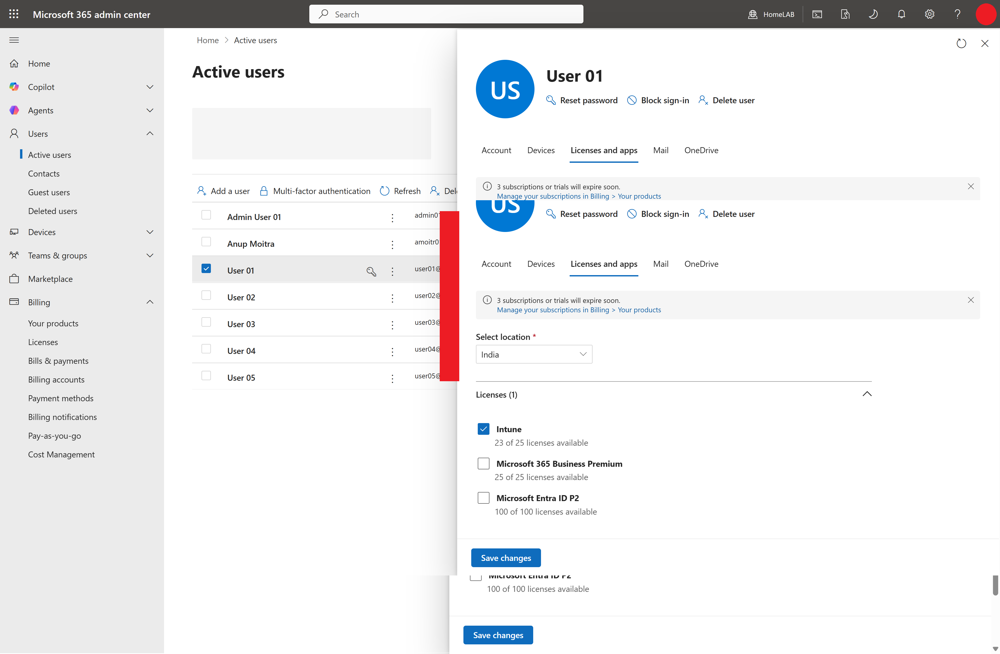

# Users and Groups

This file documents the Microsoft Entra ID users and groups for the MD-102 Intune virtual company lab.

---

## Objective

Create Microsoft Entra ID lab users and security groups that will be used for Intune policy assignments, application deployment, compliance testing, Conditional Access testing, BYOD testing, and Windows Autopilot testing.

This lab validates that:

- Lab users can be created in Microsoft Entra ID.
- Security groups can be created for targeted Intune assignments.
- Pilot users can be separated from general lab users.
- Users and groups can be used later for device enrollment, app deployment, compliance, and Conditional Access.

---

## Why This Lab Matters

Microsoft Intune policies, apps, compliance policies, and Conditional Access rules are usually assigned to users or groups.

Instead of assigning settings directly to individual users, real environments use groups to make management easier and safer.

Simple example:

```text
Create group
-> Add users or devices
-> Assign Intune policy to group
-> Policy applies to group members
```

This lab creates the identity foundation for the rest of the MD-102 project.

---

## Lab Environment

| Item | Value |
|---|---|
| Identity platform | Microsoft Entra ID |
| Management platform | Microsoft Intune |
| Lab company | Contoso Startup Lab |
| Main test user | user01 |
| Main admin account | admin01 |
| Assignment strategy | Security groups |
| Current status | Completed |

---

## Lab Users

| Display Name | Username | Department | Role | Status |
|---|---|---|---|---|
| Admin User 01 | admin01 | IT | Lab administrator | Created |
| User 01 | user01 | Management | Standard user / pilot user | Created |
| User 02 | user02 | Finance | Standard user | Created |
| User 03 | user03 | HR | Standard user | Created |
| User 04 | user04 | Operations | Standard user | Created |
| User 05 | user05 | Operations | Standard user | Created |

---

## Lab Groups

| Group Name | Group Type | Purpose | Status |
|---|---|---|---|
| GRP-All-Lab-Users | Security group | General lab targeting | Created |
| GRP-Pilot-Users | Security group | Pilot testing | Created |
| GRP-Windows-Users | Security group | Windows targeting | Created |
| GRP-BYOD-Users | Security group | BYOD targeting | Created |
| GRP-Mobile-Users | Security group | Mobile targeting | Created |
| GRP-IT-Admins | Security group | Admin targeting | Created |
| GRP-Autopilot-Devices | Security group | Autopilot targeting | Created |

---

## Group Membership

| Group Name | Members |
|---|---|
| GRP-All-Lab-Users | user01, user02, user03, user04, user05 |
| GRP-Pilot-Users | user01 |
| GRP-Windows-Users | user01, user02 |
| GRP-BYOD-Users | user01, user03 |
| GRP-Mobile-Users | user01, user04 |
| GRP-IT-Admins | admin01 |
| GRP-Autopilot-Devices | Future Autopilot devices |

---

## License Assignment

| User | Intune License | Microsoft 365 Apps | Purpose |
|---|---|---|---|
| admin01 | Available as needed | Optional | Lab administration |
| user01 | Assigned | Available as needed | Main testing user |
| user02 | Available as needed | Optional | Windows testing |
| user03 | Available as needed | Optional | BYOD testing |
| user04 | Available as needed | Optional | Mobile testing |
| user05 | Available as needed | Optional | Policy testing |

> [!NOTE]
> The exact license name may depend on the available Microsoft 365 or Intune trial/subscription in the lab tenant.

---

## Group Assignment Strategy

The lab uses a pilot-first assignment approach.

Instead of assigning new policies to all users or all devices immediately, new policies should first target a small pilot group.

Recommended pilot group:

```text
GRP-Pilot-Users
```

This group will be used for early testing of:

- Windows enrollment
- Configuration profiles
- Compliance policies
- Conditional Access report-only testing
- Microsoft Store app deployment
- Win32 app deployment
- Microsoft 365 Apps deployment

This approach helps reduce risk because new policies are tested with a small group before being expanded to other users or devices.

### Completed Usage of GRP-Pilot-Users

`GRP-Pilot-Users` has already been used to target Microsoft Store app deployment for both required and available apps.

Required Microsoft Store apps assigned to `GRP-Pilot-Users`:

```text
Company Portal
VLC UWP
Slack
```

Available Microsoft Store apps assigned to `GRP-Pilot-Users`:

```text
ChatGPT
WhatsApp
```

Win32 app assigned to `GRP-Pilot-Users`:

```text
7-Zip
```

This validates that the pilot group can be used for real Intune application deployment testing across both Microsoft Store apps and Win32 apps.

---

## Steps Performed

### Step 1: Opened Microsoft Entra Admin Center

Opened:

```text
https://entra.microsoft.com
```

Signed in with the lab administrator account.

### Step 2: Created Lab Users

Navigation used:

```text
Microsoft Entra admin center
-> Entra ID
-> Users
-> All users
-> New user
-> Create new user
```

Created the planned users:

```text
admin01
user01
user02
user03
user04
user05
```

### Step 3: Verified Users in Microsoft Entra ID

After creation, the users were visible under:

```text
Entra ID
-> Users
-> All users
```

The users list confirmed that the lab user accounts were created successfully.

### Step 4: Created Security Groups

Navigation used:

```text
Microsoft Entra admin center
-> Entra ID
-> Groups
-> All groups
-> New group
```

Created the planned security groups:

```text
GRP-All-Lab-Users
GRP-Pilot-Users
GRP-Windows-Users
GRP-BYOD-Users
GRP-Mobile-Users
GRP-IT-Admins
GRP-Autopilot-Devices
```

### Step 5: Added Users to Groups

Users were added to the planned Microsoft Entra ID security groups.

The key pilot membership configured for the first Intune tests was:

```text
GRP-Pilot-Users -> user01
```

The lab administrator account was added to:

```text
GRP-IT-Admins -> admin01
```

### Step 6: Assigned License to User 01

A license was assigned to:

```text
user01
```

This prepares `user01` for Intune enrollment, app deployment, compliance, and Conditional Access testing.

### Step 7: Verified Users, Groups, Memberships, and License

Verification confirmed that:

- Lab users exist in Microsoft Entra ID.
- Lab security groups exist in Microsoft Entra ID.
- user01 is a member of GRP-Pilot-Users.
- admin01 is a member of GRP-IT-Admins.
- user01 has the required license.
- Groups are ready for future Intune assignments.

### Step 8: Used GRP-Pilot-Users for Microsoft Store App Deployment

`GRP-Pilot-Users` was used as the assignment target for the Microsoft Store app deployment lab.

The deployment included:

```text
Required apps = Company Portal, VLC UWP, Slack
Available apps = ChatGPT, WhatsApp
```

This confirmed that the pilot group can be used for Microsoft Store app assignments in Microsoft Intune.

### Step 9: Used GRP-Pilot-Users for Win32 App Deployment

`GRP-Pilot-Users` was used as the assignment target for the Win32 7-Zip app deployment lab.

The deployment included:

```text
Required Win32 app = 7-Zip
```

This confirmed that the pilot group can also be used for required Win32 app deployment in Microsoft Intune.

---

## Expected Result

After this lab:

- Lab users exist in Microsoft Entra ID.
- Lab security groups exist in Microsoft Entra ID.
- user01 is a member of GRP-Pilot-Users.
- admin01 is a member of GRP-IT-Admins.
- user01 has an Intune-capable license.
- Groups are ready for future Intune assignments.
- GRP-Pilot-Users can be used to target Microsoft Store app assignments.
- GRP-Pilot-Users can be used to target required Win32 app assignments.

---

## Test Result

| Test Item | Result |
|---|---|
| Lab users created | Completed |
| Lab security groups created | Completed |
| user01 added to GRP-Pilot-Users | Completed |
| admin01 added to GRP-IT-Admins | Completed |
| user01 license assigned | Completed |
| GRP-Pilot-Users used for Microsoft Store app deployment | Completed |
| GRP-Pilot-Users used for Win32 7-Zip app deployment | Completed |
| Users and groups verified | Completed |

---

## Screenshots

Screenshots are stored in:

```text
screenshots/sanitized/identity-and-groups/
```

### Admin user creation review screen



### Lab users created in Microsoft Entra ID



### Lab groups created in Microsoft Entra ID



### Pilot users group membership



### User 01 license assignment



> [!NOTE]
> Screenshots were sanitized before upload. Tenant names, full email addresses, top-right signed-in account details, and sensitive identifiers were hidden.

---

## Screenshot Files

```text
lab-user-admin01-create-sanitized.png
lab-users-created-sanitized.png
lab-groups-created-sanitized.png
grp-pilot-users-membership-sanitized.png
user01-license-assignment-sanitized.png
```

---

## Related Labs

The following labs use the users and groups created in this file:

| Lab file | Relationship |
|---|---|
| `02-device-enrollment/windows-oobe-enrollment.md` | Uses `user01` for Windows enrollment |
| `05-application-deployment/microsoft-store-app-deployment.md` | Uses `GRP-Pilot-Users` for required and available app assignments |
| `05-application-deployment/win32-app-deployment-7zip.md` | Uses `GRP-Pilot-Users` for required Win32 app deployment |

---

## Troubleshooting Notes

If a user cannot be created:

1. Confirm the signed-in account has permission to create users.
2. Confirm the username is unique.
3. Check whether the tenant has user creation restrictions.

If a group cannot be created:

1. Confirm the signed-in account has permission to create groups.
2. Confirm the group name is unique.
3. Confirm the group type is Security.

If a license cannot be assigned:

1. Confirm licenses are available in the tenant.
2. Confirm the user location is set if required.
3. Confirm the account has license administrator or global administrator permissions.

If group membership does not appear immediately:

1. Refresh the group members page.
2. Wait a few minutes for Microsoft Entra ID to update.
3. Search for the user again inside the group membership page.
4. Confirm the correct group was selected.

---

## Security and Privacy Notes

This is a public learning repository.

Do not upload:

- Full real email addresses
- Real tenant names
- Tenant IDs
- User object IDs
- Group object IDs
- Passwords
- MFA QR codes
- Unsanitized screenshots

Before uploading screenshots, hide or blur:

- Top-right signed-in admin account
- Tenant or domain name
- Full user principal names
- Object IDs
- Any authentication prompts or sensitive account information

---

## Current Status

| Task | Status |
|---|---|
| users-and-groups.md created | Completed |
| Lab users created in Entra ID | Completed |
| Lab groups created in Entra ID | Completed |
| Group memberships configured | Completed |
| Intune licenses assigned | Completed |
| GRP-Pilot-Users used for Microsoft Store app deployment | Completed |
| GRP-Pilot-Users used for Win32 7-Zip app deployment | Completed |
| Screenshots added | Completed |

---

## Next Step

Continue to the Microsoft 365 Apps deployment lab or Company Portal self-service app testing.

Recommended next lab:

```text
05-application-deployment/microsoft-365-apps-autopilot-deployment.md
```

Alternative next lab:

```text
05-application-deployment/company-portal-self-service-apps.md
```
