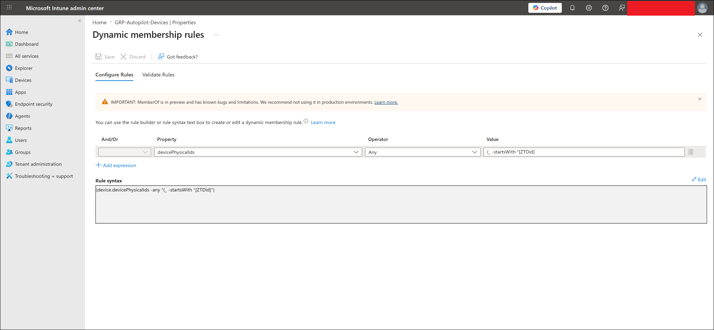
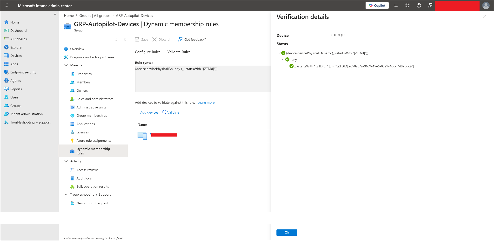
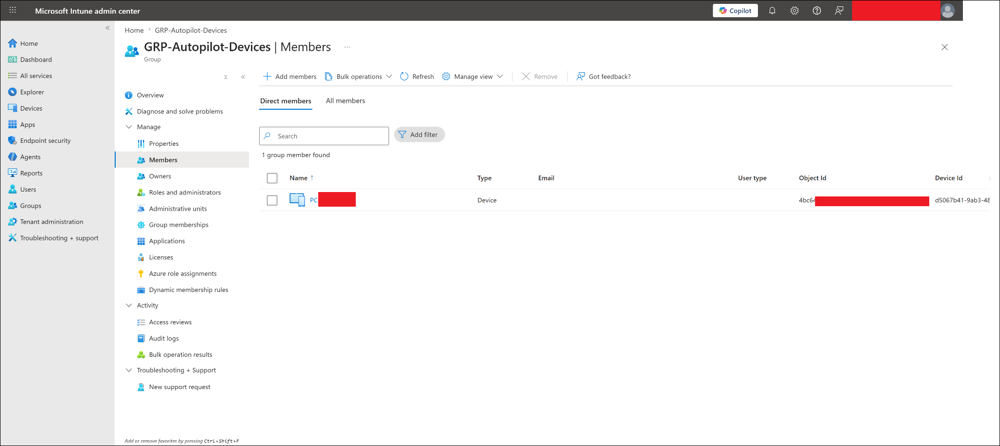

# Users and Groups

## Lab Status

| Field | Value |
|---|---|
| Status | Completed |
| Lab category | Identity and groups |
| Identity platform | Microsoft Entra ID |
| Management platform | Microsoft Intune |
| Lab company | Contoso Startup Lab |
| Primary test user | user01 |
| Primary admin account | admin01 |
| Assignment strategy | Microsoft Entra security groups |

---

## Lab Objective

Create the Microsoft Entra ID users and security groups that form the identity foundation for all subsequent Intune labs — enrollment, app deployment, configuration profiles, compliance, Conditional Access, and endpoint security.

---

## Why This Lab Matters

Intune policies and apps are assigned to users or groups, not individuals. Using groups lets administrators control rollout safely and reuse the same targets across multiple policy types.

```text
Create users
-> Create groups
-> Add users or devices to groups
-> Assign Intune policies or apps to groups
-> Validate deployment on pilot users/devices
```

Without this foundation, no other lab in the project can be targeted correctly.

---

## Prerequisites

- Access to Microsoft Entra admin center and Microsoft Intune admin center
- Permission to create users, groups, and assign licenses
- Available Microsoft 365 or Intune-capable licenses in the lab tenant

---

## Identity and Group Design

### Users

| Display name | Username | Department | Role |
|---|---|---|---|
| Admin User 01 | admin01 | IT | Lab administrator |
| User 01 | user01 | Management | Primary pilot user |
| User 02 | user02 | Finance | Windows policy testing |
| User 03 | user03 | HR | BYOD and Conditional Access testing |
| User 04 | user04 | Operations | Mobile device testing |
| User 05 | user05 | Operations | Additional policy testing |

### Groups

| Group name | Type | Purpose |
|---|---|---|
| GRP-All-Lab-Users | Security | General lab targeting |
| GRP-Pilot-Users | Security | Pilot user testing and user-based app/policy assignments |
| GRP-Windows-Users | Security | Windows user targeting |
| GRP-BYOD-Users | Security | BYOD enrollment and Conditional Access testing |
| GRP-Mobile-Users | Security | Mobile device targeting |
| GRP-IT-Admins | Security | Admin targeting |
| GRP-Autopilot-Devices | Security / dynamic device | Autopilot device targeting |

### Group Membership

| Group | Members |
|---|---|
| GRP-All-Lab-Users | user01, user02, user03, user04, user05 |
| GRP-Pilot-Users | user01 |
| GRP-Windows-Users | user01, user02 |
| GRP-BYOD-Users | user03, user04 |
| GRP-Mobile-Users | user01, user04 |
| GRP-IT-Admins | admin01 |
| GRP-Autopilot-Devices | WINAUTO452 (via dynamic device rule) |

### License Assignment

| User | License | Purpose |
|---|---|---|
| user01 | Microsoft 365 Business Premium (includes Intune) | Primary test user — enrollment, apps, compliance, CA |
| All others | Available as needed | Assigned when required by specific labs |

> [!NOTE]
> The exact license name depends on what is available in the lab tenant. Any license that includes Microsoft Intune is sufficient.

---

## Configuration Flow

```text
Open Microsoft Entra admin center
-> Create lab users
-> Create security groups
-> Add users to groups
-> Assign license to user01
-> Prepare GRP-Autopilot-Devices dynamic device group
-> Validate group membership
```

---

## Steps Performed

### Step 1 — Created lab users

Navigated to:

```text
Entra ID -> Users -> All users -> New user -> Create new user
```

Created: `admin01`, `user01`, `user02`, `user03`, `user04`, `user05`

Verified all accounts visible under All users after creation.

---

### Step 2 — Created security groups

Navigated to:

```text
Entra ID -> Groups -> All groups -> New group
```

Created all planned groups with Group type set to Security.

---

### Step 3 — Added users to groups

Added users to groups per the membership table above. Key assignments:

- `user01` → `GRP-All-Lab-Users`, `GRP-BYOD-Users`, `GRP-Mobile-Users`, `GRP-All-Lab-Users`
- `user03` → `GRP-All-Lab-Users`, `GRP-BYOD-Users`
- `admin01` → `GRP-IT-Admins`

---

### Step 4 — Assigned license to user01

Assigned a Microsoft 365 Business Premium license to `user01` from the user's license assignment page. This prepared `user01` for Intune enrollment, app deployment, compliance, and Conditional Access testing.

---

### Step 5 — Configured Autopilot device group

Configured `GRP-Autopilot-Devices` with a dynamic device membership rule targeting Autopilot-imported devices. Validated rule processing and confirmed the device appeared in the group after the Autopilot hardware hash was imported in a later lab.

---

## Final Test Result

| Validation item | Result |
|---|---|
| Lab users created in Microsoft Entra ID | Completed |
| Lab security groups created | Completed |
| Group memberships configured | Completed |
| user01 license assigned | Completed |
| GRP-Pilot-Users ready for user-based targeting | Completed |
| GRP-Autopilot-Devices ready for device-based targeting | Completed |
| Groups reused successfully across later Intune labs | Completed |

---

## Screenshots

Screenshots are stored in `screenshots/sanitized/identity-and-groups/`.

### Admin user creation review screen


### Lab users created in Microsoft Entra ID


### Lab groups created in Microsoft Entra ID


### GRP-Pilot-Users membership


### user01 license assignment


### Autopilot dynamic device group rule


### Autopilot dynamic group rule validation


### Autopilot device group member


---

## Troubleshooting Notes

**User creation fails** — confirm the admin account has User Administrator or Global Administrator role, the username is unique, and all required fields are filled.

**Group creation fails** — confirm the admin account has permission to create groups and the group name is not already in use.

**License assignment fails** — confirm the tenant has available licenses, the user has a usage location set, and the admin account has License Administrator or Global Administrator role.

**Group membership not appearing** — wait a few minutes and refresh. Microsoft Entra ID group processing is near-real-time but not always instant.

**Autopilot device not appearing in dynamic group** — confirm the hardware hash was imported successfully, the dynamic membership rule syntax is correct, and enough time has passed for group processing to complete.

---

## Enterprise Reflection

In production, identity and group design should be planned before any Intune deployment begins. A well-structured group strategy lets administrators pilot policies safely before broad rollout, separate user-based and device-based assignments cleanly, and reuse the same groups across apps, compliance, configuration, and security policies.

The pattern used here — start with a pilot group, validate, then expand — is the same approach used in real enterprise Intune deployments.

---

## Key Learning Outcomes

- How to create users and security groups in Microsoft Entra ID
- How to design a group structure that separates user-based and device-based Intune assignments
- How to configure a dynamic device group for Windows Autopilot targeting
- How to assign licenses to prepare users for Intune enrollment and app deployment
- Why pilot groups matter before broader policy rollout
