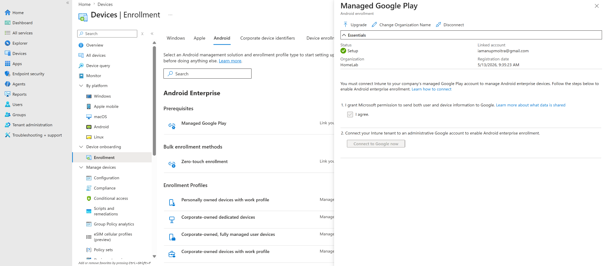
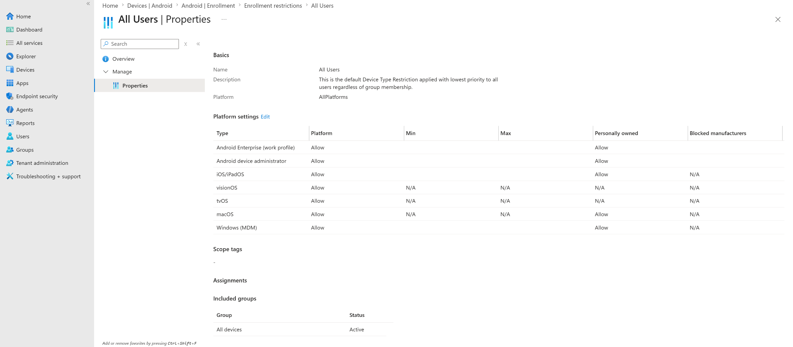
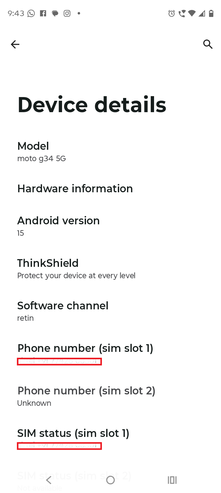
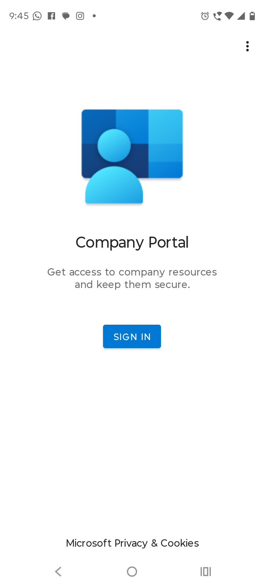
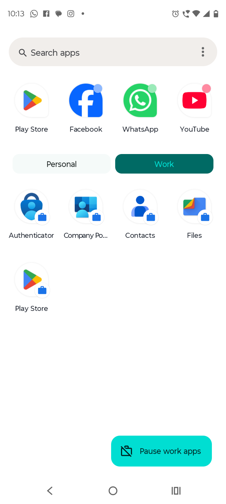
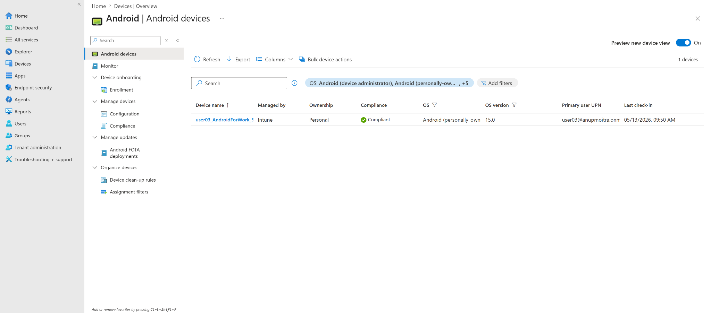
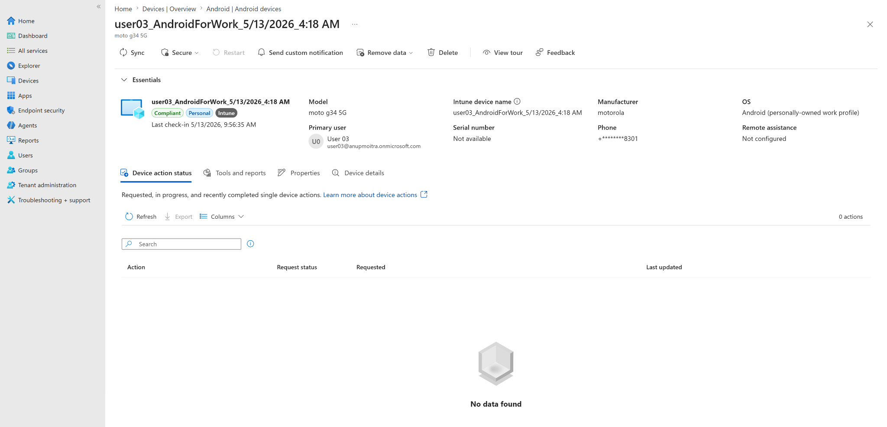
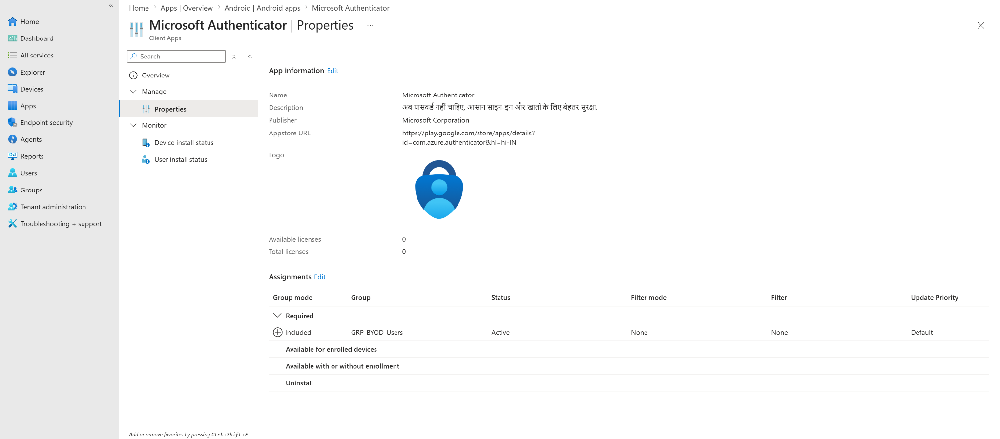
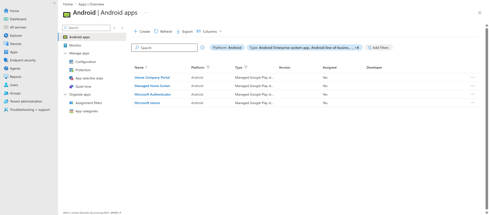

# Android BYOD Enrollment with Work Profile

## Lab status

**Status:** Completed  
**Lab category:** Device enrollment  
**Platform:** Android Enterprise  
**Enrollment scenario:** Personally owned device with work profile  
**Management platform:** Microsoft Intune  
**Identity platform:** Microsoft Entra ID  
**Primary test user:** user03  
**Assignment group:** GRP-BYOD-Users  
**Test device:** ANDROID-BYOD-001  
**Device model:** moto g34 5G  
**Android version:** 15  
**Ownership:** Personal / BYOD  
**Compliance result:** Compliant  
**Final result:** Android BYOD work profile enrollment completed and Microsoft Authenticator deployed successfully  

---

## Lab objective

The objective of this lab is to enroll a personally owned Android device into Microsoft Intune using the **Android Enterprise personally owned work profile** enrollment method.

This lab validates that:

- Managed Google Play can be connected to Microsoft Intune.
- Android Enterprise personally owned work profile enrollment can be enabled.
- A BYOD Android device can enroll into Intune.
- Android creates a separate work profile on the personal device.
- Intune manages the work profile instead of the full personal device.
- The device appears in Intune as personally owned.
- The device reports as compliant.
- A Managed Google Play app can be deployed to the Android work profile.
- Microsoft Authenticator can be assigned as a required app to the BYOD user group.
- The required app installs inside the Android work profile.

---

## Why this lab matters

In real organizations, employees often use personal Android phones for work access.

This is called **BYOD**, or bring your own device.

For Android BYOD, the recommended modern approach is usually **Android Enterprise personally owned work profile**. This creates a separate work area on the phone for company apps and data.

Simple explanation:

```text
Personal profile = user's own apps and data
Work profile = company-managed apps and data
```

This matters because the organization can protect work data without taking full control of the employee's personal phone.

This approach helps the organization:

- Manage only the work profile.
- Separate work apps from personal apps.
- Deploy required work apps through Managed Google Play.
- Apply compliance and app policies to work data.
- Avoid full management of the user's personal device.
- Improve user privacy compared with full device management.

---

## Lab environment

| Item | Value |
|---|---|
| Tenant | HomeLab |
| Admin portal | Microsoft Intune admin center |
| Identity platform | Microsoft Entra ID |
| Enrollment type | Android Enterprise personally owned work profile |
| Primary user | user03 |
| User group | GRP-BYOD-Users |
| Device name | ANDROID-BYOD-001 |
| Device model | moto g34 5G |
| Android version | 15 |
| Device ownership | Personal |
| Management | Microsoft Intune |
| Compliance result | Compliant |
| App deployment test | Microsoft Authenticator |
| App type | Managed Google Play app |
| App assignment type | Required |
| App target group | GRP-BYOD-Users |
| Final lab status | Completed |

---

## Prerequisites

Before enrolling the Android BYOD device, the following prerequisites were validated.

| Requirement | Result |
|---|---|
| Managed Google Play connected to Intune | Completed |
| Android Enterprise work profile enrollment allowed | Completed |
| Personally owned Android enrollment allowed | Completed |
| Test user has Intune-capable licensing | Completed |
| Test user is a member of GRP-BYOD-Users | Completed |
| Android device available for enrollment | Completed |
| Company Portal available on Android device | Completed |
| Internet connectivity available on Android device | Completed |

---

## Configuration flow

```text
Connect Managed Google Play to Intune
-> Confirm Android Enterprise enrollment restrictions
-> Confirm personally owned Android enrollment is allowed
-> Prepare Android BYOD test device
-> Install/open Company Portal
-> Sign in as user03
-> Complete Android work profile enrollment
-> Verify device in Intune
-> Assign Microsoft Authenticator as Required
-> Confirm Authenticator installs in the Work profile
-> Validate final Intune and endpoint status
```

---

## Steps performed

### Step 1 - Connected Managed Google Play

Navigation path:

```text
Microsoft Intune admin center
-> Devices
-> Enrollment
-> Android
-> Managed Google Play
```

Managed Google Play was connected to Intune so that Android Enterprise enrollment and app deployment could be used.

During setup, the Microsoft Entra-based Google Admin account creation did not complete successfully. The fallback **limited account** option was used to complete Android Enterprise setup.

Final result:

```text
Managed Google Play status: Setup / Connected
Organization: HomeLab
```



---

### Step 2 - Verified Android enrollment restrictions

Navigation path:

```text
Microsoft Intune admin center
-> Devices
-> Enrollment
-> Device platform restrictions
-> Android restrictions
-> All Users
```

The default Android restriction policy was reviewed.

Required settings:

| Setting | Expected | Result |
|---|---|---|
| Android Enterprise work profile platform | Allow | Allow |
| Personally owned devices | Allow | Allow |



---

### Step 3 - Reviewed Android device details

On the Android phone, the device details were reviewed before enrollment.

Captured details:

| Item | Value |
|---|---|
| Model | moto g34 5G |
| Android version | 15 |



---

### Step 4 - Installed and opened Company Portal

On the Android phone, the **Intune Company Portal** app was installed/opened from Google Play.

Company Portal is used by personal Android users to start work profile enrollment.



---

### Step 5 - Signed in as BYOD test user

The Android phone was enrolled using:

```text
user03
```

Company Portal started the Android Enterprise personally owned work profile enrollment process.

During the enrollment flow, Android created a separate **Work profile** on the device.

---

### Step 6 - Confirmed Android work profile creation

After enrollment, the Android app drawer showed separate Personal and Work areas.

The Work profile included work-badged apps such as:

- Company Portal
- Contacts
- Files
- Play Store
- Microsoft Authenticator



---

### Step 7 - Verified device in Intune

Navigation path:

```text
Microsoft Intune admin center
-> Devices
-> Android
-> Android devices
```

The enrolled Android device appeared in the Android devices list.

Observed result:

| Field | Result |
|---|---|
| Managed by | Intune |
| Ownership | Personal |
| Compliance | Compliant |
| OS | Android personally owned work profile |
| OS version | 15.0 |
| Primary user | user03 |



---

### Step 8 - Verified Android device overview

The Android device record was opened in Intune.

Observed result:

| Field | Result |
|---|---|
| Compliance | Compliant |
| Ownership | Personal |
| Managed by | Intune |
| Primary user | User 03 |
| Model | moto g34 5G |
| Manufacturer | motorola |
| OS | Android personally owned work profile |
| Last check-in | Successful |



---

### Step 9 - Deployed Microsoft Authenticator to the work profile

After enrollment, a post-enrollment app deployment test was completed.

Navigation path:

```text
Microsoft Intune admin center
-> Apps
-> Android
-> Android apps
-> Microsoft Authenticator
-> Properties
-> Assignments
```

Assignment configured:

| Setting | Value |
|---|---|
| App | Microsoft Authenticator |
| App type | Managed Google Play app |
| Assignment type | Required |
| Included group | GRP-BYOD-Users |
| Status | Active |



---

### Step 10 - Confirmed app deployment in the work profile

After policy sync/check-in, Microsoft Authenticator appeared inside the Android Work profile with a work badge.

This confirmed that the required Managed Google Play app assignment successfully installed the app into the managed work profile.


---

### Step 11 - Reviewed Android app assignment list

The Android apps list showed assigned status for the Android work profile app deployment test.



---

## Validation

### Enrollment service validation

Validation confirmed that:

- Managed Google Play was connected to Intune.
- Android Enterprise work profile enrollment was allowed.
- Personally owned Android enrollment was allowed.
- `GRP-BYOD-Users` was ready for BYOD enrollment targeting.

---

### User validation

Validation confirmed that:

- `user03` was the BYOD test user.
- `user03` was a member of `GRP-BYOD-Users`.
- `user03` could start the Company Portal enrollment flow.

---

### Endpoint validation

Validation confirmed that:

- The Android device was available for testing.
- The device model was moto g34 5G.
- The Android version was 15.
- Company Portal was used to start enrollment.
- Android created a separate Work profile.
- Work-badged apps appeared in the Work profile.

---

### Intune device validation

Validation confirmed that:

- The Android BYOD device appeared in the Intune Android devices list.
- The device showed as managed by Intune.
- The ownership showed as Personal.
- The compliance result showed as Compliant.
- The operating system showed Android personally owned work profile.
- The primary user showed as user03.

---

### Managed Google Play app validation

Validation confirmed that:

- Microsoft Authenticator was available as a Managed Google Play app.
- Microsoft Authenticator was assigned as Required.
- The assignment targeted `GRP-BYOD-Users`.
- Microsoft Authenticator installed inside the Android Work profile.

---

## Final test result

| Validation item | Status |
|---|---|
| Managed Google Play connected | Passed |
| Android Enterprise work profile allowed | Passed |
| Personally owned Android enrollment allowed | Passed |
| Android BYOD device enrolled | Passed |
| Work profile created | Passed |
| Device visible in Intune | Passed |
| Device managed by Intune | Passed |
| Device ownership shown as Personal | Passed |
| Device compliance shown as Compliant | Passed |
| Microsoft Authenticator assigned as Required | Passed |
| Microsoft Authenticator installed in Work profile | Passed |
| Android app assignment list reviewed | Completed |
| Screenshots captured and uploaded | Completed |
| Final lab result | Completed |

Observed final result:

```text
ANDROID-BYOD-001 enrolled successfully into Microsoft Intune as a personally owned Android Enterprise work profile device.
Microsoft Authenticator was deployed successfully to the Android Work profile.
```

---

## Screenshots captured

Screenshots are stored in:

```text
screenshots/sanitized/device-enrollment/
```

| Screenshot | Purpose |
|---|---|
| `android-byod-managed-google-play-connected-sanitized.png` | Shows Managed Google Play connected/setup in Intune |
| `android-byod-platform-restriction-sanitized.png` | Shows Android Enterprise work profile and personally owned enrollment allowed |
| `android-byod-001-device-details-sanitized.png` | Shows Android device model and Android version |
| `android-byod-001-company-portal-signin-sanitized.png` | Shows Company Portal app used for enrollment |
| `android-byod-001-intune-android-devices-list-sanitized.png` | Shows enrolled Android device in Intune Android devices list |
| `android-byod-001-intune-overview-sanitized.png` | Shows device overview with Personal, Intune, Compliant, Android work profile |
| `android-byod-authenticator-required-assignment-sanitized.png` | Shows Microsoft Authenticator assigned as Required to GRP-BYOD-Users |
| `android-byod-001-work-profile-apps-with-authenticator-sanitized.png` | Shows Authenticator installed inside the Android Work profile |
| `android-byod-android-apps-assigned-list-sanitized.png` | Shows Android app list with assigned app status |

---

## Screenshot file list

```text
android-byod-managed-google-play-connected-sanitized.png
android-byod-platform-restriction-sanitized.png
android-byod-001-device-details-sanitized.png
android-byod-001-company-portal-signin-sanitized.png
android-byod-001-intune-android-devices-list-sanitized.png
android-byod-001-intune-overview-sanitized.png
android-byod-authenticator-required-assignment-sanitized.png
android-byod-001-work-profile-apps-with-authenticator-sanitized.png
android-byod-android-apps-assigned-list-sanitized.png
```

---

## Troubleshooting notes

### Managed Google Play setup

The initial Microsoft Entra-based Google Admin account creation did not complete successfully.

Resolution:

```text
Fallback limited account option was used to complete Managed Google Play setup.
```

This still allowed Intune to connect to Managed Google Play and continue Android Enterprise work profile enrollment testing.

---

### Managed Google Play app picker loaded blank

The Managed Google Play app picker initially loaded as a blank screen when trying to add additional apps.

Resolution:

```text
An already available Managed Google Play app, Microsoft Authenticator, was assigned as Required to GRP-BYOD-Users.
```

This allowed the app deployment validation to continue without blocking the lab.

---

### App install delay

The Microsoft Authenticator app did not appear immediately in the Work profile.

Resolution:

```text
Waited for sync/check-in and Google Play app delivery to complete.
```

After waiting, the app appeared in the Work profile.

This is expected behavior because app delivery can take time after Intune assignment and Google Play synchronization.

---

### Device does not appear in Intune

If the Android BYOD device does not appear in Intune:

1. Confirm Managed Google Play is connected.
2. Confirm Android Enterprise personally owned work profile enrollment is allowed.
3. Confirm the user has an Intune-capable license.
4. Confirm the user is in the correct BYOD group.
5. Confirm the device has internet access.
6. Reopen Company Portal and check enrollment status.
7. Wait for Intune reporting to refresh.

---

## Enterprise reflection

Android BYOD enrollment is useful when employees need work access from personal Android phones.

In production, Android BYOD should be managed with a privacy-aware approach.

Recommended enterprise considerations:

| Area | Recommendation |
|---|---|
| Enrollment type | Use personally owned work profile for Android BYOD |
| Privacy | Manage the work profile, not the full personal device |
| Apps | Deploy work apps through Managed Google Play |
| Compliance | Require basic device health and security checks |
| Conditional Access | Require compliant device or app protection where appropriate |
| App protection | Use MAM policies for apps that handle work data |
| Pilot rollout | Test with a small BYOD group first |
| User communication | Explain what IT can and cannot see |

A good production rollout model is:

```text
BYOD pilot group
-> Android work profile enrollment
-> Required work apps
-> Compliance policy
-> App protection policy
-> Conditional Access enforcement
```

This lab validates the first major step in that Android BYOD journey.

---

## Security and privacy notes

This is a public learning repository.

Do not upload screenshots that show:

- Full real email addresses
- Tenant IDs
- Device IDs
- Object IDs
- Serial numbers
- IMEI numbers
- Phone numbers
- Internal IP addresses
- MAC addresses
- Passwords
- MFA prompts
- Verification codes
- QR codes
- Unsanitized tenant information
- Production company data

Before uploading screenshots, hide or blur:

- Top-right signed-in admin account
- Tenant or domain name
- User principal names
- Device identifiers
- Serial numbers
- IMEI numbers
- Phone numbers
- Authentication prompts
- Any sensitive personal information from the Android device

---

## Related labs

| Lab file | Relationship |
|---|---|
| `01-identity-and-groups/users-and-groups.md` | Provides user03 and GRP-BYOD-Users |
| `02-device-enrollment/windows-byod-enrollment.md` | Windows BYOD enrollment comparison lab |
| `02-device-enrollment/ios-byod-enrollment.md` | Planned iOS BYOD enrollment lab |
| `05-application-deployment/android-managed-google-play-app-deployment.md` | Planned Android app deployment lab |
| `04-compliance-and-conditional-access/windows-basic-compliance-policy.md` | Future compliance policy pattern |
| `04-compliance-and-conditional-access/conditional-access-compliant-device.md` | Future Conditional Access enforcement pattern |

---

## Key learning outcomes

This lab demonstrated how to:

- Connect Managed Google Play to Intune.
- Enable Android Enterprise personally owned work profile enrollment.
- Enroll a personal Android device into Intune.
- Create a separate Android Work profile.
- Understand the difference between personal profile and work profile.
- Validate Android BYOD device status in Intune.
- Confirm Personal ownership and Compliant status.
- Assign a Managed Google Play app as Required.
- Confirm Microsoft Authenticator installed inside the Work profile.
- Document Android BYOD enrollment evidence for a professional Intune project.

---

## Lab conclusion

The Android BYOD enrollment lab was completed successfully.

Final result:

```text
Managed Google Play was connected to Microsoft Intune.
Android Enterprise personally owned work profile enrollment was allowed.
ANDROID-BYOD-001 enrolled successfully as a personal Android work profile device.
The device appeared in Intune as Personal, Intune managed, and Compliant.
Microsoft Authenticator was assigned as Required to GRP-BYOD-Users.
Microsoft Authenticator installed successfully inside the Android Work profile.
```

This confirms that the lab tenant can support Android Enterprise BYOD enrollment with a personally owned work profile and Managed Google Play app deployment.

---

## Microsoft Learn references

- [Android Enterprise work profile management overview](https://learn.microsoft.com/en-us/mem/intune-service/enrollment/android-enterprise-overview)
- [Set up enrollment of Android Enterprise personally owned work profile devices](https://learn.microsoft.com/en-us/intune/device-enrollment/android/setup-personal-work-profile)
- [Add and assign Managed Google Play apps to Android Enterprise devices](https://learn.microsoft.com/en-us/intune/app-management/deployment/add-managed-google-play)
