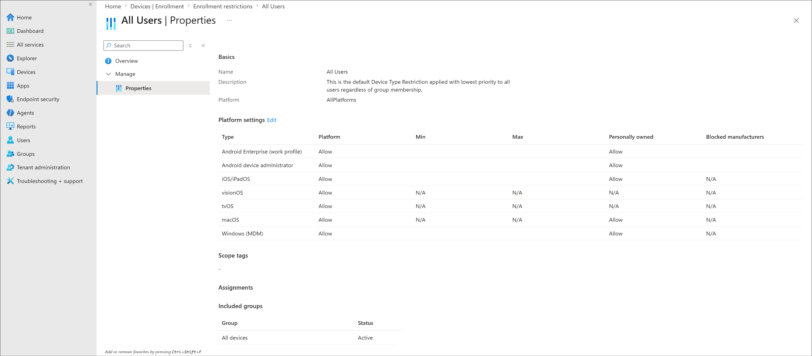
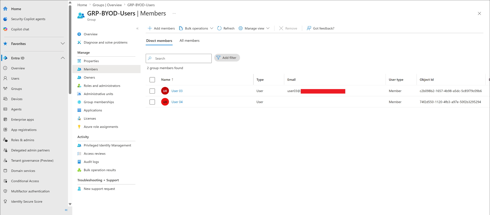
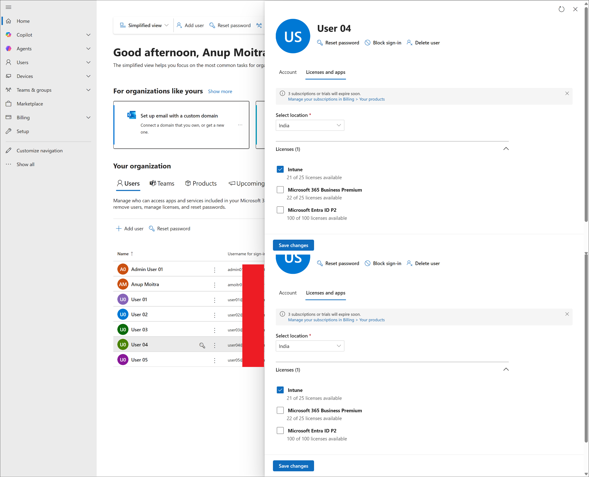
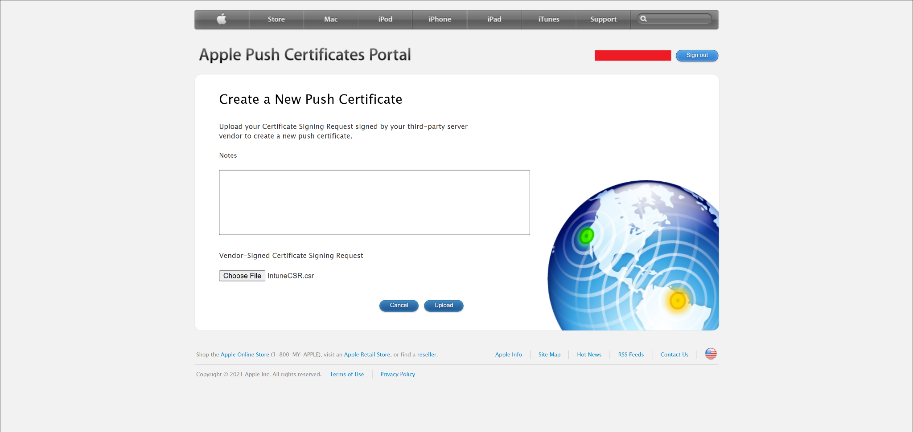
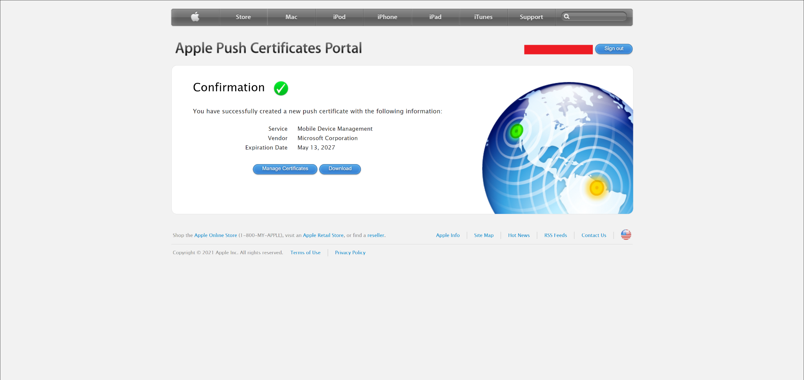
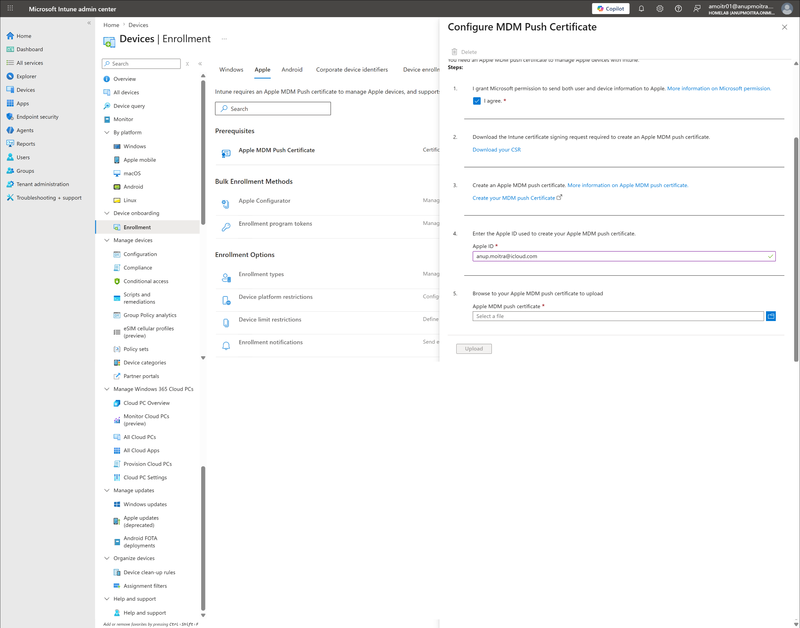
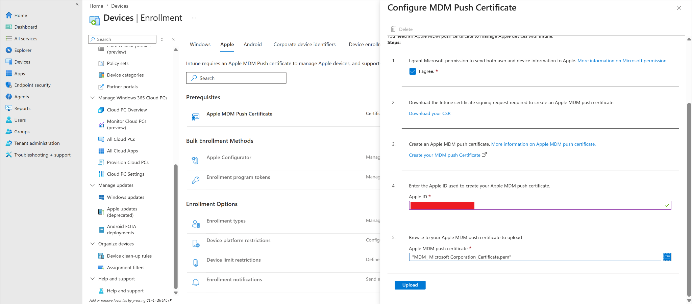
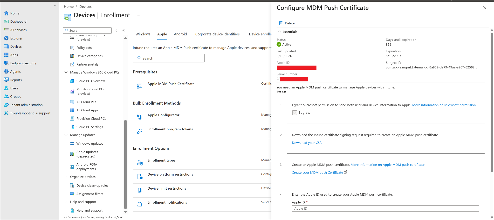

# iOS BYOD Enrollment

## Lab Status

| Field | Value |
|---|---|
| Status | In Progress |
| Current stage | Admin prerequisites completed |
| Pending | Physical iPhone/iPad enrollment and Intune device validation |
| Lab area | Device enrollment |
| Platform | iOS/iPadOS |
| Enrollment scenario | Personally owned / BYOD |
| Target group | GRP-BYOD-Users |
| Test user | user04 |
| Planned device name | IOS-BYOD-001 |

---

## Lab Objective

Enroll a personally owned iPhone or iPad into Microsoft Intune using the Company Portal app, and validate that the device appears in Intune as personally owned and managed. Admin prerequisites are complete. Physical device enrollment is pending hardware availability.

---

## Why This Lab Matters

iOS/iPadOS BYOD enrollment is a common real-world Intune scenario. Users bring personal iPhones or iPads to access Outlook, Teams, OneDrive, and SharePoint. Intune manages the work-related side of the device while keeping personal data separate.

Unlike Android, iOS/iPadOS enrollment requires an Apple MDM Push Certificate before Intune can manage any Apple device. That certificate is the primary admin prerequisite this lab documents.

---

## Prerequisites

| Requirement | Status |
|---|---|
| iOS/iPadOS platform enrollment allowed | Completed |
| Personally owned iOS/iPadOS devices allowed | Completed |
| user04 in GRP-BYOD-Users | Completed |
| user04 Intune license confirmed | Completed |
| Apple MDM Push Certificate created | Completed |
| Apple MDM Push Certificate active in Intune | Completed |
| Physical iPhone/iPad enrollment | Pending |
| Intune iOS device validation | Pending |

---

## Completed Steps

### Step 1 — Confirmed iOS/iPadOS enrollment restrictions

Navigated to:

```text
Devices -> Enrollment -> Device platform restrictions -> All Users -> Properties
```

Confirmed iOS/iPadOS platform is set to Allow and personally owned devices are allowed.



---

### Step 2 — Confirmed BYOD user group membership

Confirmed user04 is a member of `GRP-BYOD-Users` in Microsoft Entra admin center.



---

### Step 3 — Confirmed Intune license for user04

Confirmed user04 has an Intune-capable license assigned in Microsoft 365 admin center.



---

### Step 4 — Created Apple MDM Push Certificate

Navigated to:

```text
Devices -> Enrollment -> Apple -> Apple MDM Push Certificate
```

Downloaded the Intune certificate signing request and uploaded it to the Apple Push Certificates Portal to generate a new push certificate.





---

### Step 5 — Uploaded and activated the certificate in Intune

Entered the Apple ID used during certificate creation, uploaded the downloaded certificate file, and confirmed it shows as Active in Intune.

| Field | Result |
|---|---|
| Status | Active |
| Expiration date | Visible |







---

## Current Result

Intune is ready for personal iPhone/iPad enrollment:

- iOS/iPadOS enrollment allowed
- Personally owned devices allowed
- user04 licensed and in GRP-BYOD-Users
- Apple MDM Push Certificate active

Lab is paused until a physical iPhone or iPad is available.

---

## Pending Device-Side Steps

When an iPhone/iPad is available, complete the following steps.

### Step 6 — Rename the device

```text
Settings -> General -> About -> Name
```

Rename to `IOS-BYOD-001`. Capture device name, model, and iOS version. Sanitize serial number, IMEI, phone number, and all hardware identifiers before uploading screenshots.

---

### Step 7 — Install Company Portal and sign in

Install Intune Company Portal from the App Store. Open and sign in as user04.

---

### Step 8 — Complete Company Portal enrollment

Follow the enrollment prompts in Company Portal: Set up access → Begin → Download management profile → Allow profile download.

---

### Step 9 — Install the management profile

```text
Settings -> General -> VPN & Device Management
```

Install the downloaded management profile and trust remote management when prompted.

---

### Step 10 — Finish enrollment in Company Portal

Return to Company Portal and allow it to finish checking the device.

---

## Pending Intune Validation

After enrollment, verify the device in Intune:

```text
Devices -> iOS/iPadOS -> iOS/iPadOS devices
```

| Field | Expected value |
|---|---|
| Managed by | Intune |
| Ownership | Personal |
| Platform | iOS/iPadOS |
| Primary user | user04 |
| Compliance | Compliant or evaluating |

---

## Final Validation Checklist

| Validation item | Status |
|---|---|
| iOS/iPadOS platform allowed | Completed |
| Personally owned iOS/iPadOS devices allowed | Completed |
| user04 in GRP-BYOD-Users | Completed |
| user04 license confirmed | Completed |
| Apple MDM Push Certificate created | Completed |
| Apple MDM Push Certificate active | Completed |
| Company Portal installed on iPhone/iPad | Pending |
| iOS/iPadOS management profile installed | Pending |
| Device visible in Intune | Pending |
| Device ownership shows Personal | Pending |
| Device managed by Intune | Pending |
| Device compliance evaluated | Pending |

---

## Key Learning Points

- iOS/iPadOS enrollment requires an Apple MDM Push Certificate — without it, Intune cannot manage any Apple device
- The certificate must be renewed annually using the same Apple ID that created it
- Device platform restrictions control whether personal iOS/iPadOS devices can enroll
- A licensed Intune user is required for Company Portal enrollment
- Physical device validation is required before this lab can be marked complete
