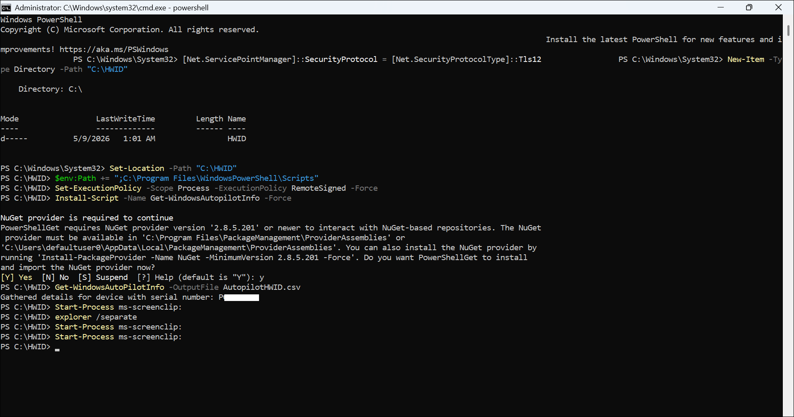
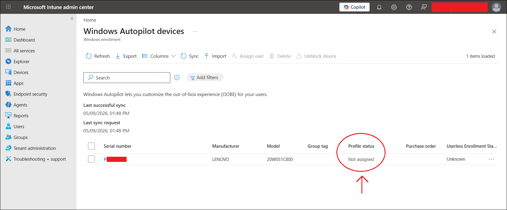
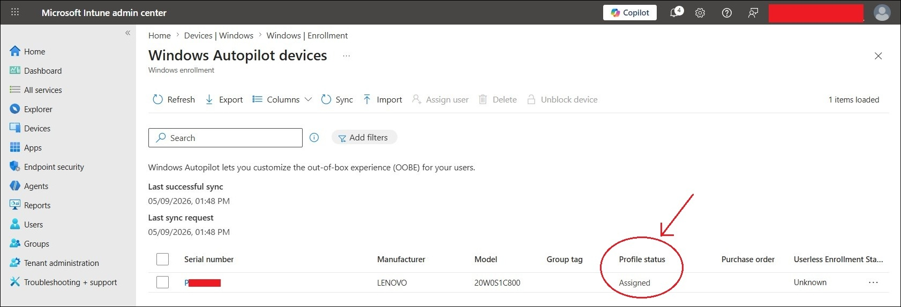
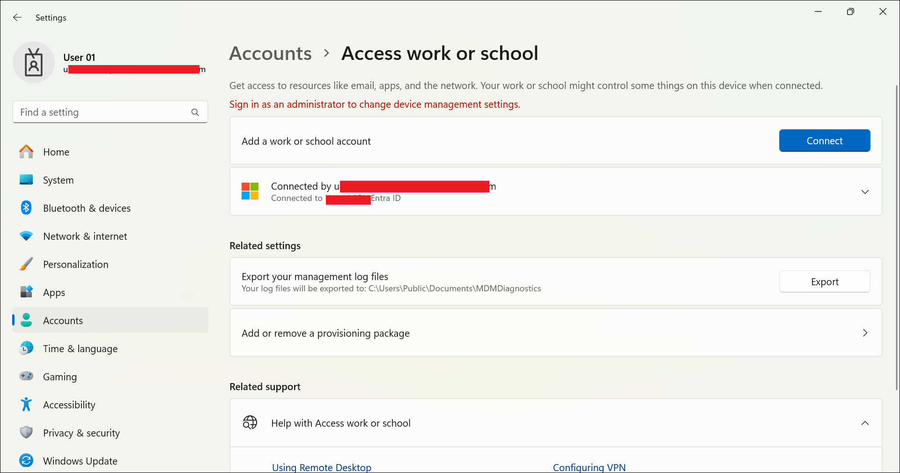
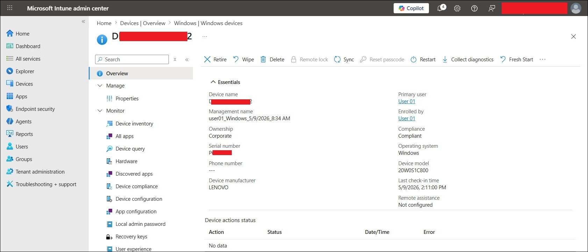

# Windows Autopilot User-Driven Enrollment

This file documents the Windows Autopilot user-driven enrollment lab for the MD-102 Intune virtual company project.

## Objective

The objective of this lab is to manually register a Windows device with Windows Autopilot and use a user-driven Autopilot deployment profile to enroll the device into Microsoft Intune.

This lab validates that:

- A Windows device can be manually registered with Windows Autopilot using a hardware hash CSV.
- A Windows Autopilot deployment profile can be assigned to the device.
- The device can receive the assigned Autopilot profile during Windows OOBE.
- User 01 can sign in during Windows OOBE.
- The device can join Microsoft Entra ID.
- The device can enroll into Microsoft Intune.
- The Autopilot-enrolled device can receive future apps, policies, and security configurations from Intune.

## Lab Context

This lab is part of the MD-102 Intune virtual company project.

The virtual company uses Microsoft Entra ID and Microsoft Intune to manage corporate Windows devices.

This Autopilot lab builds on the earlier completed work:

| Requirement | Status |
|---|---|
| Microsoft Intune tenant available | Completed |
| Microsoft Entra ID users created | Completed |
| Intune licenses assigned | Completed |
| Microsoft 365 Business Premium trial activated | Completed |
| User 01 licensed for Intune and Microsoft 365 Apps | Completed |
| Autopilot test device available | Completed |
| Autopilot device group created | Completed |
| Autopilot deployment profile created | Completed |
| Microsoft 365 Apps deployment created separately | Completed / verification pending |

## Important Concept

Windows Autopilot is used to configure Windows devices during the out-of-box experience, also known as OOBE.

In a traditional setup, an IT admin may manually configure Windows, join the device, install apps, and apply settings.

With Autopilot, the device can contact Microsoft cloud services during OOBE and receive the correct organization setup automatically.

Simple flow:

```text
Device starts at Windows OOBE
→ Device connects to the internet
→ Device checks for Autopilot registration
→ Assigned Autopilot profile is downloaded
→ User signs in with Microsoft Entra ID account
→ Device joins Microsoft Entra ID
→ Device enrolls into Intune
→ Intune applies policies and apps
```

## Lab Design

This lab uses a user-driven Autopilot deployment.

| Item | Value |
|---|---|
| Autopilot deployment type | User-driven |
| Join type | Microsoft Entra joined |
| Device ownership | Corporate |
| Enrollment platform | Windows 11 |
| Test user | User 01 |
| User sign-in account | User 01 lab account |
| Autopilot device group | GRP-Autopilot-Devices |
| Deployment profile | AP WIN User Driven Entra Join |
| Microsoft 365 Apps deployment | Created separately in Intune |

## Autopilot Device Group

A security group was created for Autopilot devices.

| Setting | Value |
|---|---|
| Group name | GRP-Autopilot-Devices |
| Group type | Security |
| Membership type | Assigned |
| Purpose | Contains Windows devices registered for Autopilot deployment in the MD-102 lab |

This group was used to assign the Autopilot deployment profile.

## Autopilot Deployment Profile

The following Windows Autopilot deployment profile was used.

| Setting | Value |
|---|---|
| Profile name | AP WIN User Driven Entra Join |
| Platform | Windows PC |
| Deployment mode | User-driven |
| Join to Microsoft Entra ID as | Microsoft Entra joined |
| User account type | Standard |
| Microsoft Software License Terms | Hide |
| Privacy settings | Hide |
| Hide change account options | Hide |
| Allow pre-provisioned deployment | No |
| Language / region | Operating system default |
| Automatically configure keyboard | Yes |
| Apply device name template | No |
| Assigned group | GRP-Autopilot-Devices |

## Device Naming Note

For this first Autopilot lab, the device name template was not enabled.

Because of this, Windows assigned a default device name during setup.

Future improvement:

```text
Enable Autopilot device name template
Example template: WINAP%RAND:5%
```

This can create cleaner device names such as:

```text
WINAP12345
```

## Hardware Hash Collection

The Autopilot test laptop was at the Windows OOBE screen.

To collect the hardware hash, Command Prompt was opened from OOBE using:

```text
Shift + F10
```

PowerShell was started from Command Prompt:

```powershell
powershell
```

The following commands were used to prepare the hardware hash collection:

```powershell
[Net.ServicePointManager]::SecurityProtocol = [Net.SecurityProtocolType]::Tls12
New-Item -Type Directory -Path "C:\HWID"
Set-Location -Path "C:\HWID"
$env:Path += ";C:\Program Files\WindowsPowerShell\Scripts"
Set-ExecutionPolicy -Scope Process -ExecutionPolicy RemoteSigned -Force
Install-Script -Name Get-WindowsAutopilotInfo -Force
```

The following command was used to generate the hardware hash CSV:

```powershell
Get-WindowsAutopilotInfo -OutputFile AutopilotHWID.csv
```

The CSV file was saved as:

```text
C:\HWID\AutopilotHWID.csv
```

The CSV file was copied from the test device and imported into Microsoft Intune.

> [!IMPORTANT]
> The Autopilot hardware hash CSV was not uploaded to GitHub. Hardware hashes and serial numbers are sensitive and should not be committed to a public repository.

## Autopilot Device Import

The hardware hash CSV was imported into Intune from the current Intune admin center path:

```text
Intune admin center
→ Devices
→ Windows
→ Device onboarding
→ Enrollment
→ Windows Autopilot
→ Devices
→ Import
```

Imported CSV file:

```text
AutopilotHWID.csv
```

After import and sync, the device appeared in the Autopilot devices list.

| Item | Result |
|---|---|
| Hardware hash collected | Successful |
| Hardware hash imported | Successful |
| Device appeared in Autopilot devices | Yes |
| Device manufacturer | Lenovo |
| Device model | 20W0S1C800 |
| Initial profile status | Not assigned |
| Final profile status | Assigned |

## Profile Assignment

After the device was imported, it was added to:

```text
GRP-Autopilot-Devices
```

The Autopilot profile assignment changed from:

```text
Not assigned
```

to:

```text
Assigned
```

This confirmed that the Autopilot deployment profile was assigned successfully.

## Autopilot OOBE Test

After the profile showed as assigned, the OOBE laptop was restarted.

Command used from OOBE Command Prompt:

```cmd
shutdown /r /t 0
```

After restart, the device connected to the internet and began the Autopilot setup experience.

User 01 signed in using the lab Microsoft Entra ID account.

> [!NOTE]
> The OOBE user sign-in screen was not captured during this lab run. Enrollment success was verified using the Intune device overview and the Windows Access work or school status after deployment.

## Verification Steps

After the device reached the Windows desktop, the following checks were completed.

### Check Windows work or school connection

On the Autopilot device:

```text
Settings
→ Accounts
→ Access work or school
```

Observed result:

```text
Connected to the lab tenant's Microsoft Entra ID
```

### Check Intune device record

In Intune admin center:

```text
Devices
→ Windows
→ Windows devices
→ Select the enrolled Autopilot device
```

Observed values:

| Field | Result |
|---|---|
| Device record visible in Intune | Yes |
| Primary user | User 01 |
| Enrolled by | User 01 |
| Ownership | Corporate |
| Compliance | Compliant |
| Operating system | Windows |
| Device manufacturer | Lenovo |
| Device model | 20W0S1C800 |

### Microsoft 365 Apps follow-up

Microsoft 365 Apps deployment should be reviewed separately from:

```text
Apps
→ All apps
→ Microsoft 365 Apps for Windows - Autopilot Lab
→ Monitor
→ Device install status
```

That validation is documented separately in:

```text
05-application-deployment/microsoft-365-apps-autopilot-deployment.md
```

## Test Result

| Test item | Result |
|---|---|
| Autopilot device group created | Successful |
| Autopilot deployment profile created | Successful |
| Hardware hash collected | Successful |
| Hardware hash imported | Successful |
| Device added to Autopilot device group | Successful |
| Autopilot profile assigned | Successful |
| OOBE sign-in with User 01 | Successful |
| Device connected to Microsoft Entra ID | Successful |
| Device appeared in Intune Windows devices | Successful |
| Device ownership shown as corporate | Successful |
| Device compliance shown as compliant | Successful |
| Microsoft 365 Apps deployment | Created separately / install verification pending |

## Screenshots

The following sanitized screenshots were captured for this lab.

> [!NOTE]
> Screenshots were sanitized before upload. Tenant names, full email addresses, serial numbers, device names, hardware hashes, and sensitive identifiers were hidden.

### Hardware hash created



### Autopilot device imported



### Autopilot profile assigned



### Access work or school status



### Intune Windows device overview



## Screenshot Folder Path

Screenshots for this lab are stored in:

```text
screenshots/sanitized/device-enrollment/
```

Screenshot filenames:

```text
autopilot-hardware-hash-created-sanitized.jpg
autopilot-device-imported-sanitized.jpg
autopilot-device-profile-assigned-sanitized.jpg
autopilot-access-work-school-managed-sanitized.jpg
autopilot-device-intune-overview-sanitized.jpg
```

## Troubleshooting Notes

### Profile status shows Not assigned

If the imported Autopilot device shows `Not assigned`, check that:

1. The device is added to the correct Autopilot device group.
2. The Autopilot deployment profile is assigned to that group.
3. Autopilot devices have been synced.
4. Enough time has passed for assignment processing.

### Profile status shows Pending

`Pending` usually means the assignment is processing.

Recommended action:

```text
Wait 5–15 minutes
Click Sync
Refresh the Autopilot devices page
```

### Device does not show Autopilot experience during OOBE

Check that:

1. The device is connected to the internet during OOBE.
2. The Autopilot profile status is `Assigned` before restarting the device.
3. The hardware hash was imported successfully.
4. The device was not accidentally set up before the Autopilot profile was assigned.

### Device name is not custom

This is expected in this lab because device name template was disabled.

Future improvement:

```text
Enable device name template in Autopilot profile
Use: WINAP%RAND:5%
```

## Security and Privacy Notes

This is a public learning repository.

Do not upload sensitive information, including:

- Full real email addresses
- Tenant IDs
- Device IDs
- Object IDs
- Serial numbers
- Autopilot hardware hashes
- BitLocker recovery keys
- Internal IP addresses
- Unsanitized screenshots
- Raw Autopilot hardware hash CSV files

## Current Lab Status

Completed:

- Microsoft 365 Business Premium trial activated.
- User 01 licensed for Intune and Microsoft 365 Apps.
- Autopilot device group created.
- Autopilot deployment profile created.
- Hardware hash collected from OOBE device.
- Autopilot device imported into Intune.
- Autopilot device added to GRP-Autopilot-Devices.
- Autopilot profile assigned successfully.
- OOBE sign-in completed with User 01.
- Device connected to Microsoft Entra ID.
- Device appeared in Intune Windows devices.
- Device ownership displayed as corporate.
- Device compliance displayed as compliant.
- Sanitized Autopilot screenshots added.

Related completed validation:

- Microsoft 365 Apps installation verified in Intune.
- Microsoft 365 Apps installation verified from Company Portal.
- Word sign-in verified with User 01.
- Excel and PowerPoint were included in the selected Microsoft 365 Apps deployment.

## Next Step

The Windows Autopilot user-driven enrollment lab is complete.

The related Microsoft 365 Apps deployment validation is now completed and documented in:

```text
05-application-deployment/microsoft-365-apps-autopilot-deployment.md
```

The next recommended lab is:

```text
06-endpoint-security/windows-firewall-policy.md
```
