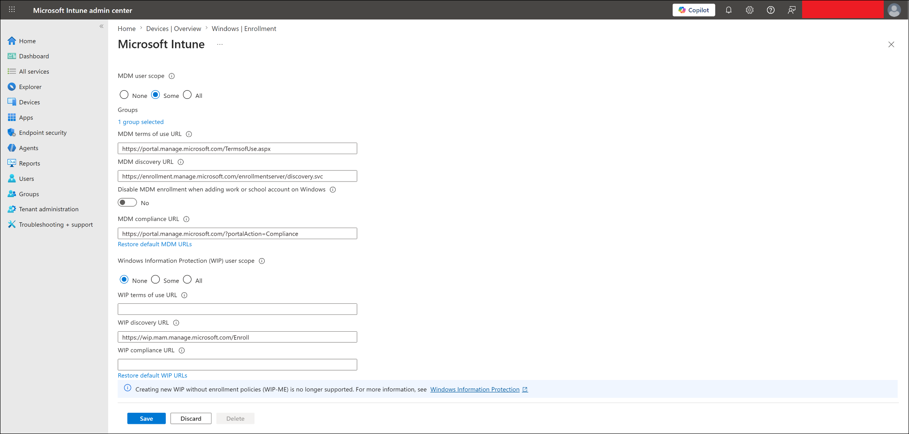
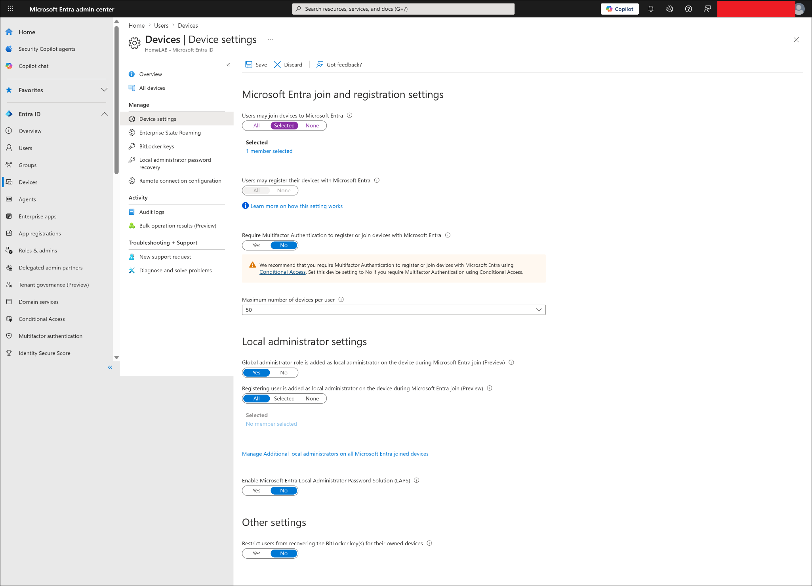

# Windows Autopilot User-Driven Enrollment

## Lab status

**Status:** Completed  
**Lab category:** Device enrollment  
**Enrollment method:** Windows Autopilot user-driven enrollment  
**Join type:** Microsoft Entra joined  
**Management platform:** Microsoft Intune  
**Target user:** user01  
**Autopilot device group:** GRP-Autopilot-Devices  
**Final enrolled device:** WINAUTO452  

---

## Lab objective

The objective of this lab is to manually register a Windows device with Windows Autopilot and complete a user-driven Autopilot enrollment into Microsoft Intune.

This lab validates that:

- A Windows device can be manually registered with Windows Autopilot using a hardware hash CSV.
- Automatic MDM enrollment settings can support Intune enrollment.
- Microsoft Entra device join settings can support user-driven provisioning.
- A dynamic Autopilot device group can target imported Autopilot devices.
- A Windows Autopilot deployment profile can be created and assigned.
- A targeted Autopilot device can receive the assigned profile.
- user01 can sign in during Windows OOBE.
- The device can join Microsoft Entra ID.
- The device can enroll into Microsoft Intune.
- The device can appear in Intune as a corporate Windows device.
- Required apps can be delivered after Autopilot enrollment.

---

## Why this lab matters

Windows Autopilot is used to provision corporate Windows devices without traditional manual imaging.

In older deployment models, IT teams often prepared devices by manually installing Windows, joining the domain, installing apps, and applying settings.

With Windows Autopilot, the device can start from the Windows out-of-box experience, identify itself through its hardware hash, receive a cloud-assigned deployment profile, and enroll into Intune automatically after the user signs in.

Simple Autopilot flow:

```text
Device starts at Windows OOBE
-> Device connects to the internet
-> Device checks for Autopilot registration
-> Assigned Autopilot profile downloads
-> User signs in with Microsoft Entra ID account
-> Device joins Microsoft Entra ID
-> Device enrolls into Microsoft Intune
-> Intune applies apps, profiles, and policies
```

This is a core modern endpoint provisioning workflow for MD-102 and Intune administration.

---

## Lab environment

| Item | Value |
|---|---|
| Virtual company | Contoso Startup Lab |
| Autopilot deployment type | User-driven |
| Join type | Microsoft Entra joined |
| Device ownership | Corporate |
| Enrollment platform | Windows 11 |
| Management platform | Microsoft Intune |
| Test user | user01 |
| Autopilot device group | GRP-Autopilot-Devices |
| Deployment profile | APUserDrivenEntraJoinPilot |
| Device name template | WINAUTO%RAND:3% |
| Final enrolled device name | WINAUTO452 |
| Final device status | Managed, corporate, compliant |

---

## Prerequisites

Before starting this lab, the following were completed:

- Microsoft Intune tenant available.
- Microsoft Entra ID users created.
- user01 license assigned.
- Automatic MDM enrollment reviewed.
- Microsoft Entra device join settings reviewed.
- Autopilot device group prepared.
- Autopilot test device available.
- Hardware hash collection method prepared.
- Required application deployments created for post-enrollment validation.

Completed dependency labs included:

```text
01-identity-and-groups/users-and-groups.md
05-application-deployment/microsoft-store-app-deployment.md
05-application-deployment/win32-app-deployment-7zip.md
05-application-deployment/microsoft-365-apps-autopilot-deployment.md
```

---

## Configuration flow

```text
Review automatic MDM enrollment
-> Review Microsoft Entra device join settings
-> Prepare Autopilot device group
-> Collect hardware hash from Windows OOBE
-> Import hardware hash CSV into Intune
-> Create Autopilot deployment profile
-> Assign profile to GRP-Autopilot-Devices
-> Wait for profile status to show Assigned
-> Complete Windows OOBE as user01
-> Verify Intune enrollment, ownership, compliance, and apps
```

---

## Autopilot design summary

### Autopilot device group

The Autopilot device was targeted through a dedicated device group.

| Setting | Value |
|---|---|
| Group name | GRP-Autopilot-Devices |
| Group type | Security |
| Membership type | Dynamic device |
| Purpose | Target Windows Autopilot deployment profile to registered Autopilot devices |
| Used for | Autopilot profile assignment |

Observed group flow:

```text
Imported Autopilot device
-> Dynamic group rule processed
-> Device became a member of GRP-Autopilot-Devices
-> Autopilot profile assignment applied
```

---

### Autopilot deployment profile

| Setting | Value |
|---|---|
| Profile name | APUserDrivenEntraJoinPilot |
| Platform | Windows PC |
| Deployment mode | User-driven |
| Join to Microsoft Entra ID as | Microsoft Entra joined |
| User account type | Standard |
| Microsoft Software License Terms | Hide |
| Privacy settings | Hide |
| Hide change account options | Hide |
| Allow pre-provisioned deployment | No |
| Language / region | Operating system default |
| Automatically configure keyboard | Yes |
| Apply device name template | Yes |
| Device name template | WINAUTO%RAND:3% |
| Assigned group | GRP-Autopilot-Devices |

---

### Device naming result

The Autopilot profile used this device name template:

```text
WINAUTO%RAND:3%
```

After enrollment, the device appeared in Intune as:

```text
WINAUTO452
```

This confirmed that the Autopilot naming template applied successfully during provisioning.

---

## Steps performed

### Step 1 - Reviewed automatic MDM enrollment

Automatic MDM enrollment was reviewed to confirm that eligible users could enroll Windows devices into Microsoft Intune.

This setting is important because during Autopilot user-driven enrollment, the user signs in with a Microsoft Entra ID account and the device must automatically enroll into Intune.

Simple flow:

```text
User signs in during OOBE
-> Device joins Microsoft Entra ID
-> Automatic MDM enrollment sends the device to Intune
-> Intune applies apps, profiles, and policies
```

---

### Step 2 - Reviewed Microsoft Entra device join settings

Microsoft Entra device join settings were reviewed to confirm that the test user could join devices to Microsoft Entra ID.

This was required for the user-driven Autopilot flow.

---

### Step 3 - Prepared the Autopilot device group

The Autopilot device group was prepared:

```text
GRP-Autopilot-Devices
```

This group was used to assign the Windows Autopilot deployment profile to imported Autopilot devices.

---

### Step 4 - Collected the hardware hash

The Autopilot test laptop was prepared from the Windows OOBE screen.

Command Prompt was opened from OOBE using:

```text
Shift + F10
```

PowerShell was started from Command Prompt:

```powershell
powershell
```

The following commands were used to prepare hardware hash collection:

```powershell
[Net.ServicePointManager]::SecurityProtocol = [Net.SecurityProtocolType]::Tls12
New-Item -Type Directory -Path "C:\HWID"
Set-Location -Path "C:\HWID"
$env:Path += ";C:\Program Files\WindowsPowerShell\Scripts"
Set-ExecutionPolicy -Scope Process -ExecutionPolicy RemoteSigned -Force
Install-Script -Name Get-WindowsAutopilotInfo -Force
```

The following command generated the hardware hash CSV:

```powershell
Get-WindowsAutopilotInfo -OutputFile AutopilotHWID.csv
```

The CSV file was saved as:

```text
C:\HWID\AutopilotHWID.csv
```

> [!IMPORTANT]
> The Autopilot hardware hash CSV was not uploaded to GitHub. Hardware hashes and serial numbers are sensitive and should not be committed to a public repository.

---

### Step 5 - Imported the Autopilot hardware hash CSV

The hardware hash CSV was imported into Intune from:

```text
Intune admin center
-> Devices
-> Windows
-> Device onboarding
-> Enrollment
-> Windows Autopilot
-> Devices
-> Import
```

Imported CSV file:

```text
AutopilotHWID.csv
```

After import and sync, the device appeared in the Windows Autopilot devices list.

| Item | Result |
|---|---|
| Hardware hash collected | Successful |
| Hardware hash imported | Successful |
| Device appeared in Autopilot devices | Successful |
| Manufacturer | Lenovo |
| Initial profile status | Not assigned |
| Final profile status | Assigned |

---

### Step 6 - Created the Autopilot deployment profile

A Windows Autopilot user-driven deployment profile was created.

Profile name:

```text
APUserDrivenEntraJoinPilot
```

The profile was configured for Microsoft Entra joined user-driven deployment.

---

### Step 7 - Assigned the Autopilot deployment profile

The Autopilot deployment profile was assigned to:

```text
GRP-Autopilot-Devices
```

After the device was imported and group membership processed, the Autopilot device profile status changed from:

```text
Not assigned
```

to:

```text
Assigned
```

This confirmed that the Autopilot profile was assigned successfully.

---

### Step 8 - Completed user-driven OOBE enrollment

After the profile status showed `Assigned`, the test device was restarted into the Windows out-of-box experience.

During OOBE:

1. The device connected to the internet.
2. The assigned Autopilot profile was downloaded.
3. user01 signed in using the lab Microsoft Entra ID account.
4. The device joined Microsoft Entra ID.
5. The device enrolled into Microsoft Intune.
6. The device reached the Windows desktop.
7. Apps and policies began processing from Intune.

> [!NOTE]
> The OOBE sign-in screen was not captured for this lab run. Enrollment success was verified using Intune device records, corporate ownership, compliance status, and managed app installation status.

---

### Step 9 - Verified the enrolled device in Intune

After the device reached the Windows desktop, validation was performed from Intune.

Navigation used:

```text
Intune admin center
-> Devices
-> Windows
-> Windows devices
```

Observed result:

| Field | Result |
|---|---|
| Device name | WINAUTO452 |
| Managed by | Intune |
| Ownership | Corporate |
| Compliance | Compliant |
| Operating system | Windows |
| Primary user | user01 |
| Last check-in | Updated after enrollment |

---

### Step 10 - Verified app deployment after Autopilot

After Autopilot enrollment, the device received application assignments from Intune.

Observed app deployment results included:

| App | Assignment behavior | Result |
|---|---|---|
| Company Portal | Required | Installed |
| VLC UWP | Required | Installed |
| Slack | Required | Installed |
| 7-Zip | Required Win32 app | Installed |
| Microsoft 365 Apps | Required | Installed |
| ChatGPT | Available | Available for install |
| WhatsApp | Available | Available for install |

---

## Validation

### Tenant readiness validation

Validation confirmed that:

- Automatic MDM enrollment was reviewed.
- Microsoft Entra device join settings were reviewed.
- user01 was prepared for Autopilot sign-in.
- user01 had the required license for enrollment and management.

---

### Autopilot registration validation

Validation confirmed that:

- The hardware hash was collected successfully.
- The hardware hash CSV was imported into Intune.
- The imported device appeared in Windows Autopilot devices.
- The Autopilot device became associated with the target deployment profile.

---

### Profile assignment validation

Validation confirmed that:

- The Autopilot deployment profile was assigned to `GRP-Autopilot-Devices`.
- The imported Autopilot device changed from `Not assigned` to `Assigned`.
- The device was ready for user-driven OOBE provisioning.

---

### Enrollment validation

Validation confirmed that:

- user01 completed the Windows OOBE sign-in.
- The device joined Microsoft Entra ID.
- The device enrolled into Microsoft Intune.
- The device appeared as `WINAUTO452`.
- The device showed as corporate-owned.
- The device showed as compliant.

---

### Post-enrollment app validation

Validation confirmed that required apps installed or became available after Autopilot enrollment.

This validated the full modern endpoint flow:

```text
Autopilot enrollment
-> Microsoft Entra join
-> Intune enrollment
-> Required Store apps
-> Required Win32 apps
-> Microsoft 365 Apps
-> Company Portal validation
```

---

## Final test result

| Validation item | Status |
|---|---|
| Automatic MDM enrollment reviewed | Completed |
| Microsoft Entra join settings reviewed | Completed |
| Autopilot device group dynamic rule configured | Completed |
| Autopilot device group rule validation completed | Completed |
| Autopilot device group membership confirmed | Completed |
| Autopilot deployment profile created | Completed |
| Autopilot OOBE settings configured | Completed |
| Autopilot device group targeted | Completed |
| Hardware hash collected | Completed |
| Hardware hash CSV imported | Completed |
| Autopilot device appeared in Intune | Completed |
| Autopilot profile assigned | Completed |
| user01 signed in during OOBE | Completed |
| Device joined Microsoft Entra ID | Completed |
| Device enrolled into Intune | Completed |
| Device appeared in Windows devices | Completed |
| Device ownership showed corporate | Completed |
| Device compliance showed compliant | Completed |
| Required app deployment after Autopilot | Completed |
| Microsoft 365 Apps deployment after Autopilot | Completed |
| Final lab result | Completed |

---

## Screenshots captured

Screenshots are stored in:

```text
screenshots/sanitized/device-enrollment/
screenshots/sanitized/identity-and-groups/
```

> [!NOTE]
> Screenshots should be sanitized before upload. Hide tenant names, full email addresses, serial numbers, device IDs, object IDs, hardware hashes, and other sensitive identifiers.

### Automatic MDM enrollment setting



### Microsoft Entra device join settings



### Autopilot dynamic device group rule


### Autopilot dynamic group rule validation


### Autopilot device group member


### Autopilot CSV import


### Autopilot device imported


### Autopilot profile basics


### Autopilot OOBE settings


### Autopilot profile created


### Autopilot profile assignment


### Autopilot profile assigned to device


### Autopilot device overview in Intune


---

## Screenshot file list

```text
screenshots/sanitized/device-enrollment/autopilot-automatic-mdm-enrollment-sanitized.png
screenshots/sanitized/device-enrollment/autopilot-entra-device-join-settings-sanitized.png
screenshots/sanitized/identity-and-groups/autopilot-device-group-dynamic-rule-sanitized.png
screenshots/sanitized/identity-and-groups/autopilot-device-group-rule-validation-sanitized.png
screenshots/sanitized/identity-and-groups/autopilot-device-group-member-sanitized.png
screenshots/sanitized/device-enrollment/autopilot-device-csv-import-sanitized.png
screenshots/sanitized/device-enrollment/autopilot-device-imported-sanitized.png
screenshots/sanitized/device-enrollment/autopilot-profile-basics-sanitized.png
screenshots/sanitized/device-enrollment/autopilot-profile-oobe-settings-sanitized.png
screenshots/sanitized/device-enrollment/autopilot-profile-created-sanitized.png
screenshots/sanitized/device-enrollment/autopilot-profile-assignment-sanitized.png
screenshots/sanitized/device-enrollment/autopilot-profile-assigned-sanitized.png
screenshots/sanitized/device-enrollment/autopilot-device-overview-sanitized.png
```

---

## Related labs

This Autopilot lab connects to these completed application deployment labs:

| Lab file | Relationship |
|---|---|
| `01-identity-and-groups/users-and-groups.md` | Provides `user01` and `GRP-Autopilot-Devices` |
| `05-application-deployment/microsoft-store-app-deployment.md` | Provides required and available Store app deployment validation |
| `05-application-deployment/win32-app-deployment-7zip.md` | Provides Win32 app deployment validation |
| `05-application-deployment/microsoft-365-apps-autopilot-deployment.md` | Provides Microsoft 365 Apps post-Autopilot validation |
| `06-endpoint-security/windows-defender-antivirus-policy.md` | Later uses `WINAUTO452` for endpoint security targeting |
| `06-endpoint-security/windows-firewall-policy.md` | Later uses `WINAUTO452` for endpoint security targeting |
| `06-endpoint-security/bitlocker-encryption-policy.md` | Later uses `WINAUTO452` for endpoint security targeting |

---

## Troubleshooting notes

### Autopilot profile status shows Not assigned

If the imported Autopilot device shows `Not assigned`, check that:

1. The device is added to the correct Autopilot device group.
2. The Autopilot deployment profile is assigned to that group.
3. Autopilot devices have been synced.
4. Enough time has passed for assignment processing.

---

### Dynamic group membership does not update

If the imported Autopilot device does not appear in `GRP-Autopilot-Devices`, check that:

1. The group membership type is dynamic device.
2. The dynamic rule syntax is correct.
3. The device exists in Windows Autopilot devices.
4. The dynamic rule validation shows the expected result.
5. Enough time has passed for Microsoft Entra ID group processing.

---

### Autopilot profile status takes time to update

Autopilot assignment can take several minutes.

Recommended actions:

```text
Click Sync
Wait 5-15 minutes
Refresh the Autopilot devices page
Confirm profile status changes to Assigned
```

---

### Device does not show organization setup during OOBE

Check that:

1. The device is connected to the internet during OOBE.
2. The hardware hash was imported successfully.
3. The Autopilot profile status showed `Assigned` before continuing OOBE.
4. The device was not already fully set up before the Autopilot profile was assigned.

---

### Device does not appear in Intune after OOBE

Check that:

1. user01 has an Intune license.
2. Automatic MDM enrollment includes user01.
3. Enrollment restrictions allow Windows enrollment.
4. Microsoft Entra device join settings allow the user to join devices.
5. The device has internet access.
6. The device completed OOBE successfully.

---

### Apps show Waiting for install status

This can happen shortly after enrollment while Intune reporting catches up.

Recommended actions:

1. Wait several minutes.
2. Refresh the device managed apps page.
3. Check Company Portal on the endpoint.
4. Confirm apps are installed locally.
5. Review Intune app install status if needed.

---

## Enterprise reflection

Windows Autopilot is valuable in enterprise environments because it reduces the need for traditional imaging and manual device preparation.

A production-ready Autopilot design should include:

- Clear device naming standards.
- Separate pilot and production Autopilot groups.
- Dynamic device group rules for imported Autopilot devices.
- User-driven deployment profiles for standard corporate provisioning.
- Required security policies assigned early in the enrollment process.
- Required apps assigned carefully so provisioning does not become too slow.
- A documented troubleshooting process for assignment, OOBE, enrollment, and app deployment issues.

Recommended rollout model:

```text
IT pilot devices
-> Small business pilot group
-> New hire devices
-> Wider corporate device provisioning
```

This lab follows a pilot-first model by using `GRP-Autopilot-Devices` and validating the result on a single test endpoint before expanding the design.

---

## Security and privacy notes

This is a public learning repository.

Do not upload:

- Real tenant IDs
- Full real email addresses
- Passwords
- MFA QR codes
- Device serial numbers
- Device IDs
- Object IDs
- Autopilot hardware hashes
- BitLocker recovery keys
- Internal IP addresses
- Unsanitized screenshots
- Raw Autopilot hardware hash CSV files

Before uploading screenshots, hide or blur:

- Top-right signed-in admin account
- Tenant/domain name
- Full user principal names
- Device IDs
- Object IDs
- Serial numbers
- Hardware hashes
- Any sensitive identifiers

---

## Key learning outcomes

This lab demonstrated how to:

- Prepare a tenant for Windows Autopilot enrollment.
- Review automatic MDM enrollment settings.
- Review Microsoft Entra device join settings.
- Collect a Windows Autopilot hardware hash.
- Import a hardware hash CSV into Intune.
- Create a Windows Autopilot user-driven deployment profile.
- Assign an Autopilot deployment profile to a dynamic device group.
- Wait for Autopilot profile assignment.
- Complete Windows OOBE with a Microsoft Entra ID user.
- Validate Microsoft Entra join and Intune enrollment.
- Confirm corporate ownership in Intune.
- Confirm post-enrollment app deployment.
- Document a modern endpoint provisioning workflow professionally.

---

## Lab conclusion

The Windows Autopilot user-driven enrollment lab was completed successfully.

Final result:

```text
The test device was registered with Windows Autopilot.
The Autopilot deployment profile was assigned successfully.
user01 completed the OOBE sign-in experience.
The device joined Microsoft Entra ID and enrolled into Microsoft Intune.
The device appeared in Intune as WINAUTO452 with corporate ownership and compliant status.
Required applications were delivered after Autopilot enrollment.
```
