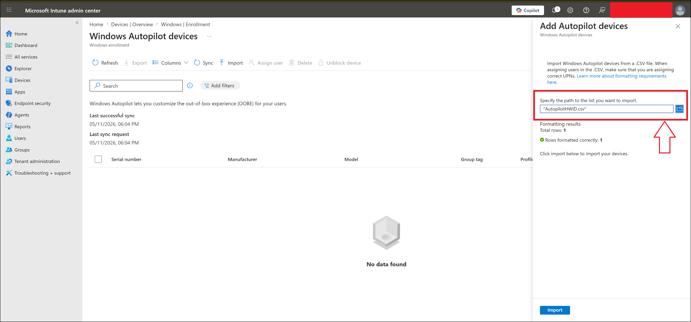
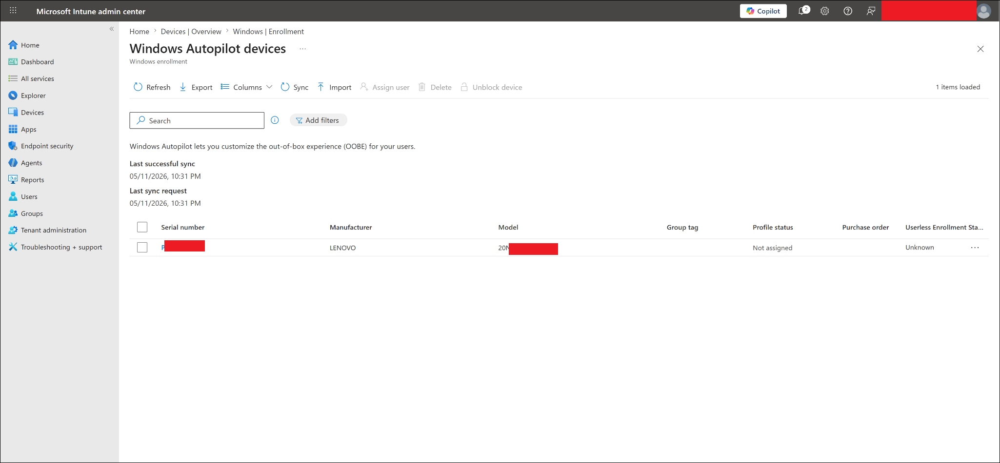
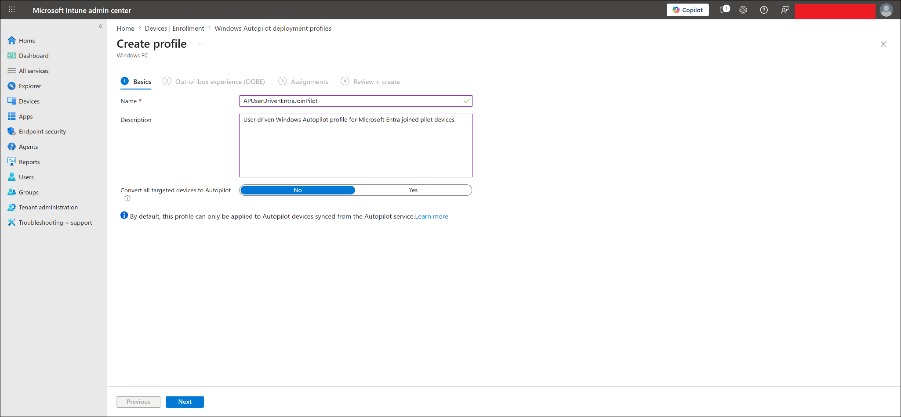
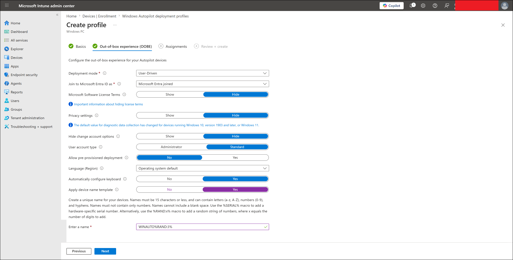
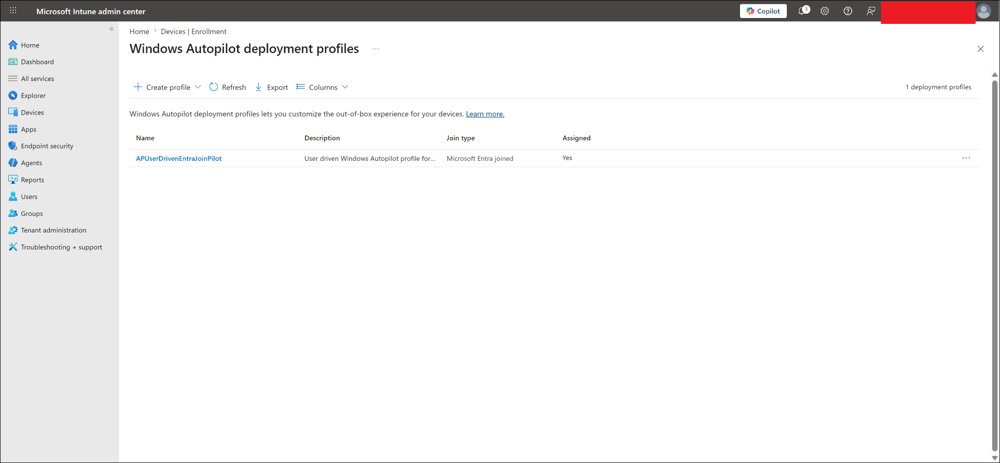
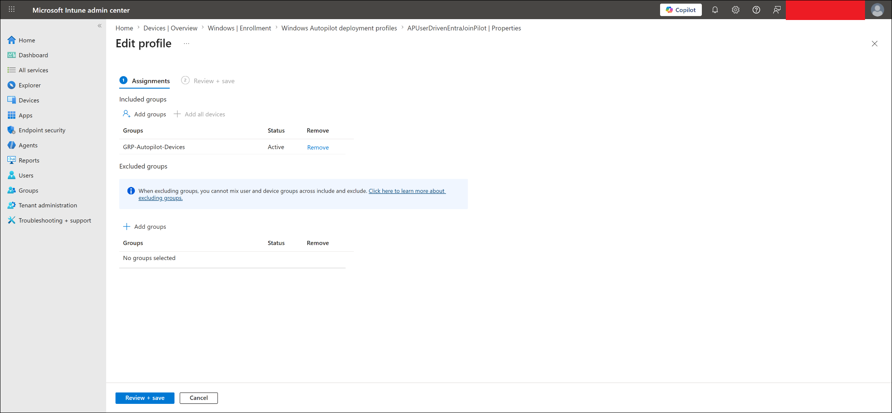
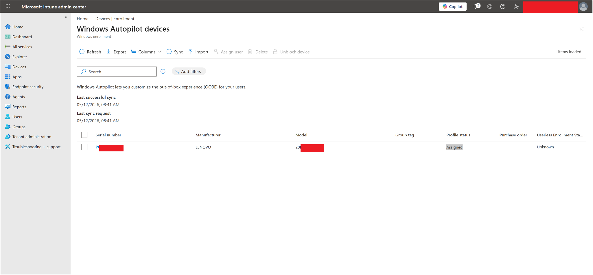
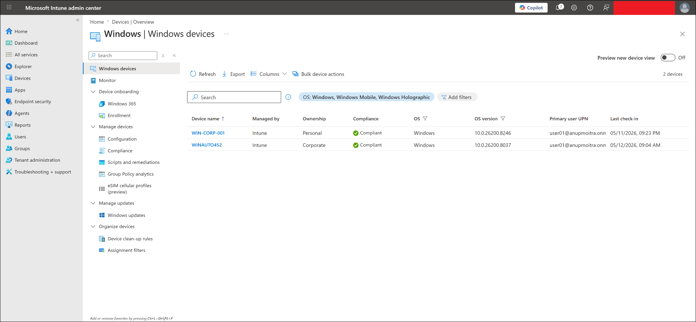

# Windows Autopilot User-Driven Enrollment

This file documents the Windows Autopilot user-driven enrollment lab for the MD-102 Intune virtual company project.

---

## Objective

The objective of this lab is to manually register a Windows device with Windows Autopilot and use a user-driven Autopilot deployment profile to enroll the device into Microsoft Intune.

This lab validates that:

- A Windows device can be manually registered with Windows Autopilot using a hardware hash CSV.
- A Windows Autopilot deployment profile can be created and assigned.
- A targeted Autopilot device can receive the assigned profile.
- User 01 can sign in during Windows OOBE.
- The device can join Microsoft Entra ID.
- The device can enroll into Microsoft Intune.
- The device can appear in Intune as a corporate Windows device.
- The device can report compliant after enrollment.
- Required apps can be delivered after Autopilot enrollment.

---

## Lab Context

This lab is part of the MD-102 Intune virtual company project.

The virtual company, **Contoso Startup Lab**, uses Microsoft Entra ID and Microsoft Intune to manage corporate Windows devices.

This Autopilot lab builds on earlier completed work:

| Requirement | Status |
|---|---|
| Microsoft Intune tenant available | Completed |
| Microsoft Entra ID users created | Completed |
| Intune licenses assigned | Completed |
| Automatic MDM enrollment configured | Completed |
| Microsoft Entra join settings reviewed | Completed |
| Microsoft Store apps deployed | Completed |
| Win32 7-Zip app deployment completed | Completed |
| Microsoft 365 Apps deployment created | Completed |
| Autopilot test device available | Completed |

---

## Important Concept

Windows Autopilot is used to provision Windows devices during the out-of-box experience, also known as OOBE.

Traditional device setup usually requires an admin to manually configure Windows, join the device, install apps, and apply settings.

With Autopilot, the device contacts Microsoft cloud services during OOBE, identifies itself through its hardware hash, downloads the assigned Autopilot profile, and starts the organization-managed setup flow.

Simple flow:

```text
Device starts at Windows OOBE
-> Device connects to the internet
-> Device checks for Autopilot registration
-> Assigned Autopilot profile downloads
-> User signs in with Microsoft Entra ID account
-> Device joins Microsoft Entra ID
-> Device enrolls into Microsoft Intune
-> Intune applies apps, policies, and compliance settings
```

---

## Lab Environment

| Item | Value |
|---|---|
| Autopilot deployment type | User-driven |
| Join type | Microsoft Entra joined |
| Device ownership | Corporate |
| Enrollment platform | Windows 11 |
| Test user | User 01 |
| User sign-in account | User 01 lab account |
| Autopilot device group | `GRP-Autopilot-Devices` |
| Deployment profile | `APUserDrivenEntraJoinPilot` |
| Final enrolled device name | `WINAUTO452` |
| Management platform | Microsoft Intune |
| Final device status | Managed, corporate, compliant |

---

## Autopilot Device Group

The Autopilot device was targeted through a dedicated Autopilot device group.

| Setting | Value |
|---|---|
| Group name | `GRP-Autopilot-Devices` |
| Group type | Security |
| Purpose | Target Windows Autopilot deployment profile to registered Autopilot devices |
| Used for | Autopilot profile assignment |

This group was used to assign the Autopilot deployment profile safely to the imported Autopilot device.

---

## Autopilot Deployment Profile

The following Windows Autopilot deployment profile was used.

| Setting | Value |
|---|---|
| Profile name | `APUserDrivenEntraJoinPilot` |
| Platform | Windows PC |
| Deployment mode | User-driven |
| Join to Microsoft Entra ID as | Microsoft Entra joined |
| User account type | Standard |
| Microsoft Software License Terms | Hide |
| Privacy settings | Hide |
| Hide change account options | Hide |
| Allow pre-provisioned deployment | No |
| Language / region | Operating system default |
| Automatically configure keyboard | Yes |
| Apply device name template | Yes |
| Device name template | `WINAUTO%RAND:3%` |
| Assigned group | `GRP-Autopilot-Devices` |

---

## Device Naming Result

The Autopilot profile used a device name template:

```text
WINAUTO%RAND:3%
```

After enrollment, the device appeared in Intune as:

```text
WINAUTO452
```

This proves that the Autopilot naming template was applied successfully during provisioning.

---

## Hardware Hash Collection

The Autopilot test laptop was prepared from the Windows OOBE screen.

Command Prompt was opened from OOBE using:

```text
Shift + F10
```

PowerShell was started from Command Prompt:

```powershell
powershell
```

The following commands were used to prepare hardware hash collection:

```powershell
[Net.ServicePointManager]::SecurityProtocol = [Net.SecurityProtocolType]::Tls12
New-Item -Type Directory -Path "C:\HWID"
Set-Location -Path "C:\HWID"
$env:Path += ";C:\Program Files\WindowsPowerShell\Scripts"
Set-ExecutionPolicy -Scope Process -ExecutionPolicy RemoteSigned -Force
Install-Script -Name Get-WindowsAutopilotInfo -Force
```

The following command was used to generate the hardware hash CSV:

```powershell
Get-WindowsAutopilotInfo -OutputFile AutopilotHWID.csv
```

The CSV file was saved as:

```text
C:\HWID\AutopilotHWID.csv
```

> [!IMPORTANT]
> The Autopilot hardware hash CSV was not uploaded to GitHub. Hardware hashes and serial numbers are sensitive and should not be committed to a public repository.

---

## Autopilot Device Import

The hardware hash CSV was imported into Intune from:

```text
Intune admin center
-> Devices
-> Windows
-> Device onboarding
-> Enrollment
-> Windows Autopilot
-> Devices
-> Import
```

Imported CSV file:

```text
AutopilotHWID.csv
```

After import and sync, the device appeared in the Autopilot devices list.

| Item | Result |
|---|---|
| Hardware hash collected | Successful |
| Hardware hash imported | Successful |
| Device appeared in Autopilot devices | Successful |
| Manufacturer | Lenovo |
| Initial profile status | Not assigned |
| Final profile status | Assigned |

---

## Profile Assignment

The Autopilot deployment profile was assigned to:

```text
GRP-Autopilot-Devices
```

After the device was imported and group membership processed, the Autopilot device profile status changed from:

```text
Not assigned
```

to:

```text
Assigned
```

This confirmed that the Autopilot profile was assigned successfully.

---

## Autopilot OOBE Enrollment Test

After the profile status showed **Assigned**, the test device was restarted into the Windows out-of-box experience.

During OOBE:

1. The device connected to the internet.
2. The assigned Autopilot profile was downloaded.
3. User 01 signed in using the lab Microsoft Entra ID account.
4. The device joined Microsoft Entra ID.
5. The device enrolled into Microsoft Intune.
6. The device reached the Windows desktop.
7. Apps and policies began processing from Intune.

> [!NOTE]
> The OOBE sign-in screen was not captured for this lab run. Enrollment success was verified using Intune device records, corporate ownership, compliance status, and managed app installation status.

---

## Post-Enrollment Verification

After the device reached the Windows desktop, validation was performed from Intune.

Navigation used:

```text
Intune admin center
-> Devices
-> Windows
-> Windows devices
```

Observed result:

| Field | Result |
|---|---|
| Device name | `WINAUTO452` |
| Managed by | Intune |
| Ownership | Corporate |
| Compliance | Compliant |
| Operating system | Windows |
| Primary user | User 01 |
| Last check-in | Updated after enrollment |

This confirms the Autopilot-enrolled device was successfully managed by Intune.

---

## Application Deployment Validation After Autopilot

After Autopilot enrollment, the device also received application assignments from Intune.

Observed app deployment results included:

| App | Assignment behavior | Result |
|---|---|---|
| Company Portal | Required | Installed |
| VLC UWP | Required | Installed |
| Slack | Required | Installed |
| 7-Zip | Required Win32 app | Installed |
| Microsoft 365 Apps | Required | Installed |
| ChatGPT | Available | Available for install |
| WhatsApp | Available | Available for install |

The detailed Microsoft 365 Apps deployment validation is documented separately in:

```text
05-application-deployment/microsoft-365-apps-autopilot-deployment.md
```

---

## Test Result

| Test item | Result |
|---|---|
| Automatic MDM enrollment reviewed | Successful |
| Microsoft Entra join settings reviewed | Successful |
| Autopilot deployment profile created | Successful |
| Autopilot OOBE settings configured | Successful |
| Autopilot device group targeted | Successful |
| Hardware hash collected | Successful |
| Hardware hash CSV imported | Successful |
| Autopilot device appeared in Intune | Successful |
| Autopilot profile assigned | Successful |
| User 01 signed in during OOBE | Successful |
| Device joined Microsoft Entra ID | Successful |
| Device enrolled into Intune | Successful |
| Device appeared in Windows devices | Successful |
| Device ownership showed corporate | Successful |
| Device compliance showed compliant | Successful |
| Required app deployment after Autopilot | Successful |
| Microsoft 365 Apps deployment after Autopilot | Successful |
| Final lab result | Successful |

---

## Screenshots

Screenshots are stored in:

```text
screenshots/sanitized/device-enrollment/
```

> [!NOTE]
> Screenshots should be sanitized before upload. Hide tenant names, full email addresses, serial numbers, device IDs, object IDs, hardware hashes, and other sensitive identifiers.

### Autopilot CSV import



### Autopilot device imported



### Autopilot profile basics



### Autopilot OOBE settings



### Autopilot profile created



### Autopilot profile assignment



### Autopilot profile assigned to device



### Autopilot device overview in Intune



---

## Screenshot Folder Path

Final screenshot paths used in this lab:

```text
screenshots/sanitized/device-enrollment/autopilot-device-csv-import-sanitized.png
screenshots/sanitized/device-enrollment/autopilot-device-imported-sanitized.png
screenshots/sanitized/device-enrollment/autopilot-profile-basics-sanitized.png
screenshots/sanitized/device-enrollment/autopilot-profile-oobe-settings-sanitized.png
screenshots/sanitized/device-enrollment/autopilot-profile-created-sanitized.png
screenshots/sanitized/device-enrollment/autopilot-profile-assignment-sanitized.png
screenshots/sanitized/device-enrollment/autopilot-profile-assigned-sanitized.png
screenshots/sanitized/device-enrollment/autopilot-device-overview-sanitized.png
```

---

## Troubleshooting Notes

### Autopilot profile status shows Not assigned

If the imported Autopilot device shows `Not assigned`, check that:

1. The device is added to the correct Autopilot device group.
2. The Autopilot deployment profile is assigned to that group.
3. Autopilot devices have been synced.
4. Enough time has passed for assignment processing.

### Autopilot profile status takes time to update

Autopilot assignment can take several minutes.

Recommended actions:

```text
Click Sync
Wait 5-15 minutes
Refresh the Autopilot devices page
Confirm profile status changes to Assigned
```

### Device does not show organization setup during OOBE

Check that:

1. The device is connected to the internet during OOBE.
2. The hardware hash was imported successfully.
3. The Autopilot profile status showed `Assigned` before continuing OOBE.
4. The device was not already fully set up before the Autopilot profile was assigned.

### Device does not appear in Intune after OOBE

Check that:

1. User 01 has an Intune license.
2. Automatic MDM enrollment includes User 01.
3. Enrollment restrictions allow Windows enrollment.
4. The device has internet access.
5. The device completed OOBE successfully.

### Apps show Waiting for install status

This can happen shortly after enrollment while Intune reporting catches up.

Recommended actions:

1. Wait several minutes.
2. Refresh the device managed apps page.
3. Check Company Portal on the endpoint.
4. Confirm apps are installed locally.
5. Review Intune app install status if needed.

---

## Security and Privacy Notes

This is a public learning repository.

Do not upload:

- Real tenant IDs
- Full real email addresses
- Passwords
- MFA QR codes
- Device serial numbers
- Device IDs
- Object IDs
- Autopilot hardware hashes
- BitLocker recovery keys
- Internal IP addresses
- Unsanitized screenshots
- Raw Autopilot hardware hash CSV files

Before uploading screenshots, hide or blur:

- Top-right signed-in admin account
- Tenant/domain name
- Full user principal names
- Device IDs
- Object IDs
- Serial numbers
- Hardware hashes
- Any sensitive identifiers

---

## Current Lab Status

Completed:

- Automatic MDM enrollment reviewed.
- Microsoft Entra join settings reviewed.
- Autopilot device group prepared.
- Autopilot deployment profile created.
- Autopilot OOBE settings configured.
- Hardware hash collected from OOBE device.
- Autopilot hardware hash CSV imported into Intune.
- Autopilot device appeared in Windows Autopilot devices.
- Autopilot deployment profile assigned successfully.
- User 01 completed OOBE sign-in.
- Device joined Microsoft Entra ID.
- Device enrolled into Microsoft Intune.
- Device appeared in Intune Windows devices as `WINAUTO452`.
- Device ownership displayed as corporate.
- Device compliance displayed as compliant.
- Required apps installed after Autopilot enrollment.
- Microsoft 365 Apps installed after Autopilot enrollment.
- Sanitized screenshots added.

---

## Related Labs

This Autopilot lab connects to the following completed application deployment labs:

```text
05-application-deployment/microsoft-store-app-deployment.md
05-application-deployment/win32-app-deployment-7zip.md
05-application-deployment/microsoft-365-apps-autopilot-deployment.md
```

Together, these labs prove this full modern endpoint flow:

```text
Autopilot enrollment
-> Microsoft Entra join
-> Intune enrollment
-> Required Store apps
-> Required Win32 apps
-> Microsoft 365 Apps
-> Company Portal validation
```

---

## Next Step

Update the project roadmap, README, and device inventory to reflect that Windows Autopilot user-driven enrollment has been completed.

Recommended files to update next:

```text
README.md
00-project-overview/lab-implementation-roadmap.md
00-project-overview/device-inventory.md
05-application-deployment/microsoft-365-apps-autopilot-deployment.md
```
