# Windows BYOD Enrollment

## Lab status

**Status:** Completed  
**Lab category:** Device enrollment  
**Platform:** Windows  
**Management platform:** Microsoft Intune  
**Identity platform:** Microsoft Entra ID  
**BYOD test user:** user03  
**BYOD user group:** GRP-BYOD-Users  
**Test device:** WIN-BYOD-001  
**Enrollment method:** Windows MDM enrollment from Settings  
**Final ownership:** Personal  
**Final result:** Windows BYOD device enrolled successfully into Microsoft Intune  

---

## Lab objective

The objective of this lab is to enroll a personally owned Windows device into Microsoft Intune using a standard BYOD user account.

This lab validates that:

- A BYOD user can be targeted for Windows MDM enrollment.
- Windows personal device enrollment can be allowed in Intune enrollment restrictions.
- A Windows device can be enrolled into Intune as a personally owned device.
- The enrolled device appears in Intune as managed by Intune.
- The device ownership shows as `Personal`.
- The device can manually sync with Intune from Windows Settings.
- The device can be used for future BYOD compliance, app, and Conditional Access testing.

---

## Why this lab matters

In real organizations, not every Windows device is corporate-owned.

Some users may access work resources from a personally owned Windows laptop. This scenario is called bring-your-own-device, or BYOD.

With Microsoft Intune, administrators can allow controlled access from personal devices while still applying management, compliance, and security requirements.

Simple flow:

```text
User signs in with work account
-> Windows enrolls into Intune MDM
-> Intune marks the device as Personal
-> Admin can apply BYOD policies and compliance rules
```

This is different from a corporate Windows Autopilot device, which is normally organization-owned and more strictly managed.

---

## Lab environment

| Item | Value |
|---|---|
| Management platform | Microsoft Intune |
| Identity platform | Microsoft Entra ID |
| Lab company | HomeLAB / Contoso Startup Lab |
| BYOD test user | user03 |
| BYOD user group | GRP-BYOD-Users |
| Device name | WIN-BYOD-001 |
| Device ownership | Personal |
| Operating system | Windows |
| Enrollment method | Windows MDM enrollment from Settings |
| Final Intune management state | Managed by Intune |
| Final compliance state | Compliant |
| Final lab status | Completed |

---

## Prerequisites

Before enrolling the device, the following prerequisites were confirmed:

- `user03` existed as a Microsoft Entra ID user.
- `user03` had an Intune-capable license assigned.
- `user03` was a member of `GRP-BYOD-Users`.
- Automatic MDM enrollment included `GRP-BYOD-Users`.
- Windows personal device enrollment was allowed in Intune enrollment restrictions.
- The test device was renamed to `WIN-BYOD-001`.
- The device had internet access.
- The device could reach Microsoft cloud services.

---

## Configuration flow

```text
Verify user03 license
-> Verify user03 BYOD group membership
-> Scope automatic MDM enrollment to GRP-BYOD-Users
-> Confirm Windows personally owned enrollment is allowed
-> Prepare WIN-BYOD-001
-> Add work account from Windows Settings
-> Complete MDM enrollment
-> Sync device
-> Validate device in Intune
```

---

## Steps performed

### Step 1 - Confirmed user03 license assignment

Opened:

```text
Microsoft 365 admin center
-> Users
-> Active users
-> User 03
-> Licenses and apps
```

Confirmed that `user03` had the required Intune-capable license assigned.

---

### Step 2 - Confirmed user03 BYOD group membership

Opened:

```text
Microsoft 365 admin center
-> Users
-> Active users
-> User 03
-> Manage groups
```

Confirmed that `user03` was a member of:

```text
GRP-BYOD-Users
```

---

### Step 3 - Configured automatic MDM enrollment scope

Opened:

```text
Intune admin center
-> Devices
-> Windows
-> Windows enrollment
-> Automatic Enrollment
```

Configured:

| Setting | Value |
|---|---|
| MDM user scope | Some |
| Selected group | GRP-BYOD-Users |
| Disable MDM enrollment when adding work or school account on Windows | No |

---

### Step 4 - Confirmed Windows personal enrollment was allowed

Opened:

```text
Intune admin center
-> Devices
-> Enrollment
-> Device platform restrictions
-> Windows restrictions
-> All Users
```

Confirmed the Windows platform restriction settings:

| Setting | Value |
|---|---|
| Windows (MDM) platform | Allow |
| Windows personally owned | Allow |

---

### Step 5 - Prepared the Windows BYOD device

On the Windows test device, the device name was confirmed as:

```text
WIN-BYOD-001
```

The hostname was also verified from Command Prompt:

```cmd
hostname
```

Before enrollment, the Access work or school page showed that no work or school account was connected.

---

### Step 6 - Added work or school account

On the Windows device, opened:

```text
Settings
-> Accounts
-> Access work or school
-> Connect
```

Signed in using:

```text
user03
```

Observed message:

```text
Account added to this device
```

---

### Step 7 - Observed work account connected only

After the first connection, the account appeared as a work or school account, but device management options were limited.

The account showed:

```text
Disconnect this account
Manage your account
```

This indicated that the account connection existed, but the full Intune MDM management view was not yet visible.

---

### Step 8 - Completed MDM enrollment

The Windows MDM enrollment flow was completed from Settings using:

```text
Settings
-> Accounts
-> Access work or school
-> Enroll only in device management
```

After enrollment, the device showed:

```text
Connected by user03
Connected to HomeLAB MDM
Managed by HomeLAB
```

---

### Step 9 - Performed manual device sync

Opened:

```text
Settings
-> Accounts
-> Access work or school
-> Managed by HomeLAB
-> Info
```

A manual sync was started from the device.

---

### Step 10 - Verified device in Intune Windows devices list

Opened:

```text
Intune admin center
-> Devices
-> Windows
-> Windows devices
```

The device appeared in the Windows devices list as:

| Field | Result |
|---|---|
| Device name | WIN-BYOD-001 |
| Managed by | Intune |
| Ownership | Personal |
| Compliance | Compliant |
| OS | Windows |
| Primary user | user03 |

---

### Step 11 - Verified Intune device overview

Opened the device record for:

```text
WIN-BYOD-001
```

The device overview confirmed:

| Field | Result |
|---|---|
| Device name | WIN-BYOD-001 |
| Compliance | Compliant |
| Ownership | Personal |
| Management | Intune |
| Primary user | User 03 |
| OS | Windows |
| Manufacturer | Lenovo |

---

## Validation

### User and group validation

Validation confirmed that:

- `user03` existed in Microsoft Entra ID.
- `user03` had an Intune-capable license.
- `user03` was a member of `GRP-BYOD-Users`.
- `GRP-BYOD-Users` was used for BYOD enrollment targeting.

---

### Enrollment settings validation

Validation confirmed that:

- Automatic MDM enrollment was scoped to `GRP-BYOD-Users`.
- Windows MDM enrollment was allowed.
- Windows personally owned enrollment was allowed.

---

### Endpoint validation

Validation confirmed that:

- The test device was named `WIN-BYOD-001`.
- A work account was added from Windows Settings.
- MDM enrollment was completed from Windows Settings.
- The device showed as connected to HomeLAB MDM.
- Manual sync was available and completed from Windows Settings.

---

### Intune validation

Validation confirmed that:

- `WIN-BYOD-001` appeared in the Intune Windows devices list.
- The device showed `Managed by: Intune`.
- The device ownership showed `Personal`.
- The device compliance showed `Compliant`.
- The primary user showed as `user03`.

---

## Final test result

| Validation item | Status |
|---|---|
| user03 license assigned | Completed |
| user03 added to GRP-BYOD-Users | Completed |
| GRP-BYOD-Users added to MDM user scope | Completed |
| Windows personal enrollment allowed | Completed |
| WIN-BYOD-001 prepared | Completed |
| Work account added | Completed |
| MDM enrollment completed | Completed |
| Device sync completed | Completed |
| Device appeared in Intune | Completed |
| Device managed by Intune | Completed |
| Device ownership shown as Personal | Completed |
| Device compliance shown as Compliant | Completed |
| Primary user shown as user03 | Completed |
| Screenshots captured and uploaded | Completed |
| Final lab result | Completed |

Observed final result:

```text
WIN-BYOD-001 enrolled successfully into Microsoft Intune as a personally owned Windows BYOD device.
```

---

## Microsoft Entra ID observation

The main validation for this lab was completed in Microsoft Intune.

During testing, the device was successfully shown in Intune as:

```text
Managed by: Intune
Ownership: Personal
Compliance: Compliant
Primary user: user03
```

The Microsoft Entra device record was not used as the primary validation point for this lab because the final working enrollment path used Windows MDM enrollment from Settings.

---

## Screenshots captured

Screenshots are stored in:

```text
screenshots/sanitized/device-enrollment/
```

### User 03 license assignment

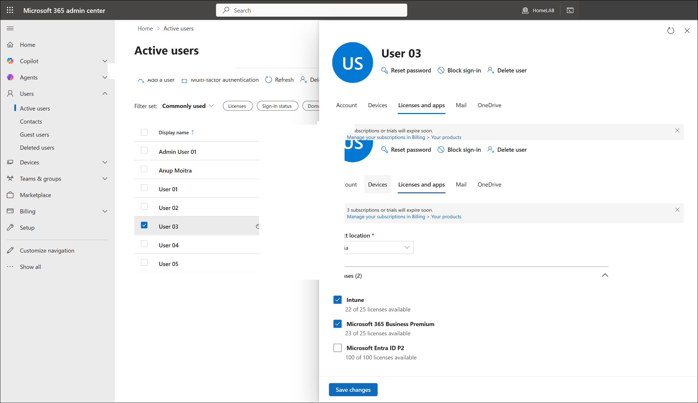

### User 03 BYOD group membership

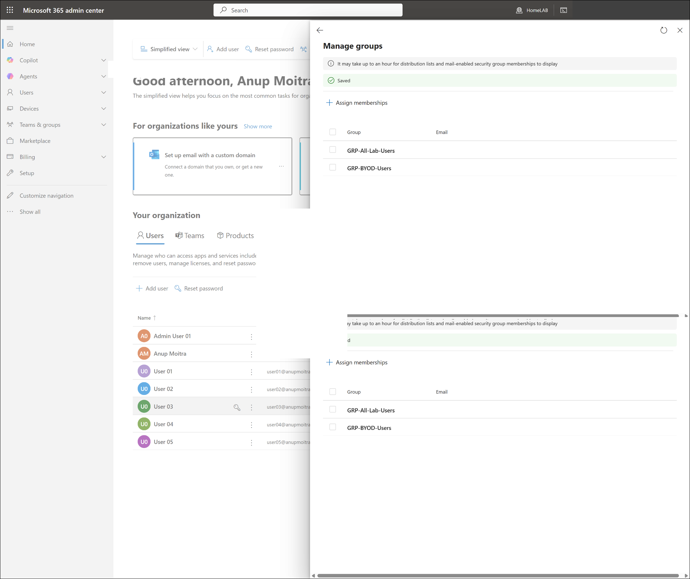

### Automatic MDM enrollment scope

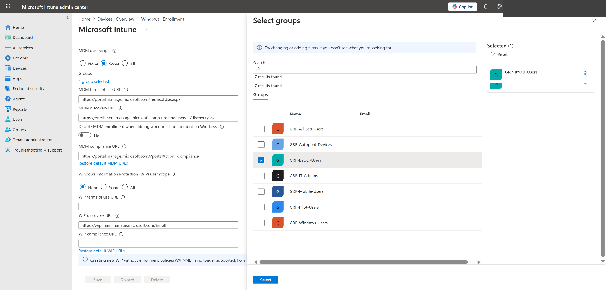

### Windows BYOD platform restriction

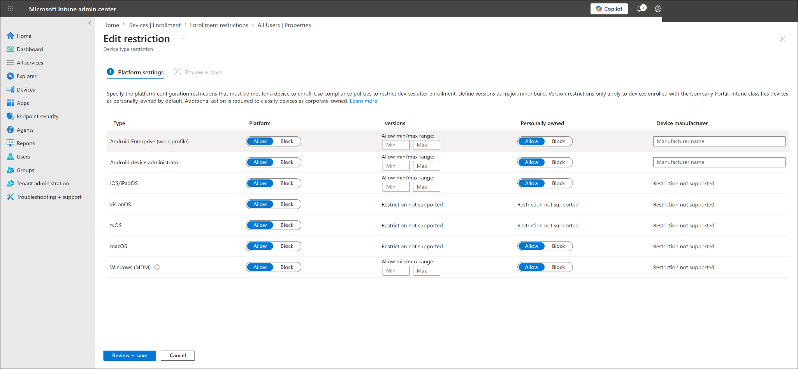

### Windows BYOD device name

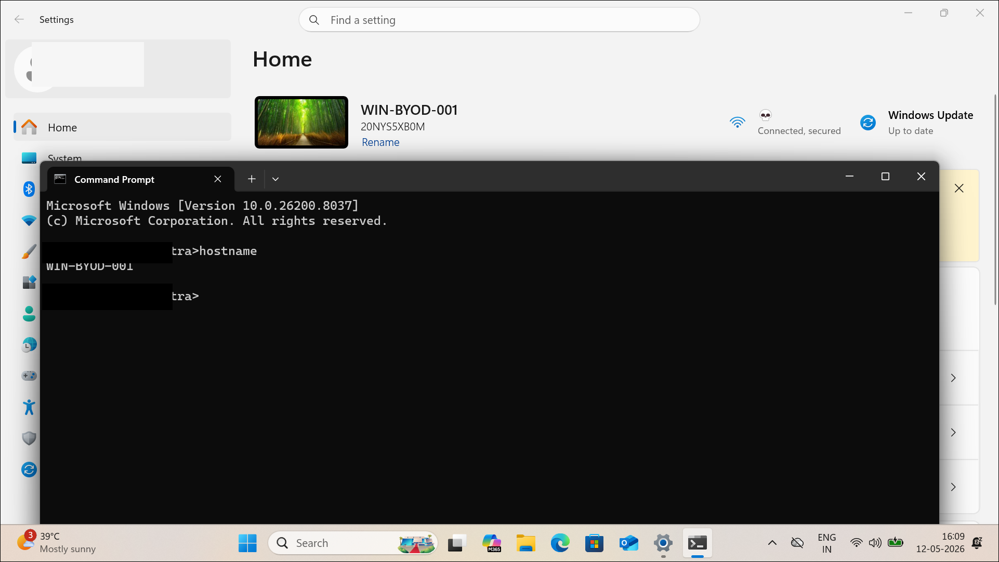

### Access work or school before enrollment

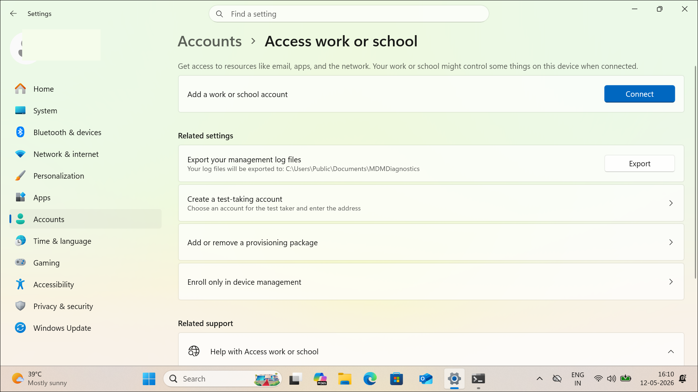

### Account added to device

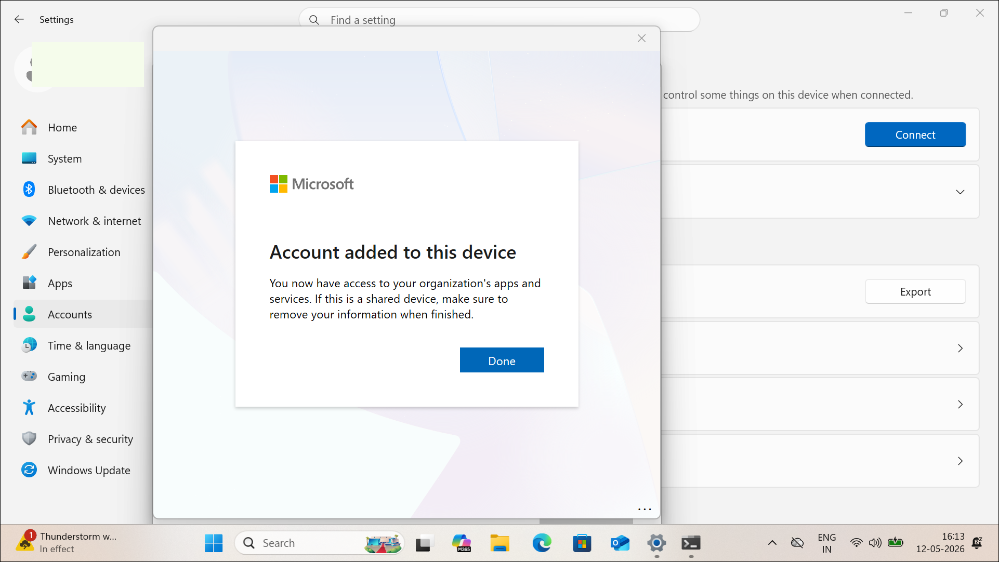

### Work account connected only

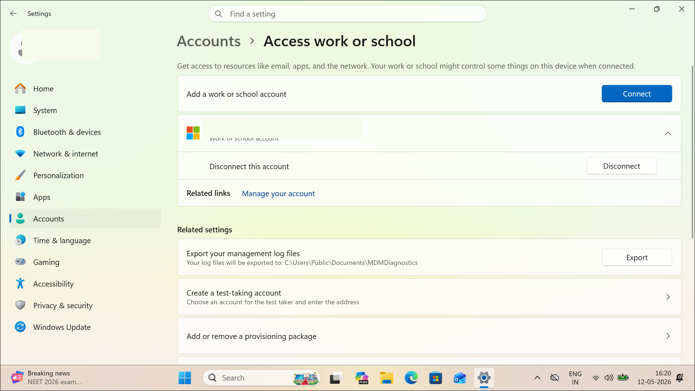

### Access work or school after MDM enrollment

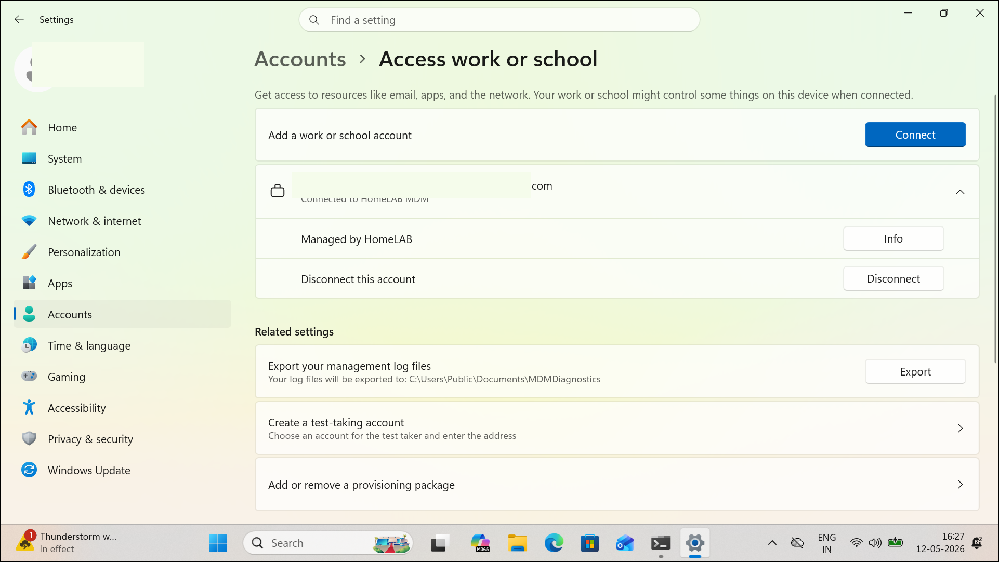

### Manual device sync

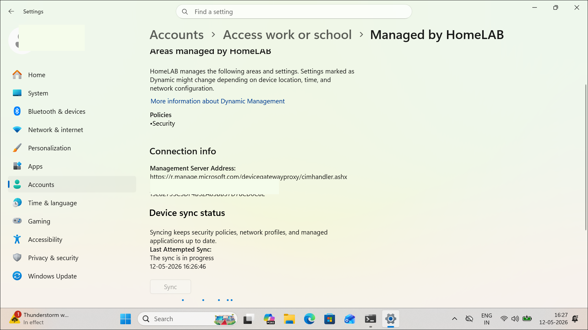

### Windows BYOD device in Intune Windows devices list

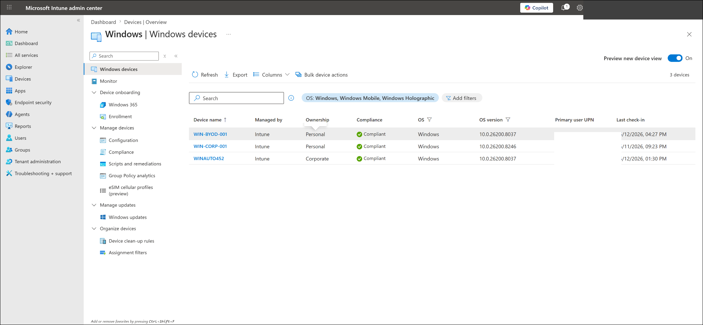

### Windows BYOD Intune device overview

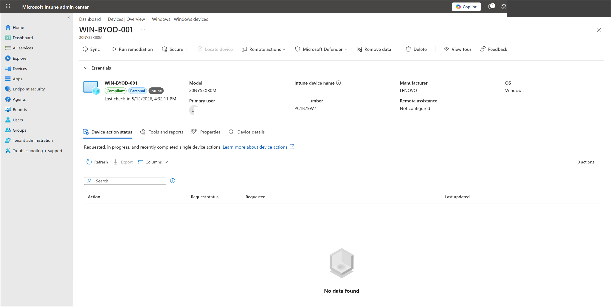

---

## Screenshot file list

```text
windows-byod-user03-license-sanitized.png
windows-byod-user03-byod-group-membership-sanitized.png
windows-byod-automatic-mdm-scope-sanitized.png
windows-byod-platform-restriction-sanitized.png
win-byod-001-device-about-sanitized.png
win-byod-001-access-work-school-before-sanitized.png
win-byod-001-account-added-sanitized.png
win-byod-001-work-account-connected-only-sanitized.png
win-byod-001-access-work-school-after-sanitized.png
win-byod-001-manual-sync-sanitized.png
win-byod-001-intune-windows-devices-list-sanitized.png
win-byod-001-intune-overview-sanitized.png
```

---

## Troubleshooting notes

### Work account connected but Intune sync was not visible

During the first attempt, the account was added successfully, but the Access work or school page showed only a connected work account view.

Expected Intune management options such as device management information and sync were not immediately visible.

Resolution path used:

```text
Settings
-> Accounts
-> Access work or school
-> Enroll only in device management
```

After completing the MDM enrollment flow, the device showed:

```text
Connected to HomeLAB MDM
Managed by HomeLAB
```

The device then appeared in Intune as managed by Intune.

---

### Microsoft Entra device details were not the main validation source

The primary validation for this BYOD lab was the Intune device record.

The device was confirmed as:

```text
Managed by: Intune
Ownership: Personal
Compliance: Compliant
Primary user: user03
```

This was sufficient to confirm successful Windows BYOD Intune enrollment.

---

### Device does not appear in Intune

If a BYOD device does not appear in Intune:

1. Confirm the user has an Intune-capable license.
2. Confirm the user is in the group included in MDM user scope.
3. Confirm Windows personally owned enrollment is allowed.
4. Confirm the device has internet access.
5. Complete the `Enroll only in device management` flow.
6. Sync from Access work or school.
7. Check the Intune Windows devices list again.

---

## Enterprise reflection

Windows BYOD enrollment is useful when users need to access work resources from personally owned Windows devices.

In production, BYOD should usually be managed differently from corporate devices.

Recommended enterprise considerations:

| Area | BYOD approach |
|---|---|
| Ownership | Personal |
| Enrollment scope | Controlled BYOD user group |
| Apps | Prefer available/self-service or required only where justified |
| Compliance | Require basic health and security checks |
| Conditional Access | Require compliant device or app protection where appropriate |
| Privacy | Avoid overly aggressive device management |
| Remote actions | Use caution with wipe/retire actions |
| Security | Balance protection with user privacy |

A good production design might use:

```text
GRP-BYOD-Users
-> BYOD enrollment restrictions
-> BYOD compliance policy
-> Conditional Access in report-only mode
-> Gradual enforcement after validation
```

---

## Security and privacy notes

This is a public learning repository.

Do not upload screenshots that show:

- Full real email addresses
- Tenant IDs
- Device IDs
- Object IDs
- Serial numbers
- MAC addresses
- Internal IP addresses
- Passwords
- MFA prompts
- QR codes
- Verification codes
- Unsanitized screenshots

Before uploading screenshots, hide or blur:

- Top-right signed-in admin account
- Tenant or domain name
- User principal names
- Device serial number
- Intune device ID
- Microsoft Entra device ID
- Wi-Fi MAC address
- Ethernet MAC address
- IP address
- Authentication prompts or sensitive account information

---

## Related labs

| Lab file | Relationship |
|---|---|
| `01-identity-and-groups/users-and-groups.md` | Provides `user03` and `GRP-BYOD-Users` |
| `02-device-enrollment/windows-oobe-enrollment.md` | Documents corporate-style Windows enrollment troubleshooting |
| `02-device-enrollment/windows-autopilot-user-driven-enrollment.md` | Documents corporate Autopilot enrollment |
| `02-device-enrollment/android-byod-enrollment.md` | Android Enterprise BYOD work profile comparison lab |
| `02-device-enrollment/ios-byod-enrollment.md` | iOS/iPadOS BYOD enrollment lab with admin prerequisites completed |
| `04-compliance-and-conditional-access/windows-basic-compliance-policy.md` | Planned future compliance testing |
| `04-compliance-and-conditional-access/conditional-access-compliant-device.md` | Planned future Conditional Access testing |

---

## Key learning outcomes

This lab demonstrated how to:

- Prepare a BYOD user for Windows enrollment.
- Use a BYOD-specific Microsoft Entra group.
- Scope automatic MDM enrollment to selected users.
- Confirm Windows personally owned enrollment is allowed.
- Enroll a personally owned Windows device from Settings.
- Complete MDM enrollment using `Enroll only in device management`.
- Sync an enrolled BYOD device.
- Validate Intune management state.
- Confirm personal ownership in Intune.
- Compare BYOD enrollment with corporate Autopilot enrollment.

---

## Lab conclusion

The Windows BYOD enrollment lab was completed successfully.

Final result:

```text
WIN-BYOD-001 enrolled successfully into Microsoft Intune as a personally owned Windows device.
The device appeared as managed by Intune.
The ownership showed Personal.
The compliance state showed Compliant.
The primary user showed user03.
```

This confirms that the lab tenant can support personally owned Windows BYOD enrollment through Microsoft Intune.
