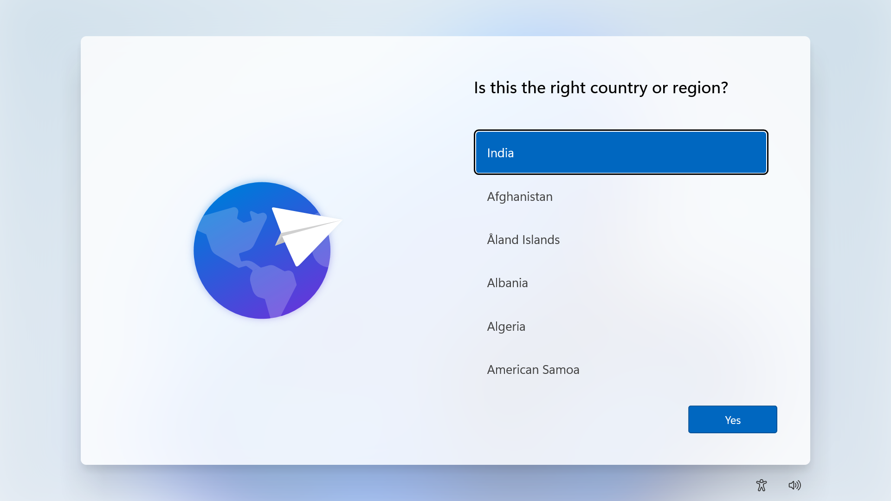
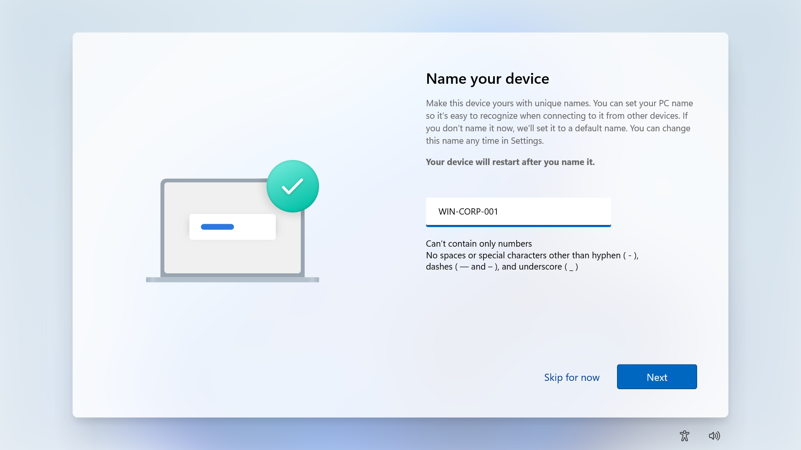
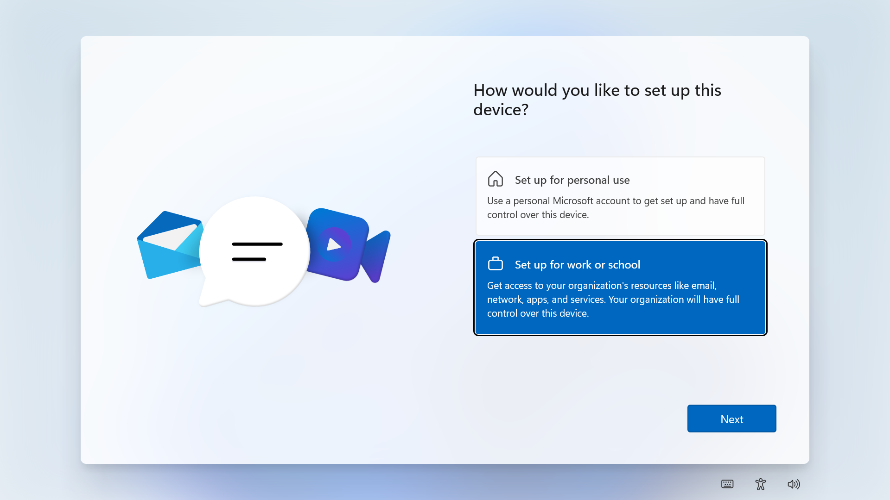
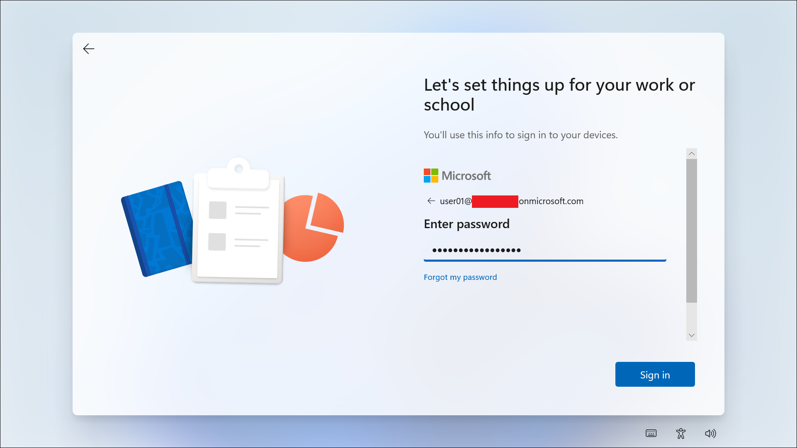
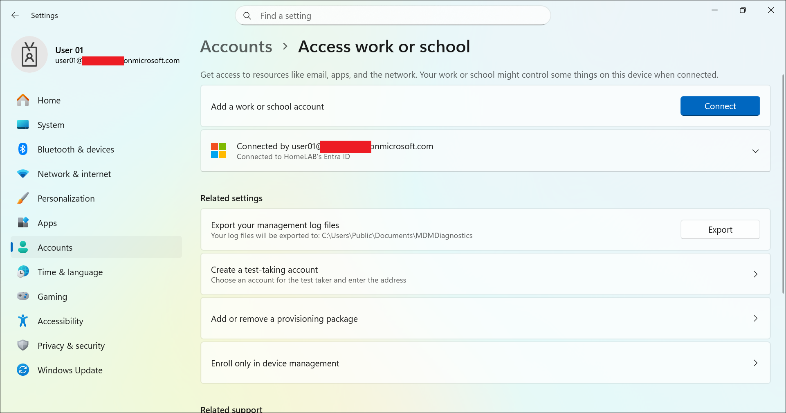

# Windows OOBE Enrollment

This file documents the first corporate Windows device enrollment using Windows Out-of-Box Experience, Microsoft Entra ID, and Microsoft Intune.

---

## Objective

Enroll a corporate Windows 11 device by signing in with a Microsoft Entra ID work account during Windows Out-of-Box Experience.

This lab validates that:

- A Windows device can be set up for work or school during OOBE.
- The device can be named using a consistent lab naming standard.
- The device can join Microsoft Entra ID.
- The device can appear in the Microsoft Entra admin center.
- The device can be prepared for Microsoft Intune enrollment.
- Intune enrollment can be troubleshot if MDM enrollment does not complete automatically.

---

## Why This Lab Matters

Windows OOBE enrollment is one of the most important modern Windows enrollment methods.

In a real company, a user can receive a new or reset Windows device, connect it to the internet, sign in with a work account, and allow the device to become cloud managed.

Expected full flow:

```text
Windows OOBE
-> User signs in with Microsoft Entra ID account
-> Device joins Microsoft Entra ID
-> Automatic MDM enrollment enrolls the device into Intune
-> Device becomes managed
```

In this lab, the device successfully joined Microsoft Entra ID, but Intune MDM enrollment still needs to be verified or fixed.

---

## Lab Environment

| Item | Value |
|---|---|
| Test device | WIN-CORP-001 |
| Device type | Laptop |
| Ownership | Corporate |
| Operating system | Windows 11 |
| Enrollment method | Windows OOBE work or school setup |
| Join type | Microsoft Entra joined |
| Management | Not yet verified in Intune |
| Primary user | user01 |
| Assignment group | GRP-Pilot-Users |
| Current status | Troubleshooting in progress |

---

## Prerequisites

Before starting this lab, the following should be completed:

- Microsoft Entra ID lab users created.
- Microsoft Entra ID security groups created.
- user01 created and available for testing.
- user01 added to GRP-Pilot-Users.
- user01 assigned an Intune-capable license.
- Windows test device reset or ready for OOBE.
- Device connected to the internet during setup.

The following must be checked if Intune enrollment does not complete:

- Automatic MDM enrollment configured.
- MDM user scope set to All or targeted to GRP-Pilot-Users.
- user01 included in the MDM user scope.

---

## Important Notes

This lab is not Windows Autopilot.

This lab uses the basic corporate Windows OOBE work or school setup flow.

Windows Autopilot will be documented separately in:

```text
02-device-enrollment/windows-autopilot-user-driven-enrollment.md
```

---

## Device Naming

The lab device is documented as:

```text
WIN-CORP-001
```

During Windows setup, the OOBE device name option appeared and the device name was set to:

```text
WIN-CORP-001
```

This keeps the local device name, Entra device record, screenshots, and GitHub documentation consistent.

---

## Steps Performed

### Step 1: Prepared the Windows Device

The spare Windows device was reimaged and started from Windows Out-of-Box Experience.

The OOBE setup flow displayed the initial setup screens, including:

```text
Region selection
Device name
Work or school setup
Microsoft work account sign-in
```

---

### Step 2: Selected Region

The country or region screen was displayed.

Selected region:

```text
India
```

---

### Step 3: Named the Device During OOBE

Windows setup displayed the device naming screen.

The device name was set to:

```text
WIN-CORP-001
```

---

### Step 4: Selected Work or School Setup

During Windows setup, the following option was selected:

```text
Set up for work or school
```

The personal setup option was not selected.

---

### Step 5: Signed In as user01

The Microsoft work or school sign-in screen was displayed.

Signed in using the lab user account:

```text
user01
```

The full user principal name was used during sign-in, but it must be hidden in public screenshots.

---

### Step 6: Completed Authentication Prompts

Windows Hello and MFA/security setup prompts appeared during first sign-in.

Authentication setup was completed or skipped where appropriate.

No MFA QR codes, verification codes, passwords, or PIN setup screens should be uploaded to GitHub.

---

### Step 7: Reached Windows Desktop

Windows setup completed and the device reached the desktop.

The local Windows device name was confirmed as:

```text
WIN-CORP-001
```

---

### Step 8: Verified Work or School Connection Locally

On the Windows device, the following page was checked:

```text
Settings
-> Accounts
-> Access work or school
```

The device showed a connected work or school account.

This confirms that the device is connected to the lab Microsoft Entra ID tenant.

---

### Step 9: Verified Device in Microsoft Entra Admin Center

The device appeared in Microsoft Entra admin center under:

```text
Entra admin center
-> Devices
-> All devices
```

The device was listed as:

```text
WIN-CORP-001
```

The Microsoft Entra device record showed:

```text
Join type: Microsoft Entra joined
MDM: None
```

This means Microsoft Entra join completed successfully, but Intune MDM enrollment did not complete at the time of verification.

---

## Expected Result

Expected full result after the lab is fully fixed:

- WIN-CORP-001 completes Windows OOBE.
- WIN-CORP-001 uses the planned lab device name.
- user01 signs in with a work account.
- The device joins Microsoft Entra ID.
- The device enrolls into Microsoft Intune.
- The device appears under Windows devices in Intune.
- The device is ready for compliance, app deployment, and configuration profile testing.

Current observed result:

- WIN-CORP-001 completed Windows OOBE.
- The device name was configured successfully.
- user01 signed in successfully.
- The device joined Microsoft Entra ID.
- The device appeared in Microsoft Entra admin center.
- MDM status showed None.
- Intune device visibility is still pending.

---

## Test Result

| Test Item | Result |
|---|---|
| Windows OOBE started | Completed |
| Region selected | Completed |
| Device name set to WIN-CORP-001 | Completed |
| Work or school setup selected | Completed |
| user01 signed in successfully | Completed |
| Windows Hello/MFA prompts completed | Completed |
| Device reached Windows desktop | Completed |
| Device joined Microsoft Entra ID | Completed |
| Device visible in Microsoft Entra admin center | Completed |
| MDM status checked | Completed |
| Device enrolled into Intune | Pending |
| Device visible in Intune | Pending |
| Final lab result | Troubleshooting in progress |

---

## Screenshots

Screenshots are stored in:

```text
screenshots/sanitized/device-enrollment/
```

### Windows OOBE region selection



### Windows OOBE device name



### Windows OOBE work or school selection



### Windows OOBE user sign-in



### Windows device name verification



### Access work or school verification


### Entra device record with MDM status


> [!NOTE]
> Screenshots must be sanitized before upload. Tenant names, full email addresses, device IDs, product IDs, object IDs, serial numbers, and top-right signed-in account details must be hidden.

---

## Missing Screenshots

The following screenshots are still missing because the device has not yet appeared in Intune:

```text
win-corp-001-intune-windows-devices-list-sanitized.png
win-corp-001-intune-overview-sanitized.png
```

These should be added after Intune MDM enrollment is fixed and the device appears in the Intune admin center.

---

## Troubleshooting Notes

### Current Issue

The device appears in Microsoft Entra admin center, but the MDM column shows:

```text
None
```

This means the device is Microsoft Entra joined, but not enrolled into Intune MDM yet.

### Check Automatic MDM Enrollment

Go to:

```text
Microsoft Entra admin center
-> Entra ID
-> Mobility (MDM and WIP)
-> Microsoft Intune
```

Check:

```text
MDM user scope
```

Recommended lab setting:

```text
Some
```

with this group included:

```text
GRP-Pilot-Users
```

For a small lab, this can also be set to:

```text
All
```

### Sync from Windows

On WIN-CORP-001, go to:

```text
Settings
-> Accounts
-> Access work or school
-> Select connected account
-> Info
-> Sync
```

Wait several minutes and check Intune again.

### Check Entra Join Status

On WIN-CORP-001, open Command Prompt and run:

```cmd
dsregcmd /status
```

Check for:

```text
AzureAdJoined : YES
```

Do not upload the full command output unless it is carefully sanitized.

### Trigger Manual MDM Enrollment

If the device remains Entra joined but MDM is still missing, run:

```cmd
start ms-device-enrollment:?mode=mdm
```

Then complete any enrollment prompts and check Intune again.

---

## Security and Privacy Notes

This is a public learning repository.

Do not upload:

- Full real email addresses
- Real tenant names
- Tenant IDs
- Device IDs
- Object IDs
- Serial numbers
- Autopilot hardware hashes
- BitLocker recovery keys
- Passwords
- MFA QR codes
- Internal IP addresses
- Unsanitized screenshots

Before uploading screenshots, hide or blur:

- Top-right signed-in admin account
- Tenant or domain name
- Full user principal names
- Device IDs
- Object IDs
- Serial numbers
- Product IDs
- Any recovery keys, tokens, or QR codes

---

## Current Status

| Task | Status |
|---|---|
| windows-oobe-enrollment.md created | Completed |
| Windows device prepared for OOBE | Completed |
| Device name configured as WIN-CORP-001 | Completed |
| Work or school setup selected | Completed |
| user01 sign-in completed | Completed |
| Microsoft Entra join verified | Completed |
| Entra device record verified | Completed |
| Intune enrollment verified | Pending |
| Intune screenshots added | Pending |
| OOBE screenshots added | Completed |

---

## Next Step

Fix or verify Intune MDM enrollment:

```text
Check MDM user scope
Confirm user01 is included in MDM enrollment scope
Sync the work or school account from Windows Settings
Check Intune devices again
Capture Intune device list and device overview screenshots
Update this file from Troubleshooting in progress to Completed
```
