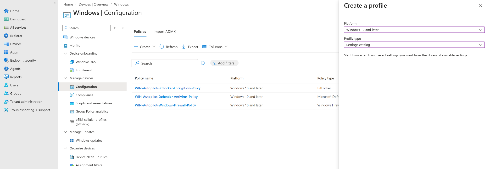
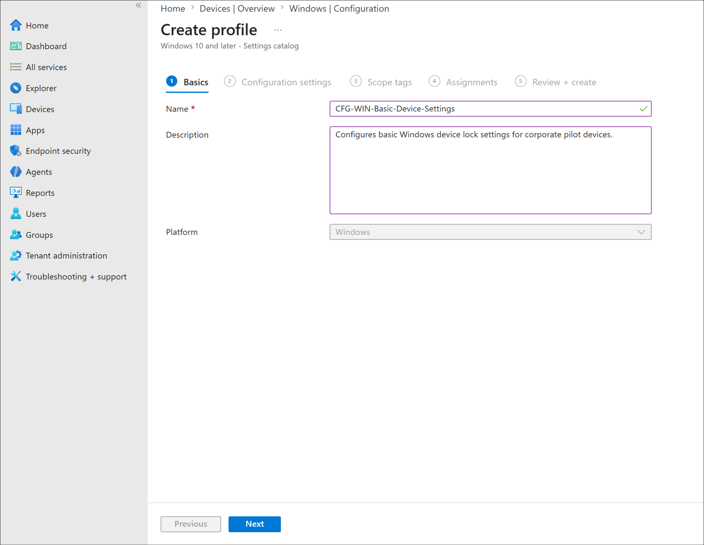
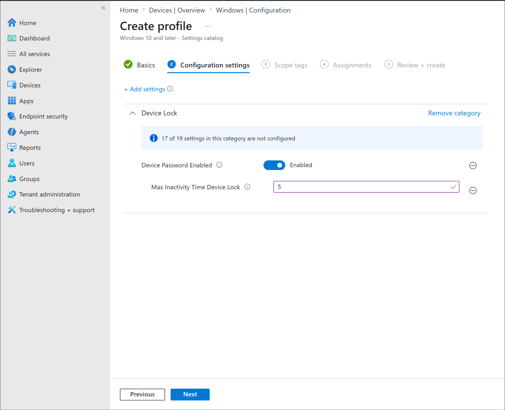
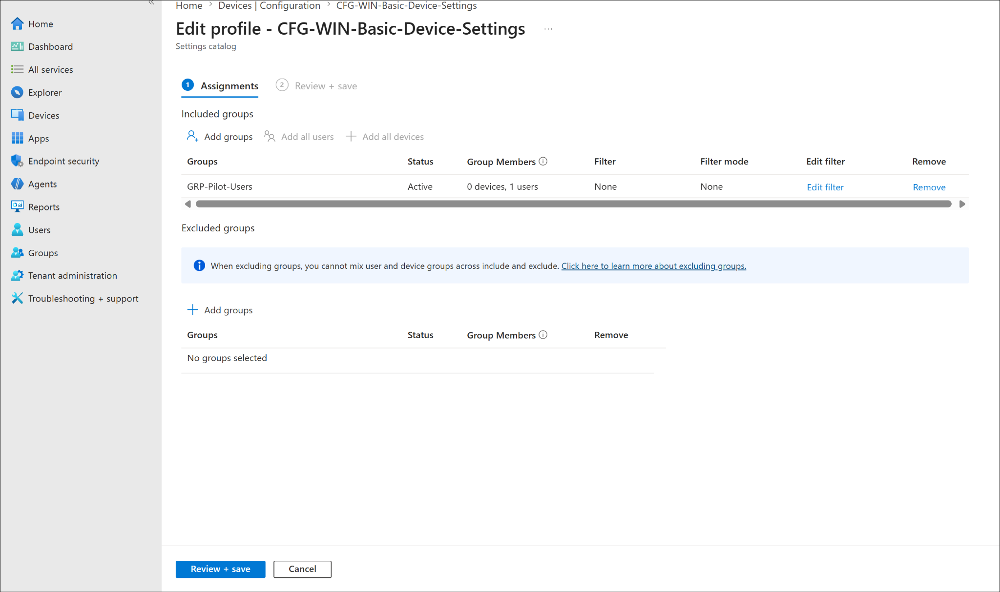
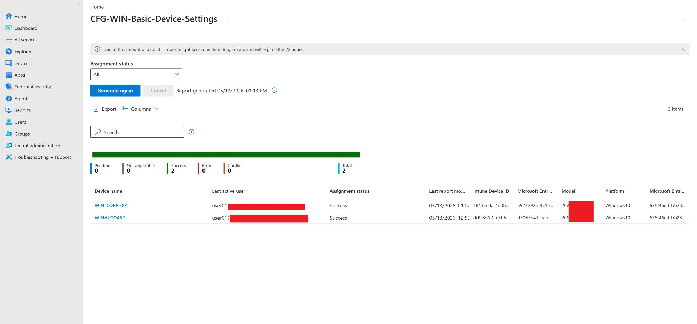

# Windows Basic Configuration Profile

## Lab status

**Status:** Completed  
**Lab category:** Configuration profiles  
**Platform:** Windows 10 and later  
**Management platform:** Microsoft Intune  
**Profile type:** Settings catalog  
**Profile name:** CFG-WIN-Basic-Device-Settings  
**Assignment group:** GRP-Pilot-Users  
**Validated devices:** WIN-CORP-001, WINAUTO452  

---

## Lab objective

The objective of this lab is to create a basic Windows configuration profile in Microsoft Intune using the Settings catalog.

The profile was used to configure basic Windows device lock behavior on managed Windows endpoints.

This lab validates that:

- A Windows Settings catalog profile can be created in Microsoft Intune.
- Basic Device Lock settings can be configured through Intune.
- A configuration profile can be assigned to a pilot user group.
- Enrolled Windows devices can receive the configuration profile.
- Policy status can be reviewed from the Intune admin center.
- Endpoint behavior can be validated after policy sync and reboot.

Final result:

```text
The Windows basic configuration profile applied successfully to WIN-CORP-001 and WINAUTO452.
Both endpoints locked automatically after approximately 5 minutes of inactivity.
```

---

## Why this lab matters

In a real organization, administrators need to apply standard Windows settings across managed endpoints.

Examples include:

- Requiring device password behavior
- Locking inactive devices
- Applying security-related device settings
- Standardizing configuration across corporate Windows devices
- Reducing manual endpoint configuration

Traditionally, many of these settings were configured using Group Policy Objects in on-premises Active Directory.

In a modern cloud-managed environment, Microsoft Intune configuration profiles are used to deliver similar policy settings to Microsoft Entra joined and Intune-managed devices.

This lab demonstrates how Intune can centrally manage Windows device settings without relying on traditional on-premises Group Policy.

---

## Lab environment

| Item | Value |
|---|---|
| Admin portal | Microsoft Intune admin center |
| Platform | Windows 10 and later |
| Profile type | Settings catalog |
| Profile name | `CFG-WIN-Basic-Device-Settings` |
| Assignment group | `GRP-Pilot-Users` |
| Target users/devices | Pilot Windows users and their enrolled devices |
| Validated devices | `WIN-CORP-001`, `WINAUTO452` |
| Final result | Policy applied successfully |

---

## Prerequisites

Before starting this lab, the following were completed:

- Microsoft Entra ID users created.
- Microsoft Entra ID groups created.
- `GRP-Pilot-Users` group available.
- Windows devices enrolled into Microsoft Intune.
- `WIN-CORP-001` available as a managed Windows endpoint.
- `WINAUTO452` available as an Autopilot-managed Windows endpoint.
- Devices able to sync with Microsoft Intune.
- Test user available for policy validation.
- Screenshots sanitized before upload to the public GitHub repository.

---

## Deployment / Configuration flow

Simple deployment flow:

```text
Create Intune Settings catalog profile
-> Configure Device Lock settings
-> Assign profile to pilot user group
-> Sync Windows endpoints
-> Reboot endpoints if required
-> Verify Intune device status
-> Validate endpoint lock behavior
```

Configuration summary:

| Setting category | Setting | Configured value |
|---|---|---|
| Device Lock | Device Password Enabled | Enabled |
| Device Lock | Max Inactivity Time Device Lock | `5` |

For this lab, the inactivity lock value was set to `5` to allow quick testing.

Expected behavior:

```text
After policy sync and reboot, the Windows endpoints should lock automatically after approximately 5 minutes of inactivity.
```

---

## Steps performed

### Step 1: Created a new Windows configuration profile

Path used:

```text
Microsoft Intune admin center
-> Devices
-> Windows
-> Configuration
-> Create
-> New policy
```

The following options were selected:

| Field | Value |
|---|---|
| Platform | Windows 10 and later |
| Profile type | Settings catalog |

---

### Step 2: Configured profile basics

The profile was created with the following name:

```text
CFG-WIN-Basic-Device-Settings
```

Description:

```text
Configures basic Windows device lock settings for corporate pilot devices.
```

---

### Step 3: Configured Device Lock settings

The Settings catalog was used to configure the Device Lock category.

Configured settings:

| Setting | Value |
|---|---|
| Device Password Enabled | Enabled |
| Max Inactivity Time Device Lock | `5` |

This setting was used to validate that Intune could apply a basic Windows device lock configuration to managed endpoints.

---

### Step 4: Assigned the profile

The profile was assigned to the pilot user group:

```text
GRP-Pilot-Users
```

This user-targeted assignment allowed the configuration profile to apply to enrolled Windows devices used by the assigned pilot user.

---

### Step 5: Synced Windows endpoints

After the policy was created, the Windows endpoints were synced with Intune.

Intune sync path:

```text
Microsoft Intune admin center
-> Devices
-> Windows
-> Windows devices
-> Select device
-> Sync
```

Local Windows sync path:

```text
Settings
-> Accounts
-> Access work or school
-> Connected work or school account
-> Info
-> Sync
```

The devices were rebooted after sync because the lock behavior did not apply during the first validation attempt.

---

### Step 6: Validated Intune deployment status

Path used:

```text
Microsoft Intune admin center
-> Devices
-> Windows
-> Configuration
-> CFG-WIN-Basic-Device-Settings
-> Device status
```

The policy deployment report showed both Windows devices with a successful assignment status.

Validated devices:

| Device | Assignment status |
|---|---|
| `WIN-CORP-001` | Success |
| `WINAUTO452` | Success |

---

### Step 7: Validated endpoint behavior

After Intune reported success, the policy was tested on the Windows endpoints.

Initial testing did not immediately lock the endpoints after the configured inactivity period.

After rebooting the machines, the setting applied successfully.

Final endpoint validation:

| Device | Validation result |
|---|---|
| `WIN-CORP-001` | Locked automatically after approximately 5 minutes |
| `WINAUTO452` | Locked automatically after approximately 5 minutes |

This confirmed that the configuration profile was successfully applied and enforced on the endpoints.

---

## Validation

Validation was completed in two places:

1. Microsoft Intune policy reporting
2. Windows endpoint behavior

### Intune validation

The profile deployment report showed successful policy assignment for both test devices.

Validated devices:

```text
WIN-CORP-001
WINAUTO452
```

Observed Intune status:

```text
Success
```

### Endpoint validation

The policy behavior was tested directly on the Windows endpoints.

Observed endpoint behavior:

```text
After device sync and reboot, both endpoints locked automatically after approximately 5 minutes of inactivity.
```

---

## Final test result

| Validation item | Status |
|---|---|
| Windows Settings catalog profile created | Completed |
| Device Lock settings configured | Completed |
| Profile assigned to pilot users | Completed |
| Devices synced with Intune | Completed |
| Device status showed Success | Completed |
| Endpoint behavior tested | Completed |
| Devices locked after configured inactivity period | Completed |
| Final lab result | Completed |

Result summary:

```text
The Windows basic configuration profile was successfully created and deployed using Microsoft Intune.
The profile configured basic Device Lock settings and was assigned to the pilot user group.
After device sync and reboot, both Windows endpoints reported successful policy deployment and locked automatically after approximately 5 minutes of inactivity.
```

---

## Screenshots captured

Screenshots for this lab are stored in:

```text
screenshots/sanitized/configuration-profiles/
```

### Create Windows Settings Catalog Profile



### Profile basics



### Device Lock settings configured



### Assignment to pilot users



### Device status success



### Uploaded screenshot files

```text
windows-basic-config-profile-create-profile-sanitized.png
windows-basic-config-profile-basics-sanitized.png
windows-basic-config-profile-settings-configured-sanitized.png
windows-basic-config-profile-assignment-sanitized.png
windows-basic-config-profile-device-status-success-sanitized.png
```

> [!NOTE]
> Screenshots were sanitized before upload. Tenant names, full email addresses, top-right signed-in account details, and sensitive identifiers were hidden.

---

## Troubleshooting notes

### Policy showed success but endpoint did not immediately lock

During testing, Intune showed the profile assignment as successful, but the endpoint did not immediately lock during the first test.

After rebooting the Windows devices, both endpoints locked automatically after the configured inactivity period.

Key observation:

```text
Intune policy success confirms policy delivery, but some endpoint behaviors may require a reboot or new sign-in session before the setting is fully enforced.
```

### Validation reminder

When testing configuration profiles, validate both:

```text
Intune reporting
Endpoint behavior
```

A successful Intune status is important, but endpoint testing confirms the user/device experience.

---

## Enterprise reflection

In a real corporate environment, basic configuration profiles are usually part of a standard Windows baseline.

This type of policy may be used with:

- Windows Autopilot
- Microsoft Entra joined devices
- Intune compliance policies
- Endpoint security baselines
- Conditional Access
- Microsoft Defender for Endpoint

A recommended rollout approach is:

```text
Pilot users
-> Pilot devices
-> Validate Intune status
-> Validate endpoint behavior
-> Expand to production groups
```

Important production considerations:

| Consideration | Why it matters |
|---|---|
| Pilot testing | Confirms settings work before broad deployment |
| User impact | Lock settings affect user workflow and sign-in frequency |
| Device reboot/sign-in | Some settings may require reboot or a new user session |
| Reporting | Intune success should be checked before endpoint behavior is trusted |
| Standardization | Consistent device settings improve security and manageability |

For this lab, the profile was assigned to:

```text
GRP-Pilot-Users
```

This follows a safe pilot-based configuration approach.

---

## Security and privacy notes

This is a public learning repository.

Do not upload screenshots that show:

- Full user email addresses
- Tenant names
- Tenant IDs
- Device IDs
- Object IDs
- Serial numbers
- Internal IP addresses
- MAC addresses
- Recovery keys
- Passwords
- MFA prompts
- Unsanitized device details

Before uploading screenshots, hide or blur:

- Top-right signed-in admin account
- Tenant/domain name
- Full user principal names
- Device identifiers
- Serial numbers
- Any private endpoint details

---

## Key learning outcomes

This lab demonstrated:

- How to create a Windows Settings catalog configuration profile in Microsoft Intune.
- How to configure basic Windows Device Lock settings.
- How to assign a configuration profile to a pilot user group.
- How user-targeted policies can apply to enrolled devices used by assigned users.
- How to sync Windows endpoints from Intune and Windows Settings.
- How to verify configuration profile success in Intune.
- How to validate endpoint behavior after policy deployment.
- Why some configuration profile settings may require a reboot or new sign-in session.
- How Intune configuration profiles replace many traditional Group Policy use cases in modern cloud-managed environments.

Reference topics for continued learning:

- Create a device configuration profile in Microsoft Intune
- Use the Settings catalog to configure settings on Windows devices
- Device configuration profiles in Microsoft Intune

---

## Lab conclusion

The Windows basic configuration profile was completed successfully.

Final result:

```text
CFG-WIN-Basic-Device-Settings applied successfully to WIN-CORP-001 and WINAUTO452.
Both devices reported successful policy deployment in Microsoft Intune.
After device sync and reboot, both endpoints locked automatically after approximately 5 minutes of inactivity.
```

This confirms that Intune successfully delivered and enforced the basic Windows Device Lock configuration in the lab environment.
