# Windows Corporate Wallpaper Policy

## Lab status

**Status:** Completed  
**Lab category:** Configuration profiles  
**Platform:** Windows 10 and later  
**Management platform:** Microsoft Intune  
**Target endpoint:** WINAUTO452  
**Target user:** user01  
**Script target group:** GRP-Autopilot-Devices  
**Wallpaper policy target group:** GRP-Pilot-Users  
**PowerShell script name:** SCRIPT-WIN-Stage-Corporate-Wallpaper  
**Configuration profile name:** CFG-WIN-Corporate-Wallpaper-ADMX  

---

## Lab objective

The objective of this lab is to deploy a corporate desktop wallpaper to an Autopilot-managed Windows device using Microsoft Intune.

This lab validates that:

- A PowerShell platform script can be deployed from Intune.
- A corporate wallpaper image can be downloaded from a GitHub raw URL.
- The wallpaper image can be staged locally under `C:\ProgramData`.
- An ADMX-backed Desktop Wallpaper user policy can be configured in Intune.
- A user-based wallpaper policy can be assigned to a pilot user group.
- The target Windows device can receive the policy and apply the corporate wallpaper.
- The final result can be verified from Intune and from the endpoint desktop.

Final result:

```text
Corporate wallpaper was successfully applied on WINAUTO452.
```

---

## Why this lab matters

Many organizations use a standard desktop wallpaper for branding, user communication, or internal campaigns.

Examples include:

- Company branding
- Security awareness reminders
- Monthly corporate announcements
- Device ownership identification
- Standardized desktop experience

In a real corporate environment, wallpaper deployment needs to be reliable and repeatable. A monthly wallpaper rollout should avoid manual setup on each endpoint.

This lab demonstrates a practical Intune approach:

```text
Stage wallpaper locally
-> Apply wallpaper with user policy
-> Validate result on endpoint
```

This approach also documents troubleshooting from an earlier failed method and shows how the design was improved.

---

## Lab environment

| Item | Value |
|---|---|
| Device name | `WINAUTO452` |
| Device type | Windows laptop |
| Device ownership | Corporate |
| Enrollment method | Windows Autopilot |
| Management platform | Microsoft Intune |
| Operating system | Windows 11 Pro |
| Primary user | `user01` |
| Wallpaper source | GitHub raw image URL |
| Local wallpaper path | `C:\ProgramData\HomeLab\Wallpapers\homelab-corporate-wallpaper.jpg` |
| Script name | `SCRIPT-WIN-Stage-Corporate-Wallpaper` |
| Configuration profile name | `CFG-WIN-Corporate-Wallpaper-ADMX` |
| Script assignment group | `GRP-Autopilot-Devices` |
| Wallpaper policy assignment group | `GRP-Pilot-Users` |
| Final result | Completed successfully |

---

## Prerequisites

Before starting this lab, the following were completed:

- Microsoft Entra ID users created.
- Microsoft Entra ID groups created.
- Test user `user01` created and licensed.
- `GRP-Pilot-Users` group available.
- `GRP-Autopilot-Devices` group available.
- Windows Autopilot device `WINAUTO452` enrolled into Intune.
- Device available in Microsoft Intune.
- Device able to sync with Intune.
- Wallpaper image uploaded to the GitHub repository.
- Screenshots sanitized before upload to the public GitHub repository.

Wallpaper image location in the repository:

```text
assets/wallpapers/homelab-corporate-wallpaper.jpg
```

Raw GitHub URL used by the PowerShell script:

```text
https://raw.githubusercontent.com/anup-moitra/md102-intune-virtual-company-lab/main/assets/wallpapers/homelab-corporate-wallpaper.jpg
```

---

## Deployment / Configuration flow

This rebuilt lab uses a two-part deployment model.

| Component | Purpose |
|---|---|
| PowerShell platform script | Downloads and stages the wallpaper image locally under `C:\ProgramData` |
| ADMX-backed configuration profile | Configures the desktop wallpaper using the local file path |
| User assignment group | Applies the wallpaper setting to the signed-in user |

Deployment flow:

```text
Create PowerShell staging script
-> Upload script to Intune
-> Assign script to Autopilot device group
-> Script downloads wallpaper to C:\ProgramData
-> Create Settings Catalog profile
-> Configure ADMX-backed Desktop Wallpaper user setting
-> Assign wallpaper policy to pilot user group
-> Sync device and sign in as target user
-> Verify script success
-> Verify policy success
-> Confirm wallpaper applied on endpoint
```

### Why this approach was used

The earlier wallpaper approach used the Settings Catalog setting:

```text
Personalization > Desktop Image Url
```

with a local file URL:

```text
file:///C:/ProgramData/HomeLab/Wallpapers/homelab-corporate-wallpaper.jpg
```

That approach returned an error on the Windows 11 Pro test device.

For the rebuilt lab, the policy was changed to the ADMX-backed setting:

```text
Administrative Templates
-> Desktop
-> Desktop
-> Desktop Wallpaper (User)
```

This approach uses a normal Windows file path:

```text
C:\ProgramData\HomeLab\Wallpapers\homelab-corporate-wallpaper.jpg
```

The final successful design separates the lab into two clear responsibilities:

```text
PowerShell script: stage the wallpaper file locally
ADMX policy: apply the wallpaper for the signed-in user
```

---

## Steps performed

### Step 1: Created the PowerShell staging script

Script filename:

```text
Stage-HomeLab-Corporate-Wallpaper.ps1
```

Script content:

```powershell
$WallpaperUrl = "https://raw.githubusercontent.com/anup-moitra/md102-intune-virtual-company-lab/main/assets/wallpapers/homelab-corporate-wallpaper.jpg"

$WallpaperFolder = "C:\ProgramData\HomeLab\Wallpapers"
$WallpaperPath = Join-Path $WallpaperFolder "homelab-corporate-wallpaper.jpg"

New-Item -ItemType Directory -Path $WallpaperFolder -Force | Out-Null

Invoke-WebRequest -Uri $WallpaperUrl -OutFile $WallpaperPath -UseBasicParsing

if (Test-Path $WallpaperPath) {
    Write-Output "Wallpaper staged successfully at $WallpaperPath"
    exit 0
}
else {
    Write-Output "Wallpaper staging failed."
    exit 1
}
```

The script performs the following actions:

1. Defines the GitHub raw URL for the wallpaper image.
2. Creates the folder `C:\ProgramData\HomeLab\Wallpapers`.
3. Downloads the wallpaper image from GitHub.
4. Saves the image locally as `homelab-corporate-wallpaper.jpg`.
5. Confirms whether the file exists.
6. Returns success or failure based on the file validation.

---

### Step 2: Uploaded the PowerShell script to Intune

Navigation path:

```text
Microsoft Intune admin center
-> Devices
-> Scripts and remediations
-> Platform scripts
-> Add
-> Windows 10 and later
```

Script basics:

| Setting | Value |
|---|---|
| Name | `SCRIPT-WIN-Stage-Corporate-Wallpaper` |
| Description | Downloads the HomeLab corporate wallpaper from GitHub and stages it locally under `C:\ProgramData` for the ADMX desktop wallpaper policy. |

Script settings:

| Setting | Value |
|---|---|
| PowerShell script | `Stage-HomeLab-Corporate-Wallpaper.ps1` |
| Run this script using the logged on credentials | No |
| Enforce script signature check | No |
| Run script in 64-bit PowerShell Host | Yes |

Reason for the script settings:

| Setting | Reason |
|---|---|
| Run using logged-on credentials: No | Runs as system, which is suitable for writing to `C:\ProgramData` |
| Enforce script signature check: No | The lab script is not code-signed |
| Run script in 64-bit PowerShell Host: Yes | Uses the native 64-bit PowerShell host on the endpoint |

---

### Step 3: Assigned the PowerShell script

The script was assigned to the corporate Autopilot device group:

```text
GRP-Autopilot-Devices
```

Target device:

```text
WINAUTO452
```

The script assignment was device-based because the script stages the wallpaper file locally on the endpoint.

---

### Step 4: Verified PowerShell script success

The PowerShell script completed successfully on the target device.

| Item | Result |
|---|---|
| Script | `SCRIPT-WIN-Stage-Corporate-Wallpaper` |
| Device | `WINAUTO452` |
| User | `user01` |
| Status | Succeeded |
| OS version | Windows 11 |
| Result | Wallpaper staged locally |

Expected local wallpaper path:

```text
C:\ProgramData\HomeLab\Wallpapers\homelab-corporate-wallpaper.jpg
```

---

### Step 5: Created the ADMX-backed wallpaper configuration profile

Navigation path:

```text
Microsoft Intune admin center
-> Devices
-> Configuration
-> Create
-> New policy
```

Selected:

| Setting | Value |
|---|---|
| Platform | Windows 10 and later |
| Profile type | Settings catalog |

Profile basics:

| Setting | Value |
|---|---|
| Name | `CFG-WIN-Corporate-Wallpaper-ADMX` |
| Description | Configures the corporate desktop wallpaper using the ADMX-backed Desktop Wallpaper user setting. |

---

### Step 6: Configured the Desktop Wallpaper ADMX setting

Settings Catalog path:

```text
Administrative Templates
-> Desktop
-> Desktop
```

Configured setting:

```text
Desktop Wallpaper (User)
```

Configuration values:

| Setting | Value |
|---|---|
| Desktop Wallpaper (User) | Enabled |
| Wallpaper Name (User) | `C:\ProgramData\HomeLab\Wallpapers\homelab-corporate-wallpaper.jpg` |
| Wallpaper Style (User) | Fill |

Important configuration note:

This ADMX-backed setting uses a normal Windows file path.

Correct value:

```text
C:\ProgramData\HomeLab\Wallpapers\homelab-corporate-wallpaper.jpg
```

Do not use this value for the ADMX-backed Desktop Wallpaper setting:

```text
file:///C:/ProgramData/HomeLab/Wallpapers/homelab-corporate-wallpaper.jpg
```

The `file:///` format was part of the older Desktop Image Url approach and was not used in the rebuilt successful lab.

---

### Step 7: Assigned the ADMX wallpaper policy

Because `Desktop Wallpaper (User)` is a user setting, the configuration profile was assigned to a user group.

Assigned group:

```text
GRP-Pilot-Users
```

Target user:

```text
user01
```

This assignment design matters because the wallpaper setting applies in the signed-in user context.

---

### Step 8: Synced and restarted the endpoint

After the policy was created, the target endpoint was synced and restarted.

Sync from Intune:

```text
Devices
-> Windows
-> WINAUTO452
-> Sync
```

Sync from the endpoint:

```text
Settings
-> Accounts
-> Access work or school
-> Connected work or school account
-> Info
-> Sync
```

After sync, the device was restarted and `user01` signed in again.

---

## Validation

Validation was completed in three places:

1. PowerShell script status in Intune
2. ADMX wallpaper policy status in Intune
3. Endpoint desktop visual validation

### Script validation

The PowerShell platform script reported success.

| Item | Result |
|---|---|
| Script | `SCRIPT-WIN-Stage-Corporate-Wallpaper` |
| Target device | `WINAUTO452` |
| Status | Succeeded |
| Result | Wallpaper staged locally |

### Policy validation

The configuration profile reported success for the target device.

| Item | Result |
|---|---|
| Profile | `CFG-WIN-Corporate-Wallpaper-ADMX` |
| Target device | `WINAUTO452` |
| Logged-in user | `user01` |
| Assignment status | Success |
| Error | 0 |
| Conflict | 0 |
| Result | Wallpaper policy applied |

### Endpoint validation

The wallpaper was successfully applied on the endpoint desktop.

Observed result:

```text
The desktop background changed to the corporate HomeLab wallpaper.
```

Endpoint validation device:

```text
WINAUTO452
```

---

## Final test result

| Validation item | Status |
|---|---|
| Wallpaper image exists in GitHub repository | Completed |
| PowerShell staging script created | Completed |
| PowerShell script uploaded to Intune | Completed |
| Script assigned to Autopilot device group | Completed |
| Script executed successfully on WINAUTO452 | Completed |
| Wallpaper staged under `C:\ProgramData` | Completed |
| ADMX-backed wallpaper profile created | Completed |
| Desktop Wallpaper user setting configured | Completed |
| Wallpaper policy assigned to pilot user group | Completed |
| ADMX policy reported success for WINAUTO452 | Completed |
| Endpoint wallpaper visually validated | Completed |
| Final lab result | Completed |

Final observed result:

```text
SCRIPT-WIN-Stage-Corporate-Wallpaper succeeded on WINAUTO452.
CFG-WIN-Corporate-Wallpaper-ADMX succeeded on WINAUTO452.
The corporate wallpaper was visible on the endpoint desktop.
```

---

## Screenshots captured

All screenshots are stored in:

```text
screenshots/sanitized/configuration-profiles/
```

### PowerShell script basics

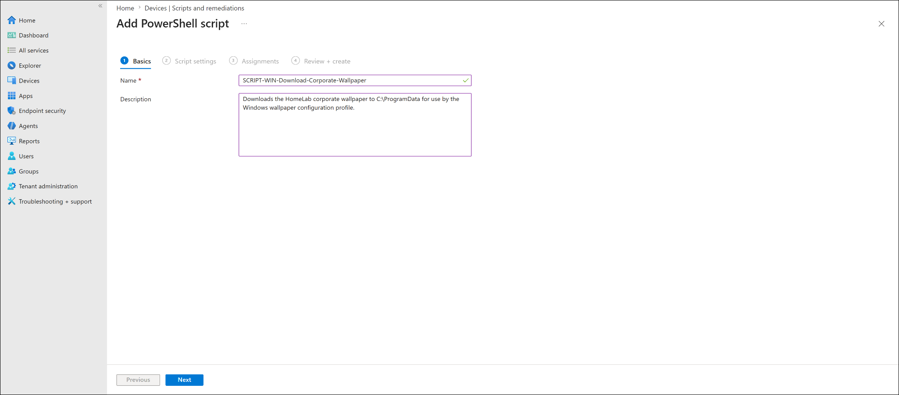

### PowerShell script settings

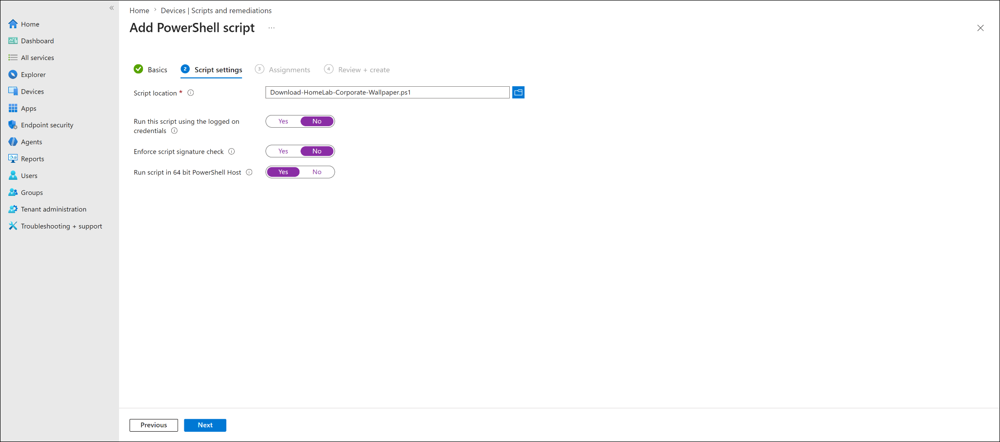

### PowerShell script assignment

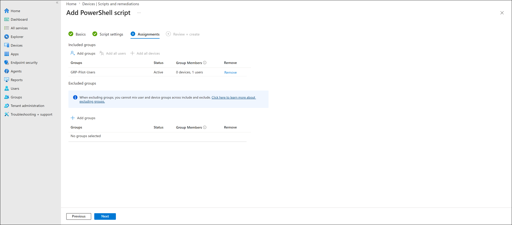

### PowerShell script review and create

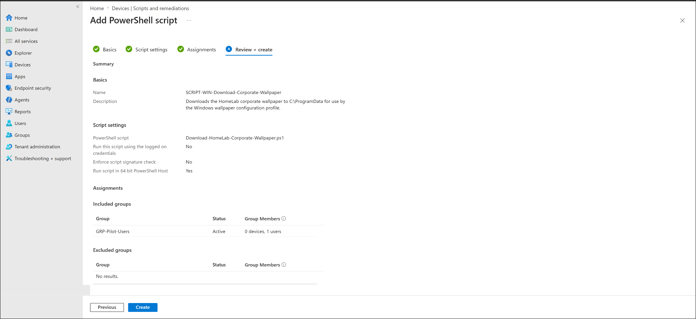

### PowerShell script device status success

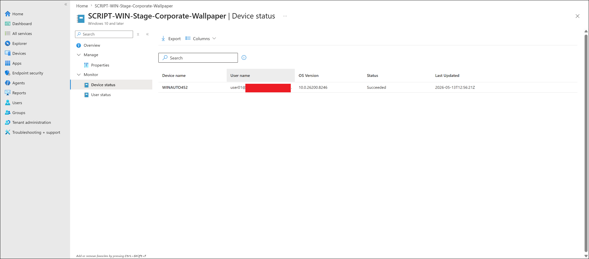

### Create Settings Catalog profile

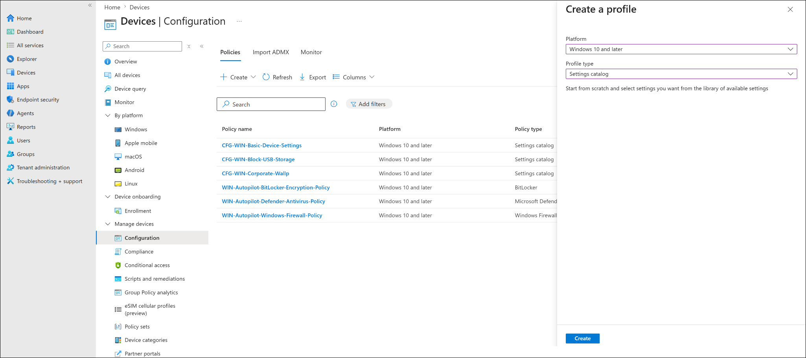

### ADMX wallpaper profile basics

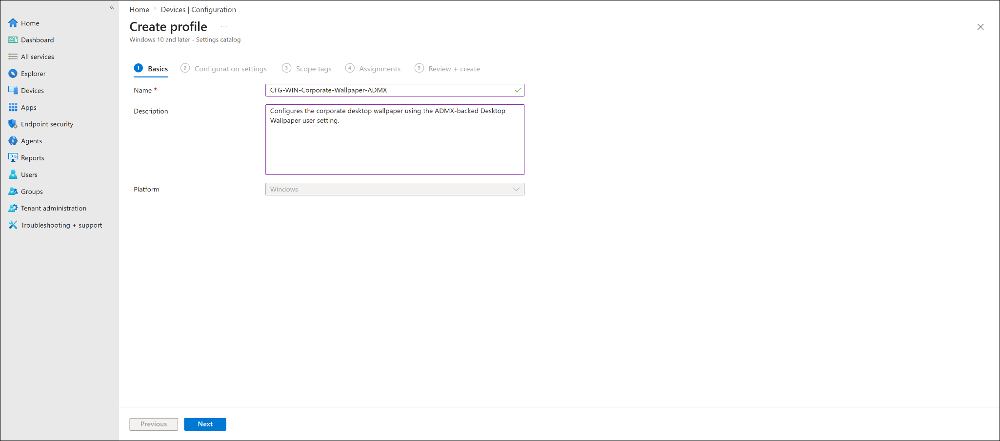

### ADMX desktop wallpaper setting

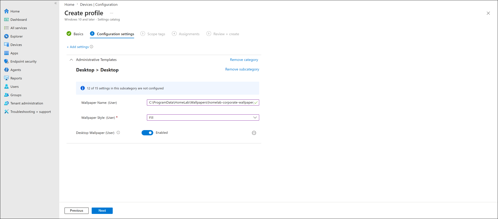

### ADMX wallpaper policy assignment

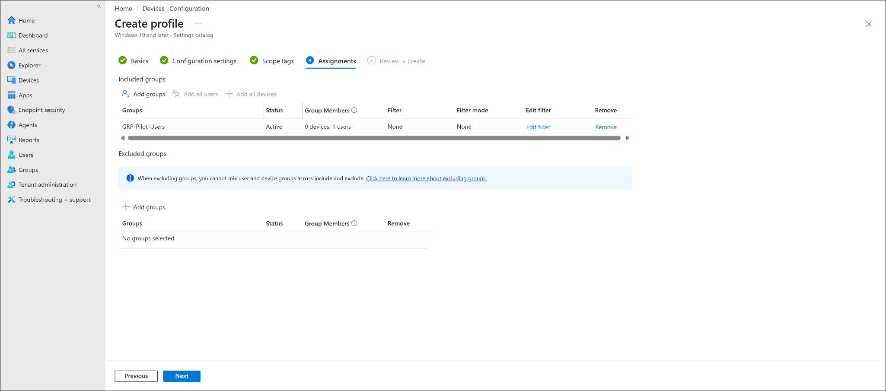

### ADMX wallpaper policy review and create

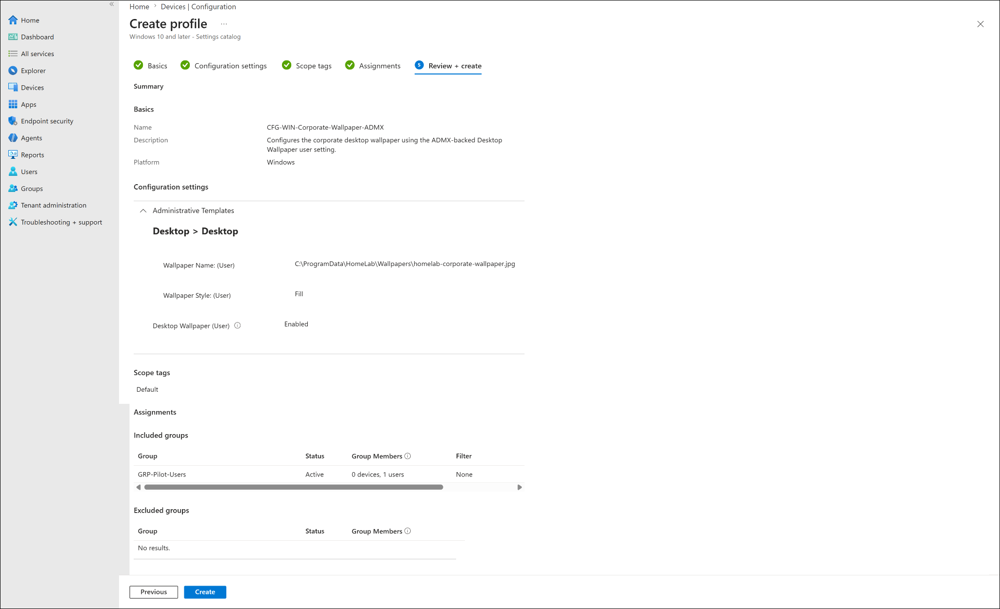

### ADMX wallpaper device status success

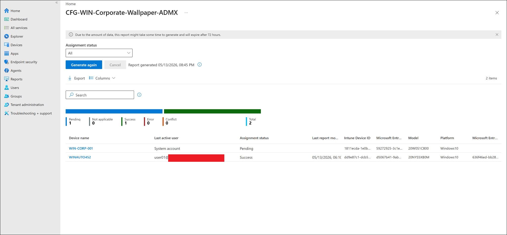

### Corporate wallpaper endpoint validation

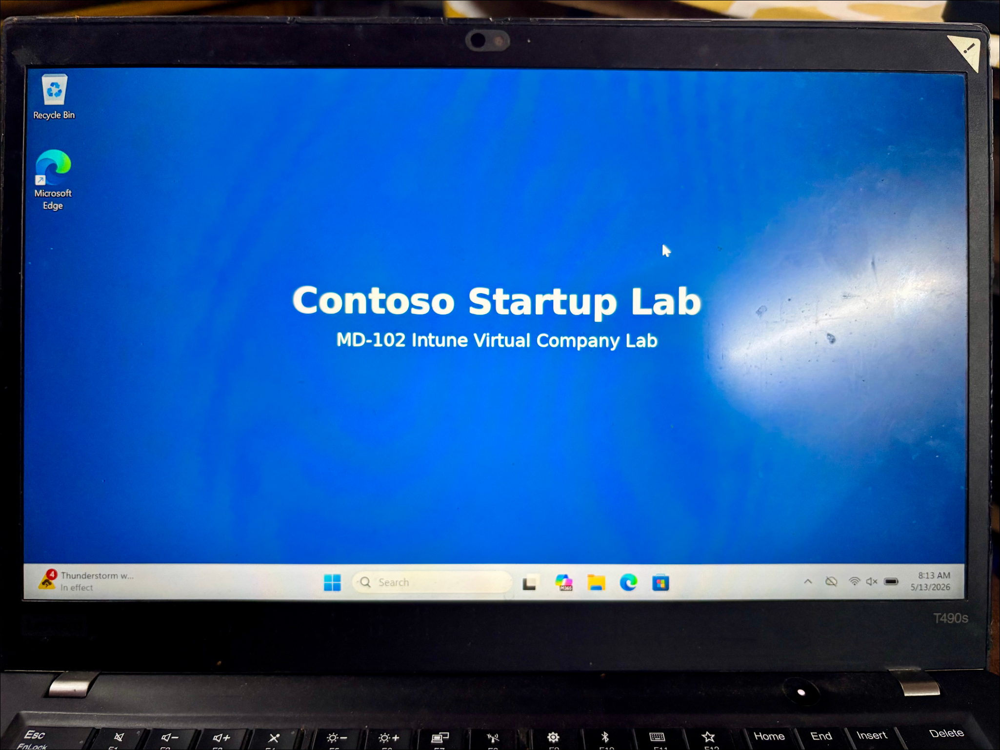

### Uploaded screenshot files

```text
windows-corporate-wallpaper-script-basics-sanitized.png
windows-corporate-wallpaper-script-settings-sanitized.png
windows-corporate-wallpaper-script-assignment-sanitized.png
windows-corporate-wallpaper-script-review-create-sanitized.png
windows-corporate-wallpaper-script-device-status-success-sanitized.png
windows-corporate-wallpaper-admx-create-profile-sanitized.png
windows-corporate-wallpaper-admx-profile-basics-sanitized.png
windows-corporate-wallpaper-admx-setting-sanitized.png
windows-corporate-wallpaper-admx-assignment-sanitized.png
windows-corporate-wallpaper-admx-review-create-sanitized.png
windows-corporate-wallpaper-admx-device-status-success-sanitized.png
windows-corporate-wallpaper-endpoint-validation-sanitized.png
```

---

## Troubleshooting notes

### Previous issue: Desktop Image Url error

The earlier lab attempt used:

```text
Personalization -> Desktop Image Url
```

with this local file URL:

```text
file:///C:/ProgramData/HomeLab/Wallpapers/homelab-corporate-wallpaper.jpg
```

The endpoint returned an error for the `Desktop Image Url` setting. The file existed locally and opened successfully, but the profile still failed.

To resolve the issue, the lab was rebuilt using:

```text
Administrative Templates -> Desktop -> Desktop -> Desktop Wallpaper (User)
```

This ADMX-backed setting used the normal local path:

```text
C:\ProgramData\HomeLab\Wallpapers\homelab-corporate-wallpaper.jpg
```

The rebuilt approach applied successfully.

### Why the script and policy were separated

The wallpaper file must exist locally before the ADMX wallpaper setting can apply it.

The PowerShell script handles file staging:

```text
Download wallpaper
-> Create local folder
-> Save image to C:\ProgramData
```

The configuration profile handles user policy enforcement:

```text
Set desktop wallpaper
-> Use local file path
-> Apply to user context
```

This separation is useful for learning and troubleshooting because it makes the two responsibilities clear.

### Testing reminder

When testing corporate wallpaper deployment, validate both sides:

```text
Script success
Policy success
Endpoint visual result
```

If the script succeeds but the wallpaper does not apply, check user assignment, user sign-in, policy sync, and whether the local file path matches the policy value.

---

## Enterprise reflection

For a real corporate environment, wallpaper deployment can be handled in different ways depending on scale and requirements.

| Requirement | Recommended approach |
|---|---|
| Simple wallpaper deployment | Use an Intune configuration profile if supported |
| Monthly wallpaper changes | Host approved images in a company-controlled HTTPS location or package them with versioned filenames |
| Local wallpaper file required | Stage the image using Win32 app, script, or remediation |
| Reliable detection required | Use Win32 app detection rules or Intune Remediations |
| User-specific wallpaper policy | Assign ADMX-backed user setting to user groups |
| Device-wide file staging | Assign script/app/remediation to device groups |
| Pilot rollout | Use pilot groups before broad deployment |

For this lab, the final successful design was:

```text
Device group stages the file
User group receives the wallpaper policy
Endpoint confirms the wallpaper applied successfully
```

For a production monthly wallpaper rollout, a safer process would be:

```text
Create approved monthly wallpaper image
-> Upload to company-controlled storage or package as a managed app
-> Pilot to IT users
-> Validate script/app delivery
-> Validate wallpaper policy
-> Roll out to production groups
-> Keep previous wallpaper available for rollback
```

This lab shows the value of separating file delivery from policy enforcement.

---

## Security and privacy notes

This is a public learning repository.

Do not publish screenshots that show:

- Full user email addresses
- Tenant names
- Tenant IDs
- Device IDs
- Object IDs
- Serial numbers
- Internal IP addresses
- MAC addresses
- Passwords
- Recovery keys
- Unsanitized tenant information
- Production company data

Screenshots should be sanitized before upload.

---

## Key learning outcomes

This lab demonstrated:

- How to rebuild a failed Intune wallpaper deployment using a better approach.
- How to stage a file locally with an Intune PowerShell platform script.
- How to assign a script to a device group.
- Why local file staging is separate from user policy application.
- How to configure the ADMX-backed Desktop Wallpaper user setting.
- Why user settings should be assigned to user groups.
- How to validate script success in Intune.
- How to validate configuration profile success in Intune.
- How to confirm wallpaper application on the endpoint.
- How to document troubleshooting and final resolution professionally.
- How to think about a production-ready corporate wallpaper rollout.

---

## Lab conclusion

The corporate wallpaper deployment was completed successfully.

Final result:

```text
SCRIPT-WIN-Stage-Corporate-Wallpaper succeeded on WINAUTO452.
CFG-WIN-Corporate-Wallpaper-ADMX succeeded on WINAUTO452.
The corporate wallpaper was visible on the endpoint desktop.
```

This confirms that the rebuilt ADMX-backed wallpaper method worked correctly in the lab environment.
