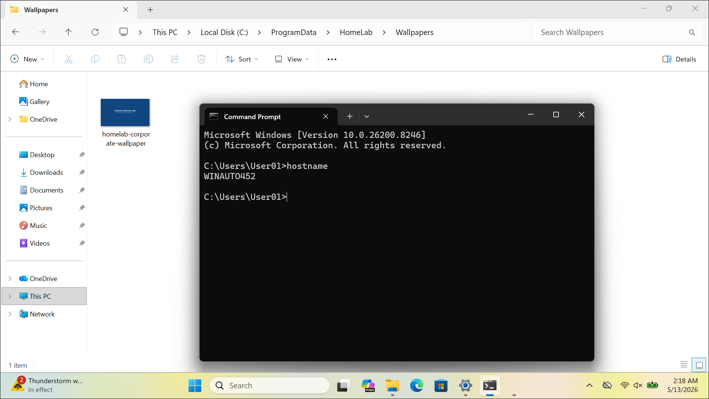
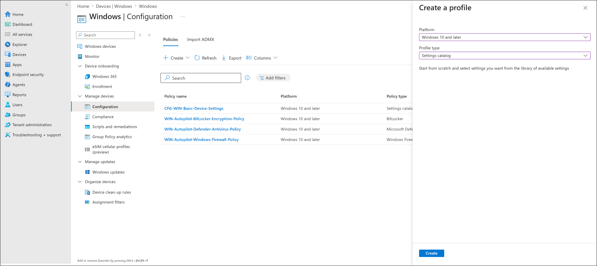
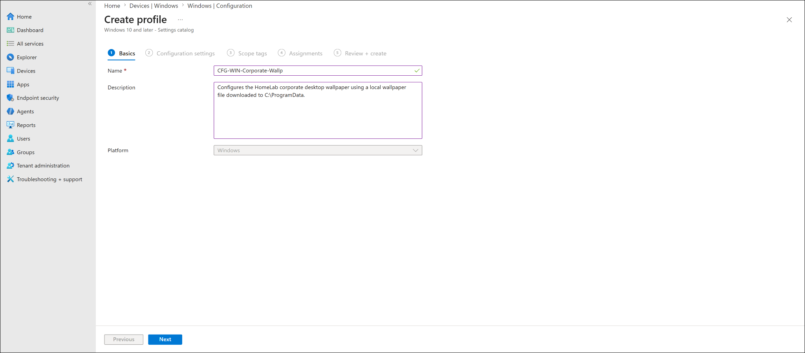
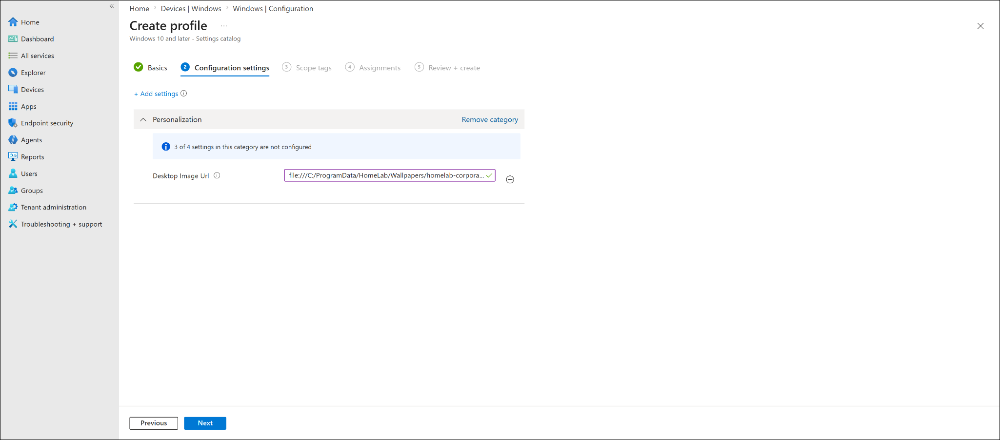
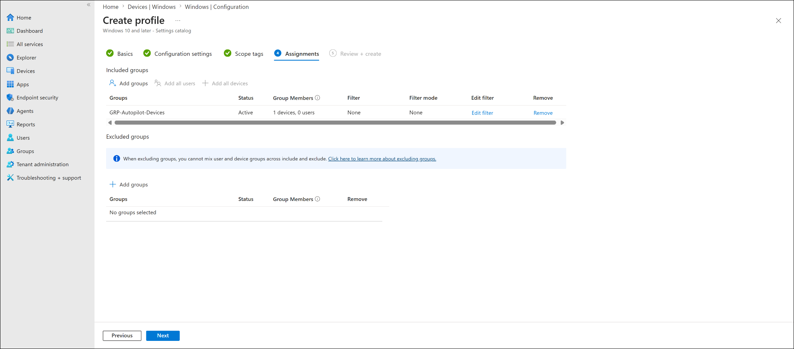
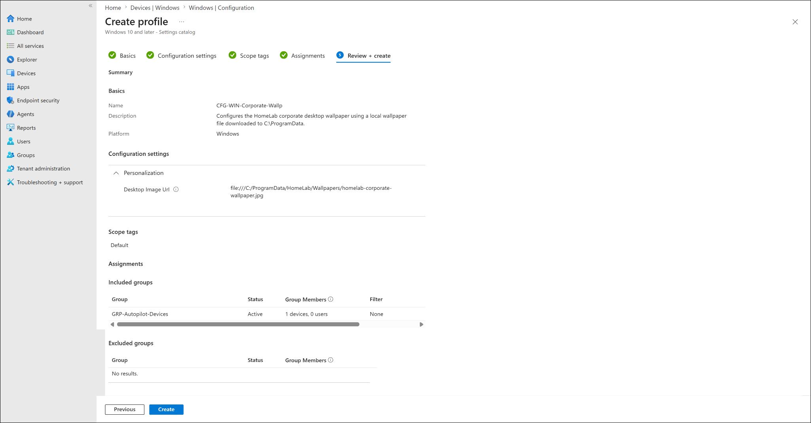

# Windows Corporate Wallpaper Policy

## Lab status

**Status:** In progress  
**Lab category:** Configuration profiles  
**Platform:** Windows 10 and later  
**Management platform:** Microsoft Intune  
**Target endpoint:** WINAUTO452  
**Primary groups used:** GRP-Pilot-Users, GRP-Autopilot-Devices

> This lab demonstrates a hybrid Intune approach where a PowerShell platform script first stages a corporate wallpaper file locally on the Windows endpoint, and a Windows Settings Catalog configuration profile then configures the desktop wallpaper policy using the local file path.

---

## Lab objective

The objective of this lab is to deploy a corporate desktop wallpaper to an Autopilot-managed Windows device using Microsoft Intune.

This lab uses two Intune components:

| Component | Purpose |
|---|---|
| PowerShell platform script | Downloads the wallpaper image from GitHub and saves it locally under `C:\ProgramData` |
| Windows configuration profile | Configures Windows to use the locally staged wallpaper image as the desktop background |

---

## Why this approach was used

The wallpaper image must exist on the endpoint before Windows can apply it from a local file path.

For this lab, the wallpaper image is hosted in GitHub and then downloaded to:

```text
C:\ProgramData\HomeLab\Wallpapers\homelab-corporate-wallpaper.jpg
```

The Intune configuration profile then points Windows to this local file by using the following value:

```text
file:///C:/ProgramData/HomeLab/Wallpapers/homelab-corporate-wallpaper.jpg
```

This approach separates **file delivery** from **policy configuration**:

- The PowerShell script handles the file download.
- The configuration profile handles the wallpaper policy setting.

---

## Important production consideration

In production environments, this hybrid approach requires sequencing awareness.

PowerShell platform scripts and configuration profiles are processed through different Intune management paths. Because of that, the configuration profile may apply before the wallpaper image has been downloaded locally.

Possible result:

```text
Configuration profile applies first
-> Local wallpaper file does not exist yet
-> Wallpaper policy may not apply immediately
-> PowerShell script runs later
-> Wallpaper file appears locally
-> Device may need another sync, reboot, or sign-in
```

For a larger production rollout, better options may include:

| Production option | Why it may be better |
|---|---|
| Direct HTTPS Desktop Image URL | Avoids local file sequencing issues |
| Win32 app package | Can use detection rules to confirm the wallpaper file exists |
| Intune Remediations | Can repeatedly detect and fix a missing wallpaper file |
| Phased deployment | Allows file staging to complete before policy assignment |

For this lab, the hybrid approach is still useful because it demonstrates both script deployment and configuration profile management.

---

## Prerequisites

Before starting this lab, the following requirements should be completed:

- Windows device is enrolled in Microsoft Intune.
- Device is Microsoft Entra joined or Microsoft Entra hybrid joined.
- Device is visible in Intune as a managed Windows device.
- Pilot user or device group exists.
- Corporate wallpaper image exists in the GitHub repository.
- Endpoint can reach `raw.githubusercontent.com`.

---

## Wallpaper source

The wallpaper was hosted in the GitHub repository under:

```text
assets/wallpapers/homelab-corporate-wallpaper.jpg
```

Raw GitHub URL used by the script:

```text
https://raw.githubusercontent.com/anup-moitra/md102-intune-virtual-company-lab/main/assets/wallpapers/homelab-corporate-wallpaper.jpg
```

---

## Part 1 - Create the PowerShell download script

### Script name

```text
Download-HomeLab-Corporate-Wallpaper.ps1
```

### Script content

```powershell
$WallpaperUrl = "https://raw.githubusercontent.com/anup-moitra/md102-intune-virtual-company-lab/main/assets/wallpapers/homelab-corporate-wallpaper.jpg"

$WallpaperFolder = "C:\ProgramData\HomeLab\Wallpapers"
$WallpaperPath = Join-Path $WallpaperFolder "homelab-corporate-wallpaper.jpg"

New-Item -ItemType Directory -Path $WallpaperFolder -Force | Out-Null

Invoke-WebRequest -Uri $WallpaperUrl -OutFile $WallpaperPath -UseBasicParsing

Write-Output "Wallpaper downloaded to $WallpaperPath"
```

### What the script does

The script performs the following actions:

1. Defines the GitHub raw URL for the wallpaper image.
2. Creates a local folder under `C:\ProgramData\HomeLab\Wallpapers`.
3. Downloads the wallpaper image from GitHub.
4. Saves the wallpaper locally as `homelab-corporate-wallpaper.jpg`.
5. Outputs the local file path after download.

---

## Part 2 - Deploy the PowerShell script from Intune

### Navigation path

```text
Microsoft Intune admin center
> Devices
> Scripts and remediations
> Platform scripts
> Add
> Windows 10 and later
```

### Script basics

| Setting | Value |
|---|---|
| Name | `SCRIPT-WIN-Download-Corporate-Wallpaper` |
| Description | `Downloads the HomeLab corporate wallpaper to C:\ProgramData for use by the Windows wallpaper configuration profile.` |


---

### Script settings

| Setting | Value |
|---|---|
| Script location | `Download-HomeLab-Corporate-Wallpaper.ps1` |
| Run this script using the logged on credentials | `No` |
| Enforce script signature check | `No` |
| Run script in 64-bit PowerShell Host | `Yes` |


### Why these settings were selected

| Setting | Reason |
|---|---|
| Run using logged-on credentials: No | The script writes to `C:\ProgramData`, so running in system context is appropriate |
| Enforce script signature check: No | The lab script is not code-signed |
| Run script in 64-bit PowerShell Host: Yes | Uses the native 64-bit PowerShell host on 64-bit Windows clients |

---

### Script assignment

The script was assigned to:

```text
GRP-Pilot-Users
```


---

### Script review and create

The script configuration was reviewed before creation.


---

## Part 3 - Validate wallpaper file on endpoint

After the script was tested and executed, the wallpaper file was validated locally on the Windows endpoint.

### Validation path

```text
C:\ProgramData\HomeLab\Wallpapers
```

### Validation command

```powershell
Test-Path "C:\ProgramData\HomeLab\Wallpapers\homelab-corporate-wallpaper.jpg"
```

### Expected result

```text
True
```

This confirms that the wallpaper image exists locally on the endpoint.



---

## Part 4 - Create the Windows wallpaper configuration profile

### Navigation path

```text
Microsoft Intune admin center
> Devices
> Windows
> Configuration
> Create
> New policy
```

### Profile type

| Setting | Value |
|---|---|
| Platform | `Windows 10 and later` |
| Profile type | `Settings catalog` |



---

### Configuration profile basics

| Setting | Value |
|---|---|
| Name | `CFG-WIN-Corporate-Wallp` |
| Description | `Configures the HomeLab corporate desktop wallpaper using a local wallpaper file downloaded to C:\ProgramData.` |



---

### Configuration setting

The following Settings Catalog setting was configured:

| Category | Setting | Value |
|---|---|---|
| Personalization | Desktop Image Url | `file:///C:/ProgramData/HomeLab/Wallpapers/homelab-corporate-wallpaper.jpg` |



### Why `file:///` was used

The `Desktop Image Url` setting accepts a URL-style value. Since the wallpaper file was staged locally, the configuration profile was pointed to the local file using a `file:///` path.

Windows path:

```text
C:\ProgramData\HomeLab\Wallpapers\homelab-corporate-wallpaper.jpg
```

Policy value:

```text
file:///C:/ProgramData/HomeLab/Wallpapers/homelab-corporate-wallpaper.jpg
```

---

### Configuration profile assignment

The wallpaper configuration profile was assigned to the Autopilot device group:

```text
GRP-Autopilot-Devices
```



---

### Configuration profile review and create

The configuration profile was reviewed before creation.



---

## Part 5 - Sync and validate policy deployment

After creating the configuration profile, the target Windows endpoint should be synced.

### Sync from Intune

```text
Microsoft Intune admin center
> Devices
> Windows
> Windows devices
> Select WINAUTO452
> Sync
```

### Sync from endpoint

```text
Settings
> Accounts
> Access work or school
> Connected work or school account
> Info
> Sync
```

### Recommended validation sequence

```text
1. Confirm wallpaper file exists locally.
2. Confirm configuration profile is assigned.
3. Sync the device.
4. Restart the device.
5. Sign in again.
6. Confirm wallpaper appears on the desktop.
```

---

## Current validation status

At the time this documentation was created:

| Validation item | Status |
|---|---|
| Wallpaper raw GitHub URL confirmed | Completed |
| PowerShell script created | Completed |
| Wallpaper downloaded locally | Completed |
| Local file path validated | Completed |
| Configuration profile created | Completed |
| Configuration profile assigned | Completed |
| Configuration profile device status | Pending / waiting for Intune reporting |
| Endpoint wallpaper visual validation | Pending / to be captured after policy sync |

---

## Screenshots captured

| Screenshot | Purpose |
|---|---|
| `windows-corporate-wallpaper-script-basics-sanitized.png` | Shows PowerShell script basics |
| `windows-corporate-wallpaper-script-settings-sanitized.png` | Shows script execution settings |
| `windows-corporate-wallpaper-script-assignment-sanitized.png` | Shows script assignment |
| `windows-corporate-wallpaper-script-review-create-sanitized.png` | Shows script review before creation |
| `windows-corporate-wallpaper-local-file-validation-sanitized.png` | Shows local file validation on endpoint |
| `windows-corporate-wallpaper-config-profile-create-sanitized.png` | Shows Settings Catalog profile creation |
| `windows-corporate-wallpaper-config-profile-basics-sanitized.png` | Shows wallpaper profile basics |
| `windows-corporate-wallpaper-config-profile-settings-sanitized.png` | Shows Desktop Image Url setting |
| `windows-corporate-wallpaper-config-profile-assignment-sanitized.png` | Shows assignment to Autopilot device group |
| `windows-corporate-wallpaper-config-profile-review-create-sanitized.png` | Shows review before creation |

---

## Screenshots still recommended

The following screenshots should be added after the configuration profile finishes syncing:

| Screenshot | Purpose |
|---|---|
| `windows-corporate-wallpaper-config-profile-device-status-success-sanitized.png` | Shows policy deployment success |
| `windows-corporate-wallpaper-endpoint-validation-sanitized.png` | Shows wallpaper applied on the endpoint desktop |

---

## Troubleshooting notes

### Issue: Wallpaper file exists but wallpaper does not apply

Possible causes:

- Configuration profile has not synced yet.
- Device has not restarted after policy application.
- User session has not refreshed.
- Windows edition does not support the Personalization CSP behavior in the current scenario.
- Policy may have applied before the local wallpaper file existed.

Recommended actions:

```text
1. Confirm the local wallpaper file exists.
2. Sync from Intune admin center.
3. Sync from Access work or school on the endpoint.
4. Restart the endpoint.
5. Sign in again.
6. Check configuration profile device status.
```

---

### Issue: Script status is blank in Intune

PowerShell script reporting may take time to appear in Intune.

Recommended checks:

- Confirm the script is assigned to the correct user or device group.
- Confirm the Intune Management Extension is installed.
- Confirm the file was downloaded locally.
- Restart the Microsoft Intune Management Extension service if needed.
- Check script status again later.

---

### Issue: Script did not download the wallpaper

Check the following:

- Raw GitHub URL opens in a browser.
- Endpoint has internet access.
- Endpoint can reach `raw.githubusercontent.com`.
- Script is assigned to the correct group.
- Intune Management Extension is installed.
- File path is correct.

PowerShell validation command:

```powershell
Test-Path "C:\ProgramData\HomeLab\Wallpapers\homelab-corporate-wallpaper.jpg"
```

---

## Key learning outcomes

This lab demonstrates:

- How to host an image file in GitHub for lab use.
- How to use a PowerShell platform script in Intune.
- How to stage files locally under `C:\ProgramData`.
- How to configure a Windows Settings Catalog profile.
- How to use the `Desktop Image Url` personalization setting.
- Why deployment sequencing matters when combining scripts and configuration profiles.
- Why production deployments may need Win32 app detection, remediations, or direct HTTPS policy values.

---

## Enterprise reflection

For a small lab, a script plus configuration profile is useful and easy to validate.

For a larger enterprise rollout, the recommended design depends on business requirements:

| Requirement | Recommended approach |
|---|---|
| Simple wallpaper deployment | Use HTTPS URL directly in `Desktop Image Url` |
| Local wallpaper file required | Deploy the image as a Win32 app with detection rules |
| Continuous repair required | Use Intune Remediations |
| Strict sequencing required | Stage file first, confirm success, then assign wallpaper policy |

This lab intentionally documents the sequencing limitation because real-world Intune deployments often require understanding how different Intune workloads process on endpoints.

---

## Microsoft documentation references

- Microsoft Intune PowerShell scripts for Windows devices:  
  https://learn.microsoft.com/en-us/intune/device-management/tools/run-powershell-scripts-windows

- Microsoft Intune Settings Catalog:  
  https://learn.microsoft.com/en-us/intune/device-configuration/settings-catalog/

- Windows Personalization CSP:  
  https://learn.microsoft.com/en-us/windows/client-management/mdm/personalization-csp
