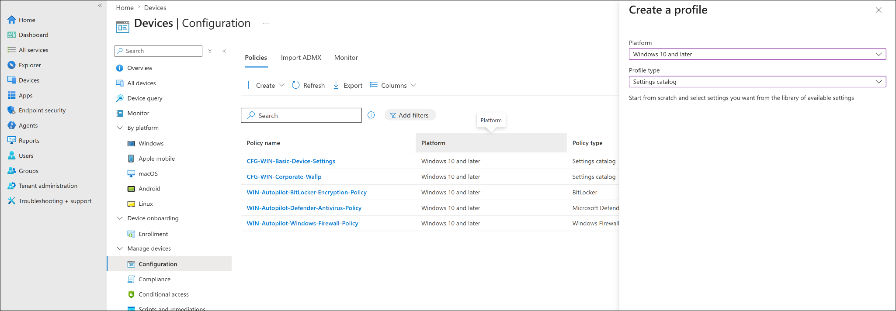
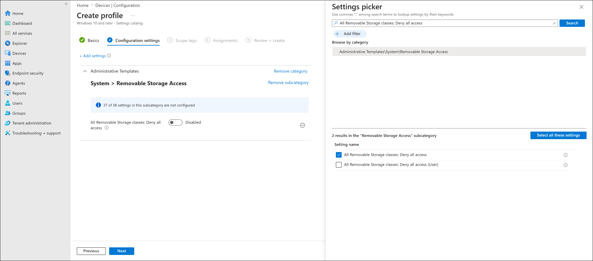
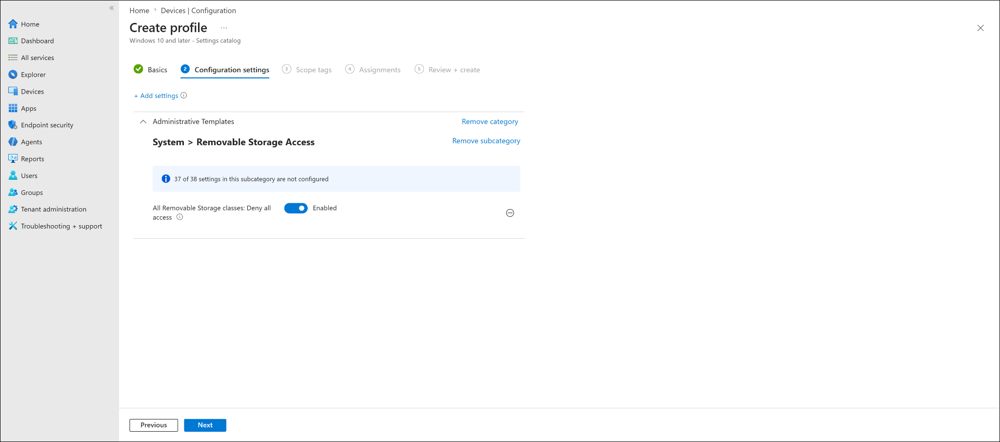
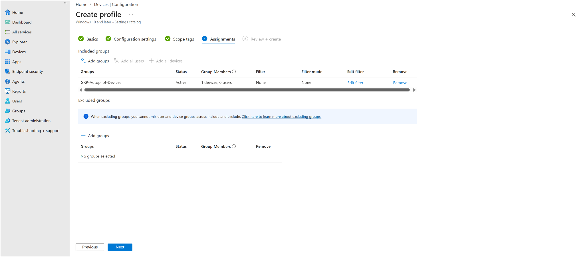
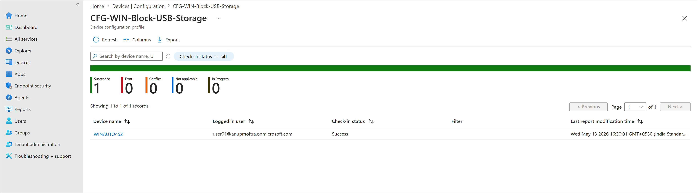
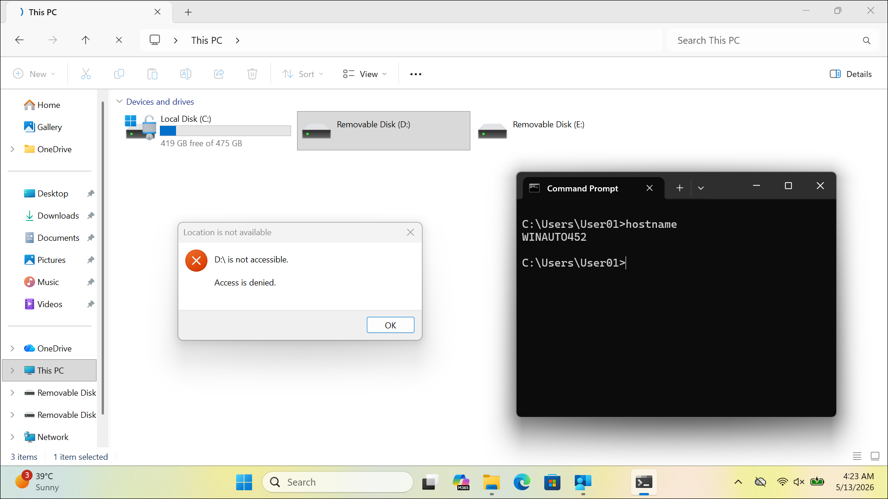

# Windows Device Restrictions Profile

## Lab Status

| Field | Value |
|---|---|
| Status | Completed |
| Lab category | Configuration profiles |
| Platform | Windows 10 and later |
| Profile name | CFG-WIN-Block-USB-Storage |
| Target group | GRP-Autopilot-Devices |
| Target device | WINAUTO452 |
| Primary user | user01 |

---

## Lab Objective

Create a Windows Settings catalog profile in Microsoft Intune to block removable USB storage access on a corporate Windows device, then validate policy delivery in Intune and confirm the restriction is enforced on the endpoint.

---

## Why This Lab Matters

Blocking removable storage is a common endpoint security control that reduces the risk of data exfiltration via USB flash drives or external drives. This lab demonstrates how to deploy that restriction through Intune to a pilot device group before broader rollout.

---

## Prerequisites

- GRP-Autopilot-Devices group available
- WINAUTO452 enrolled and able to sync with Intune
- A USB flash drive or removable storage device available for endpoint testing

---

## Policy Configuration

| Setting | Value |
|---|---|
| Category | Administrative Templates > System > Removable Storage Access |
| Setting name | All Removable Storage classes: Deny all access |
| Value | Enabled |

This setting blocks access to removable storage classes (USB drives, SD cards, external storage) but does not affect USB input devices such as keyboards, mice, or headsets.

---

## Configuration Flow

```text
Create Settings catalog profile
-> Configure removable storage restriction
-> Assign to GRP-Autopilot-Devices
-> Sync WINAUTO452
-> Verify policy status in Intune
-> Test USB storage access on endpoint
```

---

## Steps Performed

### Step 1 — Created and configured the profile

Navigated to:

```text
Devices -> Configuration -> Create -> New policy
```

Selected Windows 10 and later / Settings catalog. Named the profile `CFG-WIN-Block-USB-Storage`.

In the Settings catalog, navigated to:

```text
Administrative Templates -> System -> Removable Storage Access
```

Enabled `All Removable Storage classes: Deny all access`.







---

### Step 2 — Assigned the profile

Assigned to `GRP-Autopilot-Devices` to keep the restriction limited to the controlled corporate pilot device rather than applying broadly.



---

### Step 3 — Verified policy status in Intune

After device check-in, the policy report showed:

| Field | Result |
|---|---|
| Device | WINAUTO452 |
| Check-in status | Success |
| Succeeded | 1 |
| Error | 0 |
| Conflict | 0 |

The initial status showed Pending, which is expected before the device checks in. After check-in and report refresh, status changed to Success.



---

### Step 4 — Tested USB storage access on endpoint

Connected a removable USB drive to WINAUTO452. When attempting to open the drive, Windows displayed:

```text
D:\ is not accessible.
Access is denied.
```

This confirmed the restriction was enforced on the endpoint.



---

## Final Test Result

| Validation item | Result |
|---|---|
| Settings catalog profile created | Completed |
| All Removable Storage classes: Deny all access enabled | Completed |
| Profile assigned to GRP-Autopilot-Devices | Completed |
| Intune policy status showed Success | Completed |
| USB storage access denied on WINAUTO452 | Completed |

---

## Troubleshooting Notes

**Policy initially showed Pending** — this is expected before the device checks in and reports back. Confirmed WINAUTO452 was in `GRP-Autopilot-Devices`, waited for check-in, then refreshed the device status report. Status changed to Success after check-in.

**Production consideration** — USB blocking can affect users who rely on removable storage for legitimate business workflows. Always deploy to a pilot device group first, validate behavior, and communicate the change to users before broad rollout. Exception handling for specific users or departments should be planned before enforcement.

---

## Enterprise Reflection

USB storage blocking is typically part of a broader data protection strategy alongside Defender for Endpoint, Microsoft Purview DLP, BitLocker, and Attack Surface Reduction rules. Key rollout considerations:

| Consideration | Why it matters |
|---|---|
| Pilot testing first | Confirms no disruption to required business workflows |
| Exception handling | Some roles may legitimately need removable storage |
| User communication | Users should know why access is blocked |
| Monitoring | Track policy success, errors, and conflicts after rollout |

---

## Key Learning Outcomes

- How to find and configure removable storage settings under Administrative Templates in the Settings catalog
- Why device group assignment is appropriate for a device-level restriction like USB blocking
- How Intune policy status progresses from Pending to Success after device check-in
- Why pilot testing USB restrictions before broad rollout is important in production
