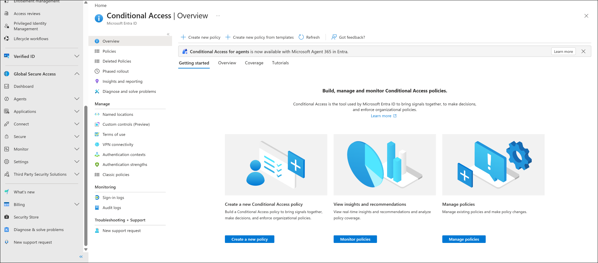
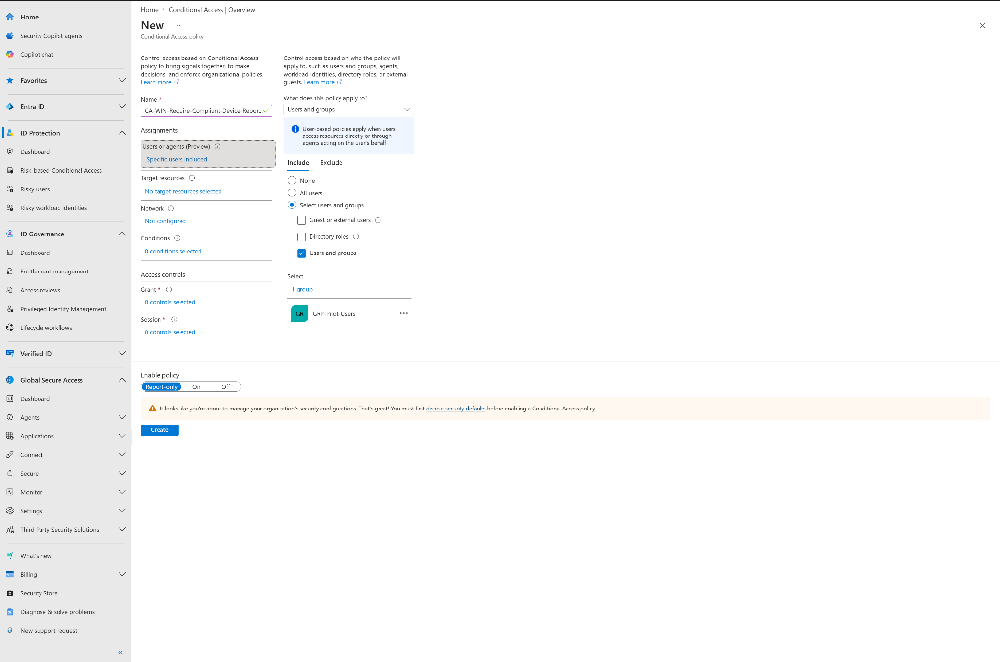
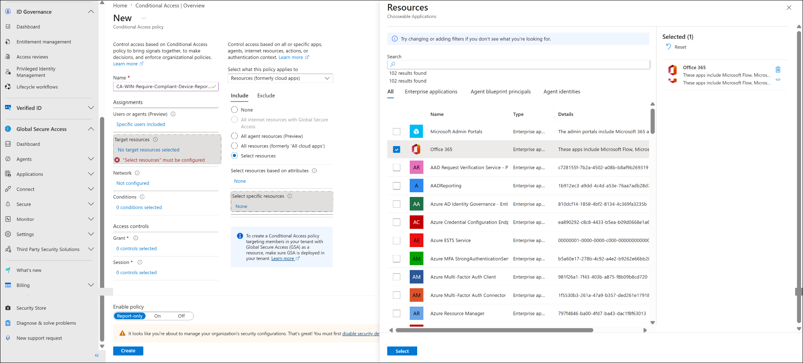
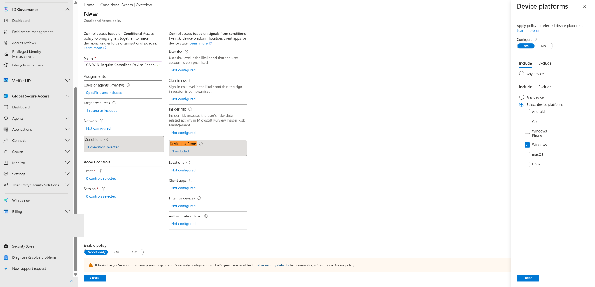
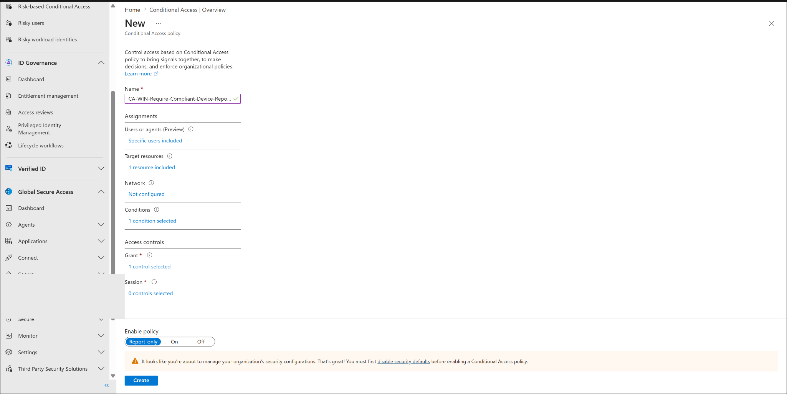
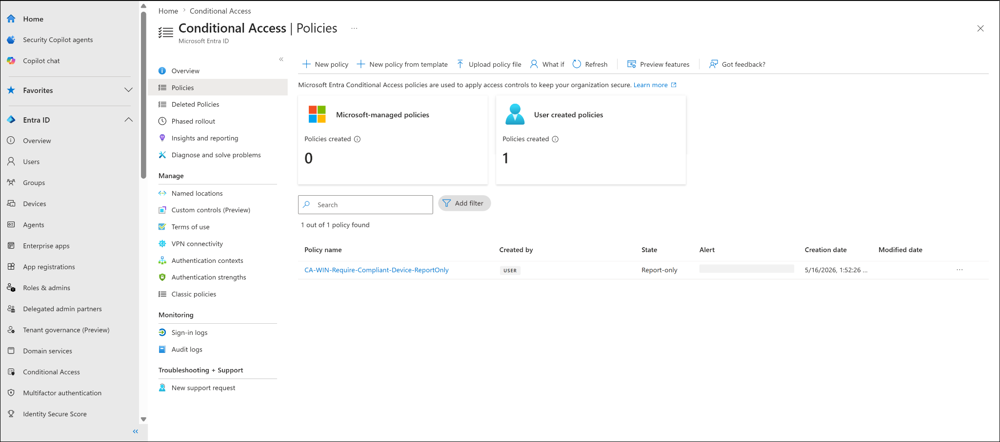
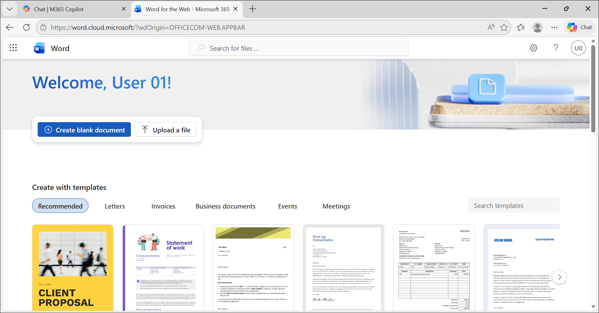
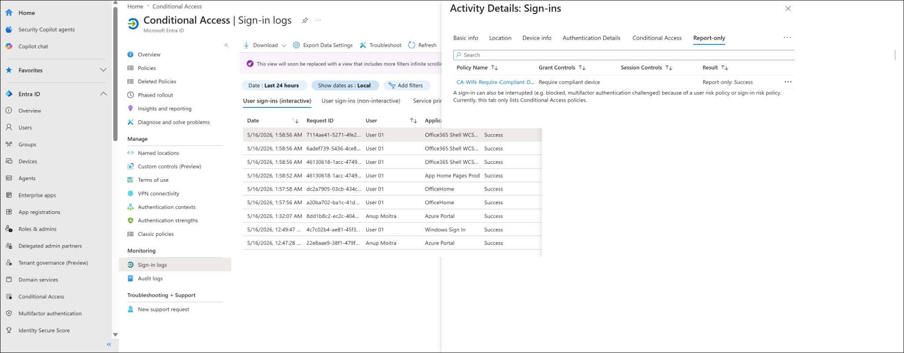
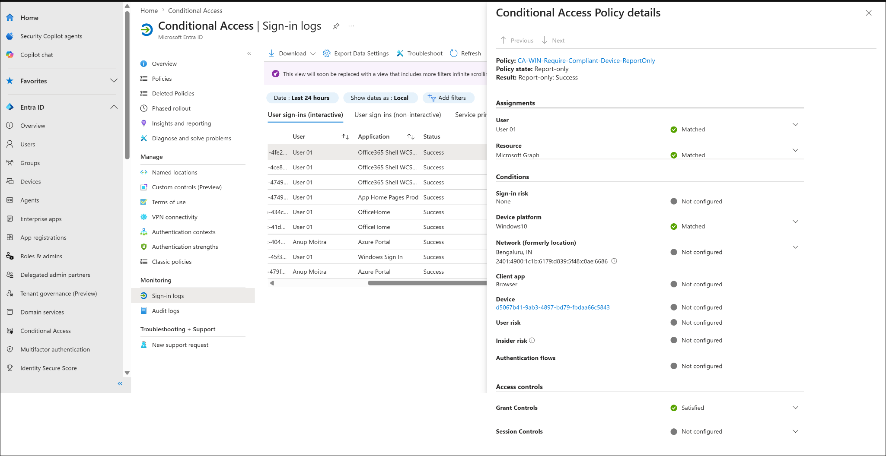

# Conditional Access — Compliant Device

## Lab Status

| Field | Value |
|---|---|
| Status | Completed |
| Lab category | Compliance and Conditional Access |
| Policy name | CA-WIN-Require-Compliant-Device-ReportOnly |
| Policy state | Report-only |
| Target group | GRP-Pilot-Users |
| Test user | user01 |
| Test device | WINAUTO452 |
| Target resource | Office 365 |
| Device platform condition | Windows |
| Grant control | Require device to be marked as compliant |
| Validation result | Report-only: Success |

---

## Lab Objective

Create a Microsoft Entra Conditional Access policy that requires a compliant Windows device for Office 365 access, configure it in Report-only mode to safely evaluate behavior, and validate the result in Microsoft Entra sign-in logs.

This lab builds on the previous compliance lab where WINAUTO452 was marked compliant in Intune. The Conditional Access policy uses that compliance signal to evaluate access.

---

## Why This Lab Matters

Conditional Access allows Microsoft Entra ID to use device health — reported by Intune — as an access signal alongside identity. A user may know the correct password, but the organization can still restrict access if the device is unhealthy, unencrypted, or unmanaged.

```text
Intune reports device compliance
-> Microsoft Entra ID uses compliance as an access signal
-> Conditional Access evaluates whether access should be allowed
```

Report-only mode is the safe way to validate this behavior before enforcement. It records what the policy *would* have done without blocking anyone.

---

## Prerequisites

- WINAUTO452 enrolled in Intune and marked compliant
- user01 licensed and member of GRP-Pilot-Users
- Office 365 / Microsoft 365 web access available for testing
- Microsoft Entra sign-in logs accessible for validation

---

## Policy Configuration

| Area | Configuration |
|---|---|
| Policy name | CA-WIN-Require-Compliant-Device-ReportOnly |
| Users | GRP-Pilot-Users |
| Target resource | Office 365 |
| Device platform condition | Windows |
| Grant control | Require device to be marked as compliant |
| Session control | Not configured |
| Policy state | Report-only |

---

## Steps Performed

### Step 1 — Created the Conditional Access policy

Opened Conditional Access from Microsoft Entra admin center and created a new policy with the settings in the configuration table above. Scoped to `GRP-Pilot-Users` rather than all users to keep the policy impact controlled during testing.









Set policy state to Report-only. This evaluates sign-ins and records what the result would have been without blocking access — the safe method for validating Conditional Access before enforcement.



---

### Step 2 — Confirmed policy created in Report-only state

After creation, the policy appeared in the Conditional Access policy list with state set to Report-only.



---

### Step 3 — Tested Microsoft 365 access

user01 signed in to Microsoft 365 from WINAUTO452. Access succeeded as expected — Report-only mode records the evaluation result without blocking the user.



---

### Step 4 — Validated result in sign-in logs

Opened Microsoft Entra sign-in logs and reviewed the Report-only tab for the test sign-in.

| Item | Result |
|---|---|
| Policy | CA-WIN-Require-Compliant-Device-ReportOnly |
| Policy state | Report-only |
| Result | Report-only: Success |
| User | Matched |
| Resource | Matched |
| Device platform | Windows10 matched |
| Grant controls | Satisfied |





---

## Final Test Result

| Validation item | Result |
|---|---|
| Policy created in Report-only mode | Completed |
| GRP-Pilot-Users scoped correctly | Completed |
| Office 365 targeted | Completed |
| Windows platform condition matched | Completed |
| Compliant device grant control configured | Completed |
| Microsoft 365 access succeeded | Completed |
| Sign-in logs captured policy evaluation | Completed |
| Report-only result: Success | Completed |
| Grant controls: Satisfied | Completed |

---

## Troubleshooting Notes

**Policy appeared under Report-only tab, not the main Conditional Access tab in sign-in logs** — this is expected. Report-only policies are evaluated and recorded under the Report-only view in sign-in log details, not the standard Conditional Access tab which reflects enforced policy results.

**Tenant warning about Security Defaults** — the tenant displayed a notice that Security Defaults must be disabled before enabling a Conditional Access policy in enforcement mode. Since this lab used Report-only mode, no enforcement was attempted and this warning did not affect the lab outcome. Enforcement is tested in a separate lab.

---

## Enterprise Reflection

Report-only mode is the correct starting point for any Conditional Access policy in production. A poorly scoped policy can block users from Microsoft 365 or prevent administrators from accessing management portals. Validating in Report-only first answers whether the right users, resources, and conditions are matching before any access is restricted.

This lab also demonstrates the direct integration between Intune and Entra ID — Intune's compliance evaluation feeds directly into Conditional Access as an access signal, which is a foundational concept in modern endpoint and identity security.

---

## Key Learning Outcomes

- How to create a Conditional Access policy scoped to a pilot group with a compliant-device grant control
- Why Report-only mode is the safe first step before Conditional Access enforcement
- How Microsoft Entra sign-in logs show Conditional Access evaluation results
- How Intune device compliance integrates with Microsoft Entra Conditional Access as an access signal
- What Report-only: Success means and how grant controls appear as Satisfied in sign-in logs
