# Conditional Access — Enforced Mode Test

## Lab Status

| Field | Value |
|---|---|
| Status | Completed |
| Lab category | Compliance and Conditional Access |
| Enforced policy name | CA-WIN-Require-Compliant-Device-Enforced |
| Policy state during test | On |
| Target group | GRP-BYOD-Users |
| Test user | user03 |
| Test device | WIN-BYOD-001 |
| Device compliance state | Noncompliant |
| Target resource | Office 365 |
| Grant control | Require device to be marked as compliant |
| Validation result | Access blocked — grant control not satisfied |

---

## Lab Objective

Enable a Conditional Access policy in enforced mode and validate that Microsoft Entra ID blocks Microsoft 365 access from a noncompliant Windows BYOD device.

This lab follows the Report-only lab where the same policy was validated safely. Enforced mode is the real test — the policy actively blocks access rather than just recording what would have happened.

---

## Why This Lab Matters

Report-only mode confirms the policy logic. Enforced mode confirms the actual access control. A user may have valid credentials, but if the device does not meet compliance requirements, access should be denied. This lab validates that end-to-end enforcement chain.

---

## Prerequisites

- WIN-BYOD-001 enrolled in Intune and intentionally marked noncompliant
- user03 licensed and member of GRP-BYOD-Users
- Previous Report-only Conditional Access lab completed
- Microsoft Entra sign-in logs accessible for validation
- Policy scoped to GRP-BYOD-Users only — not all users

> [!IMPORTANT]
> Enforced Conditional Access policies block real access. Always scope to a test group and ensure at least one admin account is excluded from the policy before enabling enforcement.

---

## Policy Configuration

| Area | Configuration |
|---|---|
| Policy name | CA-WIN-Require-Compliant-Device-Enforced |
| Included group | GRP-BYOD-Users |
| Target resource | Office 365 |
| Device platform condition | Windows |
| Grant control | Require device to be marked as compliant |
| Session control | Not configured |
| Final policy state | On |

---

## Steps Performed

### Step 1 — Confirmed WIN-BYOD-001 is noncompliant

Verified in Intune that WIN-BYOD-001 showed as Noncompliant before proceeding. This confirmed the device would fail the compliant-device grant control.

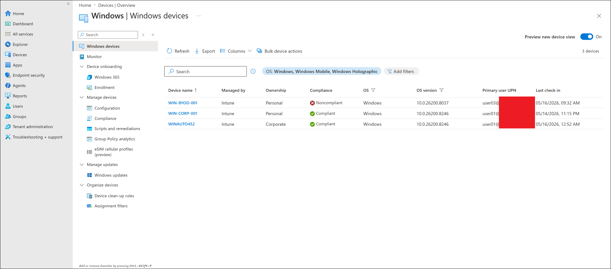

---

### Step 2 — Created the enforced Conditional Access policy

Created `CA-WIN-Require-Compliant-Device-Enforced` in Microsoft Entra Conditional Access with the settings in the configuration table above. Scoped to `GRP-BYOD-Users` to keep enforcement limited to the BYOD test user. Initially saved in Report-only to confirm settings before switching to enforcement.

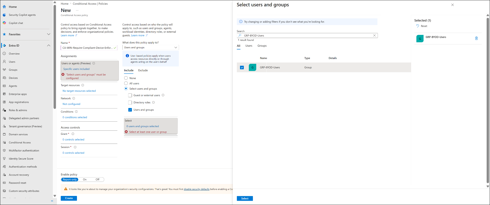

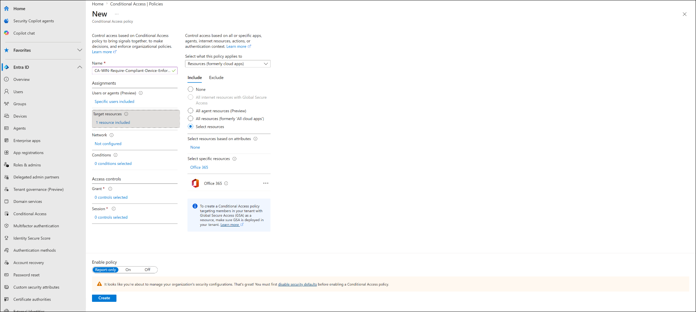

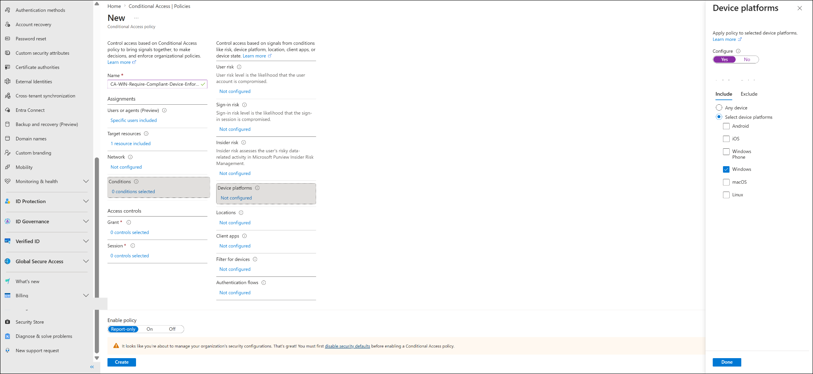

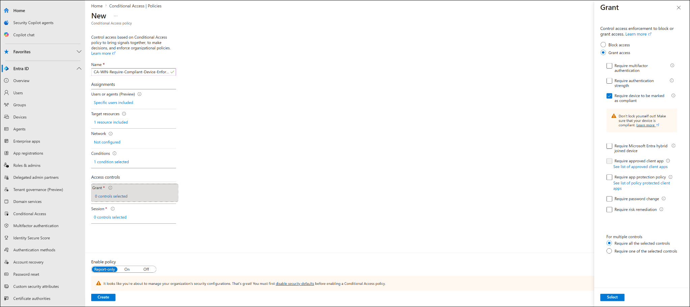


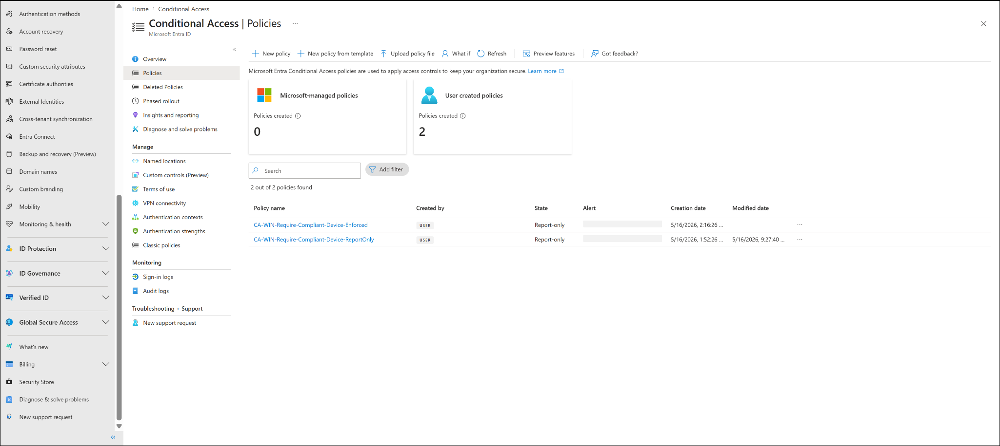

---

### Step 3 — Resolved Security Defaults conflict

When attempting to switch the policy to On, Microsoft Entra displayed a warning that Security Defaults must be disabled before custom Conditional Access policies can be enforced. Security Defaults and custom Conditional Access enforcement cannot coexist in the same tenant.

Security Defaults were disabled with the reason: *My organization is planning to use Conditional Access*.

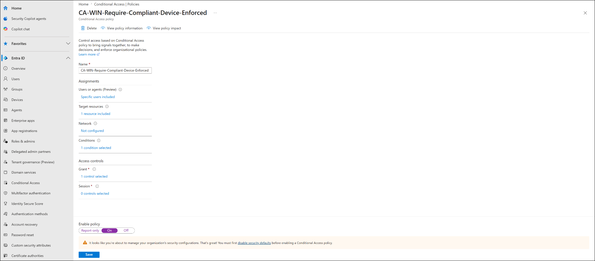

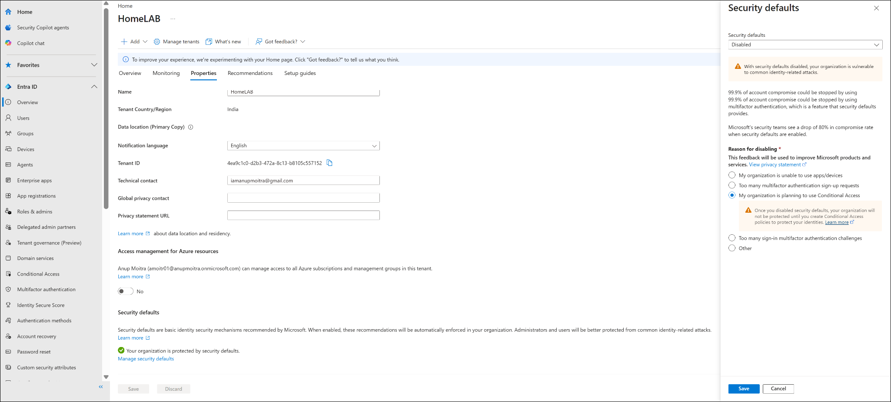

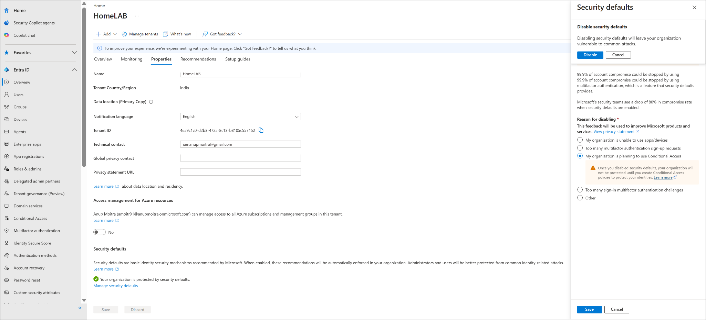

> [!NOTE]
> This was done only to allow enforcement testing in the lab. In production, equivalent Conditional Access protections must be in place before disabling Security Defaults.

---

### Step 4 — Enabled the policy

Switched `CA-WIN-Require-Compliant-Device-Enforced` from Report-only to **On**. The policy list confirmed the state as On.

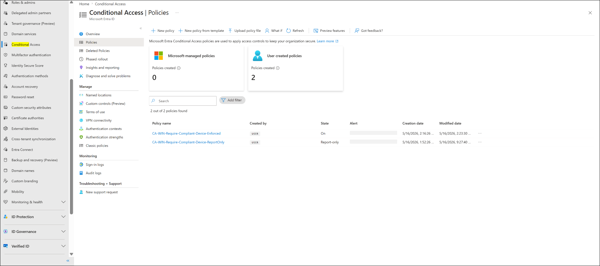

---

### Step 5 — Tested access from noncompliant BYOD device

user03 attempted to access Microsoft 365 / Teams from WIN-BYOD-001. The sign-in was blocked with the message:

```text
Device must comply with your organization's compliance requirements
```

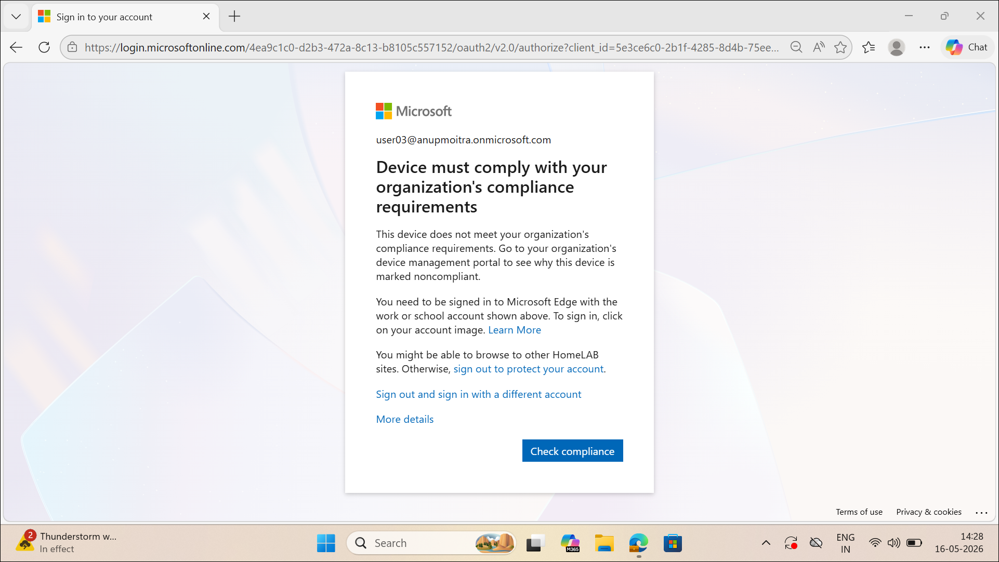

---

### Step 6 — Validated in sign-in logs

Reviewed Microsoft Entra sign-in logs for the blocked sign-in attempt. The logs showed a failure with error code 53000 and the Conditional Access policy details confirmed:

| Item | Result |
|---|---|
| Policy | CA-WIN-Require-Compliant-Device-Enforced |
| Policy state | Enabled |
| Result | Failure |
| User | Matched |
| Resource | Matched |
| Device platform | Windows10 matched |
| Grant controls | Not satisfied |
| Required control | Require compliant device |

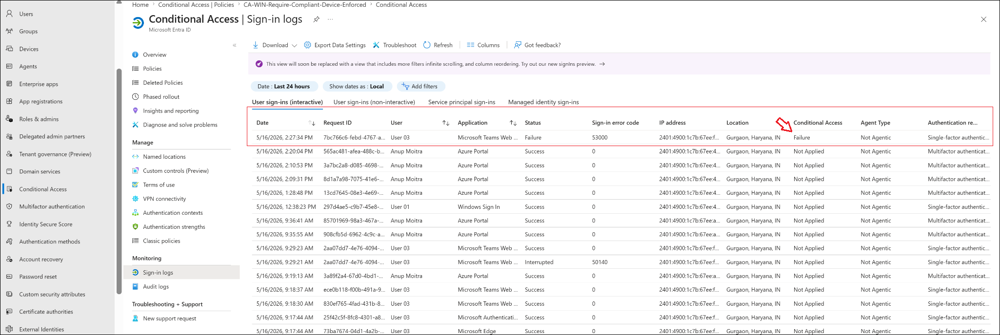

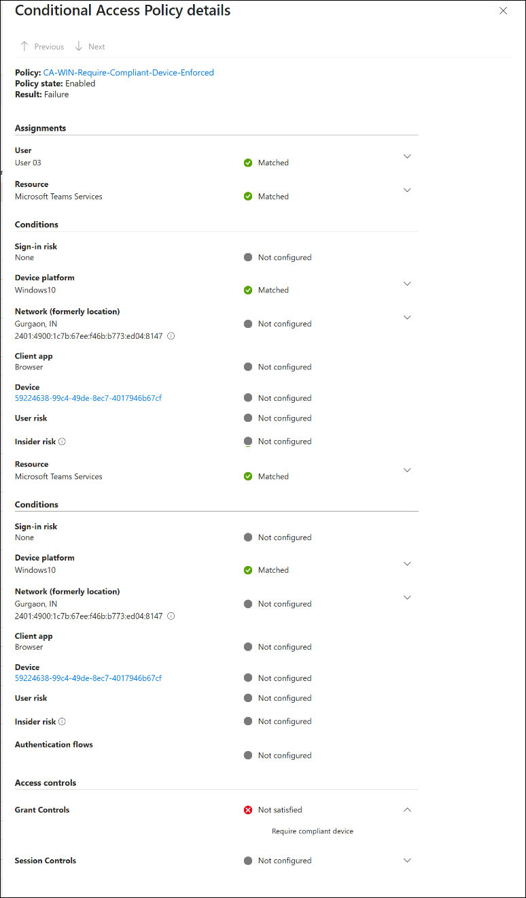

---

## Final Test Result

| Validation item | Result |
|---|---|
| WIN-BYOD-001 confirmed noncompliant | Completed |
| Policy scoped to GRP-BYOD-Users | Completed |
| Security Defaults disabled to allow enforcement | Completed |
| Policy switched to On | Completed |
| Microsoft 365 access blocked for user03 | Completed |
| Sign-in logs captured failure with error 53000 | Completed |
| Grant controls showed Not satisfied | Completed |

---

## Troubleshooting Notes

**User not blocked as expected** — confirm the policy state is On (not Report-only), the user is in `GRP-BYOD-Users`, the device is actually showing Noncompliant in Intune, and the sign-in is targeting Office 365. Check sign-in logs and open the Conditional Access policy details to confirm whether the grant control shows Not satisfied.

**Policy cannot be switched to On** — Security Defaults must be disabled first. The tenant will block enforcement mode if Security Defaults are enabled. Disable Security Defaults and confirm the setting is saved before retrying.

---

## Cleanup Notes

The enforced policy should not be left in On state after the lab unless continued blocking is intended.

To revert:

```text
Microsoft Entra admin center
-> Conditional Access -> Policies
-> CA-WIN-Require-Compliant-Device-Enforced
-> Change state to Report-only or Off -> Save
```

If no equivalent Conditional Access protections exist in the tenant, consider re-enabling Security Defaults to restore basic tenant protection.

---

## Enterprise Reflection

This lab validates the complete Intune and Entra ID enforcement chain. Intune evaluates device health and reports compliance. Microsoft Entra Conditional Access uses that compliance signal to allow or block access. The combination means identity alone is not enough — the device must also be healthy.

In production, Security Defaults should only be disabled when equivalent or stronger Conditional Access policies are ready to replace them. Emergency admin access should always be excluded from enforcement policies before they go live.

---

## Key Learning Outcomes

- How Conditional Access enforced mode differs from Report-only — it actively blocks access
- Why Security Defaults must be disabled before custom Conditional Access enforcement can be enabled
- How error code 53000 identifies a Conditional Access compliance block in sign-in logs
- How grant control results (Not satisfied) confirm the reason for a blocked sign-in
- Why scoping enforced policies to test groups and protecting admin access is essential before enforcement
