# Managed Noncompliant Device Test

## Lab status

| Item | Status |
|---|---|
| Lab | Managed Noncompliant Device Test |
| Section | 04 - Compliance and Conditional Access |
| Platform | Microsoft Intune / Microsoft Entra ID |
| Test device | `WIN-BYOD-001` |
| Device ownership | Personal / BYOD |
| Test user | `user03` |
| BYOD group | `GRP-BYOD-Users` |
| Temporary compliance policy | `COMP-WIN-BYOD-Noncompliant-Test` |
| Conditional Access policy | `CA-WIN-Require-Compliant-Device-ReportOnly` |
| Conditional Access mode | Report-only |
| Final result | Completed |
| Validation result | Report-only: Failure |

---

## Lab objective

The objective of this lab was to test what happens when a **managed Windows BYOD device** is enrolled in Microsoft Intune but does **not meet compliance requirements**.

This lab validates the negative Conditional Access scenario:

```text
Managed device
        ↓
Device is enrolled in Intune
        ↓
Device is intentionally marked noncompliant
        ↓
User signs in to Microsoft 365
        ↓
Conditional Access checks "Require compliant device"
        ↓
Report-only result shows Failure
```

This proves that a device can be managed by Intune but still fail Conditional Access if it is not compliant.

---

## Why this lab matters

In real environments, device management and device compliance are not the same thing.

A device may be:

```text
Managed by Intune = Yes
Compliant = No
```

This is important because organizations often allow access only from devices that are both:

- Managed by the organization.
- Compliant with security requirements.

For example, a BYOD Windows laptop may be enrolled in Intune, but it should not automatically be trusted if it fails compliance checks such as operating system version, encryption, Defender, firewall, or security health requirements.

This lab demonstrates that Microsoft Entra Conditional Access can use Microsoft Intune compliance state as an access signal.

---

## Lab environment

| Component | Value |
|---|---|
| Intune device | `WIN-BYOD-001` |
| Device type | Windows BYOD device |
| Device management | Microsoft Intune |
| Device compliance target | Noncompliant |
| Test user | `user03` |
| User group | `GRP-BYOD-Users` |
| Compliance policy | `COMP-WIN-BYOD-Noncompliant-Test` |
| Conditional Access policy | `CA-WIN-Require-Compliant-Device-ReportOnly` |
| Conditional Access state | Report-only |
| Target resource | Microsoft 365 / Office 365 |
| Grant control | Require compliant device |

---

## Prerequisites

Before starting this lab, the following items were already completed:

- `WIN-BYOD-001` was enrolled into Microsoft Intune.
- `user03` was available as the BYOD test user.
- `user03` was a member of `GRP-BYOD-Users`.
- The Conditional Access compliant-device policy already existed.
- The Conditional Access policy was configured in Report-only mode.
- Microsoft Entra sign-in logs were available for validation.

---

## High-level test flow

```text
1. Confirm WIN-BYOD-001 starts as a managed/compliant device.
2. Create a temporary Windows compliance policy.
3. Configure a higher minimum Windows OS version.
4. Assign the policy to GRP-BYOD-Users.
5. Confirm WIN-BYOD-001 becomes noncompliant.
6. Update Conditional Access scope to include BYOD users.
7. Sign in as user03 from the BYOD device.
8. Review Microsoft Entra sign-in logs.
9. Confirm Report-only failure for Require compliant device.
```

---

## Step 1 - Confirm initial BYOD device state

Before creating the temporary noncompliance policy, the BYOD Windows device was visible in Intune.

The device was:

```text
WIN-BYOD-001
```

At the start of the test, the device was already managed by Intune and was initially showing as compliant.

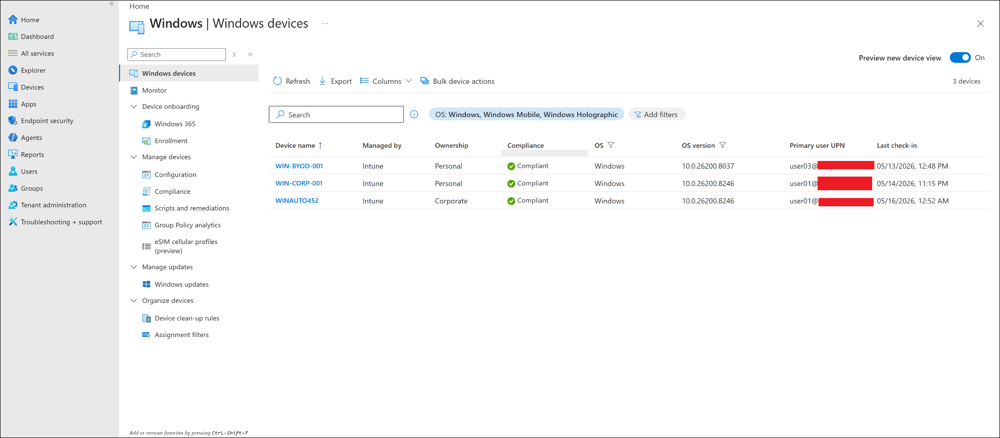

---

## Step 2 - Start creating a Windows compliance policy

A new Windows compliance policy was created from the Microsoft Intune admin center.

Navigation used:

```text
Microsoft Intune admin center
-> Devices
-> Compliance
-> Policies
-> Create policy
```

The selected platform and profile type were:

| Setting | Value |
|---|---|
| Platform | Windows 10 and later |
| Profile type | Windows 10/11 compliance policy |

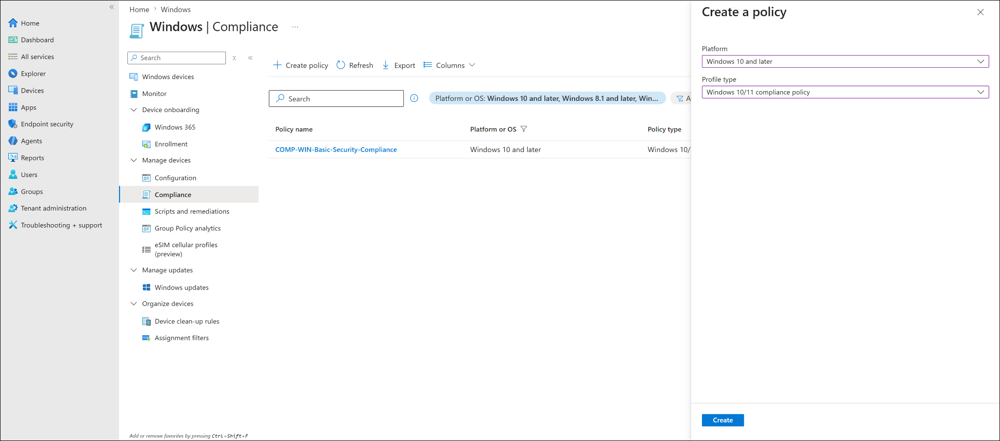

---

## Step 3 - Configure policy basics

The temporary compliance policy was named:

```text
COMP-WIN-BYOD-Noncompliant-Test
```

Purpose of the policy:

```text
Temporarily mark the BYOD Windows test device as noncompliant
by requiring a higher minimum operating system version.
```

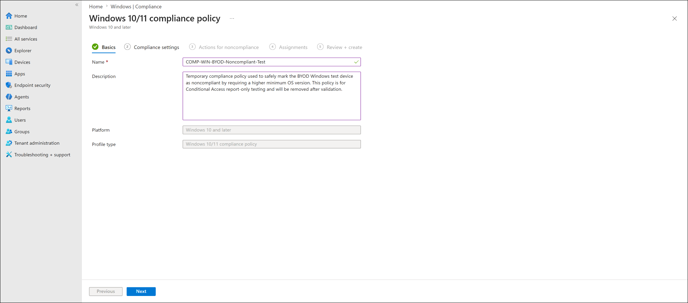

---

## Step 4 - Configure minimum OS version

The compliance setting used for this test was:

```text
Minimum OS version
```

The configured value was:

```text
10.0.30000.0
```

This value was intentionally higher than the current Windows version on the BYOD test device.

Because the device does not meet this minimum OS version, Intune marks it as noncompliant.

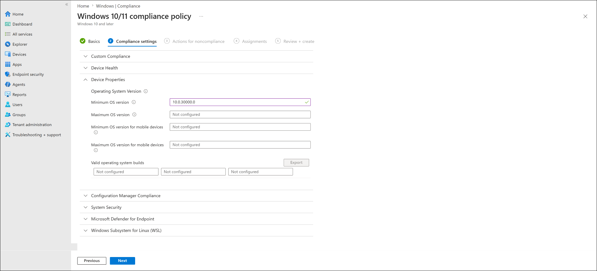

### Why this setting was used

This is a safe lab method for forcing a device into a noncompliant state.

Instead of disabling security controls or weakening the device, the policy simply requires a Windows version that the test device does not have.

This creates a clean and reversible noncompliance test.

---

## Step 5 - Configure action for noncompliance

The action for noncompliance was configured as:

```text
Mark device noncompliant
```

The schedule was:

```text
Immediately
```

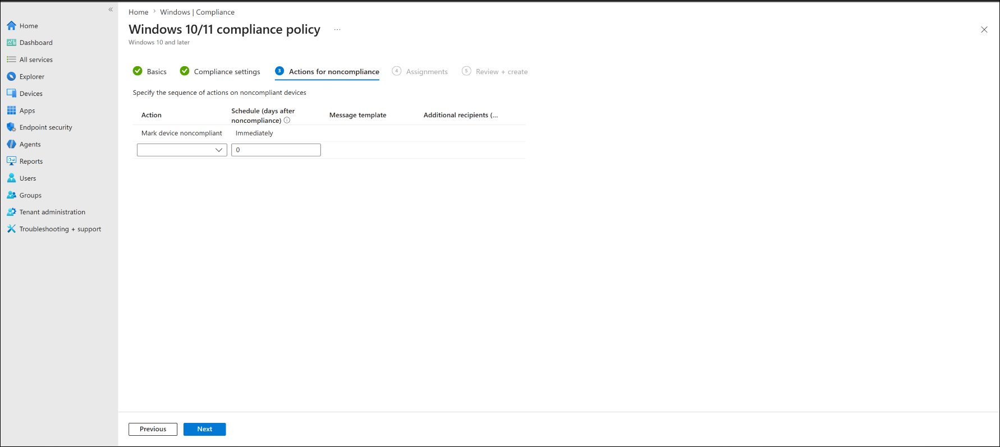

This allowed the compliance result to appear quickly after the device checked in with Intune.

---

## Step 6 - Assign policy to BYOD users

The temporary compliance policy was assigned to:

```text
GRP-BYOD-Users
```

This targeted the BYOD test user and device scenario.

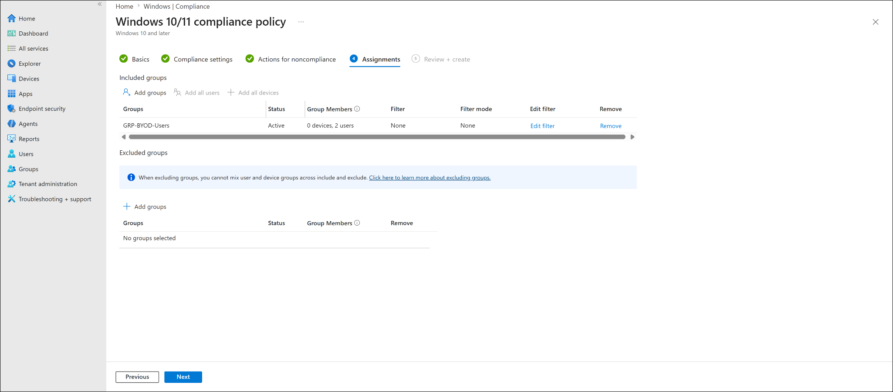

---

## Step 7 - Review and create the compliance policy

The policy summary confirmed:

| Area | Value |
|---|---|
| Policy name | `COMP-WIN-BYOD-Noncompliant-Test` |
| Platform | Windows 10 and later |
| Profile type | Windows 10/11 compliance policy |
| Minimum OS version | `10.0.30000.0` |
| Action | Mark device noncompliant immediately |
| Assignment | `GRP-BYOD-Users` |

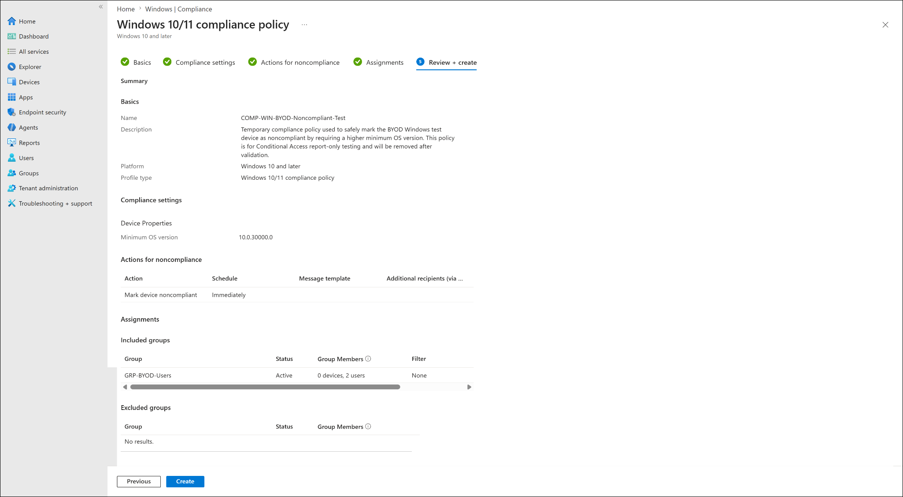

---

## Step 8 - Validate policy device status

After policy evaluation, the temporary compliance policy showed the BYOD test device as noncompliant.

Observed device:

```text
WIN-BYOD-001
```

Observed compliance result:

```text
Not compliant
```

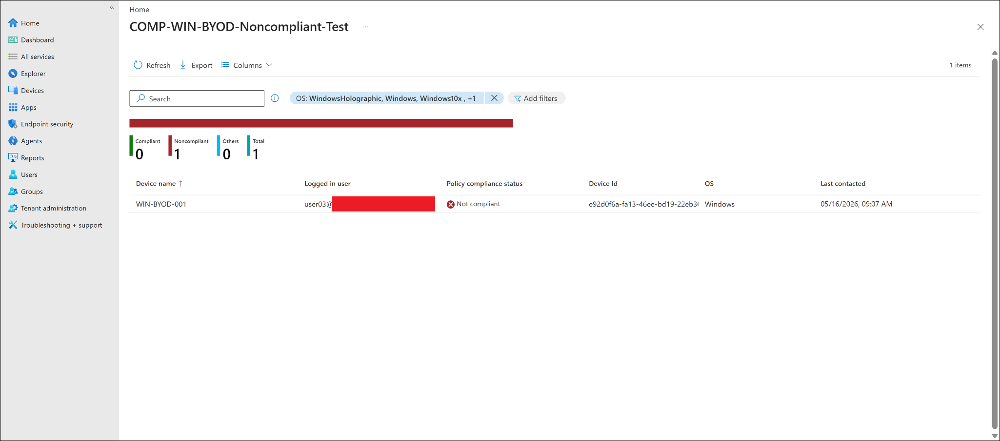

---

## Step 9 - Validate Intune Windows device list

The Windows devices list also showed:

```text
WIN-BYOD-001 = Noncompliant
```

This confirmed that the noncompliance state was visible at the device inventory level, not only inside the policy report.

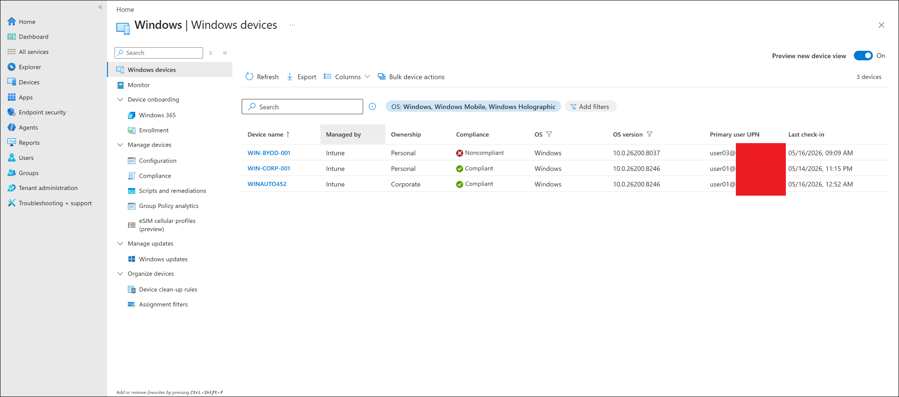

---

## Step 10 - Update Conditional Access policy scope

The existing Conditional Access policy was used:

```text
CA-WIN-Require-Compliant-Device-ReportOnly
```

The policy was updated so that it included the BYOD user group:

```text
GRP-BYOD-Users
```

The policy also retained the existing pilot group:

```text
GRP-Pilot-Users
```

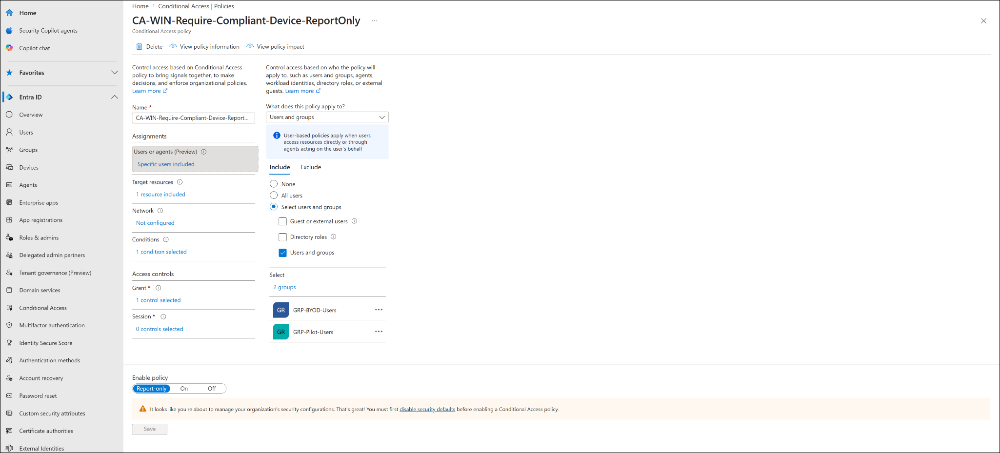

### Why the Conditional Access policy was kept in Report-only mode

The goal of this lab was to safely validate what Conditional Access would do without actually blocking access.

Report-only mode is useful because it shows whether the policy would succeed or fail, while still allowing the sign-in attempt to continue.

This is safer during testing because a wrong Conditional Access configuration can accidentally block users or administrators.

---

## Step 11 - Validate Report-only failure

A sign-in was tested from the BYOD device.

In the Microsoft Entra sign-in logs, the **Report-only** tab showed:

```text
Report-only: Failure
```

The grant control was:

```text
RequireCompliantDevice
```

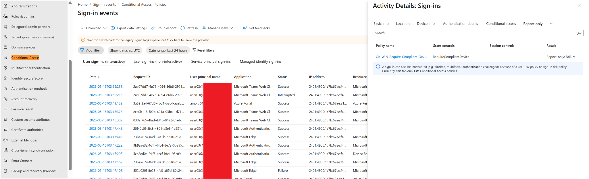

This confirms that the device did not satisfy the compliant-device requirement.

---

## Validation summary

| Validation item | Expected result | Actual result |
|---|---|---|
| BYOD device managed by Intune | Yes | Passed |
| Temporary compliance policy created | Yes | Passed |
| Minimum OS version configured above device version | Yes | Passed |
| BYOD group assigned | Yes | Passed |
| `WIN-BYOD-001` marked noncompliant | Yes | Passed |
| Conditional Access includes BYOD users | Yes | Passed |
| Conditional Access policy remains Report-only | Yes | Passed |
| Sign-in log shows policy evaluation | Yes | Passed |
| Report-only result shows Failure | Yes | Passed |
| Grant control shows RequireCompliantDevice | Yes | Passed |

---

## Final result

The lab was successful.

The managed BYOD Windows device was intentionally made noncompliant by using a temporary compliance policy with a higher minimum OS version requirement.

The Conditional Access Report-only result showed:

```text
Report-only: Failure
```

The failed grant control was:

```text
RequireCompliantDevice
```

This confirms that Conditional Access correctly detected that the managed BYOD device did not satisfy the compliant-device requirement.

---

## Key learning outcomes

- A device can be enrolled and managed by Intune but still be noncompliant.
- Device compliance is separate from device management.
- Intune compliance state can be used by Microsoft Entra Conditional Access.
- Report-only mode is useful for safe Conditional Access validation.
- A temporary high minimum OS version policy can safely simulate noncompliance.
- Microsoft Entra sign-in logs show Report-only success or failure results.
- The `Require compliant device` grant control fails when the device is noncompliant.

---

## Troubleshooting notes

If the device does not become noncompliant immediately:

1. Confirm the policy is assigned to the correct user group.
2. Confirm the test user is a member of `GRP-BYOD-Users`.
3. Sync the device from the Intune admin center.
4. Sync the device from Windows Settings.
5. Wait for Intune compliance evaluation to refresh.
6. Confirm the device is checking in with Intune.
7. Review policy device status inside the compliance policy.

If Conditional Access does not show the Report-only failure:

1. Confirm the Conditional Access policy includes `GRP-BYOD-Users`.
2. Confirm the policy is still in Report-only mode.
3. Confirm the sign-in is from the correct user.
4. Confirm the sign-in targets Microsoft 365 / Office 365.
5. Open the sign-in log details.
6. Check the **Report-only** tab, not only the normal **Conditional Access** tab.
7. Confirm the result shows the compliant-device grant control.

---

## Cleanup notes

This lab used a temporary compliance policy to force a noncompliant result.

After completing the lab, the temporary policy can be removed or disabled if it is no longer needed:

```text
COMP-WIN-BYOD-Noncompliant-Test
```

This helps return the BYOD test device to a normal compliance state.

The Conditional Access policy can remain in Report-only mode for future testing:

```text
CA-WIN-Require-Compliant-Device-ReportOnly
```

Do not switch the policy to **On** until an enforced-mode lab is intentionally being performed and admin lockout protection has been considered.

---

## Security and privacy notes

This lab is part of a public learning repository.

Before publishing screenshots, sanitize:

- Full user principal names.
- Tenant names.
- Device IDs.
- Object IDs.
- IP addresses.
- Top-right signed-in account details.
- Any serial numbers or hardware identifiers.

---

## Lab conclusion

This lab proves the negative Conditional Access scenario for a managed but noncompliant Windows BYOD device.

The device `WIN-BYOD-001` was managed by Intune but intentionally failed compliance due to a temporary minimum OS version requirement. When the BYOD user signed in, the Conditional Access policy evaluated the sign-in and reported:

```text
Report-only: Failure
```

This confirms that a managed device is not automatically trusted. For Conditional Access policies requiring a compliant device, the device must be both managed and compliant.

---

## Next lab

Recommended next lab:

```text
04-compliance-and-conditional-access/conditional-access-enforced-mode-test.md
```

That lab can safely test what happens when the Conditional Access policy is switched from Report-only to enforced mode.
