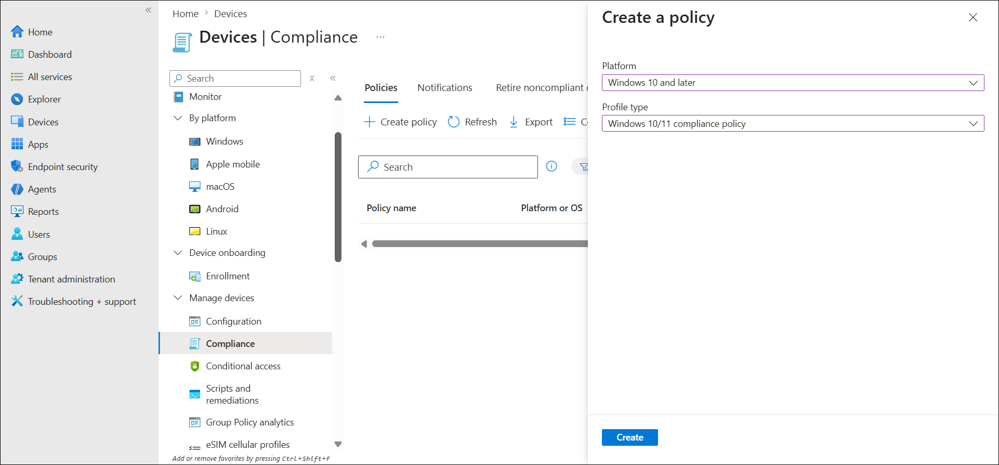
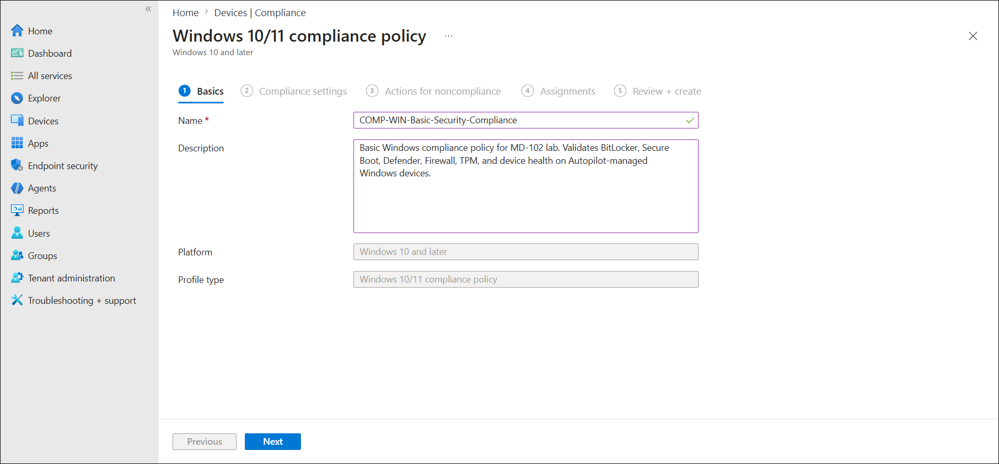
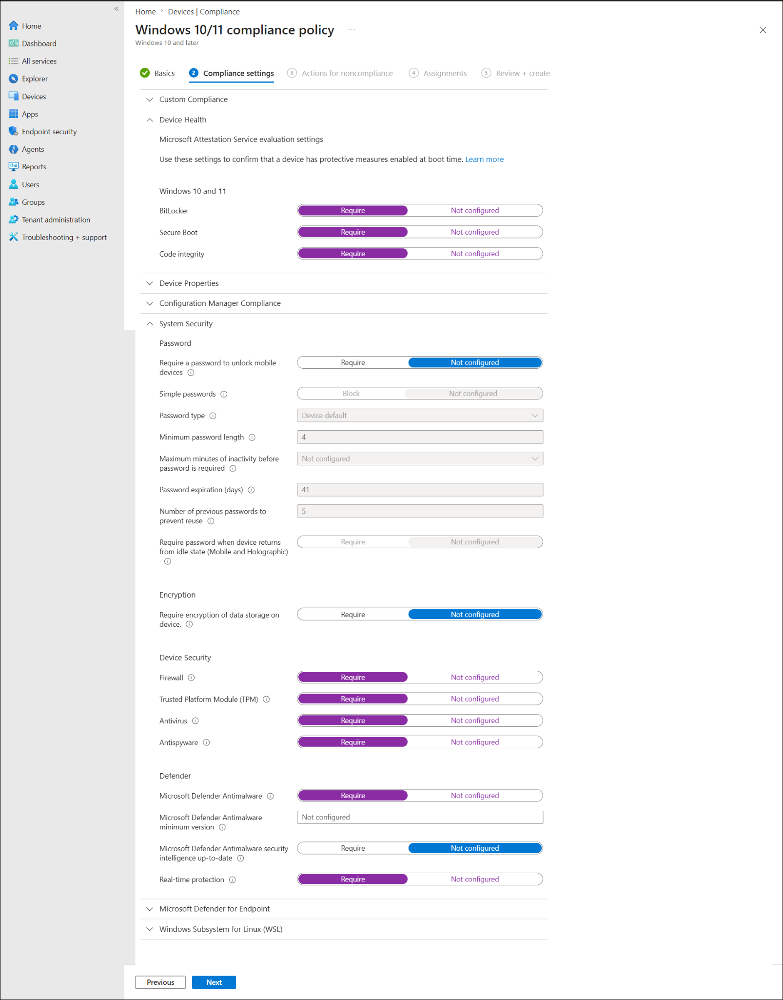
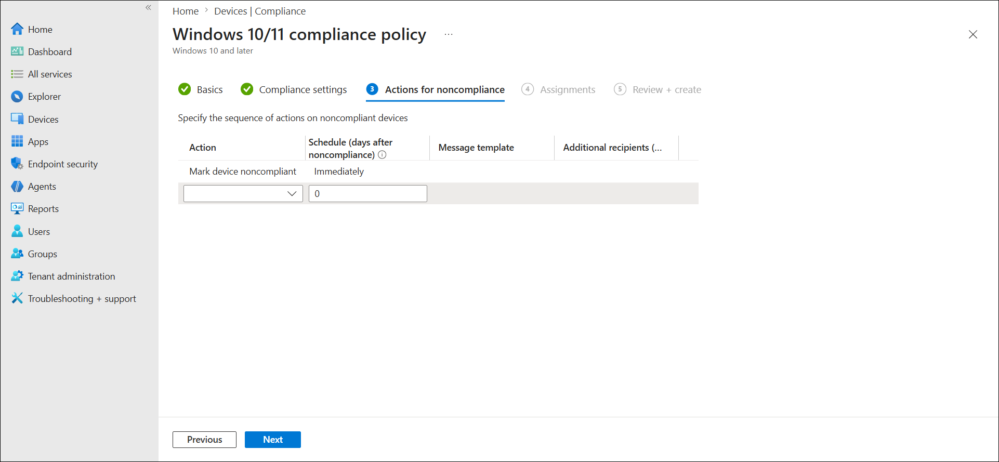
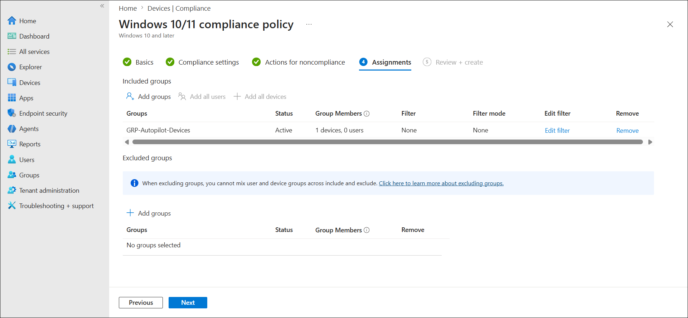
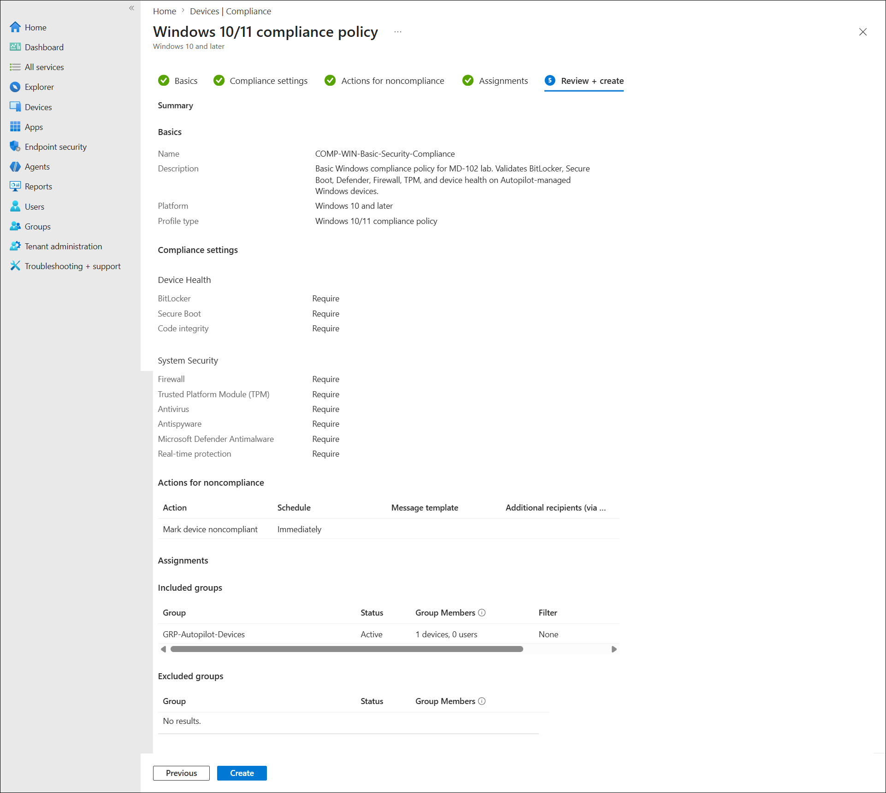
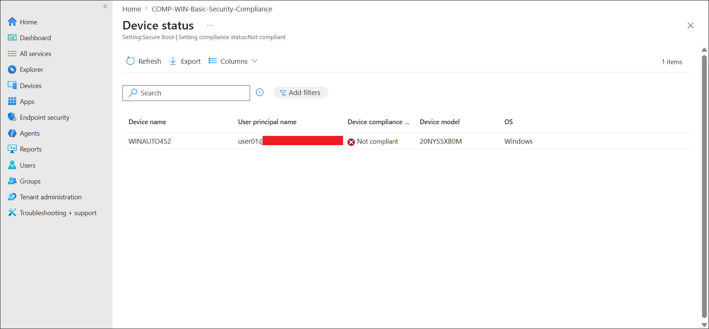
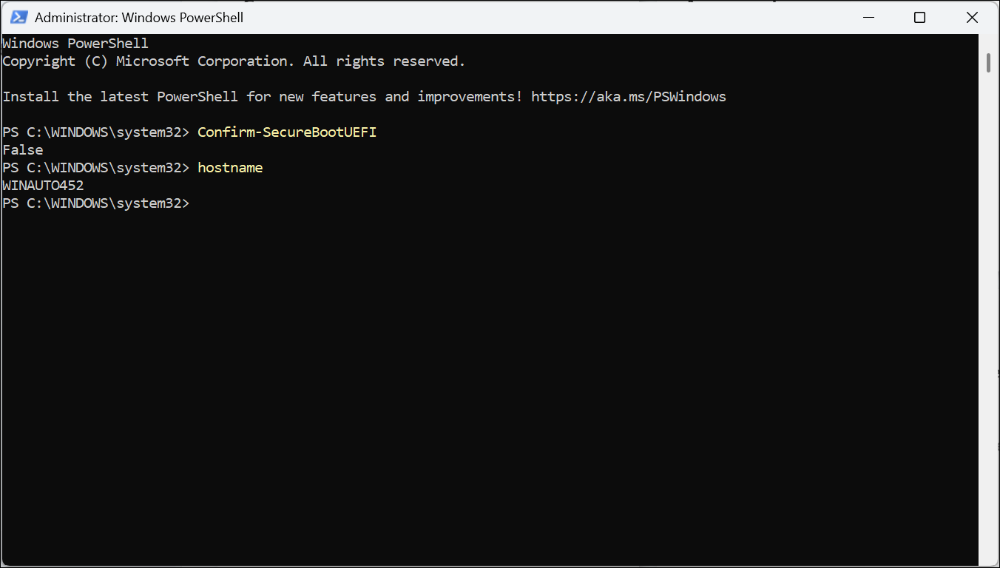
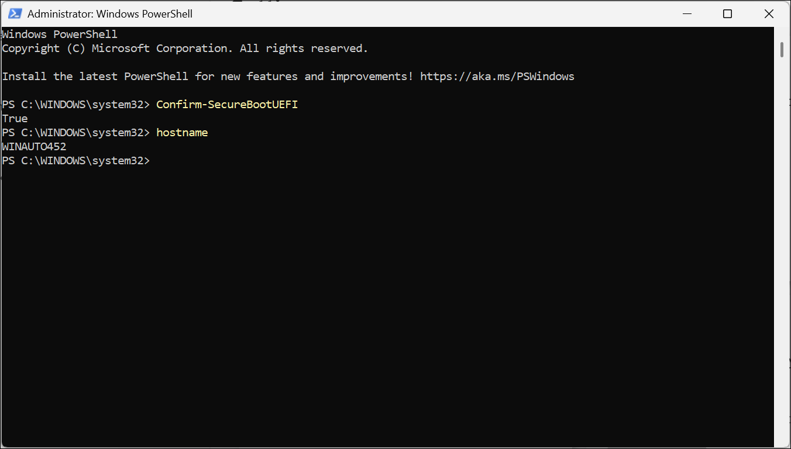
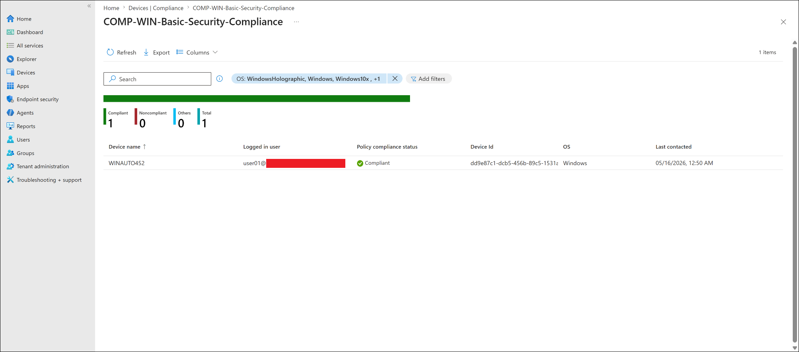

# Windows Basic Compliance Policy

## Lab Status

| Field | Value |
|---|---|
| Status | Completed |
| Lab category | Compliance and Conditional Access |
| Policy name | COMP-WIN-Basic-Security-Compliance |
| Policy type | Windows 10/11 compliance policy |
| Target group | GRP-Autopilot-Devices |
| Target device | WINAUTO452 |
| Compliance result | Compliant |

---

## Lab Objective

Create a basic Windows compliance policy in Microsoft Intune, assign it to the Autopilot device group, and validate that WINAUTO452 meets core Windows security requirements. This lab includes a real Secure Boot troubleshooting and remediation case.

---

## Why This Lab Matters

Compliance policies define the security baseline a device must meet before it is considered trusted. When combined with Conditional Access, this creates an access control chain:

```text
User signs in
-> Intune reports device compliance
-> Conditional Access evaluates compliance state
-> Access is allowed or blocked
```

This lab proves that a managed Windows device can be evaluated by Intune and marked compliant only when required security settings are healthy.

---

## Prerequisites

- WINAUTO452 enrolled in Intune and member of GRP-Autopilot-Devices
- BitLocker, Defender Antivirus, and Firewall policies already deployed
- Administrator and BIOS/UEFI access available on WINAUTO452

---

## Configuration Flow

```text
Create Windows compliance policy
-> Configure security settings
-> Assign to GRP-Autopilot-Devices
-> Sync WINAUTO452 and review result
-> Troubleshoot Secure Boot failure
-> Enable Secure Boot in BIOS/UEFI
-> Sync again and confirm Compliant
```

---

## Steps Performed

### Step 1 — Created and configured the compliance policy

Navigated to:

```text
Devices -> Compliance -> Policies -> Create policy
```

Selected Windows 10 and later / Windows 10/11 compliance policy. Named the policy `COMP-WIN-Basic-Security-Compliance`.

**Device Health settings:**

| Setting | Configuration |
|---|---|
| BitLocker | Require |
| Secure Boot | Require |
| Code integrity | Require |

**System Security settings:**

| Setting | Configuration |
|---|---|
| Firewall | Require |
| Trusted Platform Module (TPM) | Require |
| Antivirus | Require |
| Antispyware | Require |
| Microsoft Defender Antimalware | Require |
| Real-time protection | Require |

**Settings intentionally left Not configured:**

| Setting | Reason |
|---|---|
| Minimum / maximum OS version | Incorrect build values can make a healthy device noncompliant |
| Password requirements | Not required for this device-health-focused compliance test |
| Microsoft Defender for Endpoint risk score | Defender for Endpoint not part of this lab |
| Security intelligence up-to-date | Definition update reporting can be delayed, causing false failures |

Noncompliance action: Mark device noncompliant — Immediately.









---

### Step 2 — Assigned and created the policy

Assigned to `GRP-Autopilot-Devices`. Reviewed and created the policy.





---

### Step 3 — Identified Secure Boot failure

After the device synced and Intune evaluated compliance, the per-setting status showed most settings as compliant but Secure Boot as Noncompliant.

| Setting | Result |
|---|---|
| BitLocker | Compliant |
| Code Integrity | Compliant |
| Firewall | Compliant |
| TPM | Compliant |
| Antivirus | Compliant |
| Antispyware | Compliant |
| Microsoft Defender Antimalware | Compliant |
| Real-time protection | Compliant |
| **Secure Boot** | **Noncompliant** |

Confirmed Secure Boot status locally on WINAUTO452 using PowerShell:

```powershell
Confirm-SecureBootUEFI
hostname
```

Result:

```text
Confirm-SecureBootUEFI = False
hostname = WINAUTO452
```





---

### Step 4 — Enabled Secure Boot and confirmed compliant

Enabled Secure Boot in the Lenovo BIOS/UEFI settings and restarted the device. Re-ran the PowerShell check:

```powershell
Confirm-SecureBootUEFI
hostname
```

Result:

```text
Confirm-SecureBootUEFI = True
hostname = WINAUTO452
```

Synced the device with Intune. The compliance policy report updated to:

| Metric | Result |
|---|---|
| Compliant | 1 |
| Noncompliant | 0 |





---

## Final Test Result

| Validation item | Result |
|---|---|
| Compliance policy created and assigned | Completed |
| Device received compliance policy | Completed |
| Secure Boot failure identified in per-setting status | Completed |
| Secure Boot confirmed disabled via PowerShell | Completed |
| Secure Boot enabled in BIOS/UEFI | Completed |
| Secure Boot confirmed enabled via PowerShell | Completed |
| WINAUTO452 reported Compliant after remediation | Completed |

---

## Enterprise Reflection

This lab shows why pilot testing compliance policies matters. If `COMP-WIN-Basic-Security-Compliance` had been assigned broadly, many devices with Secure Boot disabled would suddenly become noncompliant — potentially triggering Conditional Access blocks across the organization. A controlled pilot group gives administrators time to find and fix firmware issues before enforcement.

It also demonstrates that compliance policies reveal real device security posture issues, not just configuration state. A device with Secure Boot disabled has a real security gap, and Intune surfacing that through compliance reporting is exactly the intended behavior.

---

## Key Learning Outcomes

- How to configure a Windows compliance policy covering BitLocker, Secure Boot, Defender, Firewall, and TPM
- Why some compliance settings (OS version, definition updates) should be left unconfigured in a first-pass lab to avoid false failures
- How to use `Confirm-SecureBootUEFI` in PowerShell to validate Secure Boot state locally
- How per-setting compliance status isolates exactly which control is failing
- Why pilot testing compliance policies before broad deployment prevents unexpected noncompliance at scale
