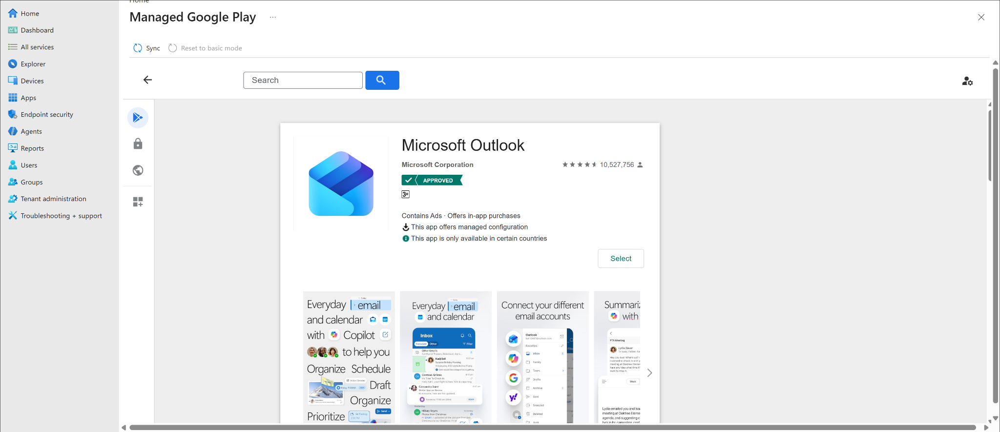
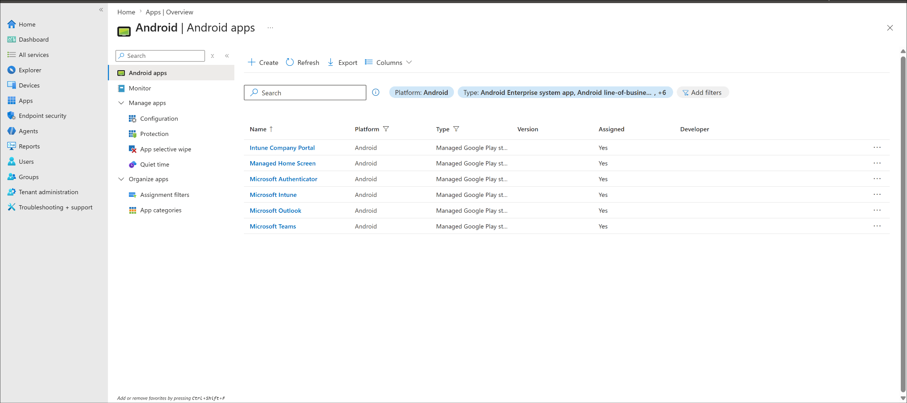
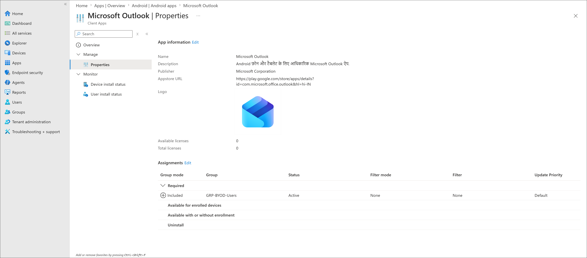
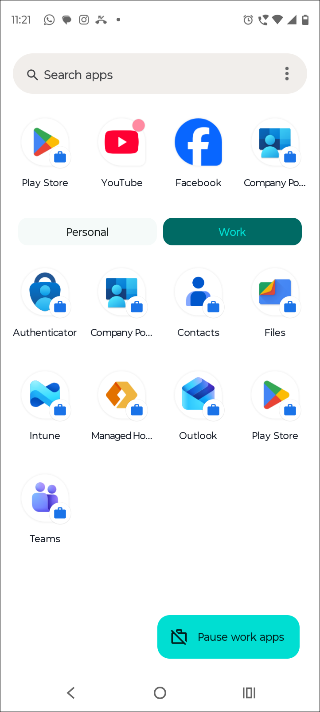

# Android Managed Google Play App Deployment

## Lab status

**Status:** Completed  
**Lab area:** Application deployment  
**Platform:** Android Enterprise  
**Enrollment scenario:** Android BYOD personally owned device with work profile  
**App source:** Managed Google Play  
**Target group:** `GRP-BYOD-Users`  
**Test user:** `user03`  
**Test device:** Android BYOD work profile device  
**Deployment result:** Microsoft Outlook and Microsoft Teams installed in the Android Work profile  

---

## Lab objective

The goal of this lab was to deploy additional work apps to an already enrolled Android BYOD device using **Managed Google Play** and Microsoft Intune.

This lab validates that Android Enterprise work profile apps can be:

- Added from Managed Google Play
- Synced into Intune
- Assigned to a user group
- Installed inside the Android Work profile

The main proof apps for this lab were:

- **Microsoft Outlook**
- **Microsoft Teams**

---

## Why this lab matters

In a real organization, Android BYOD users often need work apps such as Outlook, Teams, Edge, and OneDrive inside the managed Work profile.

The Work profile keeps corporate apps and data separate from the user's personal apps and data. Intune manages the work side of the device, while personal apps remain outside full device management.

This lab demonstrates the app deployment flow used by Intune administrators to deliver work apps to personal Android devices.

---

## Prerequisites

The following prerequisite lab was completed first:

```text
02-device-enrollment/android-byod-enrollment.md
```

That lab confirmed:

- Managed Google Play was connected to Intune
- Android Enterprise personally owned work profile enrollment was enabled
- `user03` successfully enrolled an Android BYOD device
- The device appeared in Intune as Personal, Intune managed, and Compliant
- The Android Work profile was created successfully

---

## Lab environment

| Item | Value |
|---|---|
| Admin portal | Microsoft Intune admin center |
| Platform | Android Enterprise |
| Enrollment type | Personally owned device with work profile |
| App source | Managed Google Play |
| Target group | `GRP-BYOD-Users` |
| Test user | `user03` |
| Apps deployed | Microsoft Outlook, Microsoft Teams |
| Deployment type | Required assignment |
| Result | Apps installed in Android Work profile |

---

## Screenshot evidence

Screenshots for this lab are stored in:

```text
screenshots/sanitized/application-deployment/
```

| Screenshot | Purpose |
|---|---|
| `android-managed-google-play-outlook-approved-sanitized.png` | Shows Microsoft Outlook approved/selected from Managed Google Play |
| `android-managed-google-play-outlook-required-assignment-sanitized.png` | Shows Microsoft Outlook assigned as Required to `GRP-BYOD-Users` |
| `android-managed-google-play-outlook-teams-added-assigned-sanitized.png` | Shows Outlook and Teams added to Intune Android apps and assigned |
| `android-managed-google-play-outlook-teams-installed-work-profile-sanitized.png` | Shows Outlook and Teams installed in the Android Work profile |

---

## Step 1: Open Android apps in Intune

Path used:

```text
Microsoft Intune admin center
> Apps
> Android
> Android apps
```

This page shows Android apps that are available in Intune.

Before this lab, only the default Android Enterprise apps were available, such as:

- Intune Company Portal
- Microsoft Authenticator
- Microsoft Intune
- Managed Home Screen

The goal of this lab was to add extra work apps beyond the default app set.

---

## Step 2: Add Microsoft Outlook from Managed Google Play

Path used:

```text
Microsoft Intune admin center
> Apps
> Android
> Android apps
> Create
> Managed Google Play app
```

The Managed Google Play picker was opened from Intune.

The following app was searched and selected:

```text
Microsoft Outlook
Publisher: Microsoft Corporation
```

Outlook was approved/selected in Managed Google Play so it could be synced into Intune.

Screenshot:



---

## Step 3: Troubleshoot Managed Google Play picker loading issue

During the first attempt, the Managed Google Play app picker opened as a blank screen.

The issue was resolved by opening the Intune admin center in an **InPrivate** browser session and repeating the app picker workflow.

This indicated the issue was browser/session related, not a broken Intune or Managed Google Play connector.

Troubleshooting notes:

- Managed Google Play connector status was already `Setup`
- Android BYOD enrollment was already working
- Default Managed Google Play apps were already available in Intune
- The app picker loaded correctly in InPrivate mode

---

## Step 4: Sync Managed Google Play apps into Intune

After selecting the app in Managed Google Play, the app was synced into Intune.

Path used:

```text
Apps
> Android
> Android apps
> Refresh
```

After sync and refresh, the following apps appeared in the Android apps list:

- Microsoft Outlook
- Microsoft Teams

Both apps showed as Android Managed Google Play store apps.

Screenshot:



---

## Step 5: Assign Microsoft Outlook as a required app

Path used:

```text
Apps
> Android
> Android apps
> Microsoft Outlook
> Properties
> Assignments
> Edit
```

Assignment configured:

| Setting | Value |
|---|---|
| App | Microsoft Outlook |
| App type | Managed Google Play store app |
| Assignment type | Required |
| Included group | `GRP-BYOD-Users` |
| Status | Active |

This targets Outlook to Android BYOD users in the `GRP-BYOD-Users` group.

Screenshot:



---

## Step 6: Verify app installation in Android Work profile

After the Android device synced with Intune and Managed Google Play, the Work profile app drawer was checked.

The following additional apps appeared in the Work profile:

- Outlook
- Teams

Both apps were shown with the Android Work profile badge, confirming that they were installed in the managed Work profile rather than the personal profile.

Screenshot:



---

## Final validation

| Validation item | Result |
|---|---|
| Managed Google Play picker loaded in InPrivate mode | Passed |
| Microsoft Outlook selected/approved from Managed Google Play | Passed |
| Microsoft Outlook synced into Intune | Passed |
| Microsoft Teams synced into Intune | Passed |
| Outlook assignment configured | Passed |
| Outlook targeted to `GRP-BYOD-Users` | Passed |
| Outlook installed in Android Work profile | Passed |
| Teams installed in Android Work profile | Passed |
| Work apps show Android Work profile badge | Passed |

---

## Key learning points

- Managed Google Play is used as the app source for Android Enterprise work profile devices.
- Apps must be added or selected from Managed Google Play before they can be assigned in Intune.
- Required assignments can be used to push apps automatically to targeted users.
- For Android BYOD scenarios, targeting a BYOD user group such as `GRP-BYOD-Users` keeps assignments clean and scoped.
- Browser session issues can prevent the embedded Managed Google Play picker from loading; InPrivate mode can resolve this.
- App installation can take a few minutes after assignment and device sync.

---

## Result summary

Microsoft Outlook and Microsoft Teams were successfully added from Managed Google Play, synced into Intune, assigned to the Android BYOD user group, and installed inside the Android Work profile on the enrolled BYOD test device.

This confirms that additional work apps can be deployed to Android Enterprise personally owned work profile devices using Intune and Managed Google Play.

---

## Related labs

- `02-device-enrollment/android-byod-enrollment.md`
- `02-device-enrollment/ios-byod-enrollment.md`

---

## Microsoft Learn references

- [Add Managed Google Play apps to Android Enterprise devices with Intune](https://learn.microsoft.com/en-us/intune/app-management/deployment/add-managed-google-play)
- [Android Enterprise work profile enrollment overview](https://learn.microsoft.com/en-us/mem/intune-service/enrollment/android-enterprise-overview)
- [Set up enrollment of Android Enterprise personally owned work profile devices](https://learn.microsoft.com/en-us/intune/device-enrollment/android/setup-personal-work-profile)
