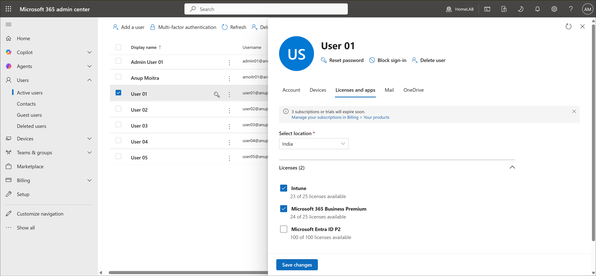
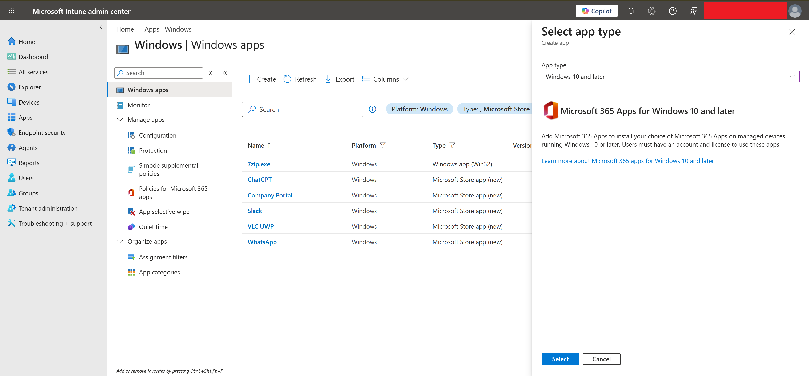
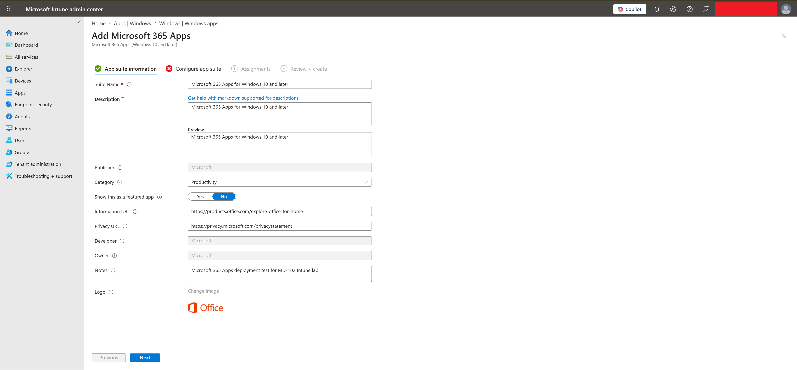
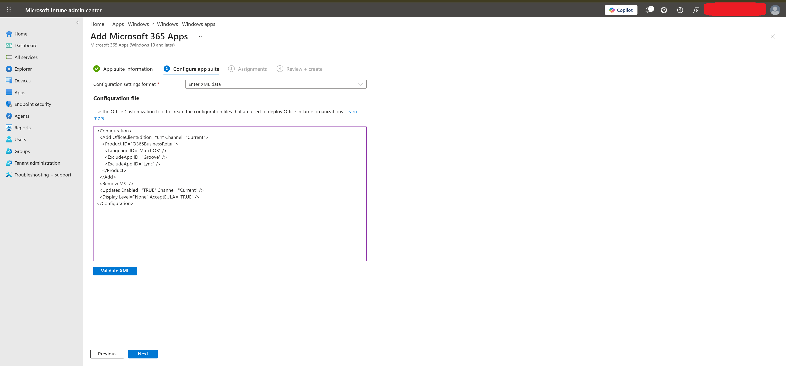
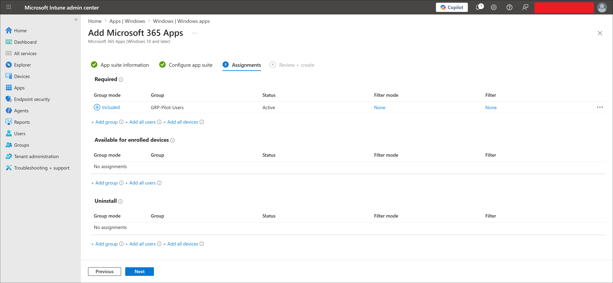
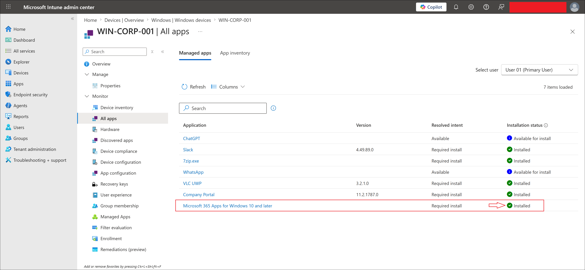
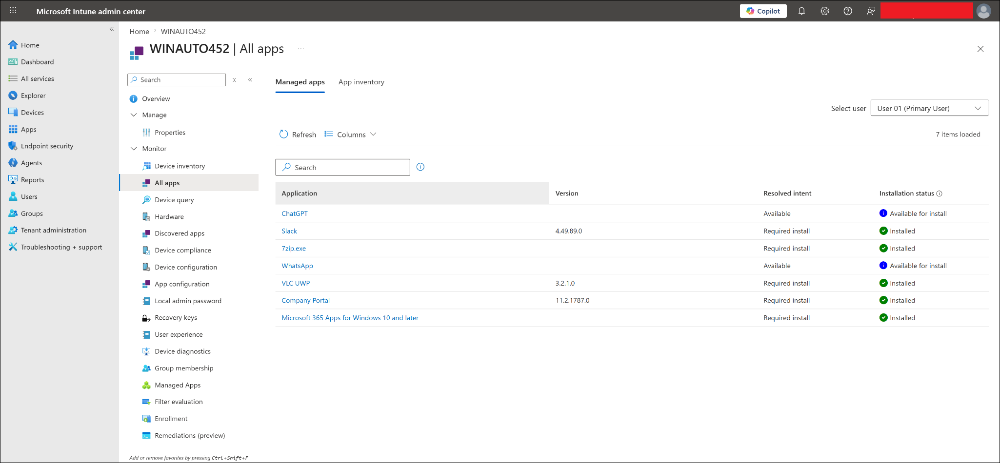
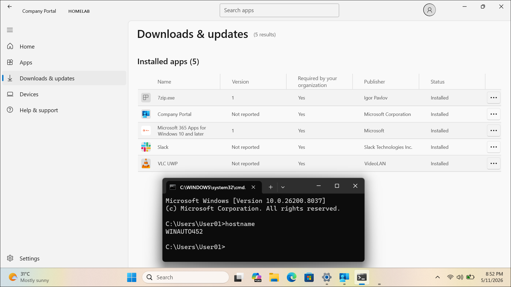

# Microsoft 365 Apps Deployment

## Lab Status

| Field | Value |
|---|---|
| Status | Completed |
| Lab category | Application deployment |
| Platform | Windows 11 |
| App type | Microsoft 365 Apps |
| Assignment type | Required |
| Assignment group | GRP-Pilot-Users |
| Initial test device | WIN-CORP-001 |
| Autopilot validation device | WINAUTO452 |
| Test user | user01 |
| Result | Microsoft 365 Apps installed and validated after Autopilot enrollment |

---

## Lab Objective

Deploy Microsoft 365 Apps to managed Windows devices using Microsoft Intune and validate that the apps install automatically — first on an existing managed device, then after Windows Autopilot enrollment on WINAUTO452.

---

## Why This Lab Matters

In most organizations, users need Microsoft 365 Apps the moment they turn on a new laptop. When combined with Autopilot, Intune can deliver a fully configured, app-ready device without IT touching it:

```text
Device goes through Autopilot
-> Enrolls into Intune
-> Required apps install automatically
-> User opens Word, Excel, Outlook, or Teams
```

---

## Prerequisites

- user01 created, licensed, and in GRP-Pilot-Users
- WIN-CORP-001 enrolled in Intune
- Autopilot lab completed (WINAUTO452 registered)
- user01 assigned Microsoft 365 Business Premium license

---

## App Deployment Configuration

| Setting | Value |
|---|---|
| App type | Microsoft 365 Apps — Windows 10 and later |
| Configuration format | XML data |
| Product ID | O365BusinessRetail |
| Architecture | 64-bit |
| Update channel | Current Channel |
| Remove old MSI versions | Enabled via XML |
| Assignment | Required — GRP-Pilot-Users |

---

## Configuration Flow

```text
Confirm user01 Microsoft 365 license
-> Create Microsoft 365 Apps deployment in Intune
-> Configure app suite using XML
-> Assign as Required to GRP-Pilot-Users
-> Verify required install intent on WIN-CORP-001
-> Confirm Installed status
-> Validate after Autopilot enrollment on WINAUTO452
```

---

## Steps Performed

### Step 1 — Confirmed user01 license

Verified in Microsoft 365 admin center that user01 had both an Intune-capable license and Microsoft 365 Business Premium assigned.



---

### Step 2 — Created the Microsoft 365 Apps deployment

Navigated to:

```text
Apps -> Windows -> Windows apps -> Create
```

Selected app type: `Microsoft 365 Apps — Windows 10 and later`. Configured the app suite name and selected XML as the configuration format.





---

### Step 3 — Configured the app suite using XML

```xml
<Configuration>
  <Add OfficeClientEdition="64" Channel="Current">
    <Product ID="O365BusinessRetail">
      <Language ID="MatchOS" />
      <ExcludeApp ID="Groove" />
      <ExcludeApp ID="Lync" />
    </Product>
  </Add>
  <RemoveMSI />
  <Updates Enabled="TRUE" Channel="Current" />
  <Display Level="None" AcceptEULA="TRUE" />
</Configuration>
```

| XML setting | Meaning |
|---|---|
| `OfficeClientEdition="64"` | Installs 64-bit Microsoft 365 Apps |
| `Channel="Current"` | Uses Current Channel for updates |
| `Product ID="O365BusinessRetail"` | Microsoft 365 Apps for business |
| `Language ID="MatchOS"` | Matches the Windows device language |
| `ExcludeApp ID="Groove"` | Excludes old OneDrive for Business sync client |
| `ExcludeApp ID="Lync"` | Excludes Skype for Business |
| `<RemoveMSI />` | Removes any existing MSI-based Office installations |
| `AcceptEULA="TRUE"` | Accepts the license agreement silently |



---

### Step 4 — Assigned as Required and created

Assigned the app as Required to `GRP-Pilot-Users` and created the deployment.



---

### Step 5 — Verified installation on WIN-CORP-001

The device managed apps view for WIN-CORP-001 initially showed:

```text
Resolved intent: Required install
Installation status: Waiting for install status
```

After manual sync and processing time, the status updated to:

```text
Installation status: Installed
```




---

### Step 6 — Validated after Autopilot enrollment on WINAUTO452

After the Autopilot lab completed, WINAUTO452 was reviewed in Intune. The managed apps view showed Microsoft 365 Apps installed alongside other required app assignments. Company Portal confirmed installed required apps after Autopilot provisioning.





---

## Final Test Result

| Validation item | Result |
|---|---|
| user01 license confirmed | Completed |
| Microsoft 365 Apps deployment created with XML | Completed |
| App assigned as Required to GRP-Pilot-Users | Completed |
| Required install intent reached WIN-CORP-001 | Completed |
| Status changed from Waiting to Installed | Completed |
| Microsoft 365 Apps installed after Autopilot on WINAUTO452 | Completed |
| Company Portal showed installed apps after Autopilot | Completed |

---

## Troubleshooting Notes

**Deployment showed Waiting or Failed before eventually showing Installed** — this is normal behaviour during Microsoft 365 Apps installation. The Office installer runs in the background and can take significant time to complete and report back to Intune. Keep the device powered on with internet access, perform a manual sync, and wait before rechecking the managed apps view. Do not force-reinstall until sufficient time has passed.

**App not installing** — confirm the app is assigned as Required, user01 is in `GRP-Pilot-Users`, user01 has a Microsoft 365 Business Premium license, and the device is enrolled in Intune. Trigger a manual sync and restart the device if needed.

**Office apps install but activation fails** — confirm user01 has the correct license, the device has internet access, and the user signs in with the correct work account inside the Office app. Check for conflicting existing Office installations.

**App shows Failed with unknown details** — confirm no Office apps are open on the endpoint, check for old MSI-based Office installations (the `<RemoveMSI />` XML setting handles this automatically), and verify the device can reach Microsoft Office CDN. Review Intune Management Extension logs at:

```text
C:\ProgramData\Microsoft\IntuneManagementExtension\Logs\IntuneManagementExtension.log
```

---

## Enterprise Reflection

Microsoft 365 Apps deployment is most effective when validated at two points: first on an existing managed device to confirm the assignment and XML work correctly, then after Autopilot enrollment to confirm the app arrives automatically during provisioning.

| Area | Recommendation |
|---|---|
| Licensing | Confirm users have valid Microsoft 365 Apps licenses before deploying |
| XML configuration | Use XML for consistent app selection and channel control |
| Architecture | Use 64-bit unless a compatibility reason requires 32-bit |
| Pilot rollout | Validate on pilot users before expanding to production |
| RemoveMSI | Include when devices may have old MSI-based Office versions |
| Reporting | Allow significant time for installation status to update in Intune |

---

## Related Labs

| Lab | Relationship |
|---|---|
| `01-identity-and-groups/users-and-groups.md` | Provides user01 and GRP-Pilot-Users |
| `02-device-enrollment/windows-autopilot-user-driven-enrollment.md` | Validates Microsoft 365 Apps install after Autopilot enrollment |

---

## Key Learning Outcomes

- How to configure Microsoft 365 Apps deployment in Intune using XML
- What each key XML element controls (Product ID, channel, architecture, RemoveMSI)
- Why deployment status shows Waiting before Installed and how long to wait
- How to validate app delivery both on an existing managed device and after Autopilot enrollment
