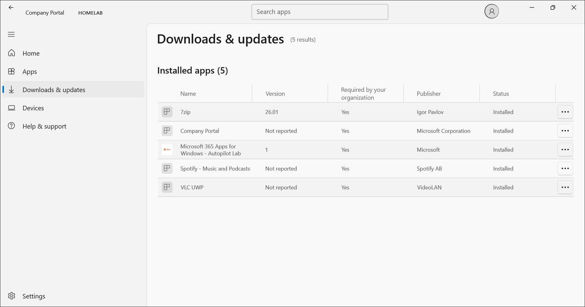
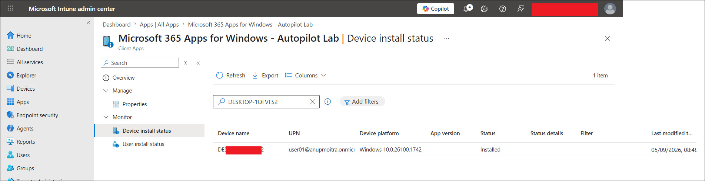
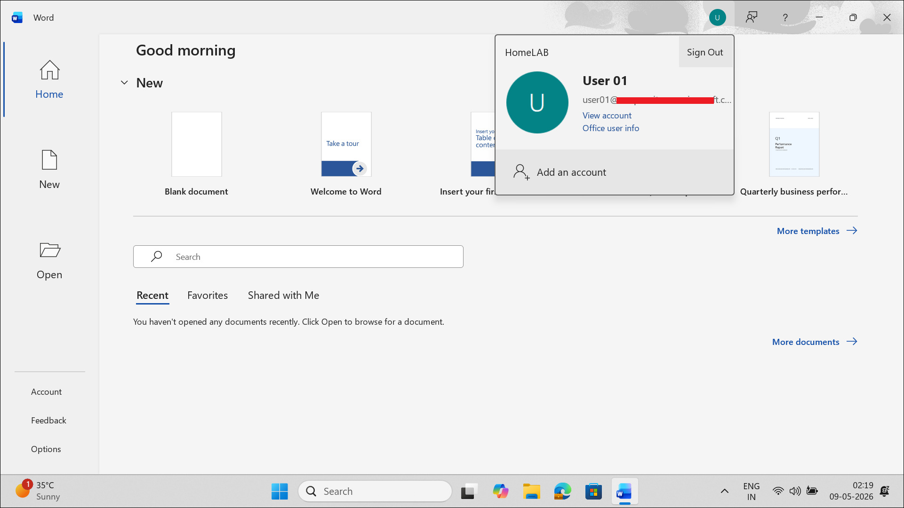

# Microsoft 365 Apps Deployment for Autopilot Lab

This file documents the Microsoft 365 Apps deployment created in Microsoft Intune for the Windows Autopilot lab.

## Objective

The objective of this lab is to deploy selected Microsoft 365 Apps to a Windows device after Windows Autopilot enrollment.

This lab validates that:

- A Microsoft 365 license can be assigned to a lab user.
- Microsoft 365 Apps can be created as an Intune app deployment.
- Selected Office apps can be assigned as required apps.
- The app deployment can support an Autopilot provisioning scenario.
- Word, Excel, and PowerPoint can be installed on an Autopilot-enrolled Windows device.
- Word can be opened and signed in with User 01 after deployment.

## Lab Context

This lab is part of the MD-102 Intune virtual company project.

The project is testing a modern endpoint management flow:

```text
Windows Autopilot
→ Microsoft Entra join
→ Intune enrollment
→ Policy assignment
→ App deployment
→ User productivity app sign-in test
```

This app deployment is connected to the Autopilot lab because the user signs in during OOBE, the device enrolls into Intune, and assigned apps can then install automatically.

Related Autopilot enrollment lab:

```text
02-device-enrollment/windows-autopilot-user-driven-enrollment.md
```

## Why This Lab Matters

In real organizations, newly provisioned corporate Windows laptops usually need productivity applications installed automatically.

Common required apps include:

- Word
- Excel
- PowerPoint
- Outlook
- Teams
- OneDrive
- Company Portal
- Security tools
- VPN clients
- Business applications

For this lab, the focus is on Microsoft 365 Apps because Microsoft Intune can deploy Office applications automatically to managed Windows devices after enrollment.

## Licensing Preparation

A Microsoft 365 Business Premium trial was activated for the lab tenant.

The license was assigned to:

```text
User 01
```

The purpose of this license is to allow User 01 to use Microsoft 365 desktop apps and test sign-in/activation after Autopilot provisioning.

## License Details

| Item | Value |
|---|---|
| License product | Microsoft 365 Business Premium |
| Assigned user | User 01 |
| Purpose | Enable Microsoft 365 Apps and productivity app testing |
| Apps selected for this lab | Word, Excel, PowerPoint |
| Related lab | Windows Autopilot user-driven enrollment |

## App Deployment Details

| Setting | Value |
|---|---|
| App name | Microsoft 365 Apps for Windows - Autopilot Lab |
| App type | Microsoft 365 Apps |
| Platform | Windows 10 and later |
| Publisher | Microsoft |
| Assignment type | Required |
| Target group | GRP-Pilot-Users |
| Test user | User 01 |
| Related device | Autopilot test device |
| Install context | After Autopilot enrollment / during Intune app processing |

## Selected Microsoft 365 Apps

The following Microsoft 365 Apps were selected for this lab:

| App | Purpose |
|---|---|
| Word | Office sign-in and activation validation |
| Excel | Productivity app installation validation |
| PowerPoint | Productivity app installation validation |

> [!NOTE]
> Outlook was not selected in this Microsoft 365 Apps deployment. This lab validates the selected apps: Word, Excel, and PowerPoint.

## App Suite Configuration

| Setting | Value |
|---|---|
| Architecture | 64-bit |
| Default file format | Office Open XML Format |
| Update channel | Current Channel |
| Version to install | Latest |
| Remove other versions | Yes |
| Shared computer activation | No |
| Accept Microsoft Software License Terms | Yes |
| Install background service for Microsoft Search in Bing | No / Not required for this lab |

## Assignment

The app was assigned as a required app.

| Assignment setting | Value |
|---|---|
| Assignment type | Required |
| Target group | GRP-Pilot-Users |
| Reason | User 01 is a member of the pilot users group and is used for Autopilot sign-in testing |

## Why Required Assignment Was Used

A required assignment installs the app automatically for targeted users or devices.

This is useful in Autopilot scenarios because a newly provisioned corporate device should receive required business apps without the user manually installing them.

Simple flow:

```text
User 01 signs in during Autopilot
→ Device enrolls into Intune
→ Intune evaluates required app assignments
→ Microsoft 365 Apps deployment applies
→ Word, Excel, and PowerPoint install or become available
```

## Steps Performed

### Step 1: Activated Microsoft 365 Business Premium Trial

A Microsoft 365 Business Premium trial was activated in the Microsoft 365 admin center.

This added Microsoft 365 Apps licensing capability to the lab tenant.

### Step 2: Assigned License to User 01

The Microsoft 365 Business Premium license was assigned to:

```text
User 01
```

Navigation used:

```text
Microsoft 365 admin center
→ Users
→ Active users
→ User 01
→ Licenses and apps
→ Microsoft 365 Business Premium
→ Save changes
```

### Step 3: Created Microsoft 365 Apps Deployment in Intune

Navigation used:

```text
Intune admin center
→ Apps
→ All apps
→ Add
→ Microsoft 365 Apps
→ Windows 10 and later
```

### Step 4: Configured App Information

The app suite was named:

```text
Microsoft 365 Apps for Windows - Autopilot Lab
```

Description used:

```text
Deploys selected Microsoft 365 Apps to Autopilot-enrolled Windows devices for the MD-102 lab.
```

### Step 5: Selected Office Apps

The following apps were selected:

```text
Word
Excel
PowerPoint
```

### Step 6: Configured App Suite Settings

The following settings were selected:

```text
Architecture: 64-bit
Default file format: Office Open XML Format
Update channel: Current Channel
Version to install: Latest
Remove other versions: Yes
Shared computer activation: No
Accept Microsoft Software License Terms: Yes
```

### Step 7: Assigned the App

The app was assigned as:

```text
Required
```

Target group:

```text
GRP-Pilot-Users
```

### Step 8: Completed Autopilot Enrollment

The Autopilot device was successfully enrolled into Microsoft Intune using User 01.

The device appeared in Intune as a corporate Windows device and showed compliant status.

### Step 9: Verified Microsoft 365 Apps Installation

Microsoft 365 Apps installation was verified from two locations:

```text
Company Portal
→ Downloads & updates
→ Microsoft 365 Apps for Windows - Autopilot Lab
→ Status: Installed
```

and:

```text
Intune admin center
→ Apps
→ All apps
→ Microsoft 365 Apps for Windows - Autopilot Lab
→ Monitor
→ Device install status
→ Status: Installed
```

### Step 10: Verified Word Sign-In

Microsoft Word was opened on the Autopilot-enrolled device.

Word showed User 01 signed in successfully.

## Test Result

| Test item | Result |
|---|---|
| Microsoft 365 Business Premium trial activated | Successful |
| License assigned to User 01 | Successful |
| Microsoft 365 Apps deployment created | Successful |
| Word selected | Successful |
| Excel selected | Successful |
| PowerPoint selected | Successful |
| App assigned as Required to GRP-Pilot-Users | Successful |
| Autopilot OOBE sign-in completed | Successful |
| Device enrolled into Intune | Successful |
| Microsoft 365 Apps install status in Intune | Installed |
| Microsoft 365 Apps shown in Company Portal | Installed |
| Word sign-in with User 01 | Successful |
| Excel availability | Installed as part of Microsoft 365 Apps |
| PowerPoint availability | Installed as part of Microsoft 365 Apps |
| Screenshots added | Completed |

## Screenshots

The following sanitized screenshots were captured for this lab.

> [!NOTE]
> Screenshots were sanitized before upload. Tenant names, full email addresses, device names, serial numbers, object IDs, request IDs, correlation IDs, IP addresses, and other sensitive information were hidden.

### Microsoft 365 Apps installed in Company Portal



### Microsoft 365 Apps device install status in Intune



### Word signed in with User 01



## Screenshot Folder Path

Screenshots for this lab are stored in:

```text
screenshots/sanitized/application-deployment/
```

Screenshot filenames:

```text
m365-apps-installed-company-portal-sanitized.jpg
m365-apps-device-install-status-sanitized.jpg
word-user01-signed-in-sanitized.jpg
```

## Troubleshooting Notes

If Microsoft 365 Apps do not install immediately, check the following:

1. Confirm the app is assigned as Required.
2. Confirm User 01 is a member of GRP-Pilot-Users.
3. Confirm User 01 has a Microsoft 365 Business Premium license.
4. Confirm the Autopilot device is enrolled in Intune.
5. Confirm the device has internet access.
6. Check the app install status in Intune.
7. Sync the device from Windows settings.
8. Restart the device if required.
9. Wait for Intune check-in and Office installation processing.

If Word, Excel, or PowerPoint opens but does not activate, check:

1. User 01 license assignment.
2. Office activation status.
3. Internet connectivity.
4. Microsoft 365 service availability.
5. Whether the user is signed in with the correct account.
6. Whether old Office installations exist on the device.

## Security and Privacy Notes

This is a public learning repository.

Do not upload sensitive information, including:

- Full real email addresses
- Tenant IDs
- Device IDs
- Serial numbers
- Autopilot hardware hashes
- Object IDs
- Request IDs
- Correlation IDs
- IP addresses
- Unsanitized screenshots
- Real production company information

## What This Lab Proves

This lab proves that Microsoft Intune can be used to deploy selected Microsoft 365 Apps to a Windows device as part of a modern Autopilot provisioning workflow.

Simple explanation:

```text
Microsoft 365 Business Premium license assigned to User 01
→ Microsoft 365 Apps deployment created in Intune
→ Word, Excel, and PowerPoint selected
→ App assigned as Required to GRP-Pilot-Users
→ User 01 signs in during Autopilot
→ Device enrolls into Intune
→ Microsoft 365 Apps install successfully
→ Word opens and signs in with User 01
```

## Future Troubleshooting Connection

This lab also supports a future troubleshooting scenario.

Planned future scenario:

```text
Autopilot / Intune-managed laptop after motherboard replacement
→ User signs in
→ Microsoft 365 Apps sign-in or activation issue occurs
→ Troubleshoot Entra device identity, Intune enrollment, Autopilot record, TPM, and Office activation
```

This will be documented later as a separate troubleshooting lab.

## Current Lab Status

Completed:

- Microsoft 365 Business Premium trial activated.
- License assigned to User 01.
- Microsoft 365 Apps deployment created in Intune.
- Word, Excel, and PowerPoint selected.
- App assigned as Required to GRP-Pilot-Users.
- Autopilot enrollment completed.
- Microsoft 365 Apps install verified in Intune.
- Microsoft 365 Apps install verified in Company Portal.
- Word sign-in verified with User 01.
- Sanitized screenshots added.

Optional future validation:

- Capture separate Excel open/sign-in screenshot.
- Capture separate PowerPoint open/sign-in screenshot.

## Next Step

The Microsoft 365 Apps deployment for Autopilot lab is complete.

The next recommended lab is to continue with another endpoint security or management task, such as:

```text
06-endpoint-security/windows-firewall-policy.md
```

or:

```text
06-endpoint-security/bitlocker-encryption-policy.md
```
