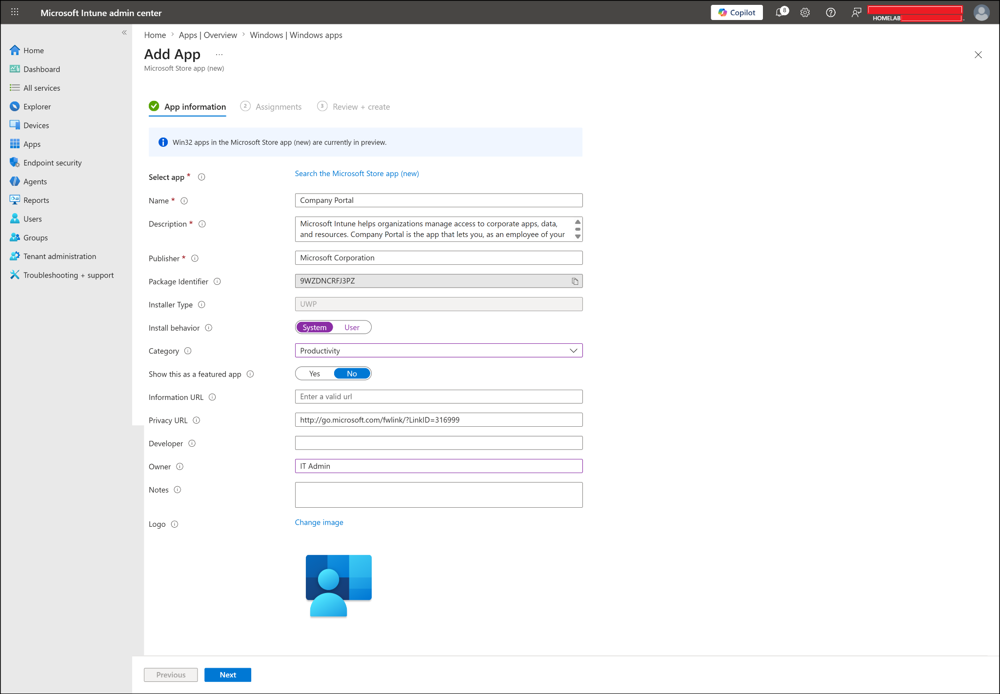
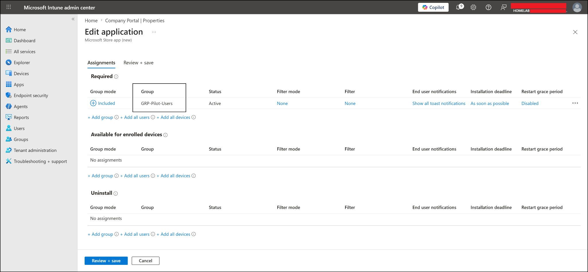
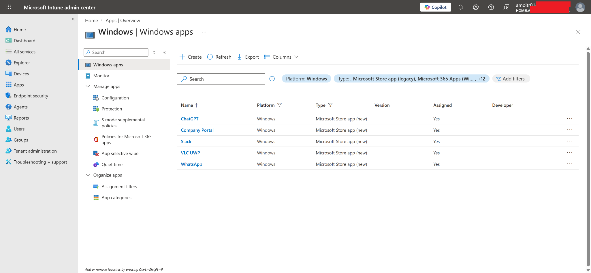
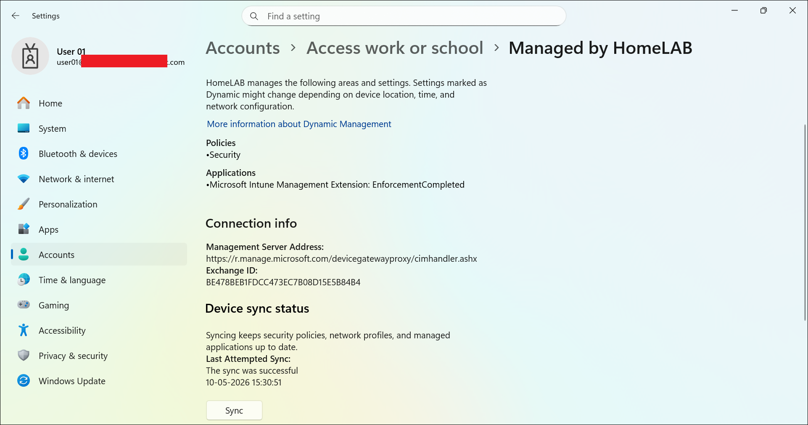
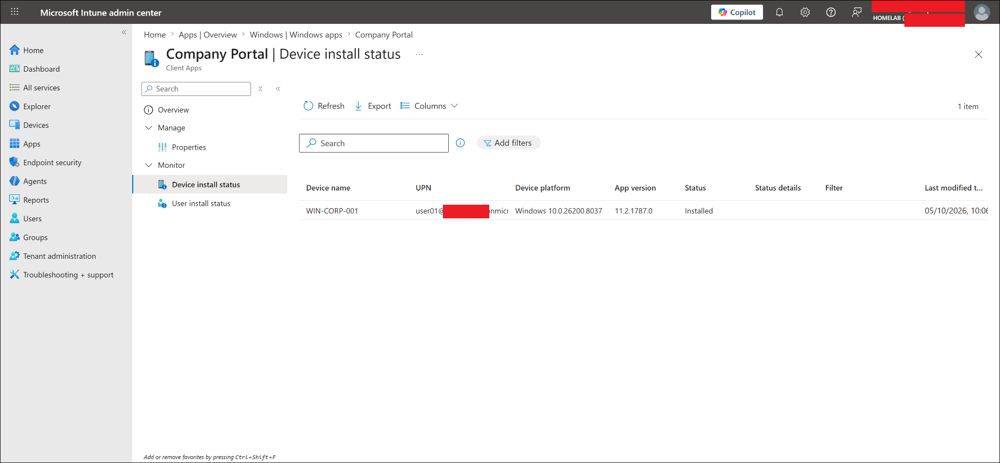
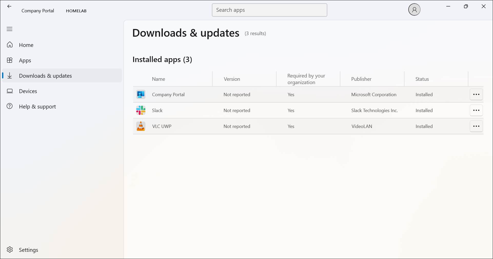
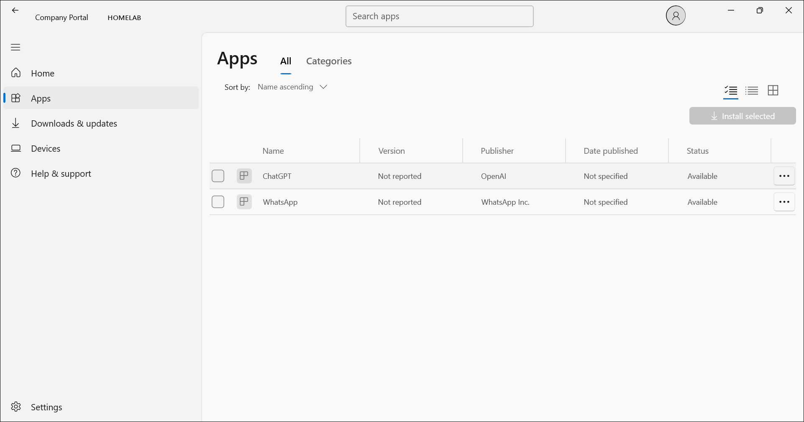

# Microsoft Store App Deployment

## Lab Status

| Field | Value |
|---|---|
| Status | Completed |
| Lab category | Application deployment |
| Platform | Windows 11 |
| App type | Microsoft Store app (new) |
| Test device | WIN-CORP-001 |
| Test user | user01 |
| Assignment group | GRP-Pilot-Users |
| Result | Required apps installed, available apps visible in Company Portal |

---

## Lab Objective

Deploy Microsoft Store apps to a managed Windows device using Intune, using both Required and Available assignments, and validate the difference in behavior between the two.

---

## Why This Lab Matters

Application deployment is a core Intune administrator responsibility. This lab demonstrates two distinct assignment behaviors:

| Assignment type | Behavior |
|---|---|
| Required | Intune installs the app automatically for the targeted users or devices |
| Available for enrolled devices | App appears in Company Portal — the user chooses whether to install it |

---

## Prerequisites

- user01 created, licensed, and in GRP-Pilot-Users
- WIN-CORP-001 enrolled in Intune and able to sync

---

## App Deployment Design

### Required Apps

| App | Publisher | Install behavior | Result |
|---|---|---|---|
| Company Portal | Microsoft Corporation | System | Installed |
| VLC UWP | VideoLAN | System | Installed |
| Slack | Slack Technologies | System | Installed |

### Available Apps

| App | Publisher | Install behavior | Result |
|---|---|---|---|
| ChatGPT | OpenAI | User | Visible in Company Portal |
| WhatsApp | WhatsApp Inc. | System | Visible in Company Portal |

---

## Configuration Flow

```text
Create Microsoft Store apps in Intune
-> Assign required apps to GRP-Pilot-Users
-> Assign available apps to GRP-Pilot-Users
-> Sync WIN-CORP-001
-> Verify required app install status in Intune
-> Verify required and available apps in Company Portal
```

---

## Steps Performed

### Step 1 — Created all Store apps in Intune

Navigated to:

```text
Apps -> Windows -> Windows apps -> Create -> Microsoft Store app (new)
```

Used the Microsoft Store search to find and create each app. All apps were assigned to `GRP-Pilot-Users` — required apps with Required assignment type, available apps with Available for enrolled devices assignment type.







---

### Step 2 — Synced WIN-CORP-001

Triggered a manual sync from:

```text
Settings -> Accounts -> Access work or school -> Info -> Sync
```



---

### Step 3 — Verified Company Portal install status in Intune

Checked install status from:

```text
Apps -> Windows -> Company Portal -> Monitor -> Device install status
```

| Device | Status |
|---|---|
| WIN-CORP-001 | Installed |



---

### Step 4 — Verified apps in Company Portal on the endpoint

Opened Company Portal on WIN-CORP-001.

**Required apps** — visible under Downloads & updates as installed:
- Company Portal
- VLC UWP
- Slack

**Available apps** — visible under Apps with an install option:
- ChatGPT
- WhatsApp





---

## Final Test Result

| Validation item | Result |
|---|---|
| All five Store apps created in Intune | Completed |
| Required apps assigned to GRP-Pilot-Users | Completed |
| Available apps assigned to GRP-Pilot-Users | Completed |
| WIN-CORP-001 synced | Completed |
| Company Portal install status showed Installed | Completed |
| Required apps visible as installed in Company Portal | Completed |
| Available apps visible with install option in Company Portal | Completed |

---

## Troubleshooting Notes

**Available app shows no device install status** — this is expected. Available apps have no install status until the user clicks Install in Company Portal. A device install status of 0 items for an available app is normal behavior, not a failure.

**Required apps not installing** — confirm the app is assigned as Required, user01 is in `GRP-Pilot-Users`, the device has internet access, and a manual sync has been triggered. Check the app device install status in Intune and allow time for reporting to update.

**Available apps not appearing in Company Portal** — confirm the assignment is Available for enrolled devices (not Required), the assignment group is `GRP-Pilot-Users`, and the user signed into Company Portal is user01. Sync the device and close/reopen Company Portal.

**App accidentally assigned as Required instead of Available** — open the app in Intune, go to Properties → Assignments → Edit, remove the group from Required, and add it under Available for enrolled devices. Note that changing from Required to Available does not automatically uninstall the app. To remove it, configure a separate Uninstall assignment.

---

## Enterprise Reflection

Microsoft Store app (new) is useful for common apps that don't require custom packaging. Key deployment decisions:

| Scenario | Assignment |
|---|---|
| Required company app | Required |
| Self-service productivity app | Available for enrolled devices |
| App no longer approved | Uninstall |

Always validate on a pilot group first. Also confirm whether user or system install behavior is appropriate for each app — user install requires the user to be signed in, system install runs regardless of who is logged in.

---

## Related Labs

| Lab | Relationship |
|---|---|
| `01-identity-and-groups/users-and-groups.md` | Provides user01 and GRP-Pilot-Users |
| `05-application-deployment/win32-app-deployment-7zip.md` | Next app deployment lab using Win32 packaging |
| `05-application-deployment/microsoft-365-apps-autopilot-deployment.md` | Next app deployment lab using Microsoft 365 Apps |

---

## Key Learning Outcomes

- How Required and Available app assignments differ in behavior and Company Portal presentation
- How to create Microsoft Store app (new) deployments in Intune
- Why available apps show no device install status until the user initiates installation
- How to correct an accidental Required assignment without removing the app from endpoints
