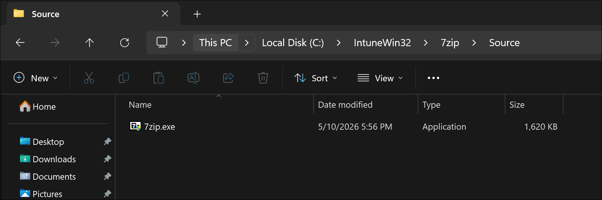
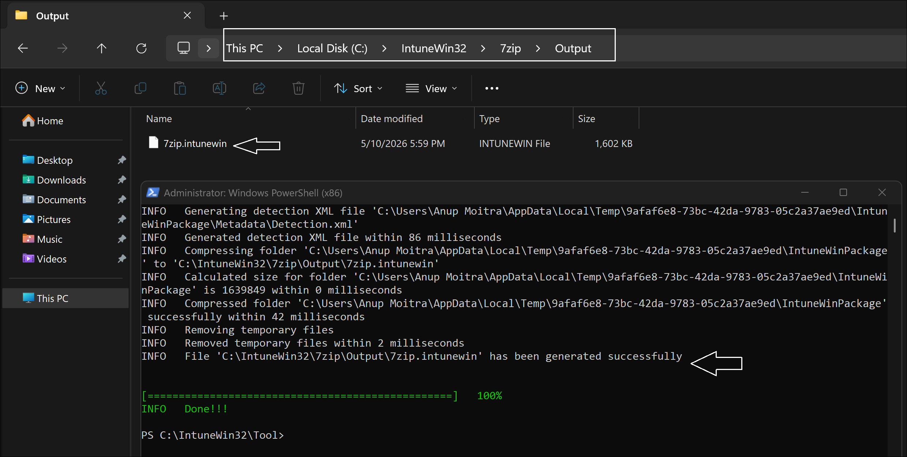
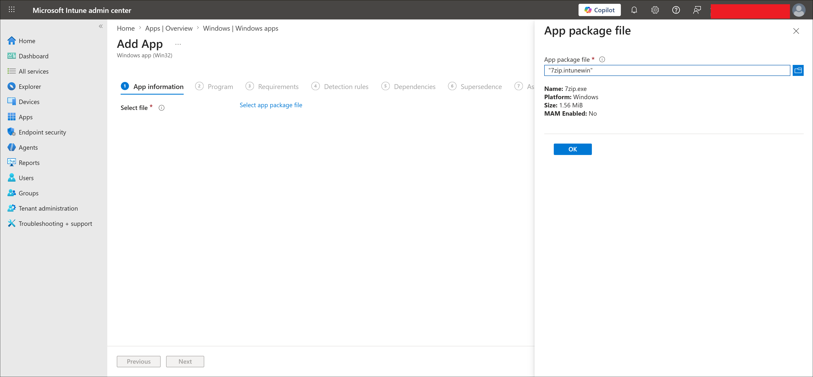
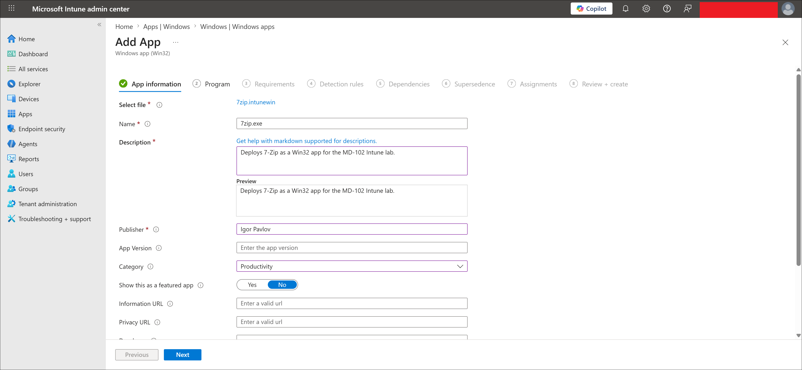
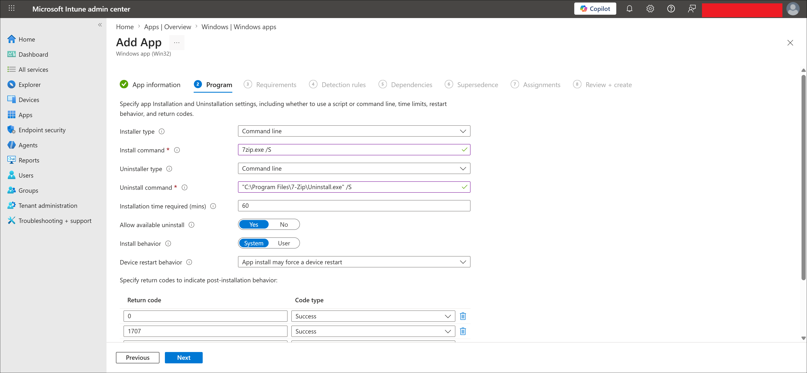
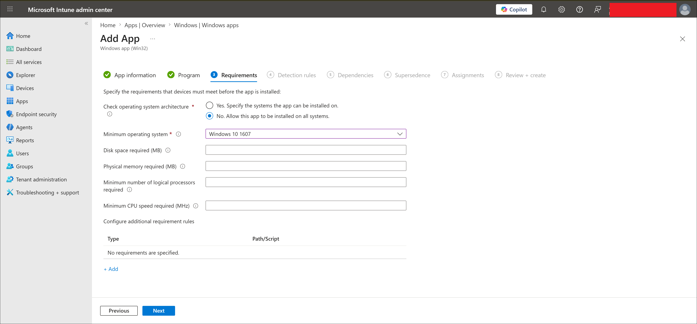
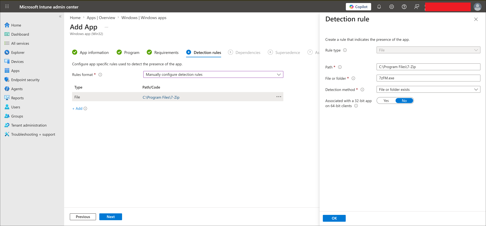
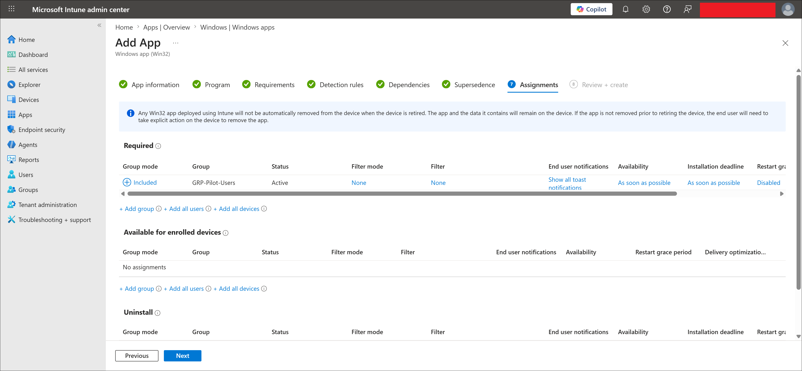
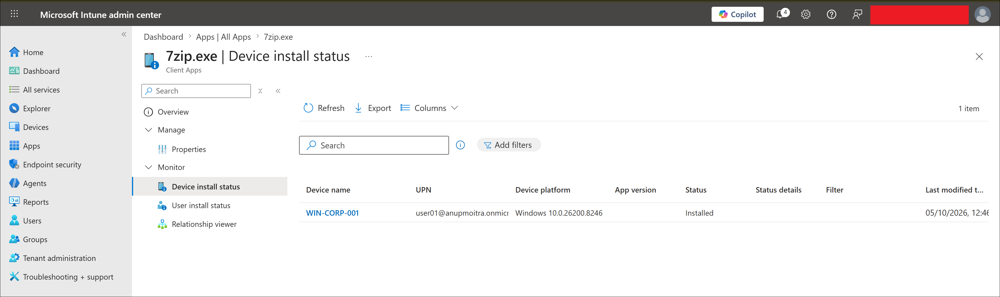

# Win32 App Deployment — 7-Zip

## Lab Status

| Field | Value |
|---|---|
| Status | Completed |
| Lab category | Application deployment |
| Platform | Windows 11 |
| App type | Windows app (Win32) |
| Package format | .intunewin |
| App deployed | 7-Zip |
| Test device | WIN-CORP-001 |
| Test user | user01 |
| Assignment group | GRP-Pilot-Users |
| Assignment type | Required |
| Result | 7-Zip installed successfully on WIN-CORP-001 |

---

## Lab Objective

Package a 7-Zip EXE installer as a `.intunewin` Win32 app, deploy it through Microsoft Intune with silent install/uninstall commands and a file-based detection rule, and validate installation on the managed Windows endpoint.

---

## Why This Lab Matters

Many business applications are delivered as traditional `.exe` or `.msi` installers — not available through the Microsoft Store. Win32 app deployment is the standard Intune method for these apps, giving administrators full control over install commands, detection rules, requirements, and restart behavior.

---

## Prerequisites

- user01 created, licensed, and in GRP-Pilot-Users
- WIN-CORP-001 enrolled in Intune
- 7-Zip Windows x64 EXE installer downloaded
- Microsoft Win32 Content Prep Tool downloaded

---

## App Packaging Design

| Item | Value |
|---|---|
| Application | 7-Zip |
| Installer type | EXE |
| Renamed installer | 7zip.exe |
| Architecture | x64 |
| Publisher | Igor Pavlov |
| Source folder | `C:\IntuneWin32\7zip\Source` |
| Output folder | `C:\IntuneWin32\7zip\Output` |
| Tool folder | `C:\IntuneWin32\Tool` |
| Packaged file | 7zip.intunewin |

Win32 apps cannot be uploaded as raw `.exe` files — they must first be packaged using the Microsoft Win32 Content Prep Tool.

---

## Configuration Flow

```text
Rename installer to 7zip.exe and place in source folder
-> Package with Win32 Content Prep Tool
-> Create Windows app (Win32) in Intune
-> Upload 7zip.intunewin
-> Configure app info, commands, requirements, detection rule
-> Assign as Required to GRP-Pilot-Users
-> Sync WIN-CORP-001
-> Verify install status in Intune
-> Verify 7-Zip installed on endpoint
```

---

## Steps Performed

### Step 1 — Prepared and packaged the installer

Placed the renamed `7zip.exe` installer in `C:\IntuneWin32\7zip\Source`. Ran the Win32 Content Prep Tool:

```cmd
IntuneWinAppUtil.exe -c "C:\IntuneWin32\7zip\Source" -s "7zip.exe" -o "C:\IntuneWin32\7zip\Output" -q
```

Output package created:

```text
C:\IntuneWin32\7zip\Output\7zip.intunewin
```





---

### Step 2 — Created the Win32 app and uploaded the package

Navigated to:

```text
Apps -> Windows -> Windows apps -> Create -> Windows app (Win32)
```

Uploaded `7zip.intunewin` and configured app information:

| Setting | Value |
|---|---|
| Name | 7-Zip |
| Publisher | Igor Pavlov |
| Install behavior | System |





---

### Step 3 — Configured program commands

| Setting | Value |
|---|---|
| Install command | `7zip.exe /S` |
| Uninstall command | `"C:\Program Files\7-Zip\Uninstall.exe" /S` |
| Install behavior | System |
| Device restart behavior | No specific action |

> [!IMPORTANT]
> The `/S` silent install switch is case-sensitive for the 7-Zip installer. Use uppercase `/S`.



---

### Step 4 — Configured requirements

| Setting | Value |
|---|---|
| Operating system architecture | 64-bit |
| Minimum operating system | Windows 10 1607 or later |



---

### Step 5 — Configured detection rule

A file-based detection rule was used to confirm installation.

| Setting | Value |
|---|---|
| Rule type | File |
| Path | `C:\Program Files\7-Zip` |
| File or folder | `7zFM.exe` |
| Detection method | File or folder exists |
| 32-bit app on 64-bit clients | No |



---

### Step 6 — Assigned and verified

Assigned the app as Required to `GRP-Pilot-Users`. After WIN-CORP-001 synced with Intune, verified the install status and confirmed 7-Zip was installed locally at `C:\Program Files\7-Zip\7zFM.exe`.





---

## Final Test Result

| Validation item | Result |
|---|---|
| 7zip.intunewin package created | Completed |
| Win32 app uploaded to Intune | Completed |
| Install and uninstall commands configured | Completed |
| Requirements configured | Completed |
| File-based detection rule configured | Completed |
| App assigned as Required to GRP-Pilot-Users | Completed |
| Intune device install status verified | Completed |
| 7-Zip installed on WIN-CORP-001 | Completed |

---

## Troubleshooting Notes

**App not installing** — confirm the app is assigned as Required, user01 is in `GRP-Pilot-Users`, and the device has synced with Intune. Verify the install command is `7zip.exe /S` with uppercase `/S`. Check the detection rule points to `C:\Program Files\7-Zip\7zFM.exe`. Review Intune Management Extension logs at:

```text
C:\ProgramData\Microsoft\IntuneManagementExtension\Logs\IntuneManagementExtension.log
```

**App installs but Intune reports failure** — confirm `7zFM.exe` exists at the configured detection path. Verify the detection rule is not configured as a 32-bit app on 64-bit clients. If 7-Zip installed to a different path, update the detection rule to match.

**Silent install runs interactively** — confirm the install command uses uppercase `/S`. Test the silent install locally before packaging. Repackage if the source file name changes.

**Package upload fails** — confirm the file extension is `.intunewin` and the source folder was not modified after packaging. Recreate the package if needed.

---

## Enterprise Reflection

Win32 app deployment is one of the most important Intune skills because most line-of-business applications require it. Key production considerations:

| Area | Recommendation |
|---|---|
| Source folder | Keep a clean source folder per app and version |
| Installer naming | Use consistent, descriptive names |
| Silent install command | Test locally before packaging |
| Detection rule | Use reliable file, registry, or MSI-based detection |
| Assignment | Pilot group first, then expand |
| Logs | Use IME logs for any deployment that fails or behaves unexpectedly |

---

## Key Learning Outcomes

- How to package an EXE installer as `.intunewin` using the Win32 Content Prep Tool
- How to configure silent install/uninstall commands and why `/S` case sensitivity matters for 7-Zip
- How file-based detection rules tell Intune whether an app is installed
- How the Intune Management Extension processes Win32 app deployments and where to find its logs
- Why Win32 deployment is necessary for applications not available in the Microsoft Store
