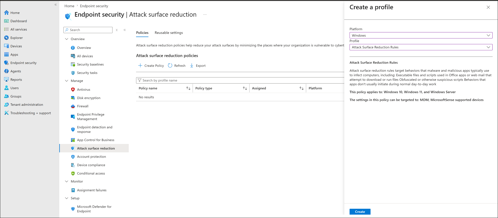
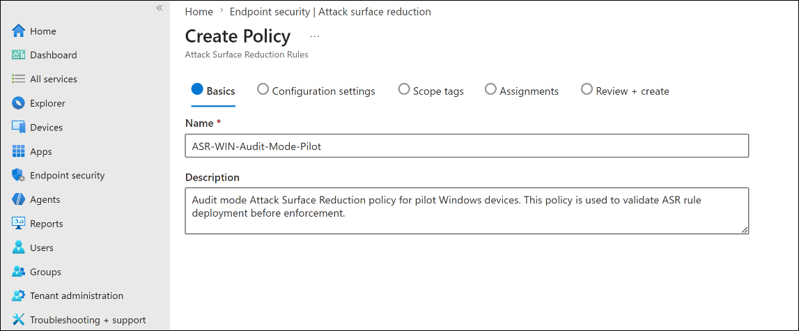
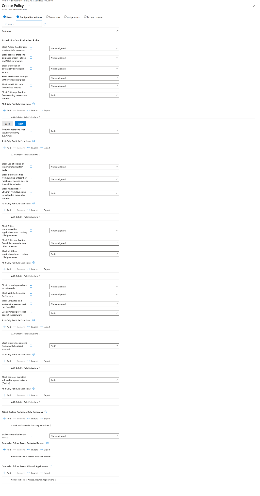
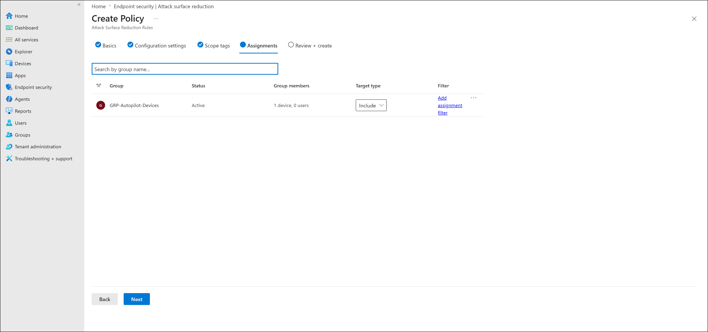
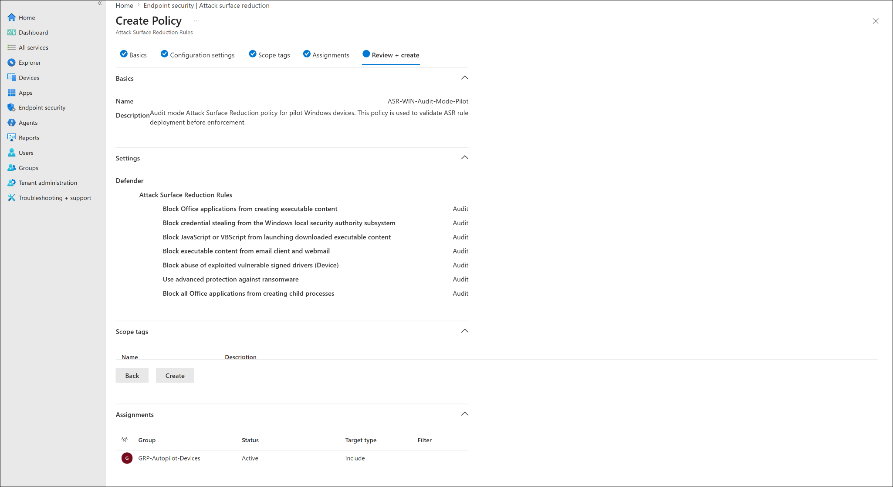
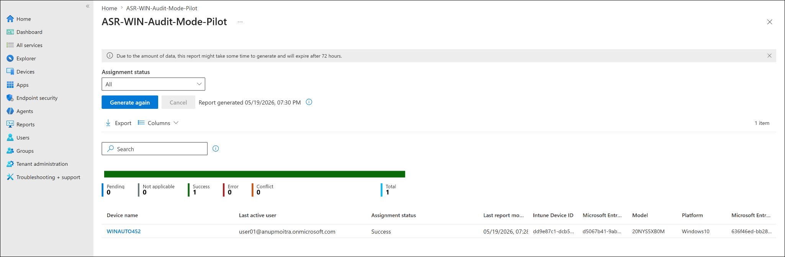
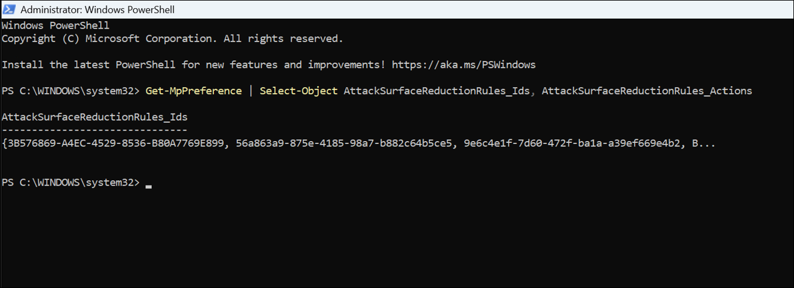

# Attack Surface Reduction Policy

## Lab Status

| Field | Value |
|---|---|
| Status | Completed |
| Lab category | Endpoint security |
| Policy name | ASR-WIN-Audit-Mode-Pilot |
| Policy type | Attack Surface Reduction Rules |
| Platform | Windows |
| Deployment mode | Audit |
| Assignment group | GRP-Autopilot-Devices |
| Test device | WINAUTO452 |
| Validation method | Intune device status and PowerShell |

---

## Lab Objective

Create an Attack Surface Reduction policy in Audit mode, assign it to the pilot device group, verify successful deployment in Intune, and validate ASR rule configuration locally on the endpoint using PowerShell.

---

## Why This Lab Matters

ASR rules reduce common attacker and malware behaviors on Windows endpoints. Audit mode is the safe first step — it records what the rules *would* have blocked without disrupting users or systems, giving administrators time to review impact before moving to Block or Warn mode.

---

## Prerequisites

- WINAUTO452 enrolled in Intune and member of GRP-Autopilot-Devices
- Microsoft Defender Antivirus active on the endpoint
- Endpoint security policy permissions available in Intune

---

## ASR Rules Configured

All rules were set to **Audit** mode.

| ASR Rule | Mode |
|---|---|
| Block Office applications from creating executable content | Audit |
| Block credential stealing from the Windows local security authority subsystem | Audit |
| Block JavaScript or VBScript from launching downloaded executable content | Audit |
| Block executable content from email client and webmail | Audit |
| Block abuse of exploited vulnerable signed drivers | Audit |
| Use advanced protection against ransomware | Audit |
| Block all Office applications from creating child processes | Audit |

---

## Configuration Flow

```text
Create ASR policy in Endpoint security
-> Configure ASR rules in Audit mode
-> Assign to GRP-Autopilot-Devices
-> Verify device status in Intune
-> Validate ASR rule configuration on endpoint with PowerShell
```

---

## Steps Performed

### Step 1 — Created and configured the ASR policy

Navigated to:

```text
Endpoint security -> Attack surface reduction -> Create Policy
```

Selected Windows platform and Attack Surface Reduction Rules profile. Named the policy `ASR-WIN-Audit-Mode-Pilot` and configured the rules in the table above, all set to Audit mode.







---

### Step 2 — Assigned and created the policy

Assigned to `GRP-Autopilot-Devices` and created the policy.





---

### Step 3 — Verified policy deployment status

After device check-in, the Intune device status report showed:

| Device | Assignment status |
|---|---|
| WINAUTO452 | Success |



---

### Step 4 — Validated ASR rules on the endpoint

On WINAUTO452, opened PowerShell as administrator and ran:

```powershell
Get-MpPreference | Select-Object AttackSurfaceReductionRules_Ids, AttackSurfaceReductionRules_Actions
```

The output showed ASR rule IDs and corresponding action values, confirming the rules were applied on the endpoint.



---

## Final Test Result

| Validation item | Result |
|---|---|
| ASR policy created in Intune | Completed |
| ASR rules configured in Audit mode | Completed |
| Policy assigned to GRP-Autopilot-Devices | Completed |
| Device status showed Success | Completed |
| PowerShell confirmed ASR rule IDs on endpoint | Completed |

---

## Troubleshooting Notes

**Policy not applying** — confirm the device is enrolled and a member of `GRP-Autopilot-Devices`, Microsoft Defender Antivirus is the active AV provider, and a manual sync has been triggered. Wait for policy check-in and refresh the device status report.

**PowerShell shows no ASR rule IDs** — confirm the Intune policy status shows Success, run PowerShell as administrator, and sync the device before re-running the command. If output is still empty, restart the device and check again.

**Policy shows Conflict** — check for other ASR policies or Security Baseline settings that configure the same rules differently. Conflicts occur when the same ASR rule ID is set to different values by multiple policies. Keep ASR testing scoped to one group and one policy per pilot phase.

---

## Enterprise Reflection

Audit mode before enforcement is the recommended production approach for ASR rules. ASR rules can affect legitimate applications — particularly Office macros, scripts, and certain line-of-business software. Reviewing audit logs before switching to Block or Warn mode prevents accidental disruption.

When moving toward enforcement, change individual rules incrementally rather than switching all rules to Block at once. This makes it easier to identify which rule is causing issues if users report problems.

---

## Key Learning Outcomes

- How to create an Attack Surface Reduction policy in Microsoft Intune
- Why Audit mode should precede enforcement in any ASR deployment
- How to use `Get-MpPreference` to validate ASR rule IDs and actions locally on a Windows endpoint
- How policy conflicts between ASR policies and Security Baselines can occur and how to identify them
