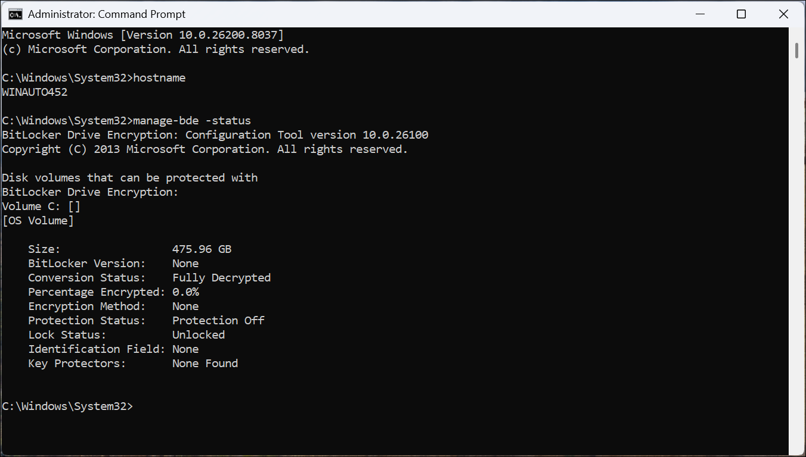
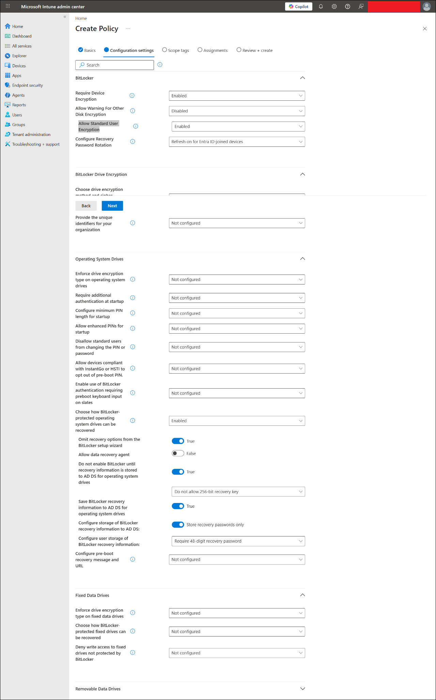
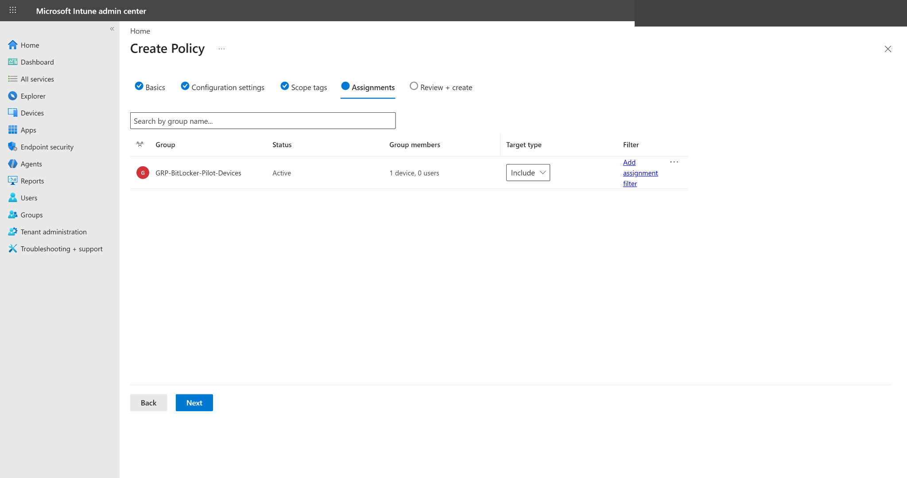
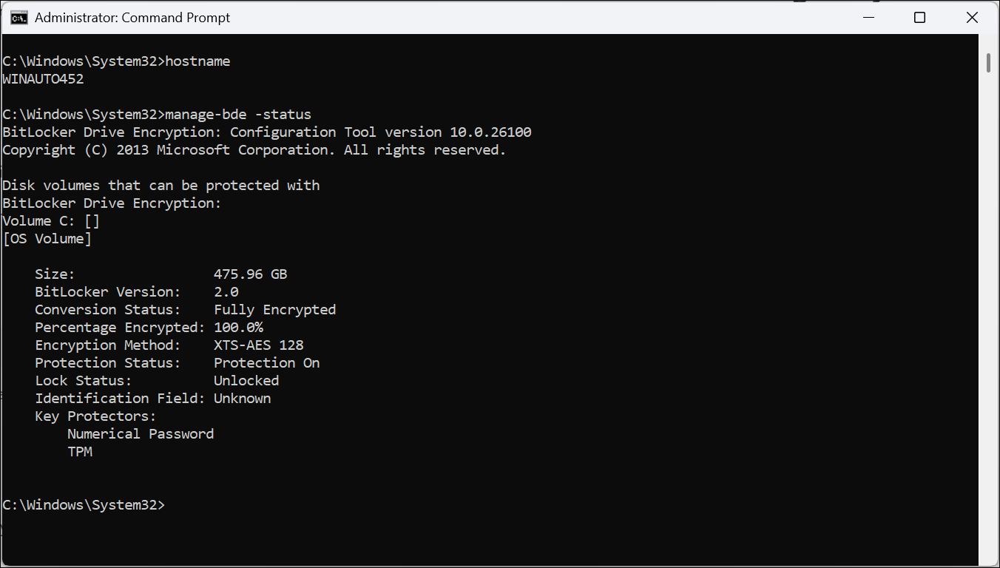

# BitLocker Encryption Policy with Intune

This file documents the BitLocker disk encryption policy lab for the MD-102 Intune virtual company project.

---

## Status

Planned

---

## Objective

Create and test a BitLocker disk encryption policy using Microsoft Intune Endpoint security.

This lab will validate that:

- BitLocker can be configured from Microsoft Intune.
- Disk encryption can be targeted safely to a dedicated pilot device group.
- The Windows operating system drive can be encrypted.
- The device can report BitLocker policy deployment status in Intune.
- Local BitLocker status can be checked using Windows tools.
- BitLocker recovery key handling can be documented safely.

---

## Safety Warning

BitLocker changes disk encryption state.

Use only a lab device where you are comfortable testing encryption.

Do not test this on an important personal or production device.

Before enabling BitLocker, confirm:

```text
Device is a lab device
Device is enrolled in Intune
Device is online
You know how to access recovery key information
You have not uploaded recovery keys to GitHub
```

---

## Lab Context

This lab continues after:

```text
06-endpoint-security/windows-defender-antivirus-policy.md
06-endpoint-security/windows-firewall-policy.md
```

Defender Antivirus and Firewall protect the device from malware and network threats.

BitLocker protects data at rest by encrypting the disk.

Simple security chain:

```text
Defender Antivirus
-> Windows Firewall
-> BitLocker disk encryption
```

---

## Why This Lab Matters

BitLocker is one of the most important Windows security controls for corporate laptops.

If a laptop is lost or stolen, BitLocker helps protect company data by encrypting the disk.

In real environments, Intune administrators often configure BitLocker policies and verify recovery key escrow.

---

## Lab Environment

| Item | Value |
|---|---|
| Test device | `WIN-CORP-001` or a dedicated lab Windows device |
| Operating system | Windows 11 |
| Management platform | Microsoft Intune |
| Identity platform | Microsoft Entra ID |
| Join type | Microsoft Entra joined |
| Policy area | Endpoint security |
| Policy type | Disk encryption |
| Profile | BitLocker |
| Recommended assignment group | `GRP-BitLocker-Pilot-Devices` |
| Assignment type | Device group |
| Screenshot folder | `screenshots/sanitized/endpoint-security/` |

---

## Recommended Pilot Group

Create a dedicated device group for this lab:

```text
GRP-BitLocker-Pilot-Devices
```

Add only one test device first:

```text
WIN-CORP-001
```

or:

```text
WINAUTO452
```

> [!IMPORTANT]
> Do not target BitLocker to a broad user group during first testing. Device-group targeting is safer for encryption labs.

---

## Policy Plan

| Setting | Planned Value |
|---|---|
| Policy name | `WIN-CORP-BitLocker-Encryption-Policy` |
| Platform | Windows |
| Profile | BitLocker |
| Assignment | `GRP-BitLocker-Pilot-Devices` |
| Target device | One lab Windows device only |
| Expected result | Operating system drive encrypted |

---

## Recommended BitLocker Settings

Use a safe beginner lab configuration.

| BitLocker setting | Recommended lab configuration |
|---|---|
| Require device encryption | Enabled |
| Allow warning for other disk encryption | Disabled, if available |
| Allow standard user encryption | Enabled, if available |
| Operating system drive encryption method | XTS-AES 128-bit |
| Fixed data drive encryption method | XTS-AES 128-bit |
| Encryption type for OS drive | Used Space Only |
| Compatible TPM startup | Allowed |
| Startup PIN | Not required for beginner lab |
| Recovery password | Required / enabled |
| Store recovery information in Entra ID / Intune | Enabled, if available |
| Hide recovery options from users | Enabled, if available |

> [!NOTE]
> Setting names can vary slightly depending on Intune policy experience and Windows version.

---

## Hands-On Steps

### Step 1: Check BitLocker Before State

On the test device, open Command Prompt as administrator and run:

```cmd
manage-bde -status
```

Document the before state:

| Item | Before result |
|---|---|
| Conversion status | Pending |
| Percentage encrypted | Pending |
| Protection status | Pending |
| Encryption method | Pending |
| Key protectors | Pending |

### Step 2: Create the Pilot Device Group

Go to:

```text
Microsoft Entra admin center
-> Groups
-> New group
```

Create:

```text
GRP-BitLocker-Pilot-Devices
```

Add only the selected test device.

### Step 3: Open Disk Encryption in Intune

Go to:

```text
Intune admin center
-> Endpoint security
-> Disk encryption
```

### Step 4: Create a BitLocker Policy

Select:

```text
Create Policy
```

Use:

| Option | Value |
|---|---|
| Platform | Windows |
| Profile | BitLocker |

### Step 5: Configure Basics

Use:

```text
Name: WIN-CORP-BitLocker-Encryption-Policy
Description: BitLocker disk encryption policy for MD-102 Intune lab.
```

### Step 6: Configure BitLocker Settings

Configure the recommended BitLocker settings from the table above.

### Step 7: Assign the Policy

Assign to:

```text
GRP-BitLocker-Pilot-Devices
```

### Step 8: Create the Policy

Review and create the policy.

### Step 9: Sync the Device

Sync the device from Windows or from Intune.

### Step 10: Verify Policy Status in Intune

Check:

```text
Endpoint security
-> Disk encryption
-> WIN-CORP-BitLocker-Encryption-Policy
-> Device status
```

Expected result:

```text
Succeeded
```

or:

```text
Pending / In progress
```

while encryption is still processing.

### Step 11: Verify Local BitLocker Status

On the test device, run:

```cmd
manage-bde -status
```

Expected result after completion:

```text
Conversion Status: Fully Encrypted
Protection Status: Protection On
```

### Step 12: Verify Recovery Key Location

From Intune or Entra device record, verify the recovery key is available.

Do not upload recovery key screenshots unless fully sanitized.

---

## Test Result

| Test item | Result |
|---|---|
| Before-state BitLocker status captured | Pending |
| Dedicated BitLocker pilot device group created | Pending |
| BitLocker policy created | Pending |
| BitLocker settings configured | Pending |
| Policy assigned to device group | Pending |
| Device sync completed | Pending |
| Intune policy status checked | Pending |
| Local `manage-bde -status` verified | Pending |
| Recovery key location verified safely | Pending |
| Screenshots captured | Pending |
| Final lab result | Pending |

---

## Screenshots

Screenshots should be stored in:

```text
screenshots/sanitized/endpoint-security/
```

Recommended screenshots:

```text
bitlocker-before-manage-bde-status-sanitized.png
bitlocker-pilot-device-group-sanitized.png
bitlocker-policy-basics-sanitized.png
bitlocker-policy-settings-sanitized.png
bitlocker-policy-assignment-sanitized.png
bitlocker-device-status-sanitized.png
bitlocker-after-manage-bde-status-sanitized.png
bitlocker-recovery-key-location-sanitized.png
```

### BitLocker before-state status



### BitLocker pilot device group


### BitLocker policy settings



### BitLocker policy assignment



### BitLocker device status


### BitLocker after-state status



---

## Troubleshooting Notes

If BitLocker does not start:

1. Confirm the device supports TPM.
2. Confirm the device is Microsoft Entra joined or properly enrolled.
3. Confirm the policy is assigned to the correct device group.
4. Sync the device.
5. Restart the device if required.
6. Check Intune policy status.
7. Run `manage-bde -status` locally.

If BitLocker requires user action:

1. Check whether silent encryption prerequisites are met.
2. Confirm TPM is available and ready.
3. Confirm no third-party disk encryption is present.
4. Confirm recovery key backup/escrow settings.

If recovery key does not appear:

1. Wait for Intune/Entra reporting to update.
2. Sync the device.
3. Restart the device.
4. Check the device record again.
5. Do not proceed with risky testing until recovery key location is understood.

---

## Security and Privacy Notes

Do not upload:

- BitLocker recovery keys
- Full device IDs
- Object IDs
- Serial numbers
- Tenant IDs
- Full UPNs
- Unsanitized screenshots

Before uploading screenshots, hide or blur:

- Recovery key values
- Device IDs
- Object IDs
- Serial numbers
- Full email addresses
- Tenant/domain names
- Top-right signed-in account

---

## Current Lab Status

Planned.

---

## Next Step

After completing this lab, continue to:

```text
06-endpoint-security/attack-surface-reduction-policy.md
```

or:

```text
06-endpoint-security/windows-security-baseline.md
```
