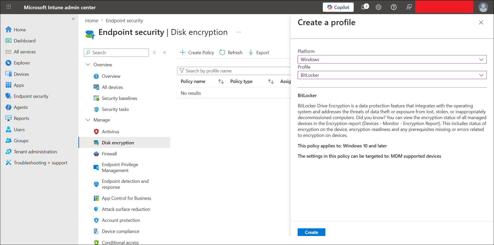
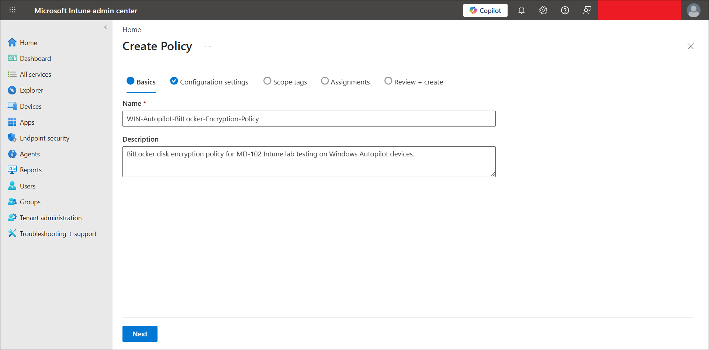
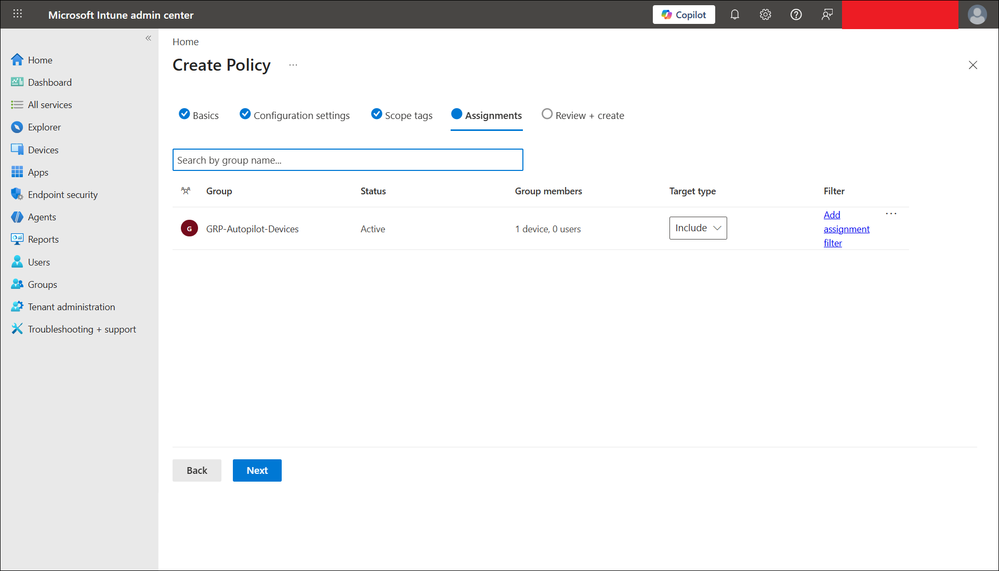
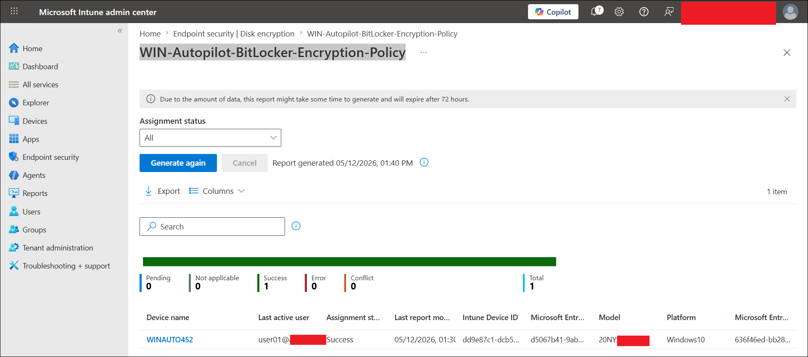

# BitLocker Encryption Policy

This file documents the BitLocker disk encryption policy lab for the MD-102 Intune virtual company project.

---

## Objective

Create, assign, and validate a BitLocker disk encryption policy using Microsoft Intune Endpoint security.

This lab validates that:

- BitLocker can be enabled from Microsoft Intune.
- A disk encryption policy can be assigned to Windows Autopilot devices.
- The Autopilot-enrolled device `WINAUTO452` can receive the BitLocker policy successfully.
- The Windows operating system drive can be encrypted with BitLocker.
- Intune can report successful policy assignment status.
- Local device-side encryption status can be verified using `manage-bde -status`.
- BitLocker protection can use TPM and a numerical recovery password protector.

---

## Lab Environment

| Item | Value |
|---|---|
| Test device | `WINAUTO452` |
| Device source | Windows Autopilot user-driven enrollment |
| Operating system | Windows 11 |
| Management platform | Microsoft Intune |
| Identity platform | Microsoft Entra ID |
| Join type | Microsoft Entra joined |
| Ownership | Corporate |
| Policy area | Endpoint security |
| Policy type | Disk encryption |
| Profile | BitLocker |
| Assignment group | `GRP-Autopilot-Devices` |
| Assignment type | Device group |
| Policy name | `WIN-Autopilot-BitLocker-Encryption-Policy` |
| Screenshot folder | `screenshots/sanitized/endpoint-security/` |

---

## Why the Autopilot Device Group Was Used

This lab targeted the existing Autopilot device group:

```text
GRP-Autopilot-Devices
```

The group contained one Autopilot-enrolled validation device:

```text
WINAUTO452
```

This assignment model proves a realistic enterprise flow:

```text
Windows Autopilot device
-> Microsoft Entra joined
-> Intune managed
-> Endpoint security policies applied
-> BitLocker encryption enabled
```

> [!IMPORTANT]
> BitLocker changes the disk encryption state. In production, do not broadly assign BitLocker until recovery key storage, device readiness, TPM support, and rollback/recovery processes are understood and tested.

---

## Policy Details

| Setting | Value |
|---|---|
| Policy name | `WIN-Autopilot-BitLocker-Encryption-Policy` |
| Platform | Windows |
| Profile | BitLocker |
| Policy location | Endpoint security > Disk encryption |
| Assignment | `GRP-Autopilot-Devices` |
| Validation device | `WINAUTO452` |
| Final Intune assignment result | Success |

---

## Before Policy State

Before the Intune BitLocker policy was applied, local BitLocker status was checked on `WINAUTO452` using Command Prompt as Administrator.

Command used:

```cmd
hostname
manage-bde -status
```

Initial result:

| Item | Before policy result |
|---|---|
| Device name | `WINAUTO452` |
| BitLocker version | None |
| Conversion status | Fully Decrypted |
| Percentage encrypted | 0.0% |
| Encryption method | None |
| Protection status | Protection Off |
| Lock status | Unlocked |
| Key protectors | None Found |

This confirmed that BitLocker was not enabled before the Intune policy was applied.

---

## BitLocker Settings Configured

### General BitLocker settings

| Setting | Configuration |
|---|---|
| Require Device Encryption | Enabled |
| Allow Warning For Other Disk Encryption | Disabled |
| Allow Standard User Encryption | Enabled |
| Configure Recovery Password Rotation | Refresh on for Microsoft Entra ID-joined devices |

### BitLocker drive encryption settings

| Setting | Configuration |
|---|---|
| Choose drive encryption method and cipher strength | Not configured |
| Provide unique identifiers for your organization | Not configured |

### Operating system drive settings

| Setting | Configuration |
|---|---|
| Enforce drive encryption type on operating system drives | Not configured |
| Require additional authentication at startup | Not configured |
| Configure minimum PIN length for startup | Not configured |
| Allow enhanced PINs for startup | Not configured |
| Disallow standard users from changing the PIN or password | Not configured |
| Allow devices compliant with InstantGo or HSTI to opt out of pre-boot PIN | Not configured |
| Enable use of BitLocker authentication requiring preboot keyboard input on slates | Not configured |
| Choose how BitLocker-protected operating system drives can be recovered | Enabled |
| Omit recovery options from the BitLocker setup wizard | True |
| Allow data recovery agent | False |
| Do not enable BitLocker until recovery information is stored | True |
| Save BitLocker recovery information | True |
| 256-bit recovery key | Do not allow |
| Storage of BitLocker recovery information | Store recovery passwords only |
| User storage of BitLocker recovery information | Require 48-digit recovery password |
| Configure pre-boot recovery message and URL | Not configured |

### Fixed and removable data drive settings

| Setting | Configuration |
|---|---|
| Fixed data drive encryption type | Not configured |
| Fixed data drive recovery options | Not configured |
| Deny write access to fixed drives not protected by BitLocker | Not configured |
| Removable data drive settings | Not configured |

---

## Steps Performed

### Step 1: Checked BitLocker status before policy

On `WINAUTO452`, Command Prompt was opened as Administrator and the following command was run:

```cmd
manage-bde -status
```

The device showed:

```text
Conversion Status: Fully Decrypted
Percentage Encrypted: 0.0%
Protection Status: Protection Off
Key Protectors: None Found
```

### Step 2: Created the BitLocker policy

Navigation used:

```text
Intune admin center
-> Endpoint security
-> Disk encryption
-> Create Policy
```

Profile selections:

```text
Platform: Windows
Profile: BitLocker
```

### Step 3: Configured policy basics

Policy name:

```text
WIN-Autopilot-BitLocker-Encryption-Policy
```

Description:

```text
BitLocker disk encryption policy for MD-102 Intune lab testing on Windows Autopilot devices.
```

### Step 4: Configured BitLocker settings

The policy was configured to silently enable BitLocker for the Autopilot device. The key settings were:

```text
Require Device Encryption = Enabled
Allow Warning For Other Disk Encryption = Disabled
Allow Standard User Encryption = Enabled
Configure Recovery Password Rotation = Refresh on for Entra ID-joined devices
```

Recovery configuration was also configured to use a required 48-digit recovery password and store recovery passwords only.

### Step 5: Assigned policy to the Autopilot device group

The policy was assigned to:

```text
GRP-Autopilot-Devices
```

This group contained the validation device:

```text
WINAUTO452
```

### Step 6: Synced the device

The device was synced from Windows and Intune policy processing was allowed to complete.

### Step 7: Verified Intune policy deployment status

The BitLocker policy deployment report showed:

| Status | Count |
|---|---:|
| Success | 1 |
| Pending | 0 |
| Error | 0 |
| Conflict | 0 |
| Not applicable | 0 |
| Total | 1 |

The successful device was:

```text
WINAUTO452
```

### Step 8: Verified BitLocker status after policy

After the policy applied, the following command was run again on `WINAUTO452`:

```cmd
manage-bde -status
```

Final result:

| Item | After policy result |
|---|---|
| Device name | `WINAUTO452` |
| BitLocker version | 2.0 |
| Conversion status | Fully Encrypted |
| Percentage encrypted | 100.0% |
| Encryption method | XTS-AES 128 |
| Protection status | Protection On |
| Lock status | Unlocked |
| Identification field | Unknown |
| Key protectors | Numerical Password, TPM |

This confirmed that the operating system drive was fully encrypted and protected by BitLocker.

---

## Test Result

| Test item | Result |
|---|---|
| Before-state `manage-bde -status` captured | Completed |
| BitLocker policy profile selected | Completed |
| BitLocker policy basics configured | Completed |
| BitLocker settings configured | Completed |
| Policy assigned to `GRP-Autopilot-Devices` | Completed |
| Intune policy status checked | Success |
| Validation device | `WINAUTO452` |
| Final encryption status | Fully Encrypted |
| Percentage encrypted | 100.0% |
| Encryption method | XTS-AES 128 |
| Protection status | Protection On |
| Key protectors present | Numerical Password, TPM |
| Final lab result | Completed |

---

## Screenshots

Screenshots are stored in:

```text
screenshots/sanitized/endpoint-security/
```

### 1. BitLocker status before policy


### 2. BitLocker profile creation



### 3. BitLocker policy basics



### 4. BitLocker policy settings


### 5. BitLocker policy assignment to Autopilot devices



### 6. BitLocker policy device status success



### 7. BitLocker status after policy


---

## Screenshot Files

```text
bitlocker-before-manage-bde-status-sanitized.png
bitlocker-profile-create-sanitized.png
bitlocker-policy-basics-sanitized.png
bitlocker-policy-settings-sanitized.png
bitlocker-policy-assignment-autopilot-devices-sanitized.png
bitlocker-device-status-winauto452-succeeded-sanitized.png
bitlocker-after-manage-bde-status-sanitized.png
```

---

## Security and Privacy Notes

This is a public learning repository.

Do not upload sensitive information, including:

- BitLocker recovery keys
- Tenant IDs
- Device IDs
- Object IDs
- Full real email addresses
- Serial numbers
- Internal IP addresses
- Unsanitized screenshots

Before uploading screenshots, hide or blur:

- Top-right admin account details
- Tenant/domain details
- Object IDs
- Device IDs
- Intune device IDs
- Microsoft Entra device IDs
- Full user email addresses
- Any visible BitLocker recovery key values

> [!IMPORTANT]
> Do not publish the actual 48-digit BitLocker recovery key in GitHub.

---

## Troubleshooting Notes

### Policy shows pending

If the BitLocker policy stays pending:

1. Sync the device from Windows settings.
2. Sync the device from Intune.
3. Wait for device policy processing.
4. Generate the assignment status report again.
5. Confirm the device is in the assigned group.
6. Confirm the device is online and checking in.

### Policy shows success but encryption is still in progress

If Intune shows success but local encryption is still in progress:

1. Wait for encryption to complete.
2. Keep the device powered on and connected.
3. Run `manage-bde -status` again later.
4. Confirm the percentage encrypted reaches 100.0%.
5. Confirm protection status becomes `Protection On`.

### BitLocker does not start

Check:

- Device has TPM available and ready.
- Device uses UEFI and Secure Boot.
- Device is Microsoft Entra joined or hybrid joined.
- Device is Intune managed.
- Device is included in the assigned group.
- No conflicting BitLocker policies exist.
- Recovery information can be stored before encryption starts.

---

## What This Lab Proves

This lab proves that Microsoft Intune can enable and manage BitLocker disk encryption on a Windows Autopilot-enrolled corporate device.

Simple flow:

```text
BitLocker initially off
-> BitLocker policy created in Intune
-> Policy assigned to GRP-Autopilot-Devices
-> WINAUTO452 receives policy successfully
-> OS drive becomes BitLocker encrypted
-> manage-bde confirms Fully Encrypted and Protection On
-> TPM and Numerical Password key protectors are present
```

---

## Current Lab Status

Completed:

- Before-policy BitLocker status captured
- BitLocker disk encryption policy created
- Silent BitLocker settings configured
- Recovery password settings configured
- Policy assigned to `GRP-Autopilot-Devices`
- Intune assignment status showed Success for `WINAUTO452`
- Device-side BitLocker status confirmed 100% encrypted
- Protection status confirmed as On
- TPM and Numerical Password key protectors confirmed
- Screenshots uploaded to `screenshots/sanitized/endpoint-security/`

---

## References

- Microsoft Learn: Encrypt Windows devices with BitLocker using Intune  
  https://learn.microsoft.com/en-us/intune/device-configuration/endpoint-security/encrypt-bitlocker-windows

- Microsoft Learn: Manage Disk Encryption policy for Windows devices with Intune  
  https://learn.microsoft.com/en-us/mem/intune-service/protect/encrypt-devices

- Microsoft Learn: Disk encryption policy for endpoint security in Intune  
  https://learn.microsoft.com/en-us/intune/device-configuration/endpoint-security/disk-encryption

- Microsoft Learn: manage-bde status command  
  https://learn.microsoft.com/en-us/windows-server/administration/windows-commands/manage-bde-status

---

## Next Step

Continue to the next endpoint security lab:

```text
06-endpoint-security/attack-surface-reduction-policy.md
```

Suggested next endpoint security sequence:

```text
Attack Surface Reduction policy
Windows Security Baseline
Remote actions and monitoring
```
