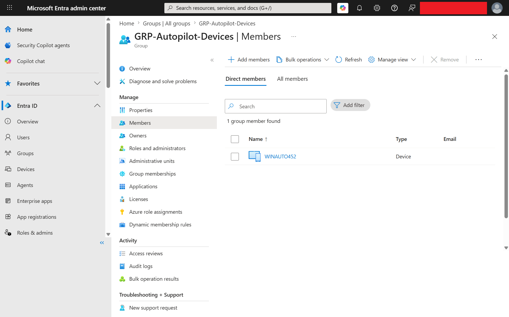
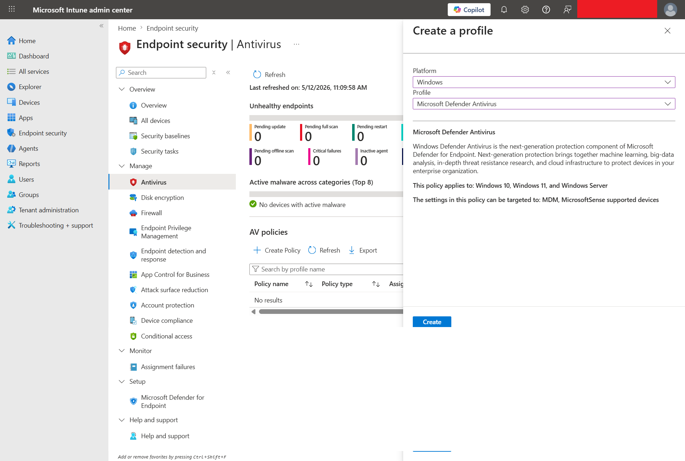
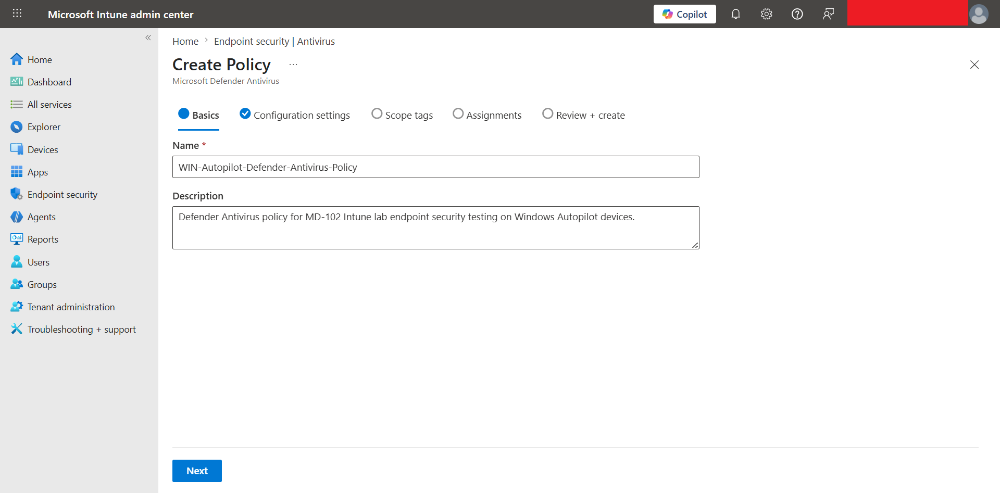
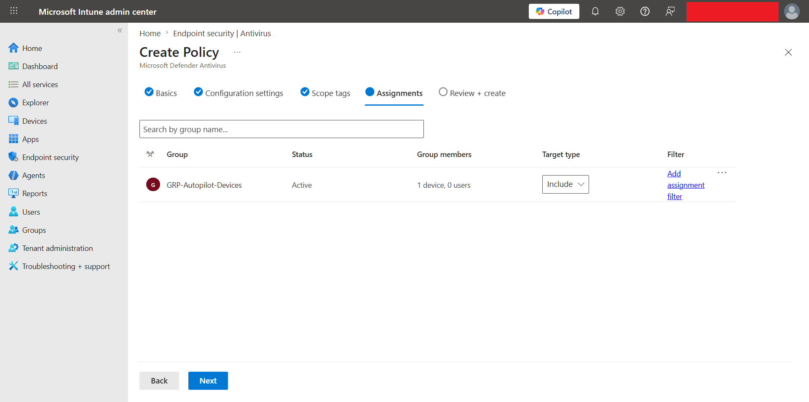
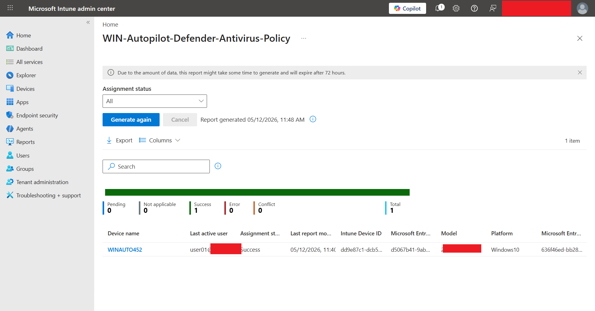

# Microsoft Defender Antivirus Policy with Intune

## Lab status

**Status:** Completed  
**Validation device:** WINAUTO452  
**Final result:** Microsoft Defender Antivirus policy successfully applied through Microsoft Intune Endpoint security.

---

## Objective

Create, configure, assign, and validate a Microsoft Defender Antivirus policy from the Microsoft Intune admin center.

This lab demonstrates how Intune can centrally manage Defender Antivirus settings for Windows Autopilot-managed corporate devices.

---

## Lab scenario

In this lab, the Defender Antivirus policy was assigned to the Windows Autopilot device group instead of a single user group.

```text
GRP-Autopilot-Devices
-> WINAUTO452
-> Microsoft Intune managed
-> Defender Antivirus policy applied
-> Device status reported Success
```

This is a more realistic enterprise approach because endpoint security policies are normally targeted to device groups that represent corporate-managed devices.

---

## Lab environment

| Item | Value |
|---|---|
| Tenant | HOMELAB |
| Management platform | Microsoft Intune |
| Policy area | Endpoint security |
| Policy type | Antivirus |
| Platform | Windows |
| Profile | Microsoft Defender Antivirus |
| Assignment group | GRP-Autopilot-Devices |
| Validation device | WINAUTO452 |
| Device ownership | Corporate |
| Enrollment method | Windows Autopilot user-driven enrollment |
| Primary user | user01 |
| Final policy status | Success |

---

## Policy details

| Setting | Value |
|---|---|
| Policy name | WIN-Autopilot-Defender-Antivirus-Policy |
| Description | Defender Antivirus policy for MD-102 Intune lab endpoint security testing on Windows Autopilot devices. |
| Platform | Windows |
| Profile | Microsoft Defender Antivirus |
| Assignment | GRP-Autopilot-Devices |
| Target device | WINAUTO452 |
| Assignment result | Success |

---

## Why this matters

Microsoft Defender Antivirus is built into Windows and can be managed through Intune Endpoint security policies. In a real environment, administrators use this type of policy to enforce baseline antivirus settings across corporate devices.

This lab proves that an Autopilot-enrolled Windows device can receive endpoint security settings after enrollment and report successful policy application back to Intune.

---

## Step 1 - Confirm Autopilot device group membership

The policy was designed to target the Autopilot device group.

The group `GRP-Autopilot-Devices` contained the device `WINAUTO452`.



---

## Step 2 - Create Microsoft Defender Antivirus profile

The policy was created from the Intune admin center.

Navigation path:

```text
Microsoft Intune admin center
-> Endpoint security
-> Antivirus
-> Create Policy
```

Profile selection:

| Field | Value |
|---|---|
| Platform | Windows |
| Profile | Microsoft Defender Antivirus |



---

## Step 3 - Configure policy basics

The policy was named for the Autopilot device scenario.

| Field | Value |
|---|---|
| Name | WIN-Autopilot-Defender-Antivirus-Policy |
| Description | Defender Antivirus policy for MD-102 Intune lab endpoint security testing on Windows Autopilot devices. |



---

## Step 4 - Configure Defender Antivirus settings

The following core Defender Antivirus settings were configured for the lab.

| Defender setting | Configuration |
|---|---|
| Allow Archive Scanning | Allowed |
| Allow Behavior Monitoring | Allowed |
| Allow Cloud Protection | Allowed |
| Allow Email Scanning | Allowed |
| Allow Full Scan on Removable Drive Scanning | Allowed |
| Allow Realtime Monitoring | Allowed |
| Allow Scanning Network Files | Allowed |
| Allow Script Scanning | Allowed |
| Check for Signatures Before Running Scan | Enabled |
| Cloud Block Level | High |
| Cloud Extended Timeout | 50 |
| Days to Retain Cleaned Malware | 30 |
| Enable Network Protection | Enabled in audit mode |
| PUA Protection | Enabled |
| Real Time Scan Direction | Monitor all files |
| Submit Samples Consent | Send safe samples automatically |
| Allow On Access Protection | Allowed |

Threat severity remediation actions were also configured.

| Threat severity | Remediation action |
|---|---|
| Severe | Quarantine |
| High | Quarantine |
| Moderate | Quarantine |
| Low | Quarantine |

Exclusions were intentionally left blank.

| Exclusion type | Configuration |
|---|---|
| Excluded extensions | Not configured |
| Excluded paths | Not configured |
| Excluded processes | Not configured |


---

## Step 5 - Assign policy to Autopilot device group

The policy was assigned to the Autopilot device group.

| Assignment item | Value |
|---|---|
| Included group | GRP-Autopilot-Devices |
| Group members | 1 device |
| Target type | Include |
| Excluded groups | None |



---

## Step 6 - Confirm policy creation

After creation, the policy appeared under the Antivirus policy list in Endpoint security.


---

## Step 7 - Validate device status

The policy status report showed that the Defender Antivirus policy successfully applied to `WINAUTO452`.

| Result item | Value |
|---|---|
| Device name | WINAUTO452 |
| Assignment status | Success |
| Pending | 0 |
| Success | 1 |
| Error | 0 |
| Conflict | 0 |
| Total | 1 |



---

## Final validation result

The policy was successfully applied to the Autopilot-enrolled Windows device.

```text
Policy created in Intune
-> Defender Antivirus settings configured
-> Policy assigned to GRP-Autopilot-Devices
-> WINAUTO452 synced with Intune
-> Device reported Success
```

---

## What this proves

This lab proves the following:

- Microsoft Intune can create and deploy Defender Antivirus endpoint security policies.
- Defender Antivirus settings can be targeted to an Autopilot device group.
- WINAUTO452 successfully received the policy after Autopilot enrollment.
- Intune reporting confirmed the policy status as Success.
- The same Autopilot device can now be used for additional endpoint security labs.

---

## Real-world notes

In production, Defender Antivirus policies should be planned carefully before broad deployment.

Recommended real-world practices:

- Start with a pilot device group.
- Avoid unnecessary antivirus exclusions.
- Use Intune reporting to check Success, Error, Conflict, and Pending states.
- Use Microsoft Defender for Endpoint integration for stronger threat visibility when available.
- Document policy settings and assignment scope clearly.

---

## Troubleshooting notes

If the policy remains pending:

1. Confirm the target device is in the assigned group.
2. Sync the device from Windows Settings.
3. Sync the device from Intune remote actions.
4. Wait for Intune reporting to refresh.
5. Regenerate the policy report.
6. Check for conflicts with other antivirus or endpoint security policies.

---

## Screenshot files used

Screenshots are stored in:

```text
screenshots/sanitized/endpoint-security/
```

| Screenshot | Purpose |
|---|---|
| defender-autopilot-device-group-member-sanitized.png | Shows WINAUTO452 as a member of GRP-Autopilot-Devices |
| defender-antivirus-profile-create-sanitized.png | Shows the Microsoft Defender Antivirus profile selection |
| defender-antivirus-policy-basics-sanitized.png | Shows the policy name and description |
| defender-antivirus-policy-settings-sanitized.png | Shows the configured Defender Antivirus settings |
| defender-antivirus-policy-assignment-autopilot-devices-sanitized.png | Shows assignment to GRP-Autopilot-Devices |
| defender-antivirus-policy-list-sanitized.png | Shows the created policy in the Antivirus policy list |
| defender-antivirus-device-status-winauto452-succeeded-sanitized.png | Shows WINAUTO452 reporting Success |

---

## Current lab status

Completed:

- Microsoft Defender Antivirus endpoint security policy created
- Windows platform selected
- Microsoft Defender Antivirus profile selected
- Core Defender Antivirus settings configured
- PUA protection enabled
- Threat remediation set to quarantine
- Policy assigned to GRP-Autopilot-Devices
- WINAUTO452 successfully received the policy
- Intune device status reported Success

---

## Related endpoint security labs

Completed:

- Microsoft Defender Antivirus policy
- Windows Firewall policy
- BitLocker encryption policy

Next recommended labs:

- Attack Surface Reduction policy
- Windows Security Baseline
- Account Protection policy

---

## References

- Microsoft Learn: Antivirus policy for endpoint security in Intune  
  https://learn.microsoft.com/en-us/intune/device-configuration/endpoint-security/antivirus

- Microsoft Learn: Endpoint security in Microsoft Intune  
  https://learn.microsoft.com/en-us/intune/device-security/endpoint-security-policies

- Microsoft Learn: Microsoft Defender Antivirus settings for Windows in Intune  
  https://learn.microsoft.com/en-us/mem/intune-service/protect/antivirus-microsoft-defender-settings-windows
