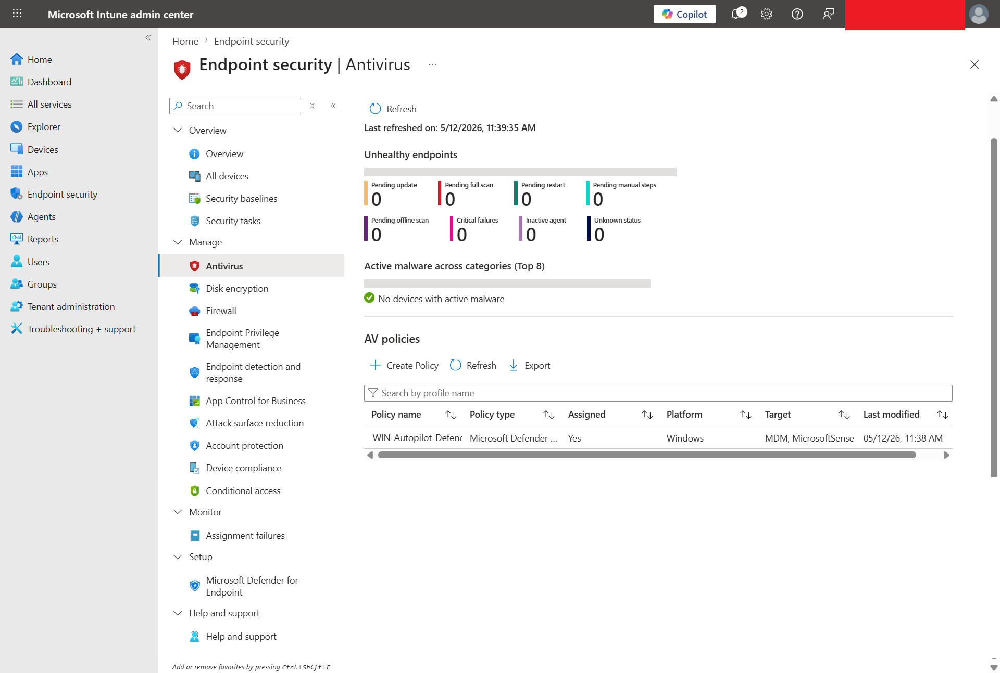
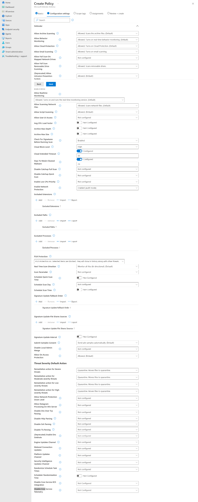

# Windows Defender Antivirus Policy with Intune

This file documents the Microsoft Defender Antivirus endpoint security policy lab for the MD-102 Intune virtual company project.

---

## Status

Planned / Next hands-on lab

---

## Objective

Create and test a Microsoft Defender Antivirus policy using Microsoft Intune Endpoint security.

This lab will validate that:

- Microsoft Intune can manage Microsoft Defender Antivirus settings.
- A Defender Antivirus policy can be created from Endpoint security.
- The policy can be assigned safely to a pilot group.
- The managed Windows device can receive the Defender Antivirus policy.
- Intune can report policy deployment status.
- The local Windows Security app can confirm Defender protection is active.

---

## Lab Context

This lab continues after:

```text
02-device-enrollment/windows-autopilot-user-driven-enrollment.md
05-application-deployment/microsoft-365-apps-autopilot-deployment.md
```

The project has already validated:

```text
Identity and groups
-> Windows enrollment
-> Autopilot enrollment
-> Store app deployment
-> Win32 app deployment
-> Microsoft 365 Apps deployment
```

This lab starts the Endpoint Security section.

---

## Why This Lab Matters

Microsoft Defender Antivirus is a core endpoint protection feature in Windows.

In a real company, administrators do not want users manually changing antivirus protection. Instead, Intune can centrally configure Defender Antivirus settings and report whether the policy applied successfully.

Simple real-world flow:

```text
Admin creates Defender Antivirus policy in Intune
-> Policy is assigned to a pilot group
-> Windows device syncs with Intune
-> Defender Antivirus settings apply
-> Intune reports deployment status
-> Admin verifies protection on the endpoint
```

---

## Lab Environment

| Item | Value |
|---|---|
| Test device | `WIN-CORP-001` or `WINAUTO452` |
| Operating system | Windows 11 |
| Management platform | Microsoft Intune |
| Identity platform | Microsoft Entra ID |
| Test user | `user01` |
| Assignment group | `GRP-Pilot-Users` |
| Policy area | Endpoint security |
| Policy type | Antivirus |
| Profile | Microsoft Defender Antivirus |
| Screenshot folder | `screenshots/sanitized/endpoint-security/` |

> [!NOTE]
> For a safer production-style design, endpoint security policies are often targeted to device groups. For this lab, pilot targeting is acceptable as long as only lab devices/users are included.

---

## Policy Plan

| Setting | Planned Value |
|---|---|
| Policy name | `WIN-CORP-Defender-Antivirus-Policy` |
| Platform | Windows |
| Profile | Microsoft Defender Antivirus |
| Assignment | `GRP-Pilot-Users` |
| Validation device | `WIN-CORP-001` or `WINAUTO452` |
| Expected result | Policy applies successfully |

---

## Recommended Defender Antivirus Settings

Use beginner-friendly baseline settings for the lab.

| Defender setting | Recommended lab configuration |
|---|---|
| Allow real-time monitoring | Enabled / Allowed |
| Allow behavior monitoring | Enabled / Allowed |
| Allow cloud protection | Enabled / Allowed |
| Allow archive scanning | Enabled / Allowed |
| Allow script scanning | Enabled / Allowed |
| Check for signatures before running scan | Enabled |
| Potentially unwanted app protection | Block |
| Cloud-delivered protection level | High or default |
| Submit samples consent | Send safe samples automatically, if available |

> [!NOTE]
> Intune setting names may vary slightly depending on the current Microsoft Intune admin center experience.

---

## Hands-On Steps

### Step 1: Open Endpoint Security

Go to:

```text
Intune admin center
-> Endpoint security
-> Antivirus
```

### Step 2: Create a New Policy

Select:

```text
Create Policy
```

Use:

| Option | Value |
|---|---|
| Platform | Windows |
| Profile | Microsoft Defender Antivirus |

### Step 3: Configure Basics

Use:

```text
Name: WIN-CORP-Defender-Antivirus-Policy
Description: Defender Antivirus policy for MD-102 Intune lab endpoint security testing.
```

### Step 4: Configure Defender Antivirus Settings

Configure the recommended Defender Antivirus settings from the table above.

### Step 5: Assign the Policy

Assign to:

```text
GRP-Pilot-Users
```

### Step 6: Create the Policy

Review the settings and create the policy.

### Step 7: Sync the Device

On the Windows endpoint:

```text
Settings
-> Accounts
-> Access work or school
-> Connected work account
-> Info
-> Sync
```

Or sync from Intune:

```text
Intune admin center
-> Devices
-> Windows
-> Select device
-> Sync
```

### Step 8: Verify Policy Status in Intune

Check:

```text
Endpoint security
-> Antivirus
-> WIN-CORP-Defender-Antivirus-Policy
-> Device status
```

Expected result:

```text
Succeeded
```

### Step 9: Verify Locally on Windows

Open:

```text
Windows Security
-> Virus & threat protection
```

Confirm Microsoft Defender Antivirus is active.

---

## Test Result

| Test item | Result |
|---|---|
| Defender Antivirus policy created | Pending |
| Policy assigned to pilot group | Pending |
| Device sync completed | Pending |
| Intune policy status checked | Pending |
| Local Windows Security verification completed | Pending |
| Screenshots captured | Pending |
| Final lab result | Pending |

---

## Screenshots

Screenshots should be stored in:

```text
screenshots/sanitized/endpoint-security/
```

Recommended screenshots:

```text
defender-antivirus-policy-list-sanitized.png
defender-antivirus-policy-basics-sanitized.png
defender-antivirus-policy-settings-sanitized.png
defender-antivirus-policy-assignment-sanitized.png
defender-antivirus-device-status-succeeded-sanitized.png
windows-security-defender-status-sanitized.png
```

### Defender Antivirus policy list



### Defender Antivirus policy settings



### Defender Antivirus policy assignment


### Defender Antivirus device status


### Windows Security Defender status


---

## Troubleshooting Notes

If policy status does not update:

1. Confirm the device is enrolled in Intune.
2. Confirm the device is online.
3. Confirm `user01` is in `GRP-Pilot-Users`.
4. Sync the device manually.
5. Restart the device if needed.
6. Wait for Intune reporting to refresh.
7. Review the policy device status again.

If local settings do not appear to change:

1. Confirm another policy is not conflicting.
2. Check Windows Security locally.
3. Run Windows Update / Defender update.
4. Confirm the device is managed by Intune.

---

## Security and Privacy Notes

Do not upload:

- Full user email addresses
- Tenant names
- Device IDs
- Object IDs
- Security recommendations containing sensitive tenant details
- Unsanitized screenshots

Before uploading screenshots, blur or hide:

- Top-right signed-in admin account
- Tenant/domain name
- Full UPNs
- Device IDs
- Object IDs

---

## Current Lab Status

Planned.

---

## Next Step

After completing this lab, continue to:

```text
06-endpoint-security/windows-firewall-policy.md
```
