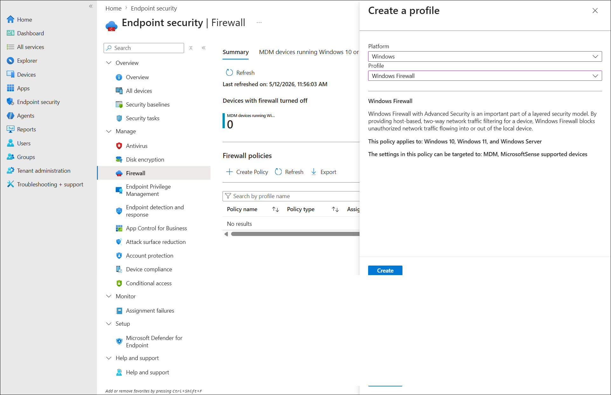
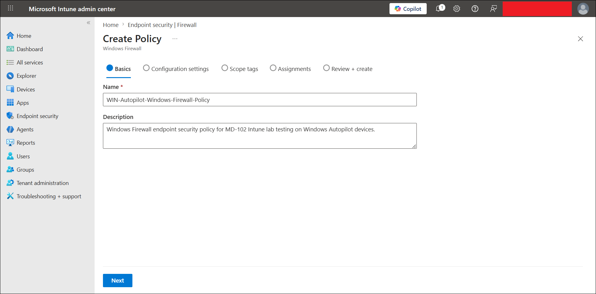
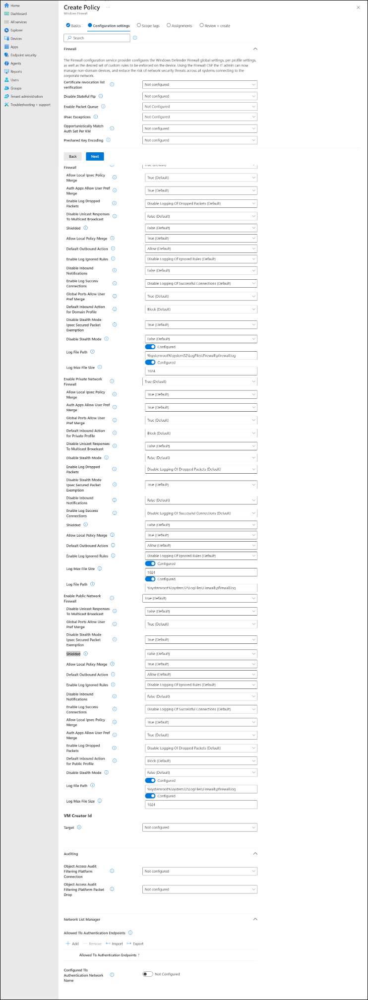
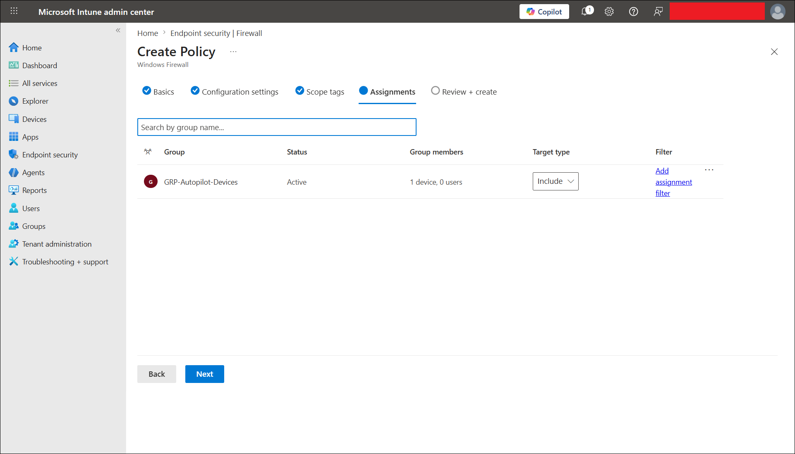
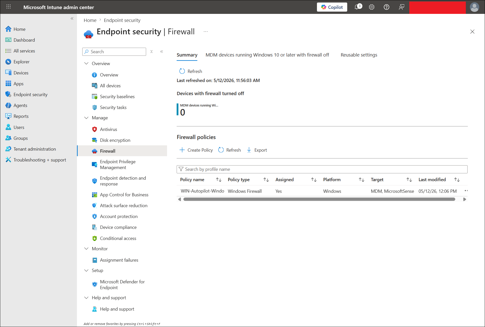
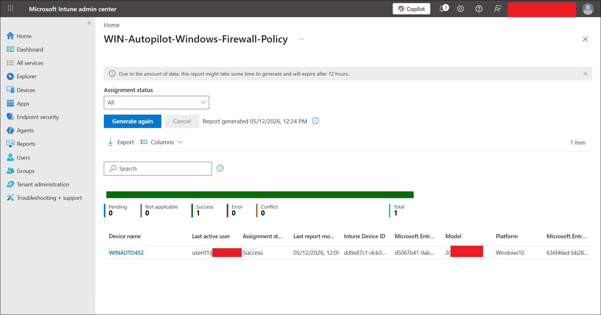

# Windows Firewall Policy with Intune

## Lab status

**Status:** Completed  
**Lab category:** Endpoint security  
**Platform:** Windows  
**Management platform:** Microsoft Intune  
**Policy area:** Endpoint security  
**Policy type:** Firewall  
**Profile:** Windows Firewall  
**Assignment group:** GRP-Autopilot-Devices  
**Validation device:** WINAUTO452  
**Enrollment method:** Windows Autopilot user-driven enrollment  
**Final result:** Windows Firewall policy applied successfully  

---

## Lab objective

The objective of this lab is to create, assign, and validate a Windows Firewall policy using Microsoft Intune Endpoint security.

This lab validates that:

- Microsoft Intune can configure Windows Firewall settings from the Endpoint security node.
- Firewall protection can be enabled for Domain, Private, and Public network profiles.
- The policy can be assigned to the Autopilot device group.
- The Autopilot device `WINAUTO452` can receive and report the policy as successful.
- Intune policy reporting can confirm policy deployment status.

---

## Why this lab matters

Windows Firewall helps reduce the attack surface of a Windows device by controlling inbound and outbound network traffic.

In a real environment, endpoint administrators usually enable firewall protection across managed corporate devices to help block unauthorized network connections and reduce exposure to network-based threats.

This lab demonstrates a beginner-friendly firewall baseline before moving into more advanced endpoint security controls such as BitLocker, Attack Surface Reduction, and Windows Security Baselines.

Simple security flow:

```text
Windows Autopilot device enrolled
-> Device becomes Intune managed
-> Endpoint security Firewall policy is created
-> Policy is assigned to GRP-Autopilot-Devices
-> WINAUTO452 syncs with Intune
-> Firewall policy applies successfully
-> Intune reports Success
```

---

## Lab environment

| Item | Value |
|---|---|
| Tenant type | Microsoft 365 / Intune lab tenant |
| Management platform | Microsoft Intune |
| Device enrollment method | Windows Autopilot user-driven enrollment |
| Validation device | WINAUTO452 |
| Device ownership | Corporate |
| Primary user | user01 |
| Assignment group | GRP-Autopilot-Devices |
| Policy area | Endpoint security |
| Policy type | Firewall |
| Profile | Windows Firewall |
| Platform | Windows |
| Final policy status | Success |

---

## Prerequisites

Before starting this lab, the following were required:

- Microsoft Intune tenant available.
- Windows Autopilot device enrolled.
- `WINAUTO452` available in Intune.
- `WINAUTO452` included in `GRP-Autopilot-Devices`.
- Device able to sync with Intune.
- Endpoint security policy permissions available in Intune.
- Sanitized screenshots prepared for GitHub documentation.

---

## Policy design

The policy was assigned to the device group:

```text
GRP-Autopilot-Devices
```

This group contained the Autopilot-enrolled corporate device:

```text
WINAUTO452
```

This assignment model is better for this lab than assigning to a user group because the policy follows the device rather than any device where the user signs in.

| Assignment type | Behavior |
|---|---|
| User group assignment | Policy follows the user across devices |
| Device group assignment | Policy targets specific devices directly |

For this lab, the device group approach is cleaner because Defender Antivirus, Windows Firewall, and BitLocker are endpoint security controls intended for the managed Autopilot device.

### Policy details

| Setting | Value |
|---|---|
| Policy name | WIN-Autopilot-Windows-Firewall-Policy |
| Description | Windows Firewall endpoint security policy for MD-102 Intune lab testing on Windows Autopilot devices. |
| Platform | Windows |
| Profile | Windows Firewall |
| Assignment | GRP-Autopilot-Devices |
| Target device | WINAUTO452 |
| Policy result | Success |

---

## Firewall settings configured

The policy enabled Windows Firewall for the main Windows network profiles.

| Firewall setting | Configuration |
|---|---|
| Enable Domain Network Firewall | True |
| Enable Private Network Firewall | True |
| Enable Public Network Firewall | True |
| Default inbound action for Domain profile | Block |
| Default inbound action for Private profile | Block |
| Default inbound action for Public profile | Block |
| Default outbound action | Allow |
| Shielded mode | False |
| Log file path | `%systemroot%\system32\LogFiles\Firewall\pfirewall.log` |
| Log max file size | 1024 |

> [!NOTE]
> This lab focused on enabling and validating Windows Firewall profile protection. Custom firewall rules were not created in this lab.

---

## Configuration flow

```text
Open Endpoint security Firewall
-> Create Windows Firewall policy
-> Configure policy basics
-> Enable Firewall for Domain, Private, and Public profiles
-> Assign policy to GRP-Autopilot-Devices
-> Create policy
-> Sync WINAUTO452
-> Validate device status in Intune
```

---

## Steps performed

### Step 1 - Opened Endpoint security Firewall

The Microsoft Intune admin center was opened.

Navigation path:

```text
Intune admin center
-> Endpoint security
-> Firewall
```

The Firewall page showed the Windows Firewall policy area and the option to create a policy.

---

### Step 2 - Created a new Firewall policy

The following profile was selected:

| Option | Value |
|---|---|
| Platform | Windows |
| Profile | Windows Firewall |

The following options were not selected:

| Option | Reason |
|---|---|
| Windows Firewall Rules | Used for specific inbound/outbound firewall rules, not needed for this baseline lab |
| Windows Hyper-V Firewall Rules | Used for Hyper-V container-specific firewall scenarios |

---

### Step 3 - Entered policy basics

The policy was named:

```text
WIN-Autopilot-Windows-Firewall-Policy
```

Description used:

```text
Windows Firewall endpoint security policy for MD-102 Intune lab testing on Windows Autopilot devices.
```

---

### Step 4 - Configured Firewall settings

The policy was configured to enable Windows Firewall across the main network profiles.

Main configured values:

```text
Enable Domain Network Firewall: True
Enable Private Network Firewall: True
Enable Public Network Firewall: True
```

The default inbound action was left as **Block**, while outbound traffic was left as **Allow**.

This is a safe beginner baseline because it keeps normal outbound connectivity working while keeping unsolicited inbound traffic blocked.

Shielded mode was left disabled because it can be too restrictive for a beginner lab and may impact connectivity.

---

### Step 5 - Left scope tags as default

The default scope tag was used.

No custom scope tag was required for this lab.

---

### Step 6 - Assigned the policy

The policy was assigned to:

```text
GRP-Autopilot-Devices
```

This group contained:

```text
WINAUTO452
```

---

### Step 7 - Reviewed and created the policy

The policy was reviewed and created in Intune.

The Review + create screenshot was not required for this lab because the policy list and device status screenshots provide stronger final evidence.

---

### Step 8 - Verified policy in Firewall policy list

After creation, the policy appeared under:

```text
Endpoint security
-> Firewall
-> Firewall policies
```

The policy list showed the firewall policy as assigned.

---

### Step 9 - Verified device status in Intune

The policy status report showed the following result:

| Status | Count |
|---|---:|
| Pending | 0 |
| Success | 1 |
| Error | 0 |
| Conflict | 0 |
| Total | 1 |

The device row showed:

```text
WINAUTO452 = Success
```

---

## Validation

### Policy creation validation

Validation confirmed that:

- The Firewall endpoint security blade was used.
- The platform was set to Windows.
- The profile was set to Windows Firewall.
- The policy appeared in the Firewall policy list.

---

### Firewall settings validation

Validation confirmed that:

- Domain network firewall was enabled.
- Private network firewall was enabled.
- Public network firewall was enabled.
- Default inbound action was configured as Block.
- Default outbound action was configured as Allow.
- No custom firewall rules were created for this baseline lab.

---

### Assignment validation

Validation confirmed that:

- The policy was assigned to `GRP-Autopilot-Devices`.
- `WINAUTO452` was included in the target device group.

---

### Device status validation

Validation confirmed that:

- `WINAUTO452` received the policy.
- Intune reported device status as Success.
- There were no error, conflict, or pending results for the target device.

---

## Final test result

| Validation item | Status |
|---|---|
| Firewall policy created | Completed |
| Platform selected as Windows | Completed |
| Windows Firewall profile selected | Completed |
| Domain network firewall enabled | Completed |
| Private network firewall enabled | Completed |
| Public network firewall enabled | Completed |
| Policy assigned to GRP-Autopilot-Devices | Completed |
| Target device WINAUTO452 received policy | Completed |
| Intune policy status reported Success | Completed |
| Screenshots captured and uploaded | Completed |
| Final lab result | Completed |

Observed final result:

```text
The Windows Firewall policy applied successfully to WINAUTO452 through Microsoft Intune Endpoint security.
```

---

## Screenshots captured

Screenshots are stored in:

```text
screenshots/sanitized/endpoint-security/
```

### Create Firewall profile



### Firewall policy basics



### Firewall policy configuration settings



### Firewall policy assignment to Autopilot devices



### Firewall policy list



### Firewall device status succeeded



---

## Screenshot file list

```text
firewall-profile-create-sanitized.png
firewall-policy-basics-sanitized.png
firewall-policy-settings-sanitized.png
firewall-policy-assignment-autopilot-devices-sanitized.png
firewall-policy-list-sanitized.png
firewall-device-status-winauto452-succeeded-sanitized.png
```

---

## Troubleshooting notes

### Device status shows Pending

If the device status shows **Pending**, wait for Intune check-in or manually sync the device.

Manual sync path on Windows:

```text
Settings
-> Accounts
-> Access work or school
-> Connected work or school account
-> Info
-> Sync
```

You can also trigger sync from Intune:

```text
Intune admin center
-> Devices
-> Windows
-> WINAUTO452
-> Sync
```

---

### Policy does not apply

If the policy does not apply, check:

1. The policy is assigned to the correct group.
2. `WINAUTO452` is a member of `GRP-Autopilot-Devices`.
3. The device is enrolled in Microsoft Intune.
4. The device has checked in recently.
5. The device has internet connectivity.
6. There are no conflicting firewall policies.

---

### Firewall policy conflicts

If a conflict appears, check whether another Intune policy, security baseline, or local policy is configuring the same Windows Firewall settings.

---

## Enterprise reflection

Windows Firewall should be enabled and monitored across managed corporate Windows devices.

For production environments:

- Test firewall changes with a pilot device group before broad deployment.
- Avoid blocking outbound traffic unless there is a tested business requirement.
- Avoid enabling shielded mode without validating remote management and network access.
- Create custom firewall rules only after confirming the required ports, protocols, applications, and network profiles.
- Monitor Success, Error, Pending, and Conflict status in Intune.

A safer rollout model is:

```text
Pilot device group
-> Validate connectivity
-> Validate Intune reporting
-> Expand to production device groups
```

This lab follows that same model by targeting:

```text
GRP-Autopilot-Devices
```

---

## Security and privacy notes

This is a public learning repository.

Do not upload screenshots that show:

- Full user email addresses
- Tenant IDs
- Device IDs
- Object IDs
- Serial numbers
- Internal IP addresses
- MAC addresses
- Passwords
- MFA prompts
- Unsanitized tenant information
- Production company data

Before uploading screenshots, hide or blur:

- Top-right signed-in admin account
- Tenant/domain name
- Full user principal names
- Device identifiers
- Serial numbers
- Any private endpoint details

---

## Related labs

| Lab file | Relationship |
|---|---|
| `02-device-enrollment/windows-autopilot-user-driven-enrollment.md` | Provides the Autopilot-enrolled corporate device WINAUTO452 |
| `06-endpoint-security/windows-defender-antivirus-policy.md` | Previous endpoint security policy |
| `06-endpoint-security/bitlocker-encryption-policy.md` | Next endpoint security policy |
| `06-endpoint-security/attack-surface-reduction-policy.md` | Planned advanced endpoint security lab |
| `06-endpoint-security/windows-security-baseline.md` | Planned security baseline lab |

---

## Key learning outcomes

This lab demonstrated how to:

- Create a Windows Firewall endpoint security policy.
- Enable Firewall for Domain, Private, and Public profiles.
- Assign endpoint security policies to a device group.
- Validate policy success from Intune reporting.
- Understand the difference between Firewall baseline settings and custom Firewall rules.
- Use an Autopilot-enrolled device for endpoint security testing.

---

## Lab conclusion

The Windows Firewall policy lab was completed successfully.

Final result:

```text
Windows Firewall endpoint security policy was created in Intune.
Domain, Private, and Public firewall profiles were enabled.
The policy was assigned to GRP-Autopilot-Devices.
WINAUTO452 received the policy successfully.
Intune reported device status as Success.
```

This confirms that the Autopilot-enrolled Windows device is receiving firewall security settings from Microsoft Intune.
