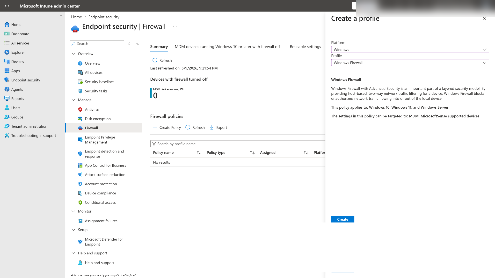
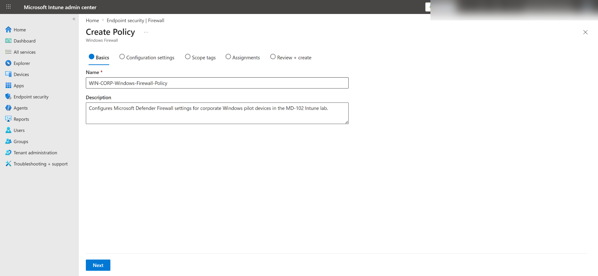
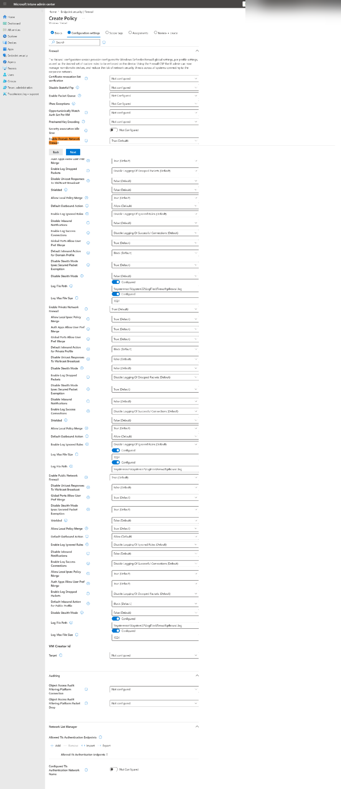
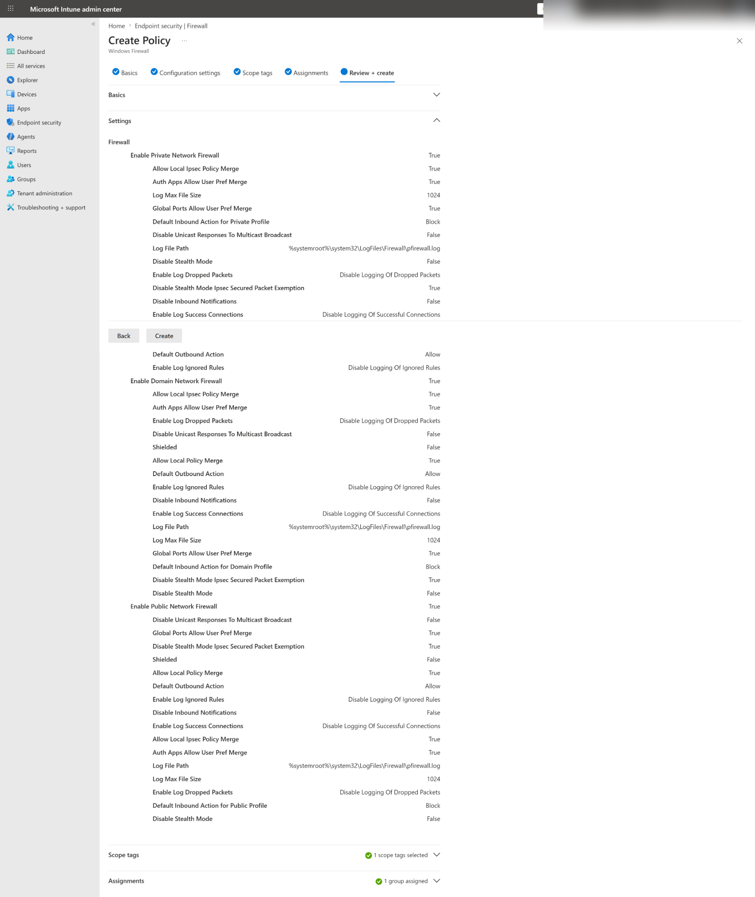
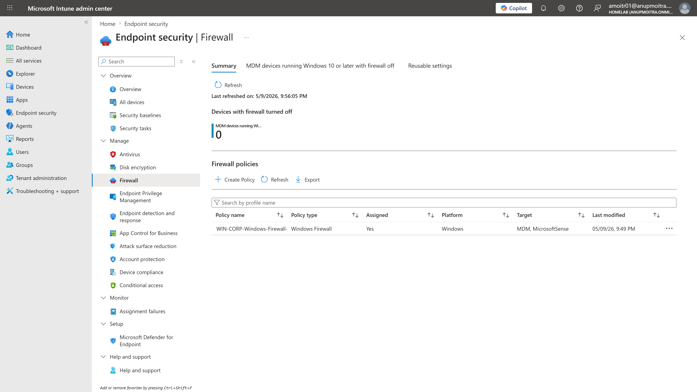
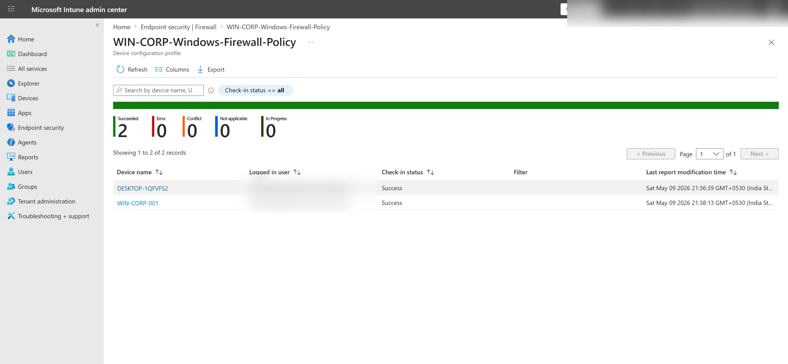
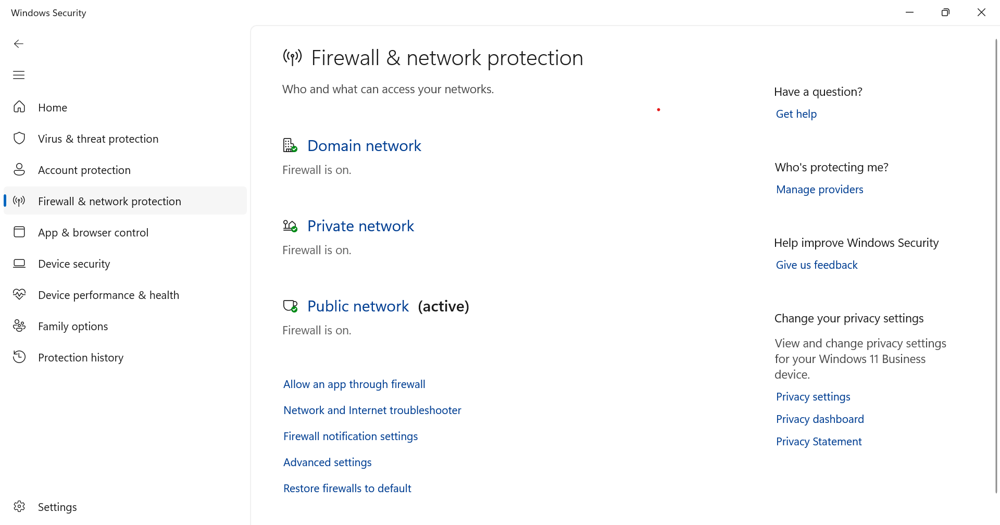

# Windows Firewall Policy with Intune

This file documents the Windows Firewall endpoint security policy lab for the MD-102 Intune virtual company project.

## Objective

Create and test a Windows Firewall endpoint security policy using Microsoft Intune.

This lab validates that:

- Microsoft Intune can configure Microsoft Defender Firewall settings.
- Firewall can be enabled for Domain, Private, and Public network profiles.
- The policy can be assigned to a pilot user group.
- The policy can successfully apply to Windows devices used by the targeted pilot user.
- The firewall status can be verified both from Intune and from the local Windows Security app.

## Lab Context

This lab is part of the MD-102 Intune virtual company project.

The virtual company uses Microsoft Intune to manage corporate Windows devices and apply endpoint security settings.

This lab continues the endpoint security section after the Microsoft Defender Antivirus policy lab.

Simple security flow:

```text
Endpoint security policy created in Intune
→ Policy assigned to pilot users
→ Windows device syncs with Intune
→ Firewall settings apply
→ Intune reports policy status
→ Windows Security confirms firewall is on
```

## Why This Lab Matters

Windows Firewall helps protect devices by controlling network traffic entering and leaving the device.

In a real company, endpoint administrators should make sure firewall protection is enabled across managed Windows devices.

This lab demonstrates a beginner-friendly firewall policy before moving into more advanced firewall rules, BitLocker, Attack Surface Reduction, and security baselines.

## Lab Environment

| Item | Value |
|---|---|
| Test device | WIN-CORP-001 |
| Additional affected device | DESKTOP-1QFVFS2 |
| Operating system | Windows 11 |
| Management | Microsoft Intune |
| Test user | user01 |
| Assignment group | GRP-Pilot-Users |
| Policy area | Endpoint security |
| Policy type | Firewall |
| Profile | Windows Firewall |

## Policy Details

| Setting | Value |
|---|---|
| Policy name | WIN-CORP-Windows-Firewall-Policy |
| Platform | Windows |
| Profile | Windows Firewall |
| Assignment | GRP-Pilot-Users |
| Target | MDM, MicrosoftSense |
| Main validation device | WIN-CORP-001 |
| Policy result | Succeeded |

## Assignment Note

The policy was assigned to the user group:

```text
GRP-Pilot-Users
```

Because `user01` was signed in on more than one Windows device, the policy applied successfully to both devices where the targeted user was active.

This is an important Intune assignment concept:

```text
User group assignment = follows the user
Device group assignment = targets the device directly
```

For this lab, `WIN-CORP-001` is the main validation device.

A future improvement would be to assign endpoint security policies to a corporate Windows device group, such as:

```text
GRP-Corporate-Windows-Devices
```

## Firewall Settings Configured

The policy enabled Microsoft Defender Firewall for all major Windows network profiles.

| Firewall setting | Configuration |
|---|---|
| Enable Domain Network Firewall | True |
| Enable Private Network Firewall | True |
| Enable Public Network Firewall | True |
| Default inbound action | Block |
| Default outbound action | Allow |
| Log file path | `%systemroot%\system32\LogFiles\Firewall\pfirewall.log` |
| Log max file size | 1024 |

> [!NOTE]
> The main purpose of this lab was to enable and verify firewall protection. Advanced inbound and outbound firewall rules were not created in this lab.

## Steps Performed

### 1. Opened Endpoint Security Firewall

The Microsoft Intune admin center was opened.

Navigation path:

```text
Intune admin center
→ Endpoint security
→ Firewall
```

The Firewall page initially showed the firewall policy area and the option to create a new policy.

### 2. Created a New Firewall Policy

The following profile was selected:

| Option | Value |
|---|---|
| Platform | Windows |
| Profile | Windows Firewall |

The following options were intentionally not selected:

| Option | Reason |
|---|---|
| Windows Firewall Rules | Used later for specific inbound/outbound rules |
| Windows Hyper-V Firewall Rules | Used for Hyper-V-specific firewall rules |

### 3. Entered Policy Basics

The policy was named:

```text
WIN-CORP-Windows-Firewall-Policy
```

Description used:

```text
Configures Microsoft Defender Firewall settings for corporate Windows pilot devices in the MD-102 Intune lab.
```

### 4. Configured Firewall Settings

The firewall settings were configured to enable firewall protection for:

```text
Domain network profile
Private network profile
Public network profile
```

Main configured values:

```text
Enable Domain Network Firewall: True
Enable Private Network Firewall: True
Enable Public Network Firewall: True
```

### 5. Left Scope Tags as Default

The default scope tag was used.

### 6. Assigned the Policy

The policy was assigned to:

```text
GRP-Pilot-Users
```

### 7. Reviewed and Created the Policy

The policy was reviewed and created in Intune.

The Review + create page showed:

```text
Settings: 51 settings
Scope tags: 1 scope tag selected
Assignments: 1 group assigned
```

### 8. Verified Policy in Firewall Policy List

After creation, the policy appeared under:

```text
Endpoint security
→ Firewall
→ Firewall policies
```

The policy list showed:

| Field | Value |
|---|---|
| Policy name | WIN-CORP-Windows-Firewall-Policy |
| Policy type | Windows Firewall |
| Assigned | Yes |
| Platform | Windows |
| Target | MDM, MicrosoftSense |

### 9. Verified Device Status in Intune

The policy device status showed:

| Status | Count |
|---|---|
| Succeeded | 2 |
| Error | 0 |
| Conflict | 0 |
| Not applicable | 0 |
| In progress | 0 |

The policy successfully applied to:

```text
DESKTOP-1QFVFS2
WIN-CORP-001
```

The reason two devices showed success is that `user01` was signed in on both devices and the policy was assigned to the user group `GRP-Pilot-Users`.

### 10. Verified Firewall Status on WIN-CORP-001

On `WIN-CORP-001`, Windows Security was opened.

Navigation path:

```text
Windows Security
→ Firewall & network protection
```

The device showed:

```text
Domain network: Firewall is on
Private network: Firewall is on
Public network: Firewall is on
```

## Test Result

| Test item | Result |
|---|---|
| Firewall policy created | Successful |
| Platform selected as Windows | Successful |
| Windows Firewall profile selected | Successful |
| Domain network firewall enabled | Successful |
| Private network firewall enabled | Successful |
| Public network firewall enabled | Successful |
| Policy assigned to GRP-Pilot-Users | Successful |
| Intune policy status | Succeeded |
| WIN-CORP-001 firewall status | Firewall is on |
| Lab result | Successful |

## What This Proves

This lab proves that Microsoft Intune can configure Microsoft Defender Firewall settings through Endpoint security policies.

Simple explanation:

```text
Admin created Windows Firewall policy in Intune
→ Policy assigned to GRP-Pilot-Users
→ user01 signed in to Windows devices
→ Devices checked in with Intune
→ Firewall policy applied successfully
→ Intune showed policy status as Succeeded
→ WIN-CORP-001 showed firewall enabled locally
```

## Screenshots

The following screenshots should be added after sanitizing sensitive information.

> [!NOTE]
> Screenshots must be sanitized before upload. Hide tenant names, full email addresses, admin account details, device IDs, serial numbers, object IDs, IP addresses, and any sensitive information.

### Create profile platform selection



### Firewall policy basics



### Firewall policy configuration settings



### Firewall policy review and create



### Firewall policy list



### Firewall device status succeeded



### WIN-CORP-001 firewall enabled



## Screenshot Folder Path

Screenshots for this lab should be stored in:

```text
screenshots/sanitized/endpoint-security/
```

Suggested screenshot filenames:

```text
windows-firewall-create-profile-platform-sanitized.png
windows-firewall-policy-basics-sanitized.png
windows-firewall-policy-settings-sanitized.png
windows-firewall-policy-review-create-sanitized.png
windows-firewall-policy-list-sanitized.png
windows-firewall-device-status-succeeded-sanitized.png
win-corp-001-firewall-enabled-sanitized.png
```

## Troubleshooting Notes

### Policy does not apply

If the policy does not apply, check:

1. The policy is assigned to the correct group.
2. The signed-in user is a member of the assigned group.
3. The device is enrolled in Microsoft Intune.
4. The device has checked in recently.
5. The device has internet connectivity.
6. There are no conflicting firewall policies.

### Policy applies to more devices than expected

If the policy is assigned to a user group, it may apply to multiple devices where the targeted user signs in.

For tighter control, assign firewall policies to a device group such as:

```text
GRP-Corporate-Windows-Devices
```

### Device status shows pending

If the device status shows pending, wait for Intune check-in or manually sync the device.

Manual sync path:

```text
Settings
→ Accounts
→ Access work or school
→ Connected work or school account
→ Info
→ Sync
```

### Firewall status does not update locally

If Windows Security does not immediately show the expected firewall status:

1. Sync the device from Windows settings.
2. Restart the device.
3. Refresh the policy status in Intune.
4. Check Windows Security again.

## Security Notes

This lab enabled Microsoft Defender Firewall across the main Windows network profiles.

For production environments, firewall policies should be tested with pilot users or pilot devices before broad deployment.

Avoid creating strict inbound/outbound rules without testing because incorrect firewall rules can break application connectivity, remote management, or business workflows.

## Current Lab Status

Completed:

- Windows Firewall endpoint security policy created
- Windows platform selected
- Windows Firewall profile selected
- Domain network firewall enabled
- Private network firewall enabled
- Public network firewall enabled
- Policy assigned to GRP-Pilot-Users
- Policy appeared in Firewall policy list
- Policy status showed Succeeded in Intune
- WIN-CORP-001 confirmed firewall is on for Domain, Private, and Public network profiles
- Screenshots captured and prepared for GitHub upload

Pending:

- Upload sanitized screenshots to GitHub if not already uploaded
- Later create advanced Windows Firewall Rules lab
- Later create BitLocker encryption policy lab
- Later create Attack Surface Reduction policy lab
- Later create Windows Security Baseline lab

## Next Step

The next endpoint security lab should be:

```text
06-endpoint-security/bitlocker-encryption-policy.md
```

Suggested next topic:

```text
BitLocker / disk encryption policy with Microsoft Intune
```
