# Windows Security Baseline

This file documents the completed Windows Security Baseline lab for the MD-102 Intune virtual company project.

---

## Objective

Create, assign, troubleshoot, and validate a Windows Security Baseline profile in Microsoft Intune.

This lab validates that:

- A Windows Security Baseline profile can be created from the Intune admin center.
- The baseline can be assigned to a pilot Windows device group.
- Baseline reporting can be used to identify Pending, Error, Conflict, and Success states.
- Conflicts with existing endpoint security policies can be investigated and remediated.
- Device Guard and virtualization-based security related errors can be isolated and corrected for a lab device.
- Final device assignment status can be confirmed as Success.

---

## Why This Lab Matters

A Windows Security Baseline is a Microsoft-recommended group of security settings for Windows devices. It gives administrators a strong starting point for endpoint hardening.

In real environments, security baselines must be tested carefully because they can overlap with dedicated endpoint security policies such as Firewall, Microsoft Defender Antivirus, Attack Surface Reduction, and BitLocker policies.

Simple deployment flow:

```text
Create Windows Security Baseline profile
-> Review baseline settings
-> Assign to pilot device group
-> Device receives policy
-> Review device assignment status
-> Identify errors or conflicts
-> Remediate overlapping or unsupported settings
-> Confirm final Success status
```

This lab is valuable because it does not only show policy creation. It also shows real Intune troubleshooting and remediation.

---

## Lab Environment

| Item | Value |
|---|---|
| Management platform | Microsoft Intune |
| Policy area | Endpoint security |
| Baseline type | Security Baseline for Windows 10 and later |
| Policy name | WIN-Security-Baseline-Pilot |
| Assignment group | GRP-Autopilot-Devices |
| Test device | WINAUTO452 |
| Device platform | Windows 10 |
| Validation method | Intune device assignment status and per-setting policy status |
| Final status | Completed |

---

## Prerequisites

Before starting this lab, the following items were already available:

- Microsoft Intune tenant.
- Windows test device enrolled in Intune.
- Test device added to the pilot device group.
- Existing endpoint security policies already created for Defender, Firewall, BitLocker, and Attack Surface Reduction.
- Screenshots captured and sanitized before upload.

---

## Important Concept

A security baseline is not a single setting. It is a large group of Windows security settings.

Simple comparison:

```text
Dedicated endpoint security policy = focused configuration area
Example: Firewall policy, Defender Antivirus policy, BitLocker policy

Security baseline = broad Microsoft-recommended security configuration package
Example: Firewall, Defender, Device Guard, browser, local security, and other settings in one profile
```

Because the security baseline can configure settings already managed by dedicated policies, conflicts can occur. In this lab, the first baseline deployment produced conflicts and one virtualization-based security error. Those issues were investigated and remediated.

---

## Policy Configuration Summary

| Setting | Value |
|---|---|
| Policy name | WIN-Security-Baseline-Pilot |
| Platform | Windows |
| Profile | Security Baseline for Windows 10 and later |
| Assignment | GRP-Autopilot-Devices |
| Initial result | Pending, then Conflict and Error |
| Remediation approach | Set overlapping or unsupported settings to Not configured |
| Final result | Success |

---

## Steps Performed

### Step 1: Opened Security Baselines

Opened the Intune admin center and navigated to:

```text
Endpoint security
-> Security baselines
-> Security Baseline for Windows 10 and later
```

Selected:

```text
Create policy
```

---

### Step 2: Created the Baseline Profile

The Windows security baseline profile was created with the following details:

```text
Name: WIN-Security-Baseline-Pilot
Description: Windows security baseline pilot profile for Intune-managed Windows devices. This profile is used to validate Microsoft-recommended security baseline settings on a pilot device group before broader deployment.
```

---

### Step 3: Reviewed Configuration Settings

The baseline configuration sections were reviewed before assignment.

Common baseline sections included:

- Administrative Templates
- Auditing
- Browser
- Data Protection
- Defender
- Device Guard
- Firewall
- Local Security Authority
- Microsoft Edge
- SmartScreen
- Virtualization Based Technology
- Windows Hello for Business
- LAPS

The baseline was reviewed as a pilot configuration because the environment already had dedicated endpoint security policies for Firewall, Defender, BitLocker, and ASR.

---

### Step 4: Assigned the Baseline to the Pilot Device Group

The baseline was assigned to the device group:

```text
GRP-Autopilot-Devices
```

This group contained the test device:

```text
WINAUTO452
```

The assignment was intentionally limited to a pilot device group instead of all devices.

---

### Step 5: Synced and Monitored the Device

After policy creation, the device was synced from Intune and monitored from the baseline report.

Report location:

```text
Endpoint security
-> Security baselines
-> Security Baseline for Windows 10 and later
-> Profiles
-> WIN-Security-Baseline-Pilot
-> Device assignment status
```

Initial reporting moved through the following states:

```text
Pending
-> Conflict
-> Error
-> Success
```

This is normal during policy processing and troubleshooting because Intune reports can take time to update after policy changes.

---

### Step 6: Identified Firewall and Defender Conflicts

The baseline initially reported policy conflicts.

The device policy settings report showed conflicts for settings such as:

```text
Allow Local Ipsec Policy Merge
Allow Local Policy Merge
Disable Inbound Notifications
Enable Log Dropped Packets
Enable Log Success Connections
Enable Network Protection
Log Max File Size
Submit Samples Consent
```

These settings overlapped with already configured dedicated endpoint security policies.

The main conflict areas were:

- Windows Firewall policy
- Microsoft Defender Antivirus policy
- Attack Surface Reduction or Defender related settings

---

### Step 7: Remediated Firewall and Defender Conflicts

To resolve the conflict, the overlapping settings were changed in the baseline to:

```text
Not configured
```

Firewall related settings changed to Not configured:

```text
Allow Local Ipsec Policy Merge
Allow Local Policy Merge
Disable Inbound Notifications
Enable Log Dropped Packets
Enable Log Success Connections
Log Max File Size
```

Defender related settings changed to Not configured:

```text
Enable Network Protection
Submit Samples Consent
```

This allowed the dedicated endpoint security policies to remain the source of configuration for these areas.

---

### Step 8: Identified Device Guard and VBS Error

After the conflict cleanup, one remaining error appeared:

```text
Enable Virtualization Based Security
Error code: 65000
```

The related Device Guard and virtualization-based security settings were reviewed.

The error was related to VBS and Device Guard settings, which can depend on device hardware, firmware, Secure Boot, virtualization support, and Windows security capability.

---

### Step 9: Remediated Device Guard and VBS Settings

The following Device Guard settings were changed to:

```text
Not configured
```

Settings remediated:

```text
Configure System Guard Launch
Credential Guard
Enable Virtualization Based Security
Machine Identity Isolation
Require Platform Security Features
```

The following Virtualization Based Technology setting was also confirmed as Not configured:

```text
Hypervisor Enforced Code Integrity
```

After saving the policy, the device was synced again and the report was regenerated.

---

### Step 10: Verified Final Device Status

The final baseline device assignment report showed:

```text
Pending: 0
Not applicable: 0
Success: 1
Error: 0
Conflict: 0
Total: 1
```

The device assignment status for `WINAUTO452` showed:

```text
Success
```

This confirmed that the Windows Security Baseline was successfully applied after conflict and error remediation.

---

## Final Test Result

| Test item | Result |
|---|---|
| Windows Security Baseline profile created | Completed |
| Baseline settings reviewed | Completed |
| Assigned to GRP-Autopilot-Devices | Completed |
| Device appeared in assignment report | Completed |
| Initial Pending status observed | Completed |
| Firewall and Defender conflicts identified | Completed |
| Firewall and Defender conflicts remediated | Completed |
| Device Guard / VBS error identified | Completed |
| Device Guard / VBS settings remediated | Completed |
| Final assignment status showed Success | Completed |
| Final lab result | Completed |

---

## Screenshots

Screenshots are stored in:

```text
screenshots/sanitized/endpoint-security/
```

### Windows security baseline overview

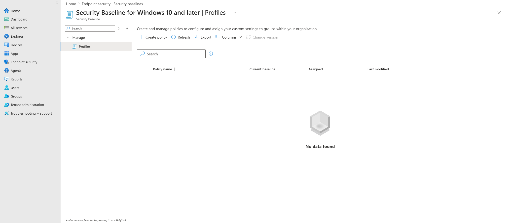

### Create baseline profile pane

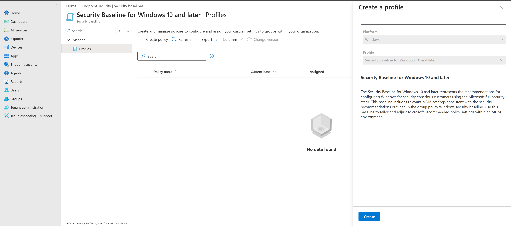

### Baseline profile basics

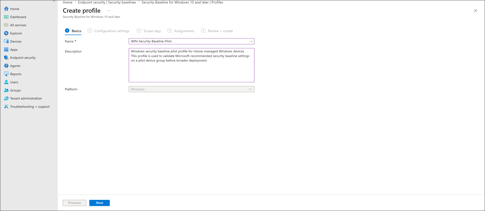

### Baseline configuration settings

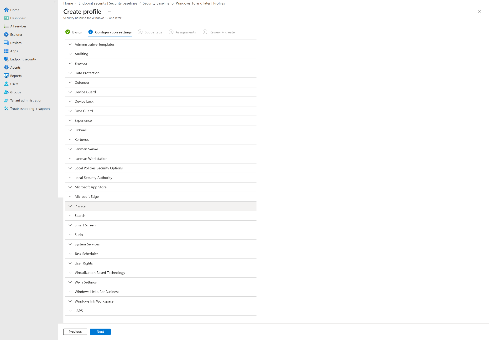

### Baseline assignment to Autopilot devices group

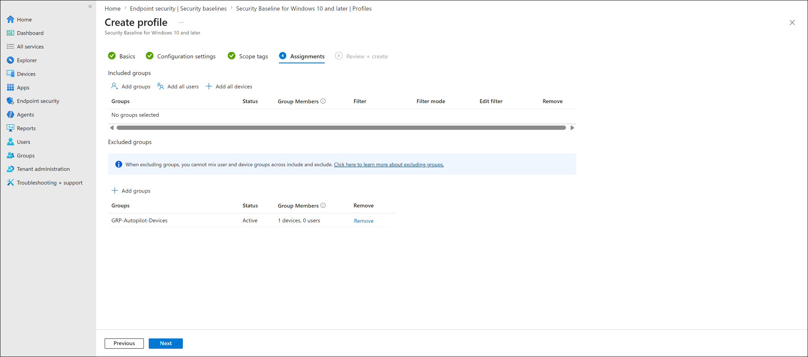

### Device status pending

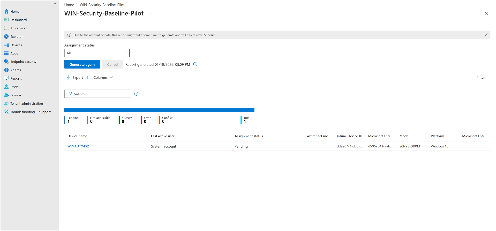

### Device status error

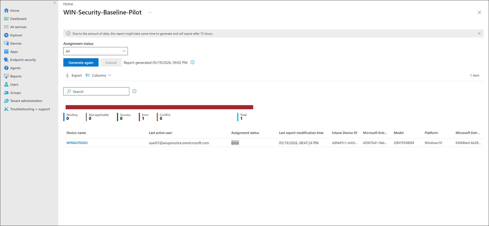

### Policy setting error for VBS

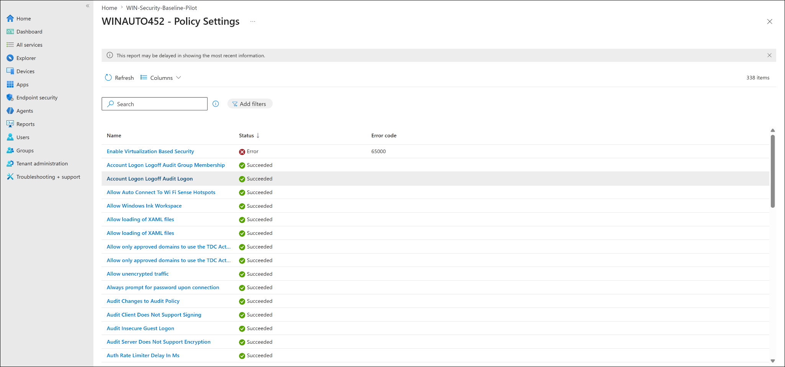

### VBS remediation set to Not configured

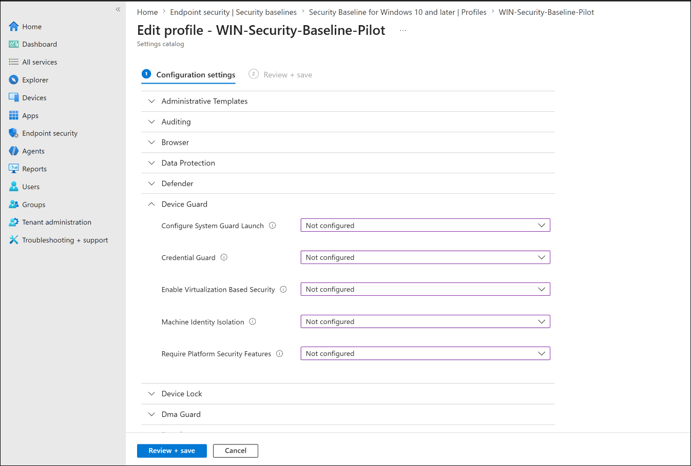

### Device status conflict

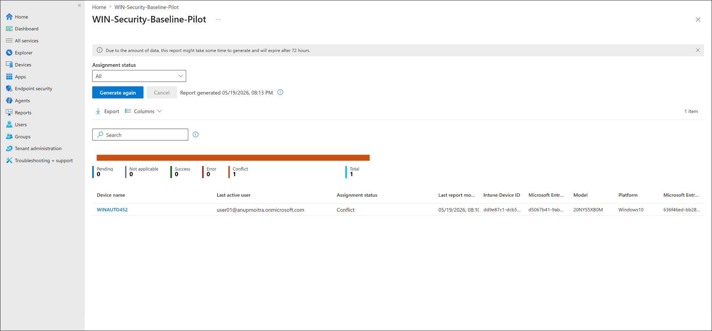

### Policy settings conflict details

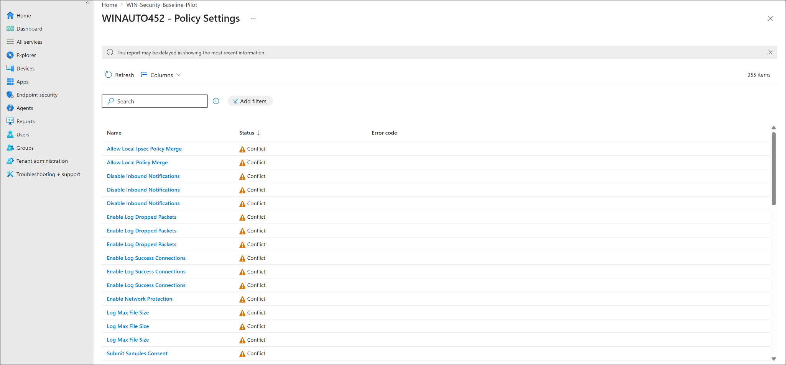

### Baseline assignment edited for Autopilot devices group

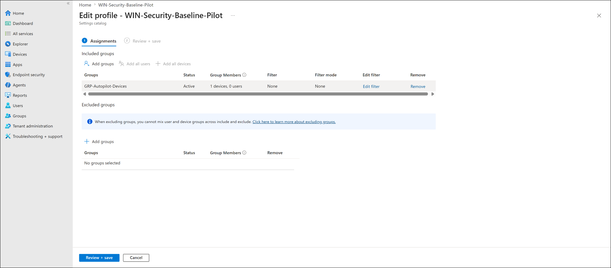

### Final device status success

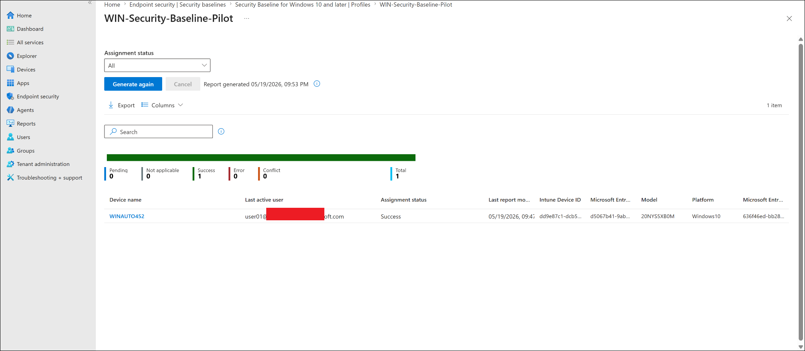

> [!NOTE]
> A separate Review + create screenshot was not captured for this lab. The documentation uses the created profile, assignment, troubleshooting, remediation, and final success screenshots as evidence instead.

> [!NOTE]
> Screenshots must be sanitized before upload. Hide tenant names, full email addresses, device IDs, object IDs, serial numbers, and top-right signed-in account details.

---

## Screenshot Files

```text
windows-security-baseline-01-baseline-overview-sanitized.png
windows-security-baseline-02-create-profile-pane-sanitized.png
windows-security-baseline-03-basics-sanitized.png
windows-security-baseline-04-configuration-settings-sanitized.png
windows-security-baseline-05-assignment-autopilot-devices-sanitized.png
windows-security-baseline-06-device-status-pending-sanitized.png
windows-security-baseline-07-device-status-error-sanitized.png
windows-security-baseline-08-policy-setting-error-vbs-sanitized.png
windows-security-baseline-09-remediation-vbs-not-configured-sanitized.png
windows-security-baseline-10-device-status-conflict-sanitized.png
windows-security-baseline-11-policy-settings-conflict-details-sanitized.png
windows-security-baseline-12-assignment-edited-autopilot-devices-sanitized.png
windows-security-baseline-13-device-status-success-sanitized.png
```

---

## Troubleshooting Notes

### Conflict reported after baseline assignment

If the security baseline reports Conflict:

1. Open the affected device from Device assignment status.
2. Filter policy settings by Conflict.
3. Identify the setting names.
4. Compare those settings with existing endpoint security policies.
5. Decide which policy should own the setting.
6. Set the duplicate baseline setting to Not configured if a dedicated policy already manages it.
7. Save, sync the device, and regenerate the report.

In this lab, Firewall and Defender related conflicts were resolved by setting overlapping baseline settings to Not configured.

---

### Error 65000 for Enable Virtualization Based Security

If the baseline reports:

```text
Enable Virtualization Based Security
Error code: 65000
```

Review related Device Guard and virtualization-based security settings.

For lab devices, these settings can depend on:

- Secure Boot
- TPM
- Virtualization support
- Firmware settings
- Windows security capability
- Hypervisor support

In this lab, the Device Guard and VBS related settings were changed to Not configured, then the device was synced again.

---

### Pending status after remediation

Pending can appear after saving baseline changes.

Recommended actions:

1. Sync the device from Intune.
2. Sync from Windows Settings > Accounts > Access work or school.
3. Restart the test device if security settings were changed.
4. Wait for policy reporting to update.
5. Generate the baseline report again.

---

## What This Lab Proves

This lab proves that Microsoft Intune can deploy a Windows Security Baseline to a pilot Windows device and that baseline reporting can be used for real troubleshooting.

Completed flow:

```text
Windows Security Baseline profile created
-> Assigned to GRP-Autopilot-Devices
-> WINAUTO452 received the baseline
-> Initial conflicts identified
-> Firewall and Defender overlaps remediated
-> VBS / Device Guard error identified
-> VBS related settings remediated
-> Final assignment status showed Success
```

This is a realistic endpoint administration scenario because production Intune environments often contain multiple policies that can overlap. The important admin skill is not only creating the baseline, but also knowing how to investigate and remediate policy conflicts.

---

## Microsoft Documentation References

- Microsoft Intune security baselines overview: https://learn.microsoft.com/en-us/intune/device-security/security-baselines/overview
- Monitor security baselines and profiles in Microsoft Intune: https://learn.microsoft.com/en-us/intune/device-security/security-baselines/monitor-baselines

---

## Security and Privacy Notes

This is a public learning repository.

Do not upload:

- Full real email addresses
- Real tenant names
- Tenant IDs
- Device IDs
- Object IDs
- Serial numbers
- Passwords
- MFA QR codes
- BitLocker recovery keys
- Unsanitized screenshots

Before uploading screenshots, hide or blur:

- Top-right signed-in admin account
- Tenant or domain name
- Full user principal names
- Device IDs
- Object IDs
- Serial numbers
- Any sensitive endpoint identifiers

---

## Current Status

| Task | Status |
|---|---|
| windows-security-baseline.md updated | Completed |
| Windows Security Baseline created in Intune | Completed |
| Baseline assigned to pilot device group | Completed |
| Initial policy status reviewed | Completed |
| Conflict troubleshooting completed | Completed |
| Error troubleshooting completed | Completed |
| Final device assignment status verified | Completed |
| Screenshots selected for documentation | Completed |
| Lab documentation updated | Completed |

---

## Next Step

Continue to remote actions and monitoring:

```text
07-remote-actions-and-monitoring/device-sync-remote-actions.md
```

Suggested follow-on troubleshooting lab:

```text
08-troubleshooting/security-baseline-conflict-troubleshooting.md
```
