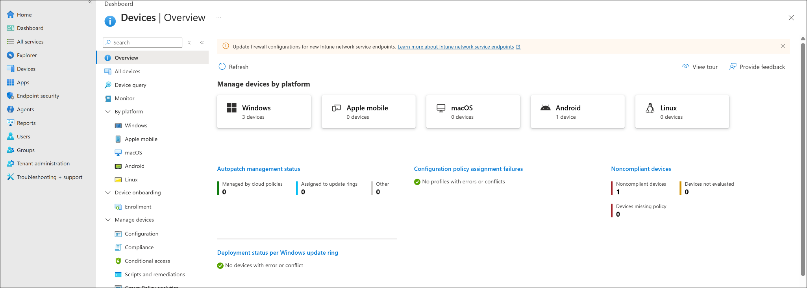
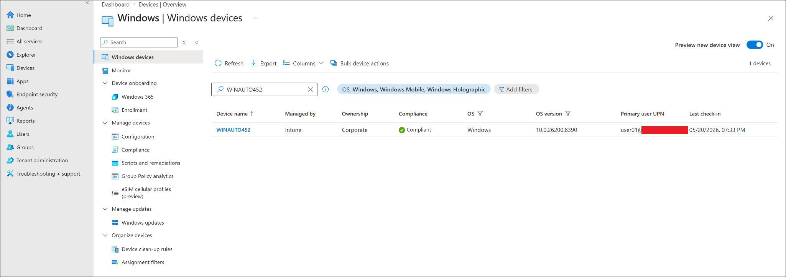
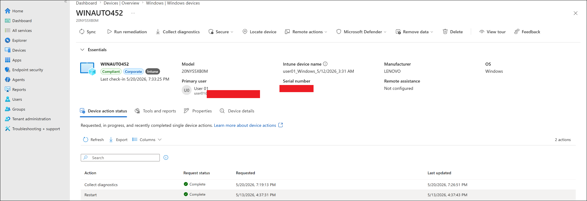
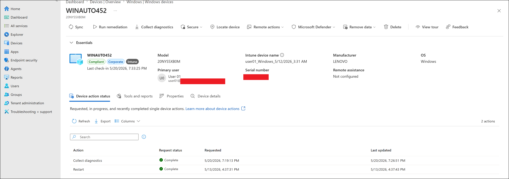
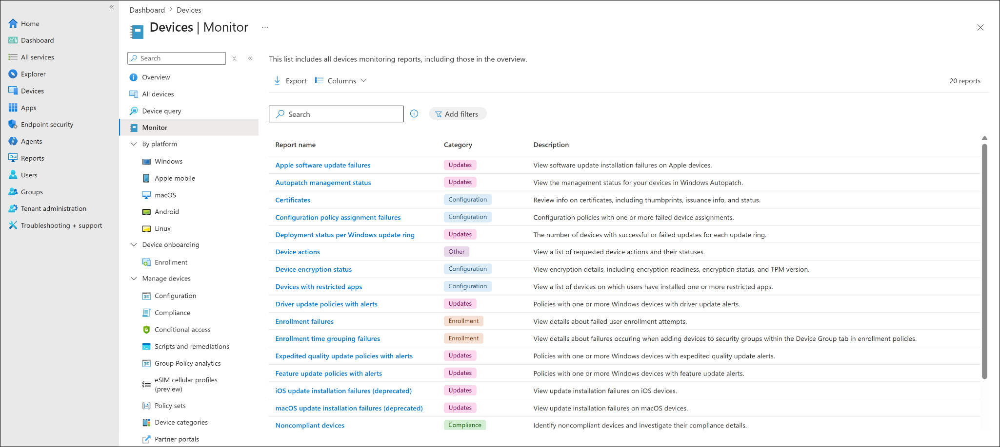
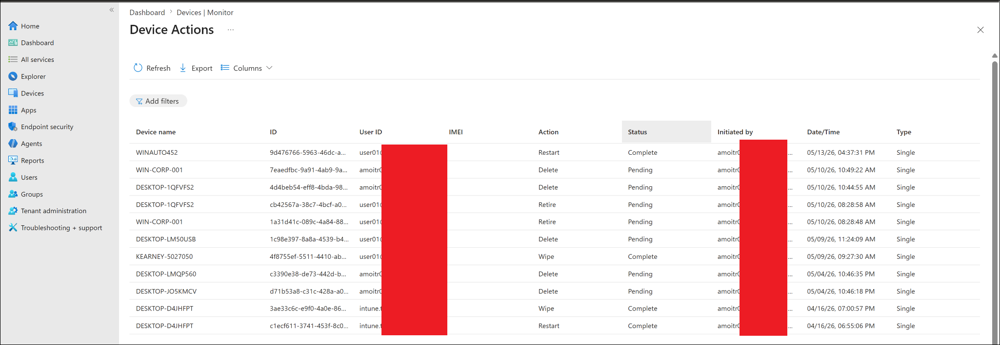
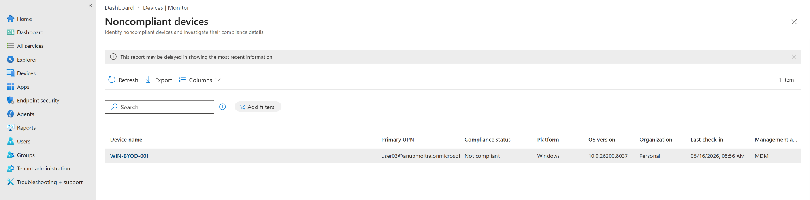
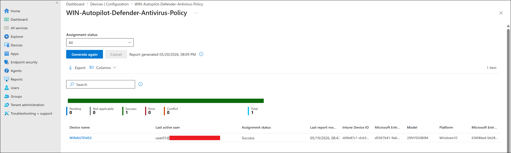

# Device Monitoring and Reports

This lab documents how to use Microsoft Intune monitoring and reporting views to review device inventory, device health, compliance state, remote action history, and configuration policy assignment status.

---

## Objective

Use Microsoft Intune monitoring and reporting features to validate the operational state of managed Windows devices.

This lab validates that:

- Windows devices can be reviewed from the Intune device inventory.
- Device compliance, ownership, management type, OS version, and last check-in can be reviewed.
- Device-level remote action history can be checked from the **Device action status** tab.
- Tenant-level device monitoring reports can be accessed from **Devices -> Monitor**.
- Device action history can be reviewed from the **Device Actions** report.
- Noncompliant devices can be identified from the **Noncompliant devices** report.
- Configuration policy assignment status can be reviewed from a policy report.
- Intune reporting delay behavior is understood and documented.

---

## Why This Lab Matters

In a real Intune administrator role, creating policies is only half of the job. The other half is monitoring whether those policies actually reached devices and whether devices remain healthy and compliant.

Device monitoring and reporting helps administrators answer questions such as:

- Is the device still checking in with Intune?
- Is the device compliant or noncompliant?
- Which user is associated with the device?
- Did a remote action complete successfully?
- Are any configuration profiles failing?
- Are there devices with errors, conflicts, or pending states?
- Which reports should helpdesk or endpoint administrators use during troubleshooting?

Simple troubleshooting flow:

```text
Intune admin center
-> Devices
-> Review device inventory
-> Open device details
-> Check compliance and last check-in
-> Review device action status
-> Use Devices -> Monitor reports
-> Investigate noncompliance or configuration assignment issues
```

This is especially important in modern endpoint management because devices may be remote, hybrid, or internet-connected only. Administrators often need to troubleshoot without physical access to the device.

---

## Lab Environment

| Item | Value |
|---|---|
| Management platform | Microsoft Intune |
| Device platform | Windows |
| Primary test device | WINAUTO452 |
| Device ownership | Corporate |
| Device state | Compliant |
| Managed by | Intune |
| Primary user | user01 |
| Additional observed device | BYOD/noncompliant Windows test device |
| Lab section | Remote Actions and Monitoring |
| Current status | Completed |

---

## Prerequisites

Before starting this lab, the following should already be completed:

- A Windows device is enrolled into Microsoft Intune.
- The device is visible under **Windows devices**.
- At least one policy has been assigned to the device.
- At least one remote action has already been performed or reviewed.
- Admin account has permission to view Intune devices and reports.
- Screenshots are sanitized before being uploaded to the public GitHub repository.

---

## Important Notes

This lab is a **read-only monitoring and reporting lab**.

No destructive remote actions were performed in this lab:

```text
Retire
Wipe
Delete
Autopilot reset
Fresh start
```

Those actions should be handled separately in a final reset/removal lab or reviewed without execution.

---

## Reports and Views Reviewed

| Area | Purpose |
|---|---|
| Devices overview | High-level device monitoring dashboard |
| Windows devices list | Windows device inventory and last check-in review |
| Device overview | Device-specific compliance, ownership, and management details |
| Device action status | Device-level remote action history |
| Devices Monitor report list | Central list of device monitoring reports |
| Device Actions report | Tenant-level remote action history |
| Noncompliant devices report | View devices that are currently noncompliant |
| Configuration policy status | Validate policy assignment result for a specific configuration policy |

---

## Steps Performed

### Step 1: Reviewed Devices Overview

Navigation used:

```text
Microsoft Intune admin center
-> Devices
-> Overview
```

The Devices overview page was used to review high-level platform and monitoring information.

Observed items included:

- Device platform summary.
- Windows device count.
- Noncompliant devices tile.
- Configuration policy assignment failure summary.
- Additional monitoring report entry points.

This view is useful as a starting point when checking overall tenant device health.

---

### Step 2: Reviewed Windows Devices List

Navigation used:

```text
Devices
-> Windows
-> Windows devices
```

The Windows device list was filtered/searched for the primary test device:

```text
WINAUTO452
```

The device list showed useful inventory and monitoring columns, including:

- Device name.
- Managed by.
- Ownership.
- Compliance.
- OS.
- OS version.
- Primary user UPN.
- Last check-in.

Observed result:

```text
WINAUTO452 was listed as Intune-managed, corporate-owned, and compliant.
```

---

### Step 3: Opened the Device Overview Page

The test device was opened from the Windows devices list.

Navigation used:

```text
Devices
-> Windows
-> Windows devices
-> WINAUTO452
```

The device overview page confirmed:

- Device name: `WINAUTO452`
- Compliance state: `Compliant`
- Ownership: `Corporate`
- Managed by: `Intune`
- Primary user was visible.
- Last check-in time was visible.
- Remote action buttons were available in the top action bar.

This page is important because it gives helpdesk and endpoint admins a device-specific view before deeper troubleshooting.

---

### Step 4: Reviewed Device-Level Action Status

On the device page, the **Device action status** tab was reviewed.

Navigation used:

```text
WINAUTO452
-> Device action status
```

The device action status page showed previous remote actions and their request status.

Observed actions included:

```text
Collect diagnostics -> Complete
Restart -> Complete
```

This confirmed that Intune remote actions were visible from the device-level monitoring view.

---

### Step 5: Reviewed Devices Monitor Report List

Navigation used:

```text
Devices
-> Monitor
```

The Devices Monitor page displayed the available monitoring reports for device operations.

Reports visible in this area included examples such as:

- Device actions.
- Noncompliant devices.
- Configuration policy assignment failures.
- Device encryption status.
- Enrollment failures.
- Windows update-related reports.

This page is useful because it groups multiple operational reports in one place.

---

### Step 6: Reviewed Device Actions Report

Navigation used:

```text
Devices
-> Monitor
-> Device actions
```

The Device Actions report showed tenant-level remote action history.

Observed columns included:

- Device name.
- Device ID.
- User ID.
- Action.
- Status.
- Initiated by.
- Date/Time.
- Type.

Observed action examples included:

```text
Restart
Retire
Wipe
Delete
```

This report is useful for auditing and troubleshooting remote actions across the tenant.

> [!IMPORTANT]
> Some historical actions such as Wipe, Delete, and Retire were visible in the report from previous lab activity, but this specific monitoring lab did not execute destructive actions.

---

### Step 7: Reviewed Noncompliant Devices Report

Navigation used:

```text
Devices
-> Monitor
-> Noncompliant devices
```

The report showed a Windows test device marked as noncompliant.

Observed columns included:

- Device name.
- Primary UPN.
- Compliance status.
- Platform.
- OS version.
- Ownership.
- Last check-in.
- Management authority.

Observed result:

```text
A Windows BYOD/test device was listed as Not compliant.
```

This report is useful for quickly identifying devices that need investigation or remediation.

---

### Step 8: Reviewed Configuration Policy Assignment Status

Navigation used:

```text
Devices
-> Configuration
-> Select policy
-> Device assignment status
```

The selected policy was:

```text
WIN-Autopilot-Defender-Antivirus-Policy
```

The policy assignment status showed:

```text
Pending: 0
Not applicable: 0
Success: 1
Error: 0
Conflict: 0
Total: 1
```

Observed result:

```text
WINAUTO452 reported Success for the selected Defender Antivirus configuration policy.
```

This validates that configuration policy monitoring can be used to confirm whether a specific policy successfully applied to a target device.

---

## Expected Result

After this lab:

- The Windows device should appear in the Windows devices inventory.
- Device compliance and ownership should be visible.
- The device should show last check-in information.
- Device action status should show previous remote actions.
- Devices Monitor should list operational reports.
- Device Actions report should show remote action history.
- Noncompliant devices report should identify noncompliant devices.
- Configuration policy status should show assignment results for a selected policy.

---

## Test Result

| Test Item | Result |
|---|---|
| Devices overview reviewed | Completed |
| Windows devices list reviewed | Completed |
| WINAUTO452 located in Windows device inventory | Completed |
| Device compliance status reviewed | Completed |
| Device ownership and management state reviewed | Completed |
| Last check-in reviewed | Completed |
| Device action status reviewed | Completed |
| Device Monitor report list reviewed | Completed |
| Device Actions report reviewed | Completed |
| Noncompliant devices report reviewed | Completed |
| Configuration policy assignment status reviewed | Completed |
| Final lab result | Completed |

---

## Screenshots

Screenshots are stored in:

```text
screenshots/sanitized/remote-actions-and-monitoring/
```

### Devices overview



### Windows devices list



### Device overview



### Device action status



### Devices Monitor report list



### Device Actions report



### Noncompliant devices report



### Configuration policy status



> [!NOTE]
> Screenshots were sanitized before upload. Tenant names, full email addresses, serial numbers, device identifiers, user identifiers, and top-right signed-in account details should be hidden before publishing publicly.

---

## Screenshot Files

```text
device-monitoring-01-devices-overview.png
device-monitoring-02-windows-devices-list.png
device-monitoring-03-device-overview.png
device-monitoring-04-device-action-status.png
device-monitoring-05-devices-monitor-report-list.png
device-monitoring-06-device-actions-report.png
device-monitoring-07-noncompliant-devices-report.png
device-monitoring-08-configuration-policy-status.png
```

---

## Key Observations

- `WINAUTO452` was visible in the Windows device inventory.
- The device was Intune-managed and corporate-owned.
- The device reported as compliant.
- Device last check-in information was visible.
- Device-level action history showed completed actions.
- The Devices Monitor page provided access to multiple operational reports.
- The Device Actions report showed tenant-level remote action history.
- The Noncompliant devices report identified a separate Windows test/BYOD device as noncompliant.
- Configuration policy assignment status confirmed a successful Defender Antivirus policy deployment to `WINAUTO452`.

---

## Reporting Delay Notes

Intune reporting may not update instantly.

In real environments, report data can depend on:

- Device check-in timing.
- Policy refresh cycles.
- Device connectivity.
- Service-side report generation.
- Report filter selections.
- Whether the report was manually generated/refreshed.

This is why some reports include messages such as:

```text
This report may be delayed in showing the most recent information.
```

For troubleshooting, always compare:

```text
Device last check-in time
Report generation time
Policy assignment status
Device action status
```

---

## Troubleshooting Notes

If a device does not appear in the Windows device list:

1. Confirm the device is enrolled in Intune.
2. Confirm the correct platform filter is selected.
3. Search by device name.
4. Check whether the device was deleted, retired, or unenrolled.
5. Confirm the admin account has permission to view devices.

If report data looks outdated:

1. Click **Refresh** or **Generate again** where available.
2. Check the device last check-in time.
3. Sync the device from Intune or locally from Windows Settings.
4. Wait for reporting data to update.
5. Confirm filters are not hiding the expected data.

If a policy shows Error or Conflict:

1. Open the affected policy.
2. Review device assignment status.
3. Review per-setting status where available.
4. Compare with other policies that may configure the same setting.
5. Check whether the device supports the setting.
6. Review the error code and Microsoft documentation.

If a device is noncompliant:

1. Open the device record.
2. Review compliance policy state.
3. Check which compliance setting failed.
4. Confirm the device has checked in recently.
5. Sync the device and recheck status.
6. Review Conditional Access impact if applicable.

---

## Security and Privacy Notes

This is a public learning repository.

Do not upload:

- Full real email addresses
- Real tenant names
- Tenant IDs
- Device IDs
- Object IDs
- Serial numbers
- Exchange IDs
- Internal IP addresses
- Diagnostic ZIP packages
- Passwords
- MFA codes or QR codes
- Unsanitized screenshots

Before uploading screenshots, hide or blur:

- Top-right signed-in admin account
- Tenant or domain name
- Full user principal names
- Device identifiers
- Serial numbers
- Local account identifiers
- Organization-specific identifiers

---

## Real-World Admin Takeaway

In a real support scenario, an Intune administrator should not stop after creating a policy. The administrator should also verify the outcome using monitoring and reports.

Recommended validation flow after deploying or troubleshooting a policy:

```text
1. Confirm device is enrolled and checking in.
2. Confirm device compliance state.
3. Review policy assignment status.
4. Review per-device action history.
5. Review tenant-level reports for wider impact.
6. Use filters/search/export when investigating multiple devices.
```

This lab demonstrates the monitoring mindset needed for endpoint administration roles.

---

## References

- Microsoft Learn: Intune reports overview  
  https://learn.microsoft.com/en-us/intune/device-management/reports/overview

- Microsoft Learn: Monitor device compliance policies  
  https://learn.microsoft.com/en-us/intune/device-security/compliance/monitor-policy

- Microsoft Learn: Monitor device configuration profiles  
  https://learn.microsoft.com/en-us/intune/device-configuration/monitor-device-profile

- Microsoft Learn: Device actions in Microsoft Intune  
  https://learn.microsoft.com/en-us/intune/device-management/actions/

---

## Current Status

| Task | Status |
|---|---|
| device-monitoring-and-reports.md created | Completed |
| Devices overview reviewed | Completed |
| Windows devices list reviewed | Completed |
| Device overview reviewed | Completed |
| Device action status reviewed | Completed |
| Devices Monitor report list reviewed | Completed |
| Device Actions report reviewed | Completed |
| Noncompliant devices report reviewed | Completed |
| Configuration policy assignment status reviewed | Completed |
| Screenshots added | Completed |
| Final lab status | Completed |

---

## Next Step

Continue to the final Remote Actions and Monitoring lab:

```text
07-remote-actions-and-monitoring/restart-retire-wipe-actions.md
```

Recommended approach:

```text
Perform Restart hands-on.
Review Retire and Wipe screens only if needed.
Do not execute Retire or Wipe on the active Autopilot lab device unless intentionally ready to rebuild or re-enroll the device.
```
