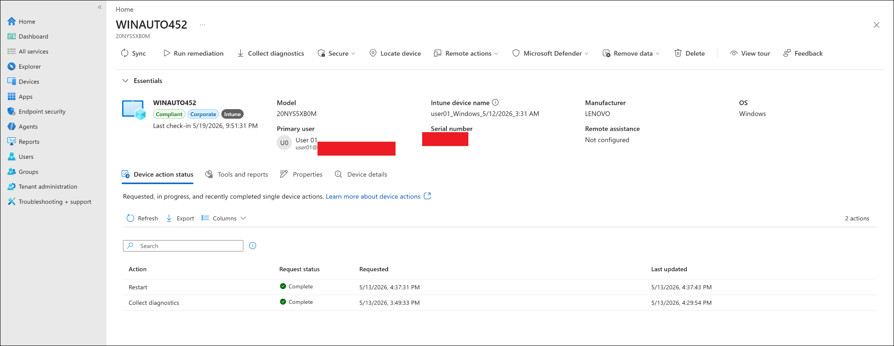
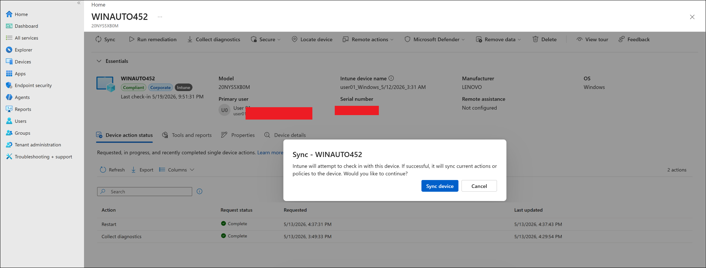
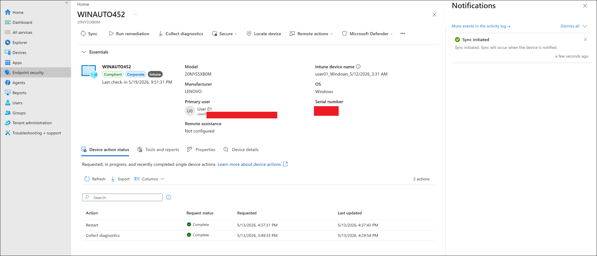
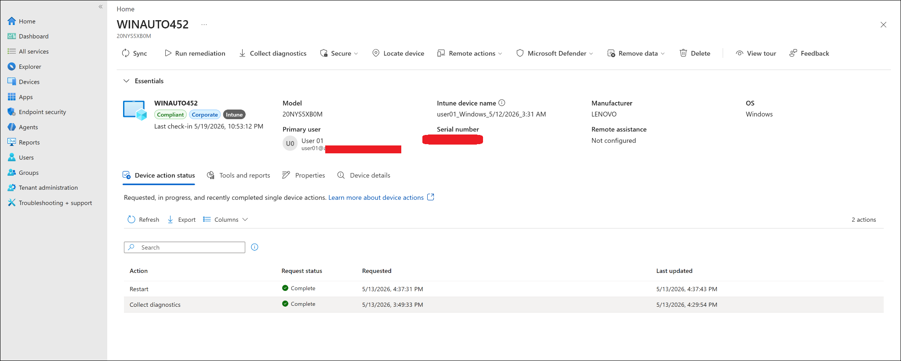
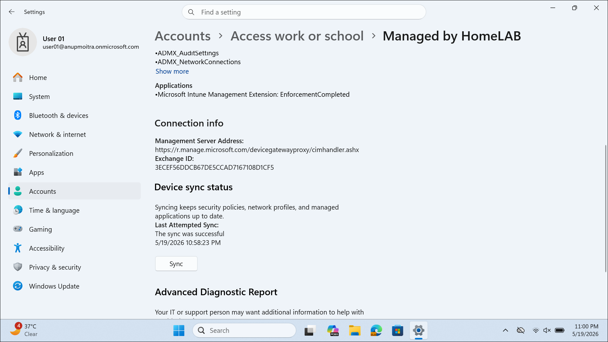

# Device Sync Remote Actions

This lab documents how to trigger a Windows device sync from the Microsoft Intune admin center and how to perform a local sync from Windows Settings.

---

## Objective

Use Microsoft Intune remote actions to manually sync an enrolled Windows device and verify that the device checks in successfully.

This lab validates that:

- A Windows device can be opened from the Intune admin center.
- The Intune **Sync** remote action can be initiated from the device overview page.
- The device can also be synced locally from Windows Settings.
- The device last check-in time can update after sync.
- The device remains compliant and managed by Intune.

---

## Why This Lab Matters

Remote actions are common in real endpoint administration work.

When a policy, app, compliance rule, or security profile is assigned in Intune, the device may not receive it immediately. A support analyst or Intune administrator can trigger a sync to ask the device to check in and receive the latest policy or configuration.

Simple flow:

```text
Intune admin center
-> Open managed Windows device
-> Trigger Sync remote action
-> Device receives sync request
-> Device checks in with Intune
-> Latest policies and configurations are evaluated
```

This is useful when troubleshooting delayed policy deployment, app installation issues, compliance updates, or endpoint security configuration changes.

---

## Lab Environment

| Item | Value |
|---|---|
| Management platform | Microsoft Intune |
| Device platform | Windows |
| Test device | WINAUTO452 |
| Device ownership | Corporate |
| Device state | Compliant |
| Managed by | Intune |
| Primary user | user01 |
| Lab section | Remote Actions and Monitoring |
| Current status | Completed |

---

## Prerequisites

Before starting this lab, the following should already be completed:

- Windows device enrolled into Microsoft Intune.
- Device visible in the Intune admin center.
- Device has internet connectivity.
- Signed-in admin account has permission to perform Intune remote actions.
- Device is active or able to receive remote commands.

---

## Important Notes

This lab uses the safe **Sync** action only.

The following actions were not performed in this lab:

```text
Retire
Wipe
Delete
Autopilot reset
Fresh start
```

Those actions can remove data, reset the device, or remove management. They should be tested separately and carefully in dedicated labs.

---

## Remote Action Used

| Remote Action | Purpose | Risk Level |
|---|---|---|
| Sync | Requests the device to check in with Intune and apply latest policies/configurations | Low |

---

## Steps Performed

### Step 1: Opened the Windows Device in Intune

Navigation used:

```text
Microsoft Intune admin center
-> Devices
-> Windows
-> Windows devices
-> WINAUTO452
```

The device overview page confirmed:

- Device name: `WINAUTO452`
- Compliance state: `Compliant`
- Ownership: `Corporate`
- Managed by: `Intune`
- Last check-in time was visible before running the sync action.

---

### Step 2: Triggered Remote Sync from Intune

From the device overview page, the following action was selected:

```text
Sync
```

Intune displayed a confirmation dialog for the device sync action.

The action confirmed that Intune would attempt to check in with the device and sync current actions or policies.

---

### Step 3: Confirmed Sync Action

The sync action was confirmed by selecting:

```text
Sync device
```

After confirmation, the Intune notification panel displayed:

```text
Sync initiated
Sync will occur when the device is notified.
```

This confirmed that the remote sync request was successfully initiated from the Intune admin center.

---

### Step 4: Verified Last Check-in After Remote Sync

The device overview was refreshed after the sync action.

The last check-in time updated after the remote sync request.

Observed result:

```text
Last check-in updated after remote sync
```

This confirms that the device successfully checked in after the sync request.

---

### Step 5: Performed Local Sync from Windows Settings

On the Windows device, local sync was performed from Windows Settings.

Navigation used:

```text
Settings
-> Accounts
-> Access work or school
-> Managed by HomeLAB
-> Device sync status
-> Sync
```

The local Windows sync page showed:

```text
The sync was successful
```

This confirmed that the device could also manually sync from the Windows endpoint side.

---

## Expected Result

After this lab:

- The Intune device overview should show the Windows device as managed.
- The Sync remote action should be available from the device action bar.
- The sync confirmation prompt should appear.
- The sync initiated notification should appear in Intune.
- The last check-in time should update after sync.
- Local Windows sync should complete successfully.

---

## Test Result

| Test Item | Result |
|---|---|
| Windows device opened in Intune | Completed |
| Device status verified as Compliant | Completed |
| Device verified as Intune managed | Completed |
| Remote Sync action selected | Completed |
| Sync confirmation prompt displayed | Completed |
| Sync action initiated | Completed |
| Last check-in updated after remote sync | Completed |
| Local Windows sync completed | Completed |
| Final lab result | Completed |

---

## Screenshots

Screenshots are stored in:

```text
screenshots/sanitized/remote-actions-and-monitoring/
```

### Device overview before sync



### Remote sync confirmation



### Sync initiated notification



### Last check-in after remote sync



### Local Windows sync success



> [!NOTE]
> Screenshots were sanitized before upload. Tenant names, full email addresses, serial numbers, device identifiers, account identifiers, and top-right signed-in account details should be hidden before publishing publicly.

---

## Screenshot Files

```text
device-sync-remote-actions-01-device-overview-before-sync.png
device-sync-remote-actions-02-remote-sync-confirmation.png
device-sync-remote-actions-03-sync-initiated-notification.png
device-sync-remote-actions-04-last-check-in-after-remote-sync.png
device-sync-remote-actions-05-local-windows-sync-success.png
```

---

## Observations

The Intune notification confirmed that the remote sync was initiated successfully.

The device action status tab already contained previous actions such as Restart and Collect diagnostics. The newly triggered sync was validated mainly through:

- Sync confirmation dialog
- Sync initiated notification
- Updated last check-in time
- Successful local Windows sync

This is acceptable because device action reporting can take time to update, and the last check-in/local sync evidence confirms that the device communicated with Intune.

---

## Troubleshooting Notes

If the Sync action does not appear:

1. Confirm the device is enrolled in Intune.
2. Confirm the device platform supports the action.
3. Check the admin role permissions.
4. Check whether the action is hidden under the overflow menu.

If sync is initiated but the device does not check in:

1. Confirm the device is powered on.
2. Confirm the device has internet connectivity.
3. Wait several minutes and refresh the device overview.
4. Perform a local sync from Windows Settings.
5. Check the device last check-in time again.

If local sync fails:

1. Confirm the work or school account is connected.
2. Confirm the device is still enrolled.
3. Confirm the user has a valid Intune-capable license.
4. Restart the device and try sync again.
5. Review Intune device troubleshooting information.

---

## Security and Privacy Notes

This is a public learning repository.

Do not upload:

- Full real email addresses
- Real tenant names
- Tenant IDs
- Device IDs
- Object IDs
- Serial numbers
- Exchange IDs
- Internal IP addresses
- Passwords
- MFA codes or QR codes
- Unsanitized screenshots

Before uploading screenshots, hide or blur:

- Top-right signed-in admin account
- Tenant or domain name
- Full user principal names
- Device identifiers
- Serial numbers
- Local account identifiers
- Organization-specific identifiers

---

## References

- Microsoft Learn: Device actions in Microsoft Intune  
  https://learn.microsoft.com/en-us/intune/device-management/actions/

- Microsoft Learn: Sync enrolled device for Windows  
  https://learn.microsoft.com/en-us/intune/user-help/device-actions/sync-device-windows

---

## Current Status

| Task | Status |
|---|---|
| device-sync-remote-actions.md created | Completed |
| Device opened in Intune | Completed |
| Remote sync initiated from Intune | Completed |
| Sync notification captured | Completed |
| Last check-in verified after remote sync | Completed |
| Local Windows sync verified | Completed |
| Screenshots added | Completed |
| Final lab status | Completed |

---

## Next Step

Continue to the next Remote Actions and Monitoring lab:

```text
07-remote-actions-and-monitoring/restart-retire-wipe-actions.md
```

Recommended approach for the next lab:

```text
Start with Restart only
Document Retire and Wipe as theoretical/safety-aware actions
Do not wipe or delete the lab device unless intentionally testing device reset behavior
```
