# Restart, Retire, and Wipe Remote Actions

## Lab Status

| Field | Value |
|---|---|
| Status | Completed |
| Lab category | Remote actions and monitoring |
| Primary device | WINAUTO452 |
| Additional device | WIN-CORP-001 |
| Actions tested | Restart, Retire, Wipe |
| Result | All actions completed and validated in Device Actions report |

> [!IMPORTANT]
> Retire and Wipe are destructive or semi-destructive actions. In production, confirm device ownership, business impact, and approval before executing. Both were performed here in a test environment on dedicated test devices.

---

## Lab Objective

Perform and validate the Restart, Retire, and Wipe remote actions from the Intune admin center. Confirm action completion from the device-level action status and the tenant-level Device Actions report.

---

## Why This Lab Matters

Remote actions let administrators support devices without physical access. The three actions in this lab cover the full range from non-destructive (Restart) to semi-destructive (Retire) to fully destructive (Wipe).

| Action | What it does | Data impact |
|---|---|---|
| Restart | Sends a restart command to the device | None |
| Retire | Removes company data and Intune management; personal data preserved | Removes corporate data and management |
| Wipe | Factory resets the device | Removes all data and settings |

---

## Devices Used

| Device | Action | Result |
|---|---|---|
| WINAUTO452 | Restart | Completed |
| WINAUTO452 | Retire | Completed |
| WIN-CORP-001 | Wipe | Completed |

---

## Prerequisites

- WINAUTO452 and WIN-CORP-001 enrolled in Intune
- Admin account has permission to perform remote actions

---

## Steps Performed

### Step 1 — Opened WINAUTO452 and located remote actions

Navigated to `Devices -> Windows -> Windows devices -> WINAUTO452`. Confirmed device state, then opened the Remote actions menu where Restart is located.

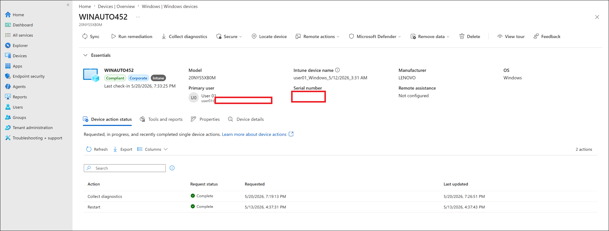

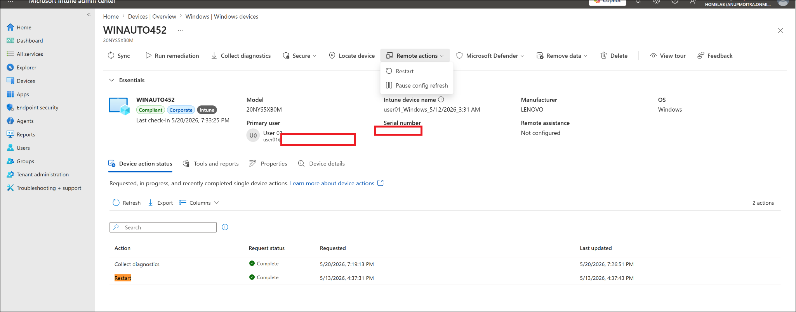

---

### Step 2 — Triggered Restart on WINAUTO452

Initiated the Restart action. The device action status progressed from Pending to Complete.

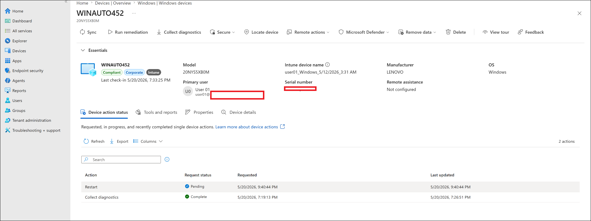

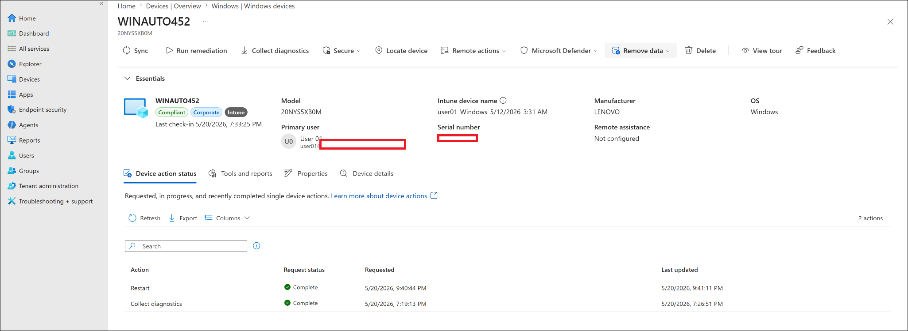

---

### Step 3 — Reviewed Remove data menu

Opened the Remove data menu to confirm where Retire, Wipe, Fresh start, and Autopilot reset are located in the Intune interface.

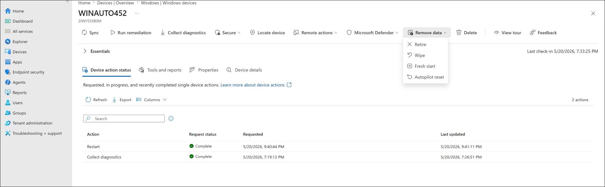

---

### Step 4 — Initiated Retire on WINAUTO452

Opened the Retire confirmation dialog for WINAUTO452. The dialog explained that Retire removes company data and Intune management while preserving personal data. Confirmed and initiated the action.

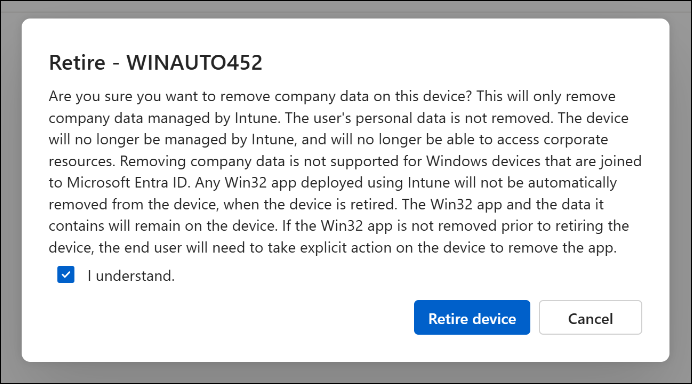

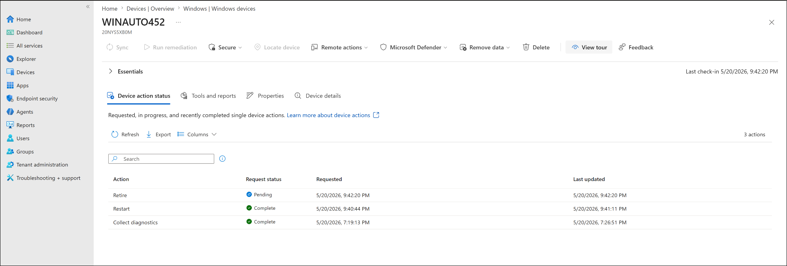

---

### Step 5 — Initiated Wipe on WIN-CORP-001

Opened the Wipe confirmation dialog for WIN-CORP-001. The dialog explained that factory reset removes all personal and company data from the device. Confirmed and initiated the action.

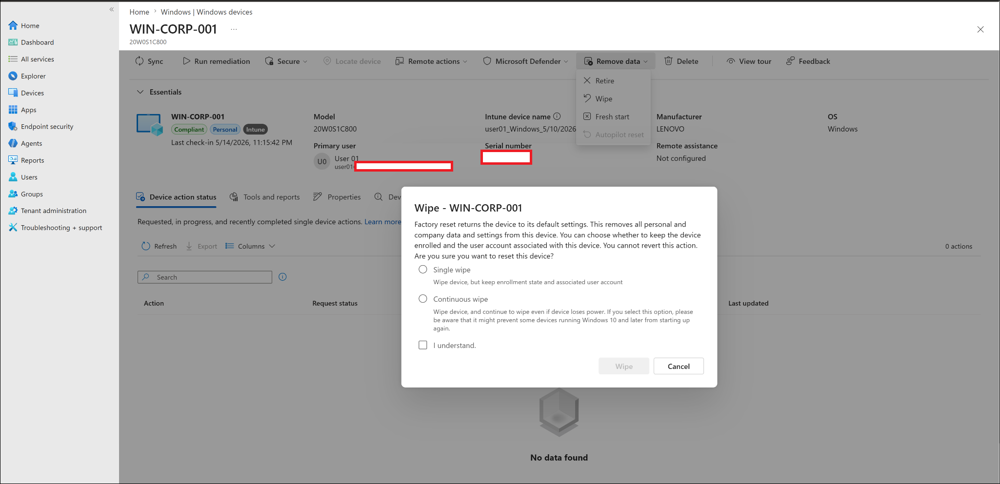

---

### Step 6 — Confirmed action notifications

The Intune notification panel confirmed all three actions were queued:

```text
Restart initiated
Retire initiated
Wipe initiated
```

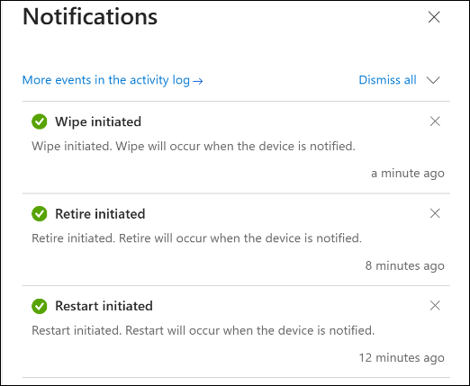

---

### Step 7 — Validated completion in Device Actions report

Navigated to `Devices -> Monitor -> Device actions`. The report confirmed all actions completed.

| Device | Action | Status |
|---|---|---|
| WIN-CORP-001 | Wipe | Complete |
| WINAUTO452 | Retire | Complete |
| WINAUTO452 | Restart | Complete |

After the Wipe completed for WIN-CORP-001, the device page returned a Not found message — expected behavior after a wipe/removal workflow.

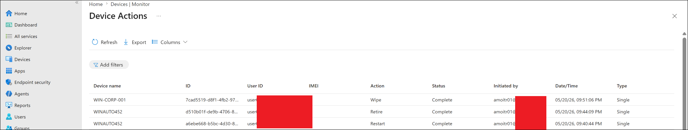

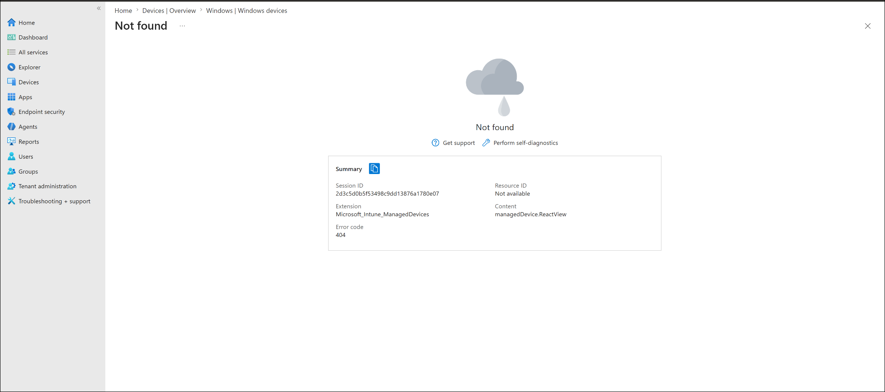

---

## Final Test Result

| Validation item | Result |
|---|---|
| Restart initiated and completed on WINAUTO452 | Completed |
| Retire initiated and completed on WINAUTO452 | Completed |
| Wipe initiated and completed on WIN-CORP-001 | Completed |
| Device Actions report confirmed all actions Complete | Completed |
| WIN-CORP-001 device page showed Not found after Wipe | Completed |

---

## Troubleshooting Notes

**Restart stays Pending** — confirm the device is online with internet access, sync from Intune or Windows Settings, and refresh the device action status page. Check the Device Actions report for the latest status.

**Retire or Wipe stays Pending** — confirm the device is connected to the internet and has checked in recently. Wait for the device to receive the queued command. Review the Device Actions report. If the device is offline, the action will process when it next connects.

**Device page shows Not found after Wipe** — this is expected after a Wipe completes and the device record state changes. Search for the device by name in the Windows devices list. Check the Device Actions report for completion evidence.

---

## Enterprise Reflection

In production, the Device Actions report is the audit trail for all remote actions. Before executing Retire or Wipe, always confirm the device name, assigned user, and ownership type — it is easy to select the wrong device from a long list. For corporate-owned devices, Retire removes company access cleanly. For devices that are lost, stolen, or being repurposed, Wipe ensures no data survives.

Restart is safe for active troubleshooting and can be used freely. Retire and Wipe require deliberate confirmation and should follow an internal approval process in most organizations.

---

## Related Labs

| Lab | Relationship |
|---|---|
| `07-remote-actions-and-monitoring/device-sync-remote-actions.md` | Sync — non-destructive action used before these |
| `07-remote-actions-and-monitoring/device-monitoring-and-reports.md` | Device Actions report reviewed in this lab |
| `08-troubleshooting/remote-actions-diagnostics-troubleshooting.md` | Case study referencing remote action behavior |

---

## Key Learning Outcomes

- Where Restart, Retire, and Wipe are located in the Intune admin center (Remote actions vs Remove data menus)
- The difference in data impact between Restart, Retire, and Wipe
- How the Device Actions report serves as the audit trail for remote action completion
- Why a device page returning Not found after Wipe is expected behavior
