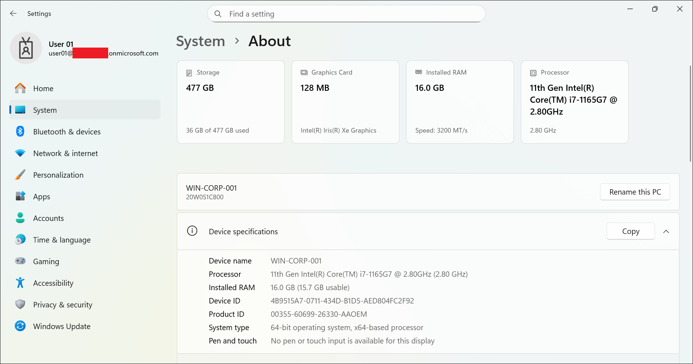
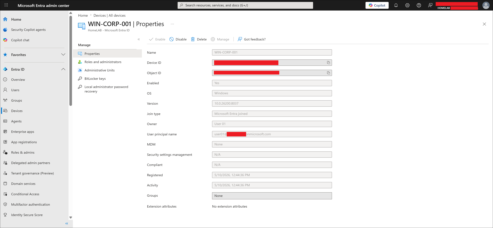
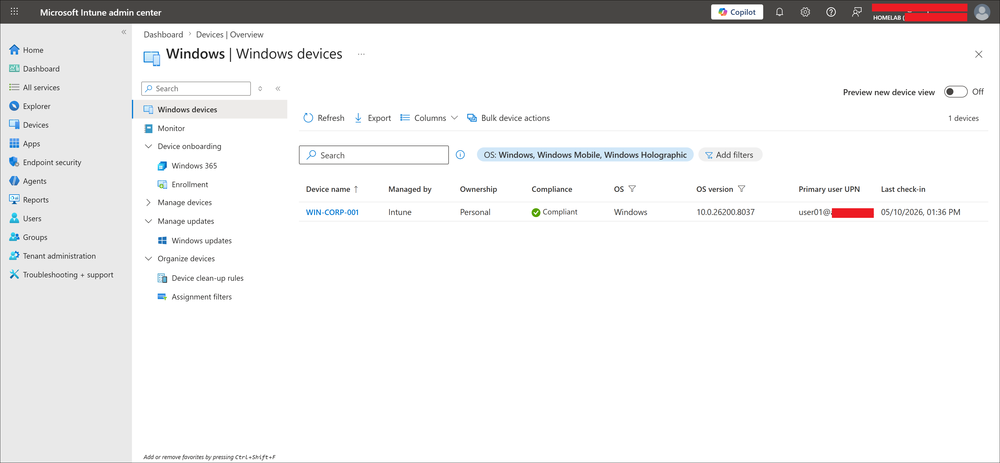
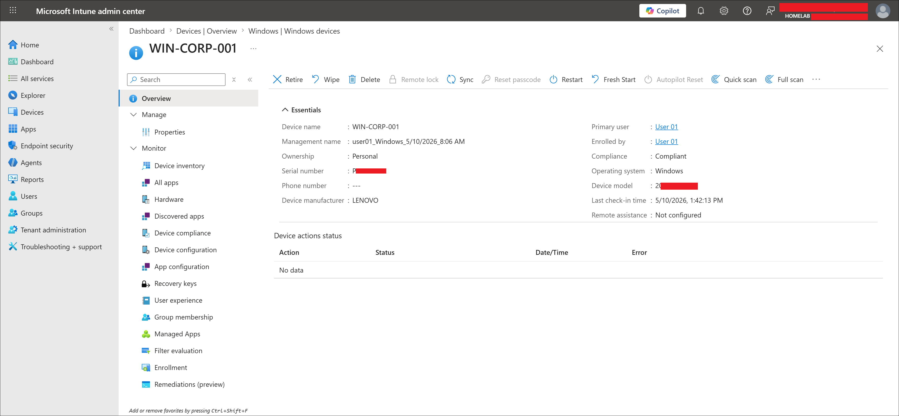

# Intune Enrollment Troubleshooting

## Case Study Status

| Field | Value |
|---|---|
| Status | Completed |
| Source lab | `02-device-enrollment/windows-oobe-enrollment.md` |
| Device | WIN-CORP-001 |
| Issue | Device Entra joined but MDM showed None |
| Resolution | Manual MDM enrollment from Windows Settings |
| Final result | Managed by Intune, Compliant |

Screenshots reused from `screenshots/sanitized/device-enrollment/`.

---

## Issue Summary

During Windows OOBE enrollment, WIN-CORP-001 successfully joined Microsoft Entra ID but did not enroll into Intune MDM. The Microsoft Entra device record showed:

```text
Join type: Microsoft Entra joined
MDM: None
```

The device did not appear in the Intune Windows devices list until manual MDM enrollment was completed.

---

## Why This Matters

Microsoft Entra join and Intune MDM enrollment are separate states. A device can be identity-joined without being managed:

| State | Meaning |
|---|---|
| Microsoft Entra joined | Device is in cloud identity |
| MDM: None | No MDM provider is managing the device |
| Managed by Intune | Device can receive policies, apps, and compliance evaluation |

Policies, compliance rules, app deployments, and endpoint security all require Intune management — not just Entra join.

---

## Troubleshooting Steps

### Step 1 — Verified local connection state

Checked `Settings -> Accounts -> Access work or school`. The device showed a connected work or school account, confirming Entra join was complete.



---

### Step 2 — Checked Microsoft Entra device record

Opened the device in Microsoft Entra admin center. The record confirmed:

```text
Join type: Microsoft Entra joined
MDM: None
```

This proved identity join worked but MDM enrollment had not completed.



---

### Step 3 — Confirmed device absent from Intune

The Intune Windows devices list did not show WIN-CORP-001, consistent with the MDM: None finding.

---

### Step 4 — Completed manual MDM enrollment

Enrolled from Windows Settings:

```text
Settings -> Accounts -> Access work or school -> Enroll only in device management
```

After enrollment and sync, WIN-CORP-001 appeared in Intune as managed, compliant, and showing Personal ownership.





---

## Root Cause

The device completed Entra join but automatic MDM enrollment did not trigger — likely because the user was not in scope for the configured MDM user scope at the time, or the automatic enrollment did not process during OOBE. Manual enrollment from Settings resolved it.

**Common checks for similar issues:**

- Confirm MDM user scope includes the affected user or group (`Entra admin center -> Identity -> Mobility (MDM and WIP) -> Microsoft Intune`)
- Confirm the user has an Intune-capable license
- Confirm enrollment restrictions allow Windows enrollment
- Check `Intune admin center -> Devices -> Monitor -> Enrollment failures` for error details
- Sync the device and retry enrollment if needed

---

## Key Learning

Microsoft Entra join and Intune management are not the same. Always verify both states when troubleshooting an enrollment issue:

- Entra join state — visible in the Entra device record
- MDM management state — visible in the same record and in the Intune device list

A device showing Entra joined but MDM: None is not managed and cannot receive Intune policies.

---

## Related Labs

| Lab | Relationship |
|---|---|
| `02-device-enrollment/windows-oobe-enrollment.md` | Source lab where this issue occurred |
| `08-troubleshooting/troubleshooting-summary.md` | Summary of all troubleshooting case studies |
