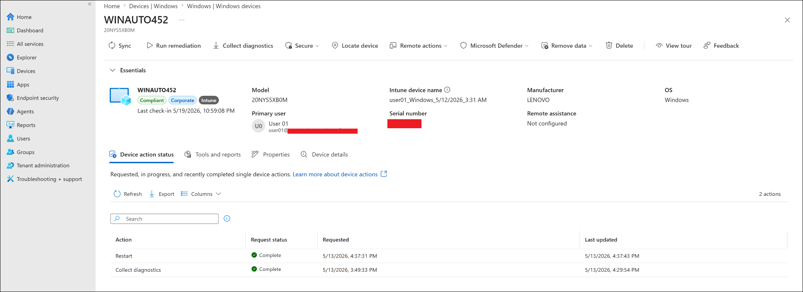
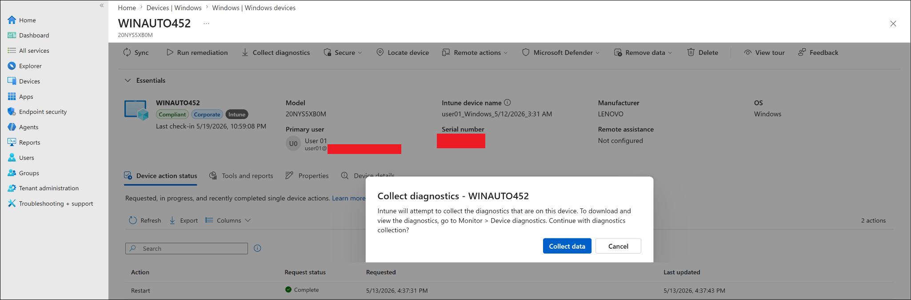
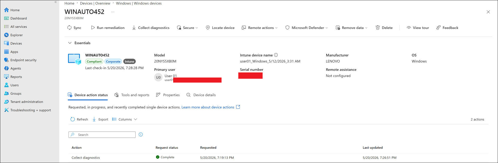
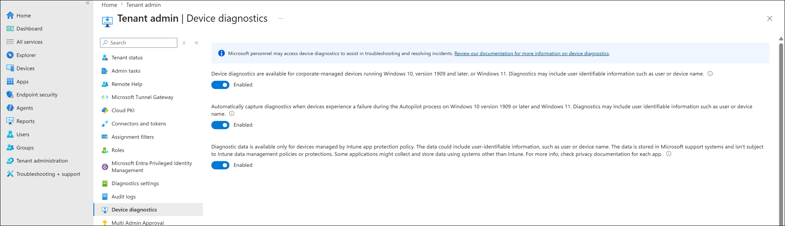

# Remote Actions Diagnostics Troubleshooting

## Case Study Status

| Field | Value |
|---|---|
| Status | Completed |
| Source lab | `07-remote-actions-and-monitoring/collect-diagnostics.md` |
| Device | WINAUTO452 |
| Issue | Expected Device diagnostics report not visible in tenant |
| Resolution | Validated using device-level Device action status |
| Final result | Collect diagnostics — Complete |

Screenshots reused from `screenshots/sanitized/remote-actions-and-monitoring/`.

---

## Issue Summary

During the Collect Diagnostics lab, Microsoft documentation referenced a separate Device diagnostics report under `Devices -> Monitor`. That report was not visible in this lab tenant.

| Path | Availability |
|---|---|
| `Monitor -> Device diagnostics` (documented path) | Not visible in this tenant |
| Device page → Device action status | Available and showed Complete |
| `Tenant administration -> Device diagnostics` | Available — confirmed diagnostics features enabled |

---

## Why This Matters

Cloud admin portals change over time and not every documented view is available in every tenant configuration. Intune administrators should know the primary intended path, but also be comfortable validating results using alternative available views when the expected report is absent.

---

## Troubleshooting Steps

### Step 1 — Triggered and confirmed the action

Opened WINAUTO452 from `Devices -> Windows -> Windows devices`. Selected Collect diagnostics and confirmed the prompt.






---

### Step 2 — Validated using device action status

The expected `Monitor -> Device diagnostics` view was not visible. Validated instead from the device-level tab:

```text
WINAUTO452 -> Device action status
```

Result confirmed:

```text
Collect diagnostics — Request status: Complete
```



---

### Step 3 — Reviewed tenant diagnostics settings

Confirmed diagnostics features were enabled under `Tenant administration -> Device diagnostics`.



---

## Resolution

The lab was validated using the device-level action status page. The Device action status tab showing Complete is strong evidence the action processed successfully — it is a device-level record of what Intune executed, not a UI display issue.

The diagnostic ZIP package was not uploaded to GitHub. Diagnostic packages can contain user, device, tenant, and log data and should be treated as sensitive operational data.

---

## Key Learning

When a documented report view is not visible in the portal, check the device-level action status and the tenant settings page. For Intune remote actions, the useful validation locations are:

- Device page → Device action status
- `Devices -> Monitor -> Device actions` (tenant-level action history)
- `Tenant administration -> Device diagnostics` (tenant settings)

Portal UI availability can vary by tenant, licence tier, and portal update state. Document the discrepancy as an observation and use the best available evidence.

---

## Related Labs

| Lab | Relationship |
|---|---|
| `07-remote-actions-and-monitoring/collect-diagnostics.md` | Source lab where this issue occurred |
| `07-remote-actions-and-monitoring/device-monitoring-and-reports.md` | Covers monitoring views including Device action status |
| `08-troubleshooting/troubleshooting-summary.md` | Summary of all troubleshooting case studies |
